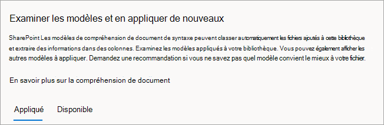
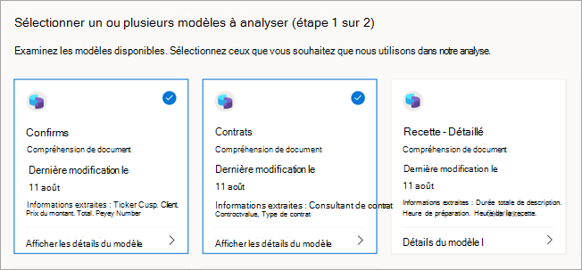

# Publier et découvrir des modèles dans Microsoft SharePoint Syntex

Vous pouvez rendre vos modèles de compréhension de documents entraînés disponibles pour que d’autres personnes les voient et les utilisent directement à partir de la SharePoint de documents. 

Vous pouvez également rechercher et évaluer des modèles entraînés dans d’autres centres de contenu créés par d’autres membres de votre organisation. Sélectionnez le modèle le plus utile pour classer vos fichiers ou en extraire des informations spécifiques. 

> [!NOTE]
> Cette fonctionnalité n’est pas encore disponible pour les modèles de traitement de formulaire.

## Rendre votre modèle accessible à d’autres personnes

Pour rendre votre modèle entraîné disponible pour d’autres personnes à utiliser :

1. Dans la page **Modèles** de votre modèle, sélectionnez **Paramètres du modèle.**

2. Dans le **volet Paramètres du modèle,** dans la section **Sites où** ce modèle est disponible, sélectionnez **Modifier**.

3. À ce stade, le panneau Sélectionner les **sites** où ce modèle est disponible sera différent selon que vous êtes administrateur ou non. 

    Si vous êtes administrateur SharePoint, cette vue s’affiche.

    

    - **Non disponible sur les sites** : le modèle ne sera pas disponible pour d’autres personnes.
    - **Tous les sites** : le modèle sera disponible dans la galerie de types de contenu que d’autres utilisateurs pourront utiliser.
    - **Seuls les sites** sélectionnés : vous pouvez choisir le ou les sites dans lesquels le modèle sera disponible. Cliquez dans la zone de texte pour rechercher et choisir les sites sur lesquels vous souhaitez appliquer le modèle. Vous ne verrez que les sites pour lesquels vous avez accès.

    Si vous *n’êtes pas* administrateur SharePoint, cette vue s’affiche.

    

    Vous pouvez uniquement ajouter ou supprimer la disponibilité des sites spécifiques à lesquels vous avez déjà accès.

4. Sélectionnez les sites où vous souhaitez que le modèle soit disponible pour les autres utilisateurs à appliquer, puis sélectionnez **Enregistrer**.

## Découvrir d’autres modèles entraînés

Pour trouver des modèles entraînés qui peuvent convenir à votre contenu :

1. Dans la bibliothèque de documents de votre modèle, **sélectionnez**  >  **Automatiser l’affichage des modèles de compréhension du document.**

2. Dans la page Examiner les modèles et en appliquer de nouveaux, vous pouvez passer en revue les **modèles appliqués** et les modèles disponibles pour être appliqués à votre bibliothèque de documents.

    

   - Sous **l’onglet** Appliqué, consultez les modèles qui ont été appliqués à votre bibliothèque. Sélectionnez **Afficher les détails du modèle** pour afficher des informations sur le modèle, telles que la description, les extracteurs et d’autres paramètres.
   
   - Sous **l’onglet** Disponible, consultez les modèles entraînés qui peuvent être appliqués à votre bibliothèque.

### Appliquer un modèle entraîné à votre bibliothèque

Vous pouvez évaluer les modèles entraînés par rapport à votre contenu pour vous aider à trouver le modèle le plus approprié. Pour sélectionner un modèle à appliquer à votre bibliothèque :

1. Dans la page **Examiner les modèles** et en appliquer de nouveaux, **sélectionnez l’onglet** Disponible pour passer en revue les modèles de la liste.

    

2. Choisissez le modèle qui, selon vous, vous permettra d’obtenir les meilleurs résultats, sélectionnez Afficher les **détails** du modèle, puis sélectionnez Appliquer **à la bibliothèque.**

### Obtenir une recommandation pour un modèle entraîné

Si vous ne savez pas quel modèle convient le mieux à vos fichiers, vous pouvez demander une recommandation. Votre recommandation peut inclure jusqu’à 10 modèles.

1. Dans la page **Examiner les modèles et en** appliquer de nouveaux, sélectionnez **l’onglet** Disponible.

2. Sur la première vignette, sélectionnez **Obtenir une recommandation.**

    

3. Dans la page **Sélectionner un ou plusieurs** modèles d’analyse, sélectionnez les modèles qui, selon vous, sont les plus adaptés, puis sélectionnez **Suivant.**

    

4. Dans la page **Sélectionner un fichier à analyser,** sélectionnez un fichier du même type ou d’un type similaire qui sera stocké dans votre bibliothèque. Ensuite, choisissez **Sélectionner.**

    

5. Dans les **résultats de l’examen et sélectionnez une** page de modèle, sous Notre **recommandation,** vous verrez le fichier recommandé. Vous n’avez pas besoin d’appliquer le modèle recommandé. Vous pouvez choisir d’appliquer un autre modèle si vous pensez qu’il est plus adapté.

    

6. Pour le modèle que vous pensez obtenir les meilleurs résultats, sélectionnez Afficher les **détails** du modèle, puis sélectionnez Appliquer **à la bibliothèque.**

7. S’il n’existe aucun modèle recommandé basé sur le fichier sélectionné, vous pouvez revenir en arrière et sélectionner un autre fichier ou sélectionner différents modèles.

### Supprimer un modèle appliqué

Pour supprimer un modèle appliqué de votre bibliothèque de documents :

1. Dans la page Révision des modèles et application de nouveaux **modèles,** sous l’onglet **Appliqué, consultez les modèles qui ont été appliqués à votre bibliothèque**.

2. Sur le modèle que vous souhaitez supprimer, sélectionnez Afficher les **détails** du modèle, puis **sélectionnez Supprimer de la bibliothèque.**

## Voir aussi

[Appliquer un modèle de compréhension de document](apply-a-model.md)

[Vue d’ensemble de la compréhension de document](document-understanding-overview.md)
