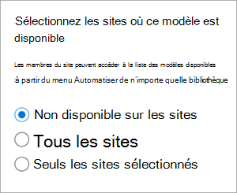
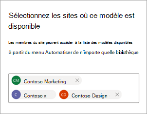

# Partager un modèle d’entreprise dans Microsoft Syntex

**S’applique à :**  &ensp; &#10003; Tous les modèles &ensp; | &ensp; personnalisés &#10003; Tous les modèles prédéfinis

Vous pouvez rendre vos modèles d’entreprise entraînés disponibles pour que d’autres utilisateurs puissent l’afficher et l’utiliser directement à partir d’une bibliothèque de documents SharePoint. Les modèles d’entreprise sont créés et entraînés dans le [centre de contenu](create-a-content-center.md). 

## Partager votre modèle avec d’autres personnes

Pour rendre votre modèle entraîné disponible pour d’autres personnes à utiliser :

1. Dans la page **Modèles** de votre modèle, sélectionnez **Paramètres du modèle.**

2. Dans le **volet Paramètres du modèle,** dans la section **Sites où** ce modèle est disponible, sélectionnez **Modifier**.

3. À ce stade, le panneau **Sélectionner les sites où ce modèle est disponible** est différent selon que vous êtes administrateur ou non. 

    Si vous êtes administrateur SharePoint, cette vue s’affiche.

    

    - **Non disponible sur les sites** : le modèle ne sera pas disponible pour d’autres personnes.
    - **Tous les sites** : le modèle sera disponible dans la galerie de types de contenu que d’autres utilisateurs pourront utiliser.
    - **Seuls les sites** sélectionnés : vous pouvez choisir le ou les sites dans lesquels le modèle sera disponible. Utilisez la zone de texte pour rechercher et choisir les sites auxquels vous souhaitez appliquer le modèle. Vous ne verrez que les sites pour lesquels vous avez accès.

    Si vous *n’êtes pas* administrateur SharePoint, cette vue s’affiche.

    

    Vous pouvez uniquement ajouter ou supprimer la disponibilité des sites spécifiques à lesquels vous avez déjà accès.

4. Sélectionnez les sites où vous souhaitez que le modèle soit disponible pour les autres utilisateurs à appliquer, puis sélectionnez **Enregistrer**.

## Voir aussi

[Découvrir d’autres modèles entraînés](discover-other-trained-models.md)
