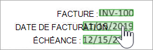

# Utiliser un modèle prédéfini pour extraire des informations à partir de reçus dans Microsoft Syntex

Le *modèle de reçu prédéfini* dans Microsoft Syntex analyse et extrait les informations clés des reçus de vente. L’API reconnaît les reçus imprimés et manuscrits et [extrait les informations de reçu clé](/azure/applied-ai-services/form-recognizer/concept-receipt#field-extraction), telles que le nom du commerçant, le numéro de téléphone du commerçant, la date de transaction, la taxe et le total de la transaction. Les reçus peuvent être de différents formats et de qualité, y compris des reçus imprimés et manuscrits.

Pour utiliser un modèle de reçus, procédez comme suit :

- [Étape 1 : Créer un modèle de reçus](#step-1-create-a-receipts-model)
- [Étape 2 : Charger un exemple de fichier à analyser](#step-2-upload-an-example-file-to-analyze)
- [Étape 3 : Sélectionner des extracteurs pour votre modèle](#step-3-select-extractors-for-your-model)
- [Étape 4 : Appliquer le modèle](#step-4-apply-the-model)

## Étape 1 : Créer un modèle de reçus

Suivez les instructions fournies dans [Créer un modèle dans Syntex](create-syntex-model.md) pour créer un modèle de reçu prédéfini. Passez ensuite aux étapes suivantes pour terminer votre modèle.

## Étape 2 : Charger un exemple de fichier à analyser

1. Dans la page **Modèles** , dans la section **Ajouter un fichier à analyser** , sélectionnez **Ajouter un fichier**.

     

2. Dans la page **Fichiers à analyser,** sélectionnez **Ajouter** pour rechercher le fichier que vous souhaitez utiliser.

     

3. Dans la page **Ajouter un fichier à partir de la bibliothèque de fichiers d’apprentissage** , sélectionnez le fichier, puis sélectionnez **Ajouter**.

     

4. Dans la page **Fichiers à analyser du modèle** , sélectionnez **Suivant**.

## Étape 3 : Sélectionner des extracteurs pour votre modèle

Dans la page des détails de l’extracteur, vous verrez la zone de document à droite et le panneau **Extracteurs** à gauche. Le panneau **Extracteurs** affiche la liste des extracteurs qui ont été identifiés dans le document.

    

Les champs d’entité mis en surbrillance en vert dans la zone de document sont les éléments détectés par le modèle lors de l’analyse du fichier. Lorsque vous sélectionnez une entité à extraire, le champ en surbrillance devient bleu. Si vous décidez par la suite de ne pas inclure l’entité, le champ en surbrillance devient gris. Les points forts facilitent l’affichage de l’état actuel des extracteurs que vous avez sélectionnés.

> [!TIP]
> Vous pouvez utiliser la roulette de défilement de votre souris ou les contrôles en bas de la zone de document pour effectuer un zoom avant ou arrière en fonction des besoins pour lire les champs d’entité.

### Sélectionner une entité d’extracteur

Vous pouvez sélectionner un extracteur dans la zone de document ou dans le panneau **Extracteurs** , selon vos préférences.
 
- Pour sélectionner un extracteur dans la zone de document, sélectionnez le champ d’entité.

     

- Pour sélectionner un extracteur dans le panneau **Extracteurs** , cochez la case à droite du nom de l’entité.

     

Lorsque vous sélectionnez un extracteur, une zone **Sélectionner l’extracteur ?** s’affiche dans la zone de document. La zone affiche le nom de l’extracteur, la valeur d’origine et l’option permettant de le sélectionner en tant qu’extracteur. Pour certains types de données, tels que les nombres ou les dates, une valeur extraite est également affichée.

    

La valeur d’origine est ce qui se trouve réellement dans le document. La valeur extraite est ce qui sera écrit dans la colonne dans SharePoint. Lorsque le modèle est appliqué à une bibliothèque, vous pouvez utiliser la mise en forme de colonne pour spécifier l’aspect que vous souhaitez lui donner dans le document.

Continuez à sélectionner les extracteurs supplémentaires que vous souhaitez utiliser. Vous pouvez également ajouter d’autres fichiers à analyser pour cette configuration de modèle.

### Renommer un extracteur

Vous pouvez renommer un extracteur à partir de la page d’accueil du modèle ou du panneau **Extracteurs** . Vous pouvez envisager de renommer les extracteurs sélectionnés, car ces noms seront utilisés comme noms de colonnes lorsque le modèle sera appliqué à la bibliothèque.

Pour renommer un extracteur à partir de la page d’accueil du modèle :

1. Dans la section **Extracteurs** , sélectionnez l’extracteur que vous souhaitez renommer, puis sélectionnez **Renommer**.

     

2. Dans le panneau **Renommer l’extracteur d’entité** , entrez le nouveau nom de l’extracteur, puis sélectionnez **Renommer**.

Pour renommer un extracteur à partir du panneau **Extracteurs** :

1. Sélectionnez l’extracteur que vous souhaitez renommer, puis sélectionnez **Renommer**.

     

2. Dans la zone **Renommer l’extracteur** , entrez le nouveau nom de l’extracteur, puis sélectionnez **Renommer**.

## Étape 4 : Appliquer le modèle

- Pour enregistrer les modifications et revenir à la page d’accueil du modèle, dans le panneau **Extracteurs** , sélectionnez **Enregistrer et quitter**.

- Si vous êtes prêt à appliquer le modèle à une bibliothèque, dans la zone de document, sélectionnez **Suivant**. Dans le panneau **Ajouter à la bibliothèque** , choisissez la bibliothèque à laquelle vous souhaitez ajouter le modèle, puis sélectionnez **Ajouter**.

## Modifier l’affichage dans une bibliothèque de documents

Pour plus d’informations sur la façon de définir l’affichage par défaut et de modifier l’affichage d’une bibliothèque de documents, voir [Choisir l’affichage dans une bibliothèque de documents](choose-library-view.md).

