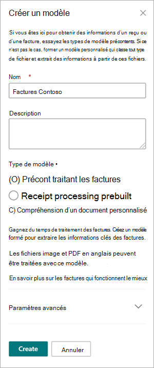
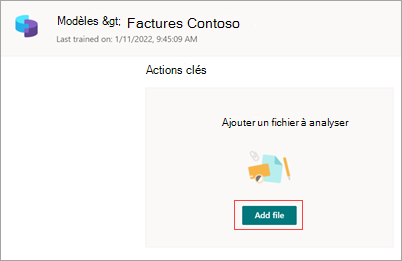
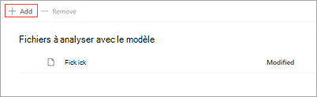
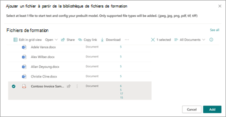
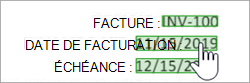
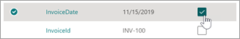
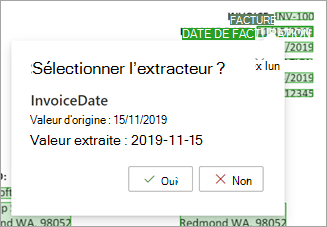
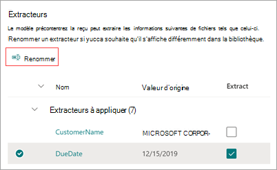

# Utilisez un modèle préétacé pour extraire des informations de factures ou de reçus dans Microsoft SharePoint Syntex

Les modèles pré-conçus sont préentraînés pour reconnaître les documents et les informations structurées dans les documents. Au lieu de devoir créer un modèle personnalisé à partir de zéro, vous pouvez itérer sur un modèle pré-formé existant pour ajouter des champs spécifiques qui correspondent aux besoins de votre organisation. 

Les modèles prédéfincis utilisent la reconnaissance optique de caractères (OCR) associée à des modèles d’apprentissage profond pour identifier et extraire des champs de données et de texte prédéfinés communs à des types de documents spécifiques. Commencez par analyser l’un de vos fichiers par rapport au modèle pré-existant. Vous sélectionnez ensuite les champs détectés qui sont logiques pour votre objectif. Si le modèle ne détecte pas les champs dont vous avez besoin, vous pouvez analyser à nouveau à l’aide d’un autre fichier.

Pour l’instant, deux modèles pré-pré-préentaux sont disponibles : facture et reçu.

- Le *modèle pré-facture* analyse et extrait les informations clés des factures. L’API analyse les factures dans différents formats et extrait les informations de facture clés [telles](/azure/applied-ai-services/form-recognizer/concept-invoice#field-extraction) que le nom du client, l’adresse de facturation, la date d’échéance et le montant dû.

- Le *modèle pré-reçu* analyse et extrait les informations clés des reçus des ventes. L’API analyse les reçus imprimés et manuscrits et extrait les informations de reçus de clé telles que le nom du marchand, le numéro de téléphone du marchand, la date de transaction, les [taxes](/azure/applied-ai-services/form-recognizer/concept-receipt#field-extraction) et le total des transactions.

Des modèles pré-version supplémentaires seront disponibles dans les prochaines version.

## Créer un modèle pré-pré-créé

Suivez ces étapes pour créer un modèle pré-SharePoint Syntex.

1. Dans la page **Modèles** , **sélectionnez Créer un modèle**.

     

2. Dans le **panneau Créer un modèle** , dans le champ **Nom** , tapez le nom du modèle.

     

3. Dans la section **Type de modèle** , sélectionnez l’un des modèles pré-projets :
   - **Pré-facturation du traitement des factures**
   - **Pré-traitement des reçus**

   Si vous souhaitez créer un modèle de compréhension de document traditionnel sans contraintes au lieu d’un modèle pré-conçu, sélectionnez **Compréhension des documents personnalisés**.

4. Si vous souhaitez modifier le type de contenu ou ajouter une étiquette de rétention, sélectionnez **Paramètres avancés**.

    > [!NOTE]
    > Les étiquettes de niveau de sensibilité ne sont pas disponibles pour les modèles pré-actuels.

5. Sélectionnez **Créer**. Le modèle sera enregistré dans la bibliothèque **de modèles** .

## Ajouter un fichier à analyser

1. Dans la page **Modèles** , dans la section **Ajouter un fichier à analyser** , **sélectionnez Ajouter un fichier**.

     

2. Dans la **page Fichiers pour analyser le modèle** , sélectionnez **Ajouter** pour trouver le fichier que vous souhaitez utiliser.

     

3. Dans la page **Ajouter un fichier à partir de la** bibliothèque de fichiers de formation, sélectionnez le fichier, puis sélectionnez **Ajouter**.

     

6. Dans la **page Fichiers pour analyser le modèle** , sélectionnez **Suivant**.

## Sélectionner des extracteurs pour votre modèle

Dans la page des détails de l’extracteur, vous verrez la zone de document à droite et le panneau **Extracteurs** à gauche. Le **panneau Extracteurs** affiche la liste des extracteurs qui ont été identifiés dans le document.

    

Les champs d’entité en vert dans la zone de document sont les éléments détectés par le modèle lors de l’analyse du fichier. Lorsque vous sélectionnez une entité à extraire, le champ en surbrillant est bleu. Si vous décidez ultérieurement de ne pas inclure l’entité, le champ en surbrillant est grisé. Les points forts facilitent l’accès à l’état actuel des extracteurs que vous avez sélectionnés.

> [!TIP]
> Vous pouvez utiliser la roulette de défilement sur votre souris ou les contrôles en bas de la zone de document pour effectuer un zoom avant ou arrière si nécessaire pour lire les champs d’entité.

### Sélectionner une entité d’extracteur

Vous pouvez sélectionner un extracteur dans la zone de document ou dans le panneau **Extracteurs** , selon vos préférences.
 
- Pour sélectionner un extracteur dans la zone de document, sélectionnez le champ d’entité.

     

- Pour sélectionner un extracteur dans le panneau **Extracteurs** , cochez la case à droite du nom de l’entité.

     

Lorsque vous sélectionnez un extracteur, un **extracteur** de sélection s’affiche dans la zone de document. La zone affiche le nom de l’extracteur, la valeur d’origine et l’option de sélection en tant qu’extracteur. Pour certains types de données tels que des nombres ou des dates, il affiche également une valeur extraite.

    

La valeur d’origine est ce qui se trouve réellement dans le document. La valeur extraite est ce qui sera écrit dans la colonne dans SharePoint. Lorsque le modèle est appliqué à une bibliothèque, vous pouvez utiliser la mise en forme de colonne pour spécifier son apparence dans le document.

Continuez à sélectionner d’autres extracteurs que vous souhaitez utiliser. Vous pouvez également ajouter d’autres fichiers à analyser pour cette configuration de modèle.

## Renommer un extracteur

Vous pouvez renommer un extracteur à partir de la page d’accueil du modèle ou du panneau **Extracteurs** . Vous pouvez envisager de renommer les extracteurs sélectionnés, car ces noms seront utilisés comme noms de colonnes lorsque le modèle sera appliqué à la bibliothèque.

Pour renommer un extracteur à partir de la page d’accueil du modèle :

1. Dans la section **Extracteurs** , sélectionnez l’extracteur à renommer, puis sélectionnez **Renommer**.

     

2. Dans le **panneau d’extraction de l’entité** Renommer, entrez le nouveau nom de l’extracteur, puis sélectionnez **Renommer**.

Pour renommer un extracteur à partir du panneau **Extracteurs** :

1. Sélectionnez l’extracteur à renommer, puis sélectionnez **Renommer**.

     

2. Dans la **zone Renommer l’extracteur** , entrez le nouveau nom de l’extracteur, puis sélectionnez **Renommer**.

## Appliquer le modèle

- Pour enregistrer les modifications et revenir à la page d’accueil du modèle, dans le panneau **Extracteurs** , **sélectionnez Enregistrer et quitter**.

- Si vous êtes prêt à appliquer le modèle à une bibliothèque, dans la zone de document, sélectionnez **Suivant**. Dans le **panneau Ajouter à la bibliothèque** , choisissez la bibliothèque à laquelle vous souhaitez ajouter le modèle, puis sélectionnez **Ajouter**.

## Voir aussi

[Appliquer un modèle de compréhension de document](apply-a-model.md)