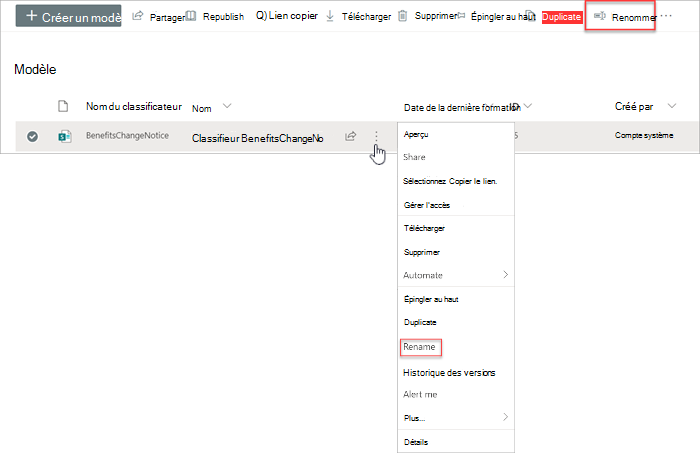
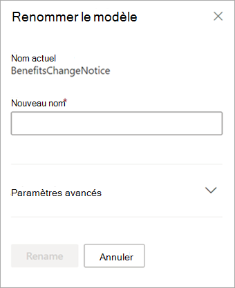

# Renommer un modèle dans Microsoft Syntex

**S’applique à :**  &ensp; &#10003; Tous les modèles &ensp; | &ensp; personnalisés &#10003; Tous les modèles prédéfinis

À un moment donné, vous souhaiterez peut-être renommer un modèle. Par exemple, lorsque vous créez une première version d'un modèle, vous n'avez peut-être pas beaucoup réfléchi au nom final (par exemple, vous l'avez peut-être nommé «AlexWilburModel1»). À l’approche de la finalisation du modèle et de l’utilisation du modèle, vous rendez compte qu’un nom plus approprié serait « Renouvellement du contrat » et que vous souhaitez le renommer.  

Un autre exemple est celui de la décision de votre organisation de désigner un processus ou un type de document par un nom différent. Par exemple, une fois que vous avez créé votre modèle et que vous êtes prêt à l'appliquer, votre organisation peut décider que tous les «contrats» seront désormais officiellement appelés «accords». Si nécessaire, vous pouvez choisir de renommer votre modèle de «Renouvellement de contrat» en «Renouvellement d'accord».

> [!IMPORTANT]
> Vous pouvez renommer un modèle uniquement s’il n’a pas été appliqué à une bibliothèque de documents. 

En renommant un modèle, on renomme également le [type de contenu](/sharepoint/governance/content-type-and-workflow-planning#content-type-overview) qui lui est associé.

## Renommer un modèle

Procédez comme suit pour renommer un modèle.

1. Dans le centre de contenu, sélectionnez **Modèles** pour afficher la liste de vos modèles.

2. Sur la page **Modèles**, sélectionnez le modèle que vous souhaitez renommer.

3. En utilisant le ruban ou le bouton **Afficher les actions** (à côté du nom du modèle), sélectionnez **Renommer** .  

      

4. Dans le **renommer le modèle** panneau :

   a. Sous **Nouveau nom** , entrez le nouveau nom du modèle que vous voulez renommer. 

      

   b. (Facultatif) Sous **Paramètres avancés** , sélectionnez si vous voulez associer un [type de contenu](/sharepoint/governance/content-type-and-workflow-planning#content-type-overview) existant . Si vous choisissez **Utiliser un type de contenu existant**, le modèle sera renommé pour correspondre au type de contenu sélectionné.

5. Sélectionnez **Renommer**.

## Voir aussi

[Supprimer un modèle](delete-a-model.md)

