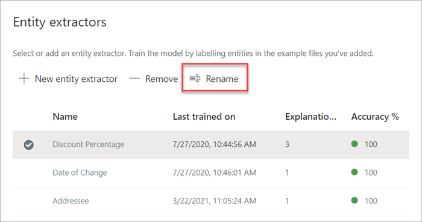

# Renommer un extracteur dans Microsoft SharePoint Syntex

À un moment donné, vous devrez peut-être renommer un extracteur si vous souhaitez faire référence à un champ de données extrait par un nom différent. Par exemple, votre organisation décide d'apporter des modifications à ses documents contractuels et désigne les «clients» par le terme «clients» dans ses documents. Si vous extrayez un champ «Client» dans votre modèle, vous pouvez choisir de le renommer en «Client».

Lorsque vous synchronisez votre modèle mis à jour avec votre bibliothèque de documents SharePoint, vous verrez une nouvelle colonne «Client» dans la vue de votre bibliothèque de documents. Votre vue conservera la colonne «Client» pour les activités passées, mais mettra à jour la nouvelle colonne «Client» pour tous les nouveaux documents traités par votre modèle. 

> [!IMPORTANT]
>  Assurez-vous de synchroniser votre modèle mis à jour avec les bibliothèques de documents où vous l'aviez précédemment appliqué pour que le nouveau nom de colonne s'affiche. 

## Renommer un extracteur

Suivez ces étapes pour renommer un extracteur d'entité.

1. Dans le centre de contenu, sélectionnez **Modèles** pour afficher votre liste de modèles.

2. Sur la page **Modèles**, dans la colonne **Nom**, sélectionnez le modèle pour lequel vous souhaitez renommer un extracteur.

3. Sous **'entité**, sélectionnez le nom de l’extracteur que vous voulez renommer, puis sélectionnez **Renommer**. 

      

4. Sur **le panneau de l'extracteur** d'entité Renommer :

   a. Sous **Nouveau nom**, saisissez le nouveau nom de l'extracteur. 

      

   b. (Facultatif) Sous **Paramètres avancés**, sélectionnez si vous voulez associer une colonne de site existante.

5. Sélectionnez **Renommer**.

## Voir aussi
[Créer un extracteur](create-an-extractor.md)

[Créer un classificateur](create-a-classifier.md)

[Renommer un modèle](rename-a-model.md)

[Types d’explications](explanation-types-overview.md)

[Utiliser la taxonomie du magasin de termes lors de la création d’un extracteur](leverage-term-store-taxonomy.md)

[Présentation de la compréhension de document](document-understanding-overview.md)

[Appliquer un modèle](apply-a-model.md) 
