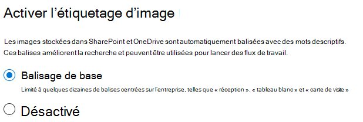

# Configurer SharePoint Syntex

Les administrateurs peuvent utiliser le centre d’administration Microsoft 365 pour installer et Microsoft SharePoint Syntex. 

Tenez compte des points suivants avant de commencer :

- Quels sites SharePoint allez-vous activer le traitement de formulaires ? Tous les sites, certains d’entre eux ou certains sites sélectionnés ?
- Quels seront les noms de votre centre de contenu et celui de l’administrateur principal du site ?

Vous pouvez modifier vos paramètres après l’installation initiale dans le centre d’administration 365 de Microsoft.

Le contenu de cet article est destiné à la préversion privée du projet cortex. Pour [plus d’informations sur le projet cortex](https://aka.ms/projectcortex).

Avant de procéder à l’installation, veillez à planifier la meilleure façon de configurer et de configurer la compréhension du contenu dans votre environnement. Par exemple, vous devez prendre en compte les noms suivants :

- Les sites SharePoint pour lesquels vous souhaitez activer le traitement de formulaire-tous les sites, certains ou certains sites sélectionnés
- Votre centre de contenu et le nom de l’administrateur de site principal

## Configuration requise 

> [!NOTE]
> Vous devez disposer d’autorisations d’administrateur général ou d’administrateur SharePoint pour pouvoir accéder au centre d’administration Microsoft 365 et configurer le mémorandum d’accord sur le contenu.

En tant qu’administrateur, vous pouvez également modifier les paramètres sélectionnés à tout moment après l’installation, et tout au long du processus de présentation du contenu dans le centre d’administration 365 de Microsoft.

## Pour configurer SharePoint Syntex

1. Dans le centre d’administration 365 de Microsoft, sélectionnez **configuration**, puis affichez la section connaissances de l' **organisation** .

2. Dans la section connaissances de l' **organisation** , sélectionnez **automatiser la compréhension du contenu**. 

     

3. Sur la page **automatiser SharePoint Syntex** , cliquez sur **commencer** pour passer en revue le processus d’installation. 

     

4. Sur la page activation du marquage de l’image, choisissez si vous souhaitez autoriser l' [étiquetage des images](image-tagging.md).

     

5. Sur la page **configurer le traitement du formulaire** , vous pouvez choisir d’autoriser les utilisateurs à utiliser le générateur ai pour créer des modèles de traitement de formulaires dans des bibliothèques de documents SharePoint spécifiques. Une option de menu est disponible dans le ruban bibliothèque de documents pour **créer un modèle de traitement de formulaire** dans les bibliothèques de documents SharePoint dans lesquelles il est activé.
 
     Pour **que les bibliothèques SharePoint affichent l’option permettant de créer un modèle de traitement de formulaire**, vous pouvez sélectionner : 
      - **Toutes les bibliothèques SharePoint** pour les mettre à la disposition de toutes les bibliothèques SharePoint dans votre organisation. 
      - **Uniquement les bibliothèques de sites sélectionnés**, puis sélectionnez les sites dans lesquels vous souhaitez les mettre à disposition. 

   

   > [!Note]
   > L’activation de ce paramètre sur une bibliothèque de documents SharePoint n’affecte pas les modèles existants appliqués à la bibliothèque ou la possibilité d’appliquer des modèles de présentation de document à une bibliothèque. 
    
6. Sur la page **créer un centre de contenu** , vous pouvez créer un site Centre de contenu SharePoint sur lequel vos utilisateurs peuvent créer et gérer des modèles de présentation de documents.  
    a. Pour **nom du site**, tapez le nom que vous souhaitez donner à votre site Centre de contenu. 
    b. L' **adresse du site** indique l’URL de votre site, en fonction de ce que vous avez sélectionné pour le nom du site. Si vous souhaitez le modifier, cliquez sur **modifier**. 

       

    Sélectionnez **Suivant**.

7. Sur la page **révision et fin** , vous pouvez examiner le paramètre que vous avez sélectionné et choisir d’effectuer des modifications. Si vos sélections vous conviennent, sélectionnez **activer**.

8. Sur la page confirmation, cliquez sur **Terminer**.

9. Vous serez redirigé vers la page **automatiser le contenu** . À partir de cette page, vous pouvez sélectionner **gérer** pour modifier vos paramètres de configuration. 

## Attribuer des licences

Une fois que vous avez configuré SharePoint Syntex, vous devez attribuer des licences aux utilisateurs qui utiliseront les fonctionnalités de traitement de formulaire et de présentation des documents.

Pour attribuer des licences :

1. Dans le centre d’administration 365 de Microsoft, sous **utilisateurs**, cliquez sur **utilisateurs actifs**.

2. Sélectionnez les utilisateurs auxquels vous souhaitez accorder une licence, puis cliquez sur **gérer les licences des produits**.

3. Sélectionnez **attribuer plus**.

4. Sélectionnez **services de contenu intelligents**. Sous **applications**, assurez-vous que **Common Data Service for intelligent content services** and **intelligent content services** est sélectionné.

    

5. Cliquez sur **Enregistrer les modifications**.

## Crédits du générateur AI

Si vous disposez de 300 ou plus de licences Syntex SharePoint pour SharePoint Syntex dans votre organisation, vous serez affectées aux crédits du générateur de 1 million AI. Si vous avez moins de 300 licences, vous devez acheter les crédits du générateur AI pour pouvoir utiliser le traitement des formulaires.

Vous pouvez estimer la capacité du générateur AI qui vous convient à l’aide de la [calculatrice du générateur ai](https://powerapps.microsoft.com/ai-builder-calculator).

Accédez au [Centre d’administration Power Platform](https://admin.powerplatform.microsoft.com/resources/capacity) pour vérifier vos crédits et l’utilisation.

## Voir aussi

[Vue d’ensemble du modèle de traitement de formulaire](https://docs.microsoft.com/ai-builder/form-processing-model-overview)

[Procédure pas à pas : comment créer un modèle de présentation des documents (vidéo)](https://www.youtube.com/watch?v=DymSHObD-bg)

