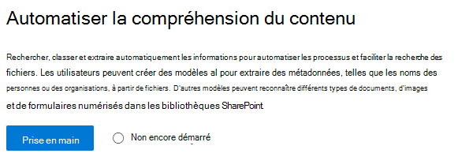
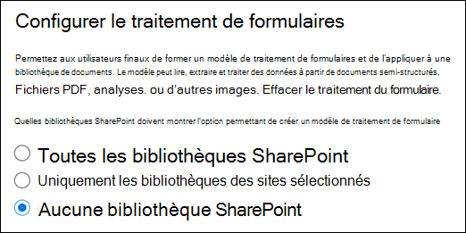
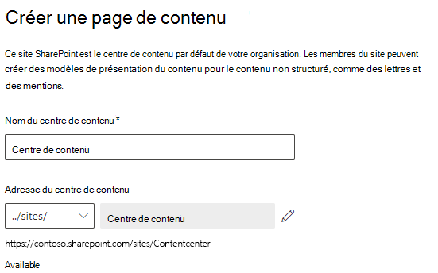

# Configurer SharePoint Online

Les administrateurs peuvent utiliser le Centre d’administration Microsoft 365 pour configurer [Microsoft SharePoint Syntex](index.md). 

Tenez compte des informations suivantes avant de démarrer :

- Dans quels sites SharePoint allez-vous activer le traitement des formulaires ? Tous les sites, certains sites ou des sites sélectionnés ?
- Comment allez-vous nommer votre centre de contenu par défaut ?

Vous pouvez modifier vos paramètres après la configuration initiale dans le Centre d’administration Microsoft 365.

Avant la configuration, veillez à planifier la meilleure manière d’installer et de configurer la compréhension de contenu dans votre environnement. Par exemple, vous devez prendre les décisions suivantes :

- Sites SharePoint dans lesquels vous souhaitez activer le traitement des formulaires : tous les sites, certains sites ou des sites sélectionnés
- Le nom et les administrateurs de votre centre de contenu 

## Configuration requise 

> [!NOTE]
> Pour accéder au centre d’administration Microsoft 365 et configurer SharePoint Syntex, vous devez disposer des autorisations d’administrateur général ou d’administrateur SharePoint.

En tant qu’administrateur, vous pouvez également modifier vos paramètres sélectionnés à tout moment après la configuration, ainsi que les paramètres de gestion de la compréhension de contenu dans le Centre d’administration Microsoft 365.

Si vous envisagez d’utiliser un environnement Platform Power personnalisé, vous devez [installer l’application *Générateur d’IA pour Project Cortex* dans cet environnement](/power-platform/admin/manage-apps#install-an-app-in-the-environment-view) et y [attribuer des crédits du Générateur d’IA](/power-platform/admin/capacity-add-on) avant de pouvoir créer des modèles de traitement des formulaires.

### Gestion des licences

Pour utiliser SharePoint Syntex, votre organisation doit avoir un abonnement à SharePoint Syntex, et chaque utilisateur doit avoir les licences suivantes :

- SharePoint Syntex
- SharePoint Syntex : Type DPO
- Service de données courant pour SharePoint Syntex

Pour utiliser le traitement des formulaires, vous avez également besoin de AI Builder crédits. Si vous avez au moins 300 utilisateurs sous licence, une allocation de AI Builder crédits est fournie chaque mois.

## Pour configurer SharePoint Syntex

1. Dans le Centre d’administration Microsoft 365, sélectionnez **Configuration**, puis affichez la section **Fichiers et contenu**.

2. Dans la section **Fichiers et contenu**, sélectionnez **Automatiser la compréhension de contenu**. Notez que la disponibilité de votre crédit AI Builder actuel s’affiche dans la section **D’un coup d’œil**. 

3. À la page **Automatiser la compréhension de contenu** , cliquez sur **Commencer** pour parcourir le processus de configuration.  

    > [!div class="mx-imgBorder"]
    >  

4. Sur la page **Configurer le traitement des formulaires**, vous pouvez choisir d’autoriser ou non les utilisateurs à créer des modèles de traitement de formulaire dans des bibliothèques de documents SharePoint spécifiques. Une option de menu **Créer un modèle de traitement de formulaire** sera disponible dans les rubans des bibliothèques de documents SharePoint où le traitement des formulaires est activé.
 
     Concernant les **bibliothèques SharePoint qui doivent afficher l’option de création d’un modèle de traitement de formulaire**, vous pouvez sélectionner les éléments suivants : 
      - **Les bibliothèques dans les sites SharePoint** pour rendre cette option disponible dans toutes les bibliothèques SharePoint au sein de votre organisation. 
      - **Ls bibliothèques dans les sites SharePoint sélectionnés**. Sélectionnez ensuite les sites dans lesquels vous souhaitez rendre cette option disponible ou chargez une liste de 50 sites maximum. 
      - **Aucune bibliothèque SharePoint** si cette option ne doit être disponible sur aucun site (vous pouvez modifier ce paramètre après la configuration).

   > [!div class="mx-imgBorder"]
   > 

   > [!Note]
   > La suppression d’un site une fois inclus n’affecte pas les modèles existants appliqués aux bibliothèques de ce site. Cette action ne vous empêche pas non plus d’appliquer des modèles de compréhension de document à une bibliothèque. 
    
    Si vous avez plusieurs environnements Power Platform configurés, vous pouvez choisir celui à utiliser avec le traitement des formulaires. (Cette option ne s’affiche pas si vous n’avez qu’un seul environnement.)

    

    Pour l’**environnement Power Platform**, vous pouvez sélectionner :
    - **Utilisez l’environnement par défaut** pour utiliser votre environnement Power Platform par défaut.
    - **Utilisez un environnement personnalisé** pour utiliser un environnement personnalisé. Sélectionnez l’environnement que vous souhaitez utiliser dans la liste. ([Voir la configuration requise pour un environnement personnalisé](/microsoft-365/contentunderstanding/set-up-content-understanding#requirements)).

    Cliquez sur **Suivant**.

5. À la page **Créer un centre de contenu**, vous pouvez créer un site de centre de contenu SharePoint. Vos utilisateurs pourront alors créer et gérer des modèles de compréhension de document sur ce même site. Si vous avez déjà créé un centre de contenu à partir du Centre d’administration SharePoint, ces informations s’affichent ici et vous pouvez simplement sélectionner **Suivant**.

    1. Dans le champ **Nom du site**, tapez le nom souhaité pour votre site de centre de contenu.
    
    1. Le champ **Adresse du site** affiche l’URL de votre site, en fonction du nom de site choisi. Si vous souhaitez le modifier, cliquez sur **Modifier**.

       > [!div class="mx-imgBorder"]
       >  

       Sélectionnez **Suivant**.

6. À la page **Examiner et finaliser**, vous pouvez consulter le paramètre sélectionné, puis choisir d’apporter des modifications. Si vos sélections vous conviennent, sélectionnez **Activer**.

7. À la page de confirmation, cliquez sur **Terminé**.

8. Le programme vous renverra alors à la page **Automatiser la compréhension de contenu**. Dans cette page, vous pouvez sélectionner **Gérer** pour modifier vos paramètres de configuration. 

## Attribuer des licences

Après avoir configuré SharePoint Syntex, vous devez attribuer des licences aux futurs utilisateurs des fonctionnalités de SharePoint Syntex.

Pour attribuer des licences :

1. Dans le Centre d’administration Microsoft 365, sous **Utilisateurs**, cliquez sur **Utilisateurs actifs**.

2. Sélectionnez les utilisateurs auxquels attribuer une licence, puis choisissez **Gérer les licences de produits**.

3. Sélectionnez **Applications** dans le menu déroulant.

4. Sélectionnez **Afficher les applications pour SharePoint Syntex**. Sous **Applications**, assurez-vous que **service de données commun pour SharePoint Syntex**, **SharePoint Syntex** et **SharePoint Syntex-SPO type** sont tous sélectionnés.

    > [!div class="mx-imgBorder"]
    > 

5. Cliquez sur **Enregistrer les modifications**.

## Voir aussi

[Vue d’ensemble du modèle de traitement de formulaire](/ai-builder/form-processing-model-overview)

[Étape par étape : créer un modèle de compréhension de document (vidéo)](https://www.youtube.com/watch?v=DymSHObD-bg)

[Créer et gérer des environnements dans le Centre d'administration Power Platform](/power-platform/admin/create-environment)
