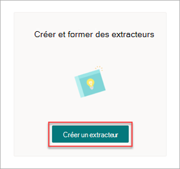
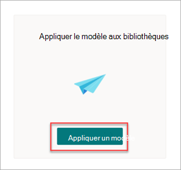

# Étape 1. Utiliser SharePoint Syntex pour identifier les fichiers de contrat et extraire des données

Votre organisation a besoin d’un moyen d’identifier et de classer tous les documents de contrat parmi les nombreux fichiers que vous recevez. Vous souhaitez également être en mesure d’afficher rapidement plusieurs éléments clés dans chacun des fichiers de contrat identifiés (par exemple, *client,* *fournisseur* et montant *des frais).* Pour ce faire, vous pouvez utiliser [SharePoint Syntex](index.md) pour créer un modèle de compréhension de document et l’appliquer à une bibliothèque de documents.

## Vue d’ensemble du processus

[La compréhension des documents](document-understanding-overview.md) utilise des modèles d’intelligence artificielle (IA) pour automatiser la classification des fichiers et l’extraction des informations. Les modèles de compréhension des documents sont également optimaux pour l’extraction d’informations à partir de documents non structurés et semi-structurés où les informations dont vous avez besoin ne sont pas contenues dans des tableaux ou des formulaires, tels que des contrats.

1. Tout d’abord, vous devez trouver au moins cinq exemples de fichiers que vous pouvez utiliser pour « former » le modèle afin de rechercher des caractéristiques spécifiques au type de contenu que vous essayez d’identifier (contrat). 

2. À l SharePoint Syntex, créez un modèle de compréhension de document. À l’aide de vos exemples de fichiers, vous devez [créer un classificateur](create-a-classifier.md). En formeant le classifieur avec vos exemples de fichiers, vous lui apprenez à rechercher des caractéristiques spécifiques à ce que vous verrez dans les contrats de votre entreprise. Par exemple, [créez une «](create-a-classifier.md#create-an-explanation) explication » qui recherche des chaînes spécifiques dans vos contrats, telles que contrat de *service,* Conditions d’contrat *et* *Rémunération.* Vous pouvez même former votre explication pour rechercher ces chaînes dans des sections spécifiques du document ou en regard d’autres chaînes. Lorsque vous pensez avoir formé votre classificateur avec les informations dont il a besoin, vous pouvez tester votre modèle sur un exemple d’exemple de fichiers pour voir son efficacité. Après le test, si nécessaire, vous pouvez choisir d’apporter des modifications à vos explications pour les rendre plus efficaces. 

3. Dans votre modèle, vous pouvez créer [un extracteur](create-an-extractor.md) pour extraire des éléments de données spécifiques de chaque contrat. Par exemple, pour chaque contrat, les informations qui vous intéressent le plus sont qui est le client, le nom de l’prestataire et le coût total.

4. Une fois que vous avez créé votre modèle, appliquez-le à [une SharePoint de documents.](apply-a-model.md) Lorsque vous téléchargez des documents dans la bibliothèque de documents, votre modèle de compréhension des documents s’exécute et identifie et classifie tous les fichiers qui correspondent au type de contenu de contrats que vous avez défini dans votre modèle. Tous les fichiers classés en tant que contrats s’affichent dans un affichage bibliothèque personnalisé. Les fichiers affichent également les valeurs de chaque contrat que vous avez défini dans votre extracteur.

   

5. Si vous avez des exigences de rétention pour  vos contrats, vous pouvez également utiliser votre modèle pour appliquer une étiquette de rétention qui empêchera la suppression de vos contrats pendant une période spécifiée.

## Étapes de création et de formation de votre modèle

> [!NOTE]
> Pour ces étapes, vous pouvez utiliser les exemples de fichiers dans le référentiel Des ressources de solution de gestion [des contrats.](https://github.com/pnp/syntex-samples/tree/main/scenario%20assets/Contracts%20Management) Les exemples de ce référentiel contiennent à la fois les fichiers de modèle de compréhension de document et les fichiers utilisés pour former le modèle.

### Créer un modèle de contrat

La première étape consiste à créer votre modèle de contrat.

1. Dans le centre de contenu, sélectionnez **Nouveau**, puis **Créer un modèle**.

2. Dans le **volet Nouveau document comprendre le modèle,** dans **le** champ Nom, tapez le nom du modèle. Pour cette solution de gestion de contrat, vous pouvez nommer le contrat *de modèle.*

4. Sélectionnez **Créer**. Cette opération permet de créer une page d’accueil pour le modèle. 

    

### Former votre modèle pour classifier un type de fichier

#### Ajouter des exemples de fichiers pour votre modèle

Vous devez ajouter au moins cinq exemples de fichiers qui sont des documents de contrat et un exemple de fichier qui n’est pas un document de contrat (par exemple, une instruction de travail). 

1. Dans la page **Modèles > contrat,** sous **Actions** clés Ajouter des  >  **exemples** de fichiers, **sélectionnez Ajouter des fichiers.**

   

2. Dans la page **Sélectionner des exemples** de fichiers pour votre modèle, ouvrez le dossier Contrat, sélectionnez les fichiers à utiliser, puis sélectionnez **Ajouter.** Si vous n’avez pas d’exemples de fichiers, **sélectionnez Télécharger** pour les ajouter.

#### Étiqueter les fichiers en tant qu’exemples positifs ou négatifs

1. Dans la page **Modèles > contrat,** sous Actions clés Classifier les fichiers et exécuter une formation, sélectionnez Former le  >   **classifieur**.

   

2. Dans la page Model **> Contract > Contract classifier,** dans la visionneuse en haut du premier exemple de fichier, vous verrez un texte demandant si le fichier est un exemple du modèle de contrat que vous avez créé. Si cet exemple est positif, sélectionnez **Oui**. Si cet exemple est négatif, sélectionnez **Non**.

3. Dans la **liste d’exemples** étiquetés à gauche, sélectionnez les autres fichiers que vous souhaitez utiliser comme exemples et étiquetez-les. 

     

#### Ajouter au moins une explication pour former le classifieur 

1. Dans la page **> contrat > contrat,** sélectionnez **l’onglet** Train.

2. Dans la section **Fichiers entraînés,** vous verrez une liste des exemples de fichiers que vous avez précédemment étiquetés. Sélectionnez l’un des fichiers positifs dans la liste pour l’afficher dans la visionneuse.

3. Dans la section **Explications,** sélectionnez **Nouveau,** puis **Vide.**

4. À la page **Créer une explication** :

    a. Dans le **champ** Nom, tapez le nom de l’explication (par exemple, « Contrat »).

    b. Dans le **champ Type d’explication,** **sélectionnez Liste d’expressions,** car vous ajoutez une chaîne de texte.

    c. Dans la **zone de liste Phrase,** tapez la chaîne (par exemple, « AGREEMENT »). Vous pouvez sélectionner **la case sensible** si la chaîne doit être sensible à la cas.

    d. Sélectionnez **Enregistrer et entraîner.**

     

#### Tester votre modèle

Vous pouvez tester votre modèle de contrat sur des exemples de fichiers qu’il n’a pas vus auparavant. Cela est facultatif, mais il peut s’avérer utile.

1. Dans la page **Modèles > contrat > classifieur** de contrat, sélectionnez **l’onglet Test.** Cette fonction exécute le modèle sur vos exemples de fichiers non lamentés.

2. Dans la **liste Fichiers de test,** vos exemples de fichiers s’affichent et indiquent si le modèle les a prédits comme positifs ou négatifs. Utilisez ces informations pour déterminer plus facilement l’efficacité de votre classifieur lors de l’identification de vos documents.

     

3. Lorsque vous avez terminé, **sélectionnez Quitter la formation.**

### Créer et former un extracteur

1. Dans la page **Modèles > contrat,** sous **Actions** clés Créer et former des  >  **extracteurs,** **sélectionnez Créer un extracteur**.

   

2. Dans le **panneau Nouvel extracteur d’entités,** dans le champ Nouveau nom, tapez le nom de votre extracteur.  Par exemple, nommez-le *Client* si vous souhaitez extraire le nom du client de chaque contrat.

3. Lorsque vous avez terminé, sélectionnez **Créer.**

#### Étiqueter l’entité que vous souhaitez extraire

Lorsque vous créez l’extracteur, la page de l’extracteur s’ouvre. Cette page affiche la liste des fichiers échantillons, le premier fichier de la liste étant affiché dans la visionneuse.

 

Pour étiqueter l’entité :

1. Dans la visionneuse, sélectionnez les données à extraire des fichiers. Par exemple, si vous souhaitez extraire le *client,* vous mettez en surbrillez la valeur du client dans le premier fichier (dans cet exemple, Best *For You Organics*), puis sélectionnez **Enregistrer**. La valeur du fichier s’affiche dans la liste **Exemples** étiquetés, sous la **colonne Étiquette.**

2. Sélectionnez **Fichier suivant** à l’auto-ave et ouvrez le fichier suivant dans la liste dans la visionneuse. Ou **sélectionnez Enregistrer,** puis sélectionnez un autre fichier dans la liste **d’exemples étiquetés.**

3. Dans la visionneuse, répétez les étapes 1 et 2, puis répétez jusqu’à ce que vous avez enregistré l’étiquette dans tous les fichiers.

Une fois que vous avez étiqueté les fichiers, une bannière de notification s’affiche pour vous informer de la mise en formation. Vous pouvez choisir d’étiqueter d’autres documents ou de passer à la formation.

#### Ajouter une explication

Vous pouvez créer une explication qui fournit un conseil sur le format d’entité lui-même et les variantes qu’il peut avoir dans les exemples de fichiers. Par exemple, une valeur de date peut être dans de nombreux formats différents, tels que :

- 14/10/2019
- 14 octobre 2019
- Lundi 14 octobre 2019

Pour vous aider à identifier la *date de début du* contrat, vous pouvez créer une explication de modèle.

1. Dans la section **Explications,** sélectionnez **Nouveau,** puis **Vide.**

2. À la page **Créer une explication** :

    a. Dans le **champ Nom,** tapez le nom de l’explication (par exemple, *Date*).

    b. Dans le **champ Type d’explication,** sélectionnez **Liste de modèles.**

    c. Dans le **champ Valeur,** fournissez la variante de date telle qu’elle apparaît dans les exemples de fichiers. Par exemple, si certaines dates apparaissent au format 0/00/0000, vous devez entrer les variations qui apparaissent dans vos documents, par exemple :

    - 0/0/0000
    - 0/00/0000
    - 00/0/0000
    - 00/00/0000

4. Sélectionnez **Enregistrer et entraîner.**

#### Tester à nouveau votre modèle

Vous pouvez tester votre modèle de contrat sur des exemples de fichiers qu’il n’a pas vus auparavant. Cela est facultatif, mais il peut s’avérer utile.

1. Dans la page **> contrat > contrat,** sélectionnez **l’onglet Test.** Cela exécute le modèle sur vos fichiers d’exemples non lamentés.

2. Dans la **liste Des fichiers de** test, vos exemples de fichiers s’affichent et indiquent si le modèle est en mesure d’extraire les informations dont vous avez besoin. Utilisez ces informations pour déterminer plus facilement l’efficacité de votre classifieur lors de l’identification de vos documents.

3. Lorsque vous avez terminé, **sélectionnez Quitter l’entraînement.**

### Appliquer votre modèle à une bibliothèque de documents

Pour appliquer votre modèle à une bibliothèque SharePoint de documents :

1. Dans la page **Modèles > contrat,** sous **Actions** clés Appliquer le modèle aux  >  bibliothèques, sélectionnez **Appliquer le modèle**.

   

2. Dans le **panneau Ajouter un** contrat, sélectionnez le site SharePoint qui contient la bibliothèque de documents à appliquer au modèle. Si le site n’apparaît pas dans la liste, utilisez la zone de recherche pour le trouver. Sélectionnez **Ajouter**.

    > [!NOTE]
    > Vous devez disposer d’autorisations *Gérer la liste* ou de droits *Modifier* sur la bibliothèque de documents à laquelle vous appliquez le modèle.

3. Après avoir sélectionné le site, sélectionnez la bibliothèque de documents à laquelle vous souhaitez appliquer le modèle.

4. Étant donné que le modèle est associé à un type de contenu, lorsque vous l’appliquez à la bibliothèque, il ajoute le type de contenu et son affichage avec les étiquettes que vous avez extraites en tant que colonnes. Cet affichage est l’affichage par défaut de la bibliothèque par défaut, mais vous pouvez éventuellement choisir  de ne pas en faire l’affichage par défaut en sélectionnant **Paramètres** avancés et en effanant la case à cocher Définir ce nouvel affichage comme affichage par défaut.

5. Sélectionnez **Ajouter** pour appliquer le modèle à la bibliothèque.

6. Dans la page **Modèles > contrat,** dans la **section** Bibliothèques avec ce modèle, vous verrez l’URL du site SharePoint répertorié.

    

Après avoir appliqué le modèle à la bibliothèque de documents, vous pouvez commencer à télécharger des documents sur le site et voir les résultats.

## Étape suivante

[Étape 2. Utiliser Microsoft Teams pour créer votre canal de gestion de contrat](solution-manage-contracts-step2.md)