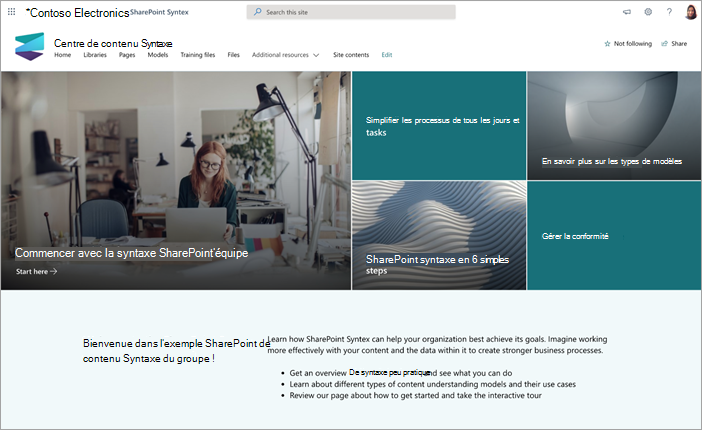
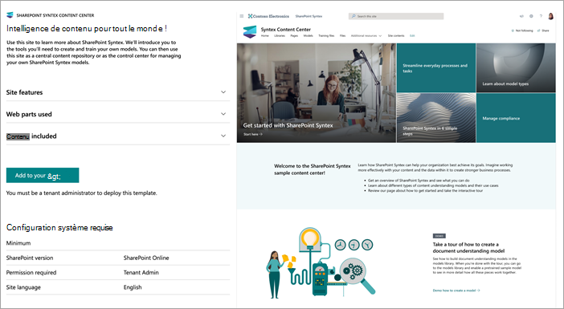
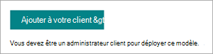

# Utiliser le modèle de site centre de contenu pour Microsoft Syntex

Le site Centre de contenu Microsoft Syntex est un modèle de site SharePoint d’instruction prêt à être déployé conçu pour vous aider à mieux comprendre les fonctionnalités de Syntex.

Vous découvrirez les outils et les informations dont vous aurez besoin pour créer et entraîner vos propres modèles. Vous pourrez ensuite utiliser ce site comme référentiel de contenu central ou comme centre de contrôle pour la gestion de vos propres modèles Syntex.

Dans ce site, les modèles peuvent être formés et évalués à l’aide de votre propre contenu. Toutefois, pour appliquer les modèles aux bibliothèques, une licence syntex est requise.  

## Approvisionner le site

Le site Centre de contenu peut être approvisionné à partir du [service look book SharePoint](https://lookbook.microsoft.com/).

> [!NOTE]
> Vous devez être administrateur général ou administrateur SharePoint dans Microsoft 365 pour configurer le site.

1. Dans la page principale du [look book SharePoint](https://lookbook.microsoft.com/), dans le menu **Afficher les conceptions** , sélectionnez **Syntex** > **Syntex Content Center**.

2. Dans la page **Centre de contenu** , sélectionnez **Ajouter à votre locataire**.

    

3. Entrez votre adresse e-mail (pour une notification indiquant quand votre site est prêt à être utilisé), l’URL du site que vous souhaitez utiliser et le titre que vous souhaitez utiliser pour votre site. 

    

4. Sélectionnez **Fourniture** puis votre site sera rapidement prêt à être utilisé. Vous recevrez un e-mail (envoyé à l’adresse e-mail que vous avez fournie) indiquant que votre demande d’approvisionnement du modèle de site centre de contenu est terminée.

5. Sélectionnez **Ouvrir le site** et votre site centre de contenu s’affiche. À partir de là, vous pouvez explorer le site et en savoir plus sur Syntex. 

Pour plus d’informations sur l’approvisionnement à partir du service look book SharePoint, consultez [Provisionner une nouvelle solution de parcours d’apprentissage](/office365/customlearning/custom_provision).

## Explorer le site

Le site centre de contenu inclut des pages préremplies qui vous guident tout au long des étapes pour commencer à utiliser Syntex dans votre organisation. 

### Bien démarrer avec Syntex

Obtenez une présentation de Syntex et découvrez comment vous pouvez l’utiliser pour votre organisation. Regardez une vidéo qui vous donne une vue d’ensemble de Syntex et trouvez une formation pour vous aider à commencer.

### En savoir plus sur les types de modèles

Découvrez trois types de modèles et découvrez comment les utiliser pour résoudre les problèmes métier liés à la recherche, aux processus métier, à la conformité, etc.

### Effectuer une visite interactive pour créer un modèle

Découvrez comment créer un modèle de compréhension de document dans la bibliothèque de modèles, puis activer un exemple de modèle préentraîné.

### Syntex en six étapes simples

Commencez par un centre de contenu, puis découvrez pas à pas comment créer des modèles pour identifier, classifier et extraire les informations dont vous avez besoin.

### Simplifier les processus et tâches quotidiens

Découvrez comment utiliser Syntex pour prendre ce qui est manuel et le transformer en quelque chose de automatisé et rationalisé pour votre organisation.

### Gérer la conformité

Implémentez des étapes pour réduire les risques et vous assurer que les données et les informations capturées par votre organisation sont utilisées de manière sécurisée et réfléchie.

### Afficher l’activité du modèle

Découvrez comment le contenu est utilisé pour illustrer l’activité du modèle et pour fournir plus d’informations sur la façon dont vos modèles sont utilisés.

### Rechercher des ressources supplémentaires

Découvrez d’autres ressources et scénarios pour en savoir plus sur Syntex.

