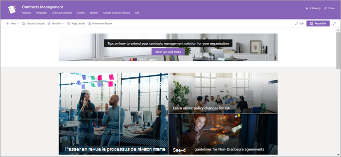
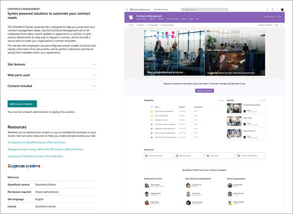
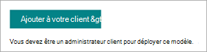

# Utiliser le modèle de site de gestion des contrats pour Microsoft Syntex

Le site de gestion des contrats est un modèle de site SharePoint prêt à être déployé et personnalisable qui permet à votre organisation d’optimiser la valeur de Microsoft Syntex. Le site est conçu pour vous permettre de créer un site professionnel pour gérer, traiter et suivre l’état des contrats dans votre organisation.

## Fonctionnalités du site

Le site de gestion des contrats comprend des pages préremplies, des composants WebPart et la navigation du site. Le site peut être personnalisé pour incorporer la propre personnalisation de votre organisation, les informations sur les employés, les informations de stratégie et de planification, le flux de travail, les contacts et les ressources de votre organisation.

Le site utilise la puissance d’un modèle Syntex s’exécutant sur une bibliothèque de documents SharePoint pour classifier les documents et extraire des métadonnées. Le site fournit des bibliothèques de documents prédéfinies pour vous aider à démarrer rapidement, mais vous pouvez également créer les vôtres en fonction des besoins. Le site inclut les bibliothèques recommandées suivantes :

- **Régions** : classifiez les documents de contrat par zone géographique, pays ou région.

- **Modèles** : sélectionnez le modèle de contrat approprié pour le type de contrat, comme les accords de non-divulgation, les contrats de service et les énoncés de travail.

- **Demandes de contrat** : lancez une demande de contrat directement à votre équipe de contrats.

- **Clients** : recherchez les informations client dans un emplacement pratique.

- **Modèles** : utilisez le modèle de cette bibliothèque pour classifier les documents et extraire des métadonnées. Les utilisateurs peuvent créer leurs propres modèles en fonction de leurs besoins et les ajouter à cette bibliothèque.

- **Bibliothèque d’exemples de contrats** : recherchez les fichiers classifiés et dont les métadonnées ont été extraites à l’aide du modèle Syntex. 

Il existe une vue distincte dans la bibliothèque dans laquelle vous pouvez suivre d’autres métadonnées, telles que l’état, et qui utilise la mise en forme de la bibliothèque de documents pour les afficher de manière plus visuelle.

## Provisionner le site

Le site de gestion des contrats peut être approvisionné à partir du [service de carnet de recherche SharePoint](https://lookbook.microsoft.com/).

> [!NOTE]
> Vous devez être administrateur général ou administrateur SharePoint dans Microsoft 365 pour approvisionner le site. Vous devez également disposer d’une [licence Microsoft Syntex](syntex-licensing.md) pour ajouter ce modèle de site à votre organisation.

1. Dans la page principale du [lookbook SharePoint](https://lookbook.microsoft.com/), dans le menu **Afficher les conceptions**, sélectionnez **Gestion des contrats Syntex** >  Syntex.

2. Dans la page **Gestion des contrats** , sélectionnez **Ajouter à votre locataire**.

    

3. Entrez votre adresse e-mail (pour une notification indiquant quand votre site est prêt à être utilisé), l’URL du site que vous souhaitez utiliser et le titre que vous souhaitez utiliser pour votre site. 

    

4. Sélectionnez **Fourniture** puis votre site sera rapidement prêt à être utilisé. Vous recevrez un e-mail (envoyé à l’adresse e-mail que vous avez fournie) indiquant que votre demande de mise en service du modèle de site de gestion des contrats est terminée.

5. Sélectionnez **Ouvrir le site** pour voir votre site de gestion des contrats. À partir de là, vous pouvez explorer le site et personnaliser les pages et le contenu. 

Pour plus d’informations sur l’approvisionnement à partir du service de carnet de recherche SharePoint, voir [Provisionner une nouvelle solution de parcours d’apprentissage](/office365/customlearning/custom_provision).

## Personnaliser la site

Avant de partager le site de gestion des contrats avec d’autres utilisateurs, vous devez personnaliser le site pour répondre à vos besoins. 

### Personnalisez l’aspect de votre site

Personnalisez les éléments suivants de votre site pour répondre aux besoins de votre organisation :

- Mettez à jour la [personnalisation](https://support.microsoft.com/office/customize-your-sharepoint-site-320b43e5-b047-4fda-8381-f61e8ac7f59b) sur le site de gestion des contrats pour l’aligner sur votre organisation.
- Personnalisez le[le composant webpart Hero](https://support.microsoft.com/office/use-the-hero-web-part-d57f449b-19a0-4b0d-8ce3-be5866430645) pour inclure des images de sites réels dans votre organisation autant que possible.
- Personnalisez le [composant WebPart Personnes](https://support.microsoft.com/office/show-people-profiles-on-your-page-with-the-people-web-part-7e52c5f6-2d72-48fa-a9d3-d2750765fa05) pour inclure les informations de contact des gestionnaires de contrats ou d’autres personnes.
- Personnalisez le [composant WebPart Texte](https://support.microsoft.com/office/add-text-and-tables-to-your-page-with-the-text-web-part-729c0aa1-bc0d-41e3-9cde-c60533f2c801) pour ajouter des paragraphes et des options de mise en forme telles que les styles, les puces, les retraits, la mise en surbrillance et les liens.
- Personnalisez le [composant WebPart Image](https://support.microsoft.com/office/use-the-image-web-part-a63b335b-ad0a-4954-a65d-33c6af68beb2) pour ajouter une image à une page.
- Personnalisez le [composant WebPart Liens rapides](https://support.microsoft.com/office/use-the-quick-links-web-part-e1df7561-209d-4362-96d4-469f85ab2a82) pour organiser et afficher des liens vers d’autres ressources.
- Ajoutez [d’autres composants WebPart](https://support.microsoft.com/office/using-web-parts-on-sharepoint-pages-336e8e92-3e2d-4298-ae01-d404bbe751e0) à votre site en fonction des besoins.
- Personnalisez la [mise en page](https://support.microsoft.com/office/add-sections-and-columns-on-a-sharepoint-modern-page-fc491eb4-f733-4825-8fe2-e1ed80bd0899) selon le besoin.
- Ajoutez [de nouvelles pages](https://support.microsoft.com/office/create-and-use-modern-pages-on-a-sharepoint-site-b3d46deb-27a6-4b1e-87b8-df851e503dec) pour ajouter des ressources de support ou d’information supplémentaires.

### Personnalisez la navigation du site

Vous avez le contrôle de la navigation du site pour le site de gestion des contrats. Utilisez les ressources suivantes pour vous aider à apporter des modifications qui s’alignent sur votre organisation :

- Personnalisez la [navigation du site](https://support.microsoft.com/office/customize-the-navigation-on-your-sharepoint-site-3cd61ae7-a9ed-4e1e-bf6d-4655f0bf25ca).
- [Associer ce site à un hub](https://support.microsoft.com/office/associate-a-sharepoint-site-with-a-hub-site-ae0009fd-af04-4d3d-917d-88edb43efc05).
- Utilisez [ciblage d’audience](https://support.microsoft.com/office/target-navigation-news-and-files-to-specific-audiences-33d84cb6-14ed-4e53-a426-74c38ea32293) pour destiner des liens de navigation spécifiques à des utilisateurs spécifiques. 
- [Supprimez les pages indésirables](https://support.microsoft.com/office/delete-a-page-from-a-sharepoint-site-1d4197b8-31b6-460d-906b-3fb492a51db1) si vous en avez besoin.

### Ajouter d’autres flux de travail

Le site de gestion des contrats contient les composants dont vous avez besoin pour commencer, mais vous pouvez également inclure des composants supplémentaires, tels que :

- Utilisez un [flux Power Automate](/power-automate/getting-started) pour déclencher un flux de travail lorsqu’un nouveau contrat est ajouté à la bibliothèque **de demandes de contrat** .
- Créez des [modèles Syntex](/microsoft-365/contentunderstanding/#models) supplémentaires.
- Utilisez la fonctionnalité [d’assembly de contenu](content-assembly.md) sur la bibliothèque **modèles** .
- Créez une [solution de gestion des contrats](solution-manage-contracts-in-microsoft-365.md) à l’aide de Syntex avec d’autres composants de Microsoft 365.

## Partager le site avec d’autres personnes

[Partagez votre site avec d’autres personnes](https://support.microsoft.com/office/share-a-site-958771a8-d041-4eb8-b51c-afea2eae3658). Collaborez avec d’autres membres de votre organisation pour vous assurer que le site de gestion des contrats est largement connu et adopté.

Facteurs clés de réussite de la gestion du site de gestion des contrats :

- Célébrez le lancement de votre site de gestion des contrats.
- Créez et publiez des actualités annonçant la nouvelle ressource.
- Vérifiez que les utilisateurs dispose d’un support pour les questions et commentaires.
- Utilisez les insights de [l’analytique de site](https://support.microsoft.com/office/view-usage-data-for-your-sharepoint-site-2fa8ddc2-c4b3-4268-8d26-a772dc55779e) pour promouvoir du contenu sur la page d’accueil, mettre à jour la navigation ou réécrire le contenu par clarté.
- Passez en revue le site de gestion des contrats si nécessaire pour vous assurer que le contenu est actualisé et toujours pertinent.

