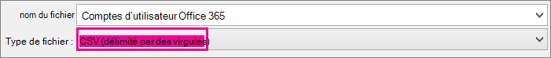
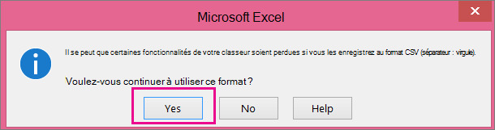

# <a name="add-several-users-at-the-same-time-to-microsoft-365---admin-help"></a>Ajouter plusieurs utilisateurs en même temps à Microsoft 365 - Aide de l’administrateur

Chaque personne de votre équipe a besoin d’un compte d’utilisateur pour pouvoir se Microsoft 365 services de messagerie et d’Office. Si votre équipe compte de nombreux membres, vous pouvez ajouter tous leurs comptes simultanément à partir d'une feuille de calcul Excel ou d'un autre fichier enregistré au format CSV. [Vous ne savez pas quel est le format CSV](add-several-users-at-the-same-time.md#not-sure-what-csv-format-is)?
  
> [!NOTE]
> Si le nouveau Centre d’administration Microsoft 365 n’est pas celui que vous utilisez, vous pouvez l’activer en sélectionnant le bouton bascule **Essayer le nouveau Centre d’administration** situé en haut de la page d’accueil.

## <a name="add-multiple-users-in-the-microsoft-365-admin-center"></a>Ajouter plusieurs utilisateurs dans le Centre d’administration Microsoft 365

1. Connectez-vous à Microsoft 365 à l’aide de votre compte professionnel ou scolaire.

2. Dans le Centre d’administration, sélectionnez **Utilisateurs** \> **actifs.**

3. Sélectionnez **Ajouter plusieurs utilisateurs.**

4. Dans le panneau **Importer plusieurs utilisateurs**, vous pouvez éventuellement télécharger un exemple de fichier CSV avec ou sans exemple de données inclus.

    Votre feuille de calcul doit inclure exactement les mêmes en-tête de colonne **que** l’exemple (nom d’utilisateur, prénom, et ainsi de suite). Si vous utilisez le modèle, ouvrez-le dans un outil d’édition de texte, tel que Bloc-notes, et envisagez de laisser seules toutes les données de la ligne 1 et d’entrer uniquement les données des lignes 2 et suivantes.

    Votre feuille de calcul doit également inclure des valeurs pour le nom d'utilisateur (tel que alexandre@contoso.com) et un nom complet (tel que Alexandre Chauvin) pour chaque utilisateur.

  ```
  User Name,First Name,Last Name,Display Name,Job Title,Department,Office Number,Office Phone,Mobile Phone,Fax,Address,City,State or Province,ZIP or Postal Code,Country or Region
  chris@contoso.com,Chris,Green,Chris Green,IT Manager,Information Technology,123451,123-555-1211,123-555-6641,123-555-6700,1 Microsoft way,Redmond,Wa,98052,United States
  ben@contoso.com,Ben,Andrews,Ben Andrews,IT Manager,Information Technology,123452,123-555-1212,123-555-6642,123-555-6700,1 Microsoft way,Redmond,Wa,98052,United States
  david@contoso.com,David,Longmuir,David Longmuir,IT Manager,Information Technology,123453,123-555-1213,123-555-6643,123-555-6700,1 Microsoft way,Redmond,Wa,98052,United States
  cynthia@contoso.com,Cynthia,Carey,Cynthia Carey,IT Manager,Information Technology,123454,123-555-1214,123-555-6644,123-555-6700,1 Microsoft way,Redmond,Wa,98052,United States
  melissa@contoso.com,Melissa,MacBeth,Melissa MacBeth,IT Manager,Information Technology,123455,123-555-1215,123-555-6645,123-555-6700,1 Microsoft way,Redmond,Wa,98052,United States
  
  ```

5. Entrez un chemin d'accès dans la zone, ou choisissez **Parcourir** pour accéder à l'emplacement du fichier CSV, puis sélectionnez **Vérifier**.
  
    S'il existe des problèmes avec le fichier, ceux-ci s'affichent dans le panneau. Vous pouvez également télécharger un fichier journal.

6. Dans la boîte de dialogue **Définir les options utilisateur**, vous pouvez définir le statut de connexion et choisir la licence produit à affecter à tous les utilisateurs.

7. Dans la boîte de dialogue **Affichez vos résultats**, vous pouvez choisir d'envoyer les résultats à vous-même ou à d'autres utilisateurs (les mots de passe seront au format texte brut). En outre, vous pouvez voir combien d'utilisateurs ont été créés et si vous avez besoin d'acheter des licences supplémentaires pour les attribuer à certains des nouveaux utilisateurs.

## <a name="next-steps"></a>Étapes suivantes

- Maintenant que ces personnes ont des comptes, elles doivent télécharger et installer ou [réinstaller Microsoft 365 ou Office 2016](https://support.office.com/article/4414eaaf-0478-48be-9c42-23adc4716658)sur un PC ou Mac . Chaque personne de votre équipe peut installer Microsoft 365 sur 5 PC ou Mac au plus.

- Chaque utilisateur peut également configurer des applications Office et la messagerie électronique sur un [appareil mobile](https://support.office.com/article/7dabb6cb-0046-40b6-81fe-767e0b1f014f) sur 5 tablettes et 5 téléphones au plus, tels que des iPhone, des iPads et des téléphones et tablettes Android. De cette façon, ils peuvent modifier Office fichiers de n’importe où.

    Voir [Configurer Microsoft 365 entreprise](https://support.office.com/article/6a3a29a0-e616-4713-99d1-15eda62d04fa) pour obtenir une liste de bout en bout des étapes de configuration.

## <a name="more-information-about-how-to-add-users-to-microsoft-365"></a>Plus d’informations sur l’ajout d’utilisateurs Microsoft 365

### <a name="not-sure-what-csv-format-is"></a>Qu'est-ce que le format CSV ?

Un fichier CSV inclut des valeurs séparées par des virgules. Vous pouvez créer ou modifier un fichier comme celui-ci avec un éditeur de texte ou un tableur comme Excel.
  
Vous pouvez télécharger [cet exemple de feuille de calcul](https://www.microsoft.com/download/details.aspx?id=45485) pour commencer. N’oubliez Microsoft 365 nécessite des en-tête de colonne dans la première ligne, donc ne les remplacez pas par autre chose. 
  
Enregistrez le fichier avec un nouveau nom et spécifiez le format CSV.
  

  
Une fois le fichier enregistré, il est probable qu'un message indiquant que certaines fonctionnalités de votre classeur seront perdues si vous enregistrez le fichier au format CSV s'affiche. Ceci est normal. Cliquez sur **Oui** pour continuer.
  

  
### <a name="tips-for-formatting-your-spreadsheet"></a>Conseils pour la mise en forme de votre feuille de calcul

- **Ai-je besoin des mêmes en-têtes de colonne que dans l'exemple de feuille de calcul ?** Oui. La première ligne de l'exemple de feuille de calcul inclut les en-têtes de colonne. Ces en-têtes sont obligatoires. Pour chaque utilisateur que vous souhaitez ajouter à Microsoft 365, créez une ligne sous le titre. Si vous ajoutez, modifiez ou supprimez des en-Microsoft 365 colonne, il se peut que vous ne soyez pas en mesure de créer des utilisateurs à partir des informations du fichier.

- **Que faire si je n'ai pas toutes les informations requises pour chaque utilisateur ?** Le nom de l'utilisateur et le nom d'affichage sont obligatoires. Vous ne pouvez pas ajouter un nouvel utilisateur sans ces informations. S'il vous manque d'autres informations, par exemple le numéro de télécopie, vous pouvez insérer un espace suivi d'une virgule pour indiquer que le champ est vide.

- **Quelle peut être la taille de la feuille de calcul ?** La feuille de calcul doit avoir au moins deux lignes. One is for the column headings (the user data column label) and one for the user. You cannot have more than 251 rows. If you need to import more than 250 users, you can create more than one spreadsheet.

- **Quelles langues puis-je utiliser ?** Lorsque vous créez votre feuille de calcul, vous pouvez entrer des étiquettes de colonnes de données utilisateur dans n’importe quelle langue ou caractère, mais vous ne devez pas modifier l’ordre des étiquettes, comme illustré dans l’exemple. You can then make entries into the fields, using any language or characters, and save your file in a Unicode or UTF-8 format.

- **Que dois-je faire si j'ajoute des utilisateurs de régions ou de pays différents ?** Créez une feuille de calcul distincte pour chaque zone. Vous devez exécuter l'Assistant Ajouter des utilisateurs en bloc avec chaque feuille de calcul, et donner ainsi un seul emplacement à tous les utilisateurs inclus dans le fichier que vous utilisez.

- **Le nombre de caractères que je peux utiliser est-il limité ?** Le tableau suivant indique les étiquettes de colonne des données utilisateur et le nombre maximal de caractères autorisés pour chacune d'elles dans l'exemple de feuille de calcul.

|**Étiquette de colonne des données utilisateur**|**Longueur de caractères maximale**|
|:-----|:-----|
|Nom d'utilisateur (requis)  <br/> |79, y compris le signe at (@), au format name@domain. \<extension\> . L’alias de l’utilisateur ne peut pas dépasser 50 caractères et le nom de domaine ne peut pas dépasser 48 caractères.  <br/> |
|Prénom  <br/> |64  <br/> |
|Nom  <br/> |64  <br/> |
|Nom d'affichage (requis)  <br/> |256  <br/> |
|Poste  <br/> |64  <br/> |
|Service  <br/> |64  <br/> |
|Numéro du bureau  <br/> |128  <br/> |
|Téléphone (bureau)  <br/> |64  <br/> |
|Téléphone mobile  <br/> |64  <br/> |
|Télécopie  <br/> |64  <br/> |
|Adresse  <br/> |1023  <br/> |
|Ville  <br/> |128  <br/> |
|Département ou région  <br/> |128  <br/> |
|Code postal  <br/> |40  <br/> |
|Pays ou région  <br/> |128  <br/> |

### <a name="still-having-problems-when-adding-users-to-microsoft-365"></a>Vous avez encore des problèmes lors de l’ajout d’utilisateurs Microsoft 365 ?

- **Vérifiez que la feuille de calcul est correctement mise en forme.** Examinez les en-têtes des colonnes pour vous assurer qu'ils correspondent à ceux de l'exemple de fichier. Veillez à respecter le nombre de caractères autorisés et assurez-vous que chaque champ est séparé par une virgule.

- **Si les nouveaux utilisateurs ne s’Microsoft 365 immédiatement, patientez quelques minutes.** Les modifications apportées à tous les services de l’Microsoft 365 peuvent prendre un certain temps. 

## <a name="related-articles"></a>Articles connexes

[Ajouter des utilisateurs individuellement ou en bloc à Microsoft 365](/office365/admin/add-users/add-users)