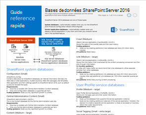
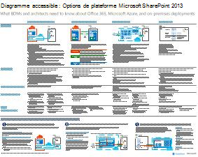
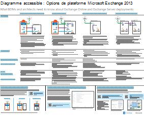
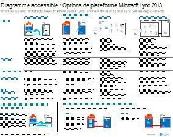
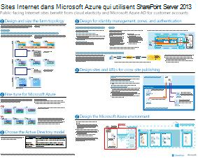
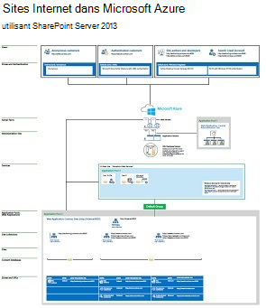

# Modèles architecturaux pour SharePoint, Exchange, Skype Entreprise et Lync

Ces affiches décrivent les modèles architecturaux et les options de déploiement de SharePoint, Exchange, Skype Entreprise et Lync, et fournissent des informations de conception pour le déploiement de SharePoint dans Microsoft Azure.
  
Avec Microsoft 365, vous pouvez fournir les services de collaboration et de communication que vos utilisateurs connaissent dans le cadre d’un service basé sur le cloud. À quelques exceptions près, l’expérience utilisateur reste la même, que vous mainteniez un déploiement local ou que vous utilisiez Microsoft 365. Cette expérience utilisateur unifiée complique quelque peu le choix d’emplacement de chaque charge de travail et soulève des questions telles que :
  
- Comment déterminer l’option de plateforme à utiliser pour les charges de travail individuelles ?
    
- Est-il judicieux de conserver tous les services en local ?
    
- Dans quel scénario un déploiement hybride est-il approprié ?
    
- Comment Microsoft Azure s’intègre-t-il ?
    
- Quelles sont les configurations prises en charge pour les charges de travail d’Office Server dans Azure ?
    
> [!TIP]
> La plupart des affiches sur cette page sont disponibles dans plusieurs langues, notamment en chinois, anglais, français, allemand, italien, japonais, coréen, portugais, russe et espagnol. Pour télécharger une affiche dans l’une de ces langues, cliquez sur le lien **Plus de langues** correspondant à cette affiche.
  
Faites-nous savoir ce que vous en pensez ! Écrivez-nous à l’adresse [cloudadopt@microsoft.com](mailto:cloudadopt@microsoft.com). 
  
Cette page renvoie aux affiches suivantes :
  
- **Affiches de modèles architecturaux** Vous pouvez utiliser ces ressources pour déterminer votre plate-forme et votre configuration idéales pour SharePoint 2016 et Skype Entreprise 2015.
    
  - [Modèles architecturaux Microsoft SharePoint 2016](architectural-models-for-sharepoint-exchange-skype-for-business-and-lync.md#SP2016_ArchModel)
    
  - [Bases de données SharePoint Server 2016](architectural-models-for-sharepoint-exchange-skype-for-business-and-lync.md#SP2016_Databases)
    
  - [Modèles architecturaux Microsoft Skype Entreprise 2015](architectural-models-for-sharepoint-exchange-skype-for-business-and-lync.md#SfB2015_ArchModel)
    
- **Affiches des options de plateforme** Vous pouvez utiliser ces ressources pour déterminer votre plate-forme et votre configuration idéales pour SharePoint 2013, Exchange 2013 et Lync 2013.
    
  - [Options de plateforme SharePoint 2013](architectural-models-for-sharepoint-exchange-skype-for-business-and-lync.md#SP2013_Options)
    
  - [Options de plateforme Exchange 2013](architectural-models-for-sharepoint-exchange-skype-for-business-and-lync.md#Exch2013_options)
    
  - [Options de plateforme Lync 2013](architectural-models-for-sharepoint-exchange-skype-for-business-and-lync.md#Lync2013_Options)
    
- **Affiches des solutions SharePoint Server 2013 dans Azure** Vous pouvez utiliser ces affiches pour déterminer la conception et la configuration des charges de travail SharePoint Server 2013 dans les services d’infrastructure Azure.
    
  - [Sites Internet dans Microsoft Azure qui utilisent SharePoint Server 2013](architectural-models-for-sharepoint-exchange-skype-for-business-and-lync.md#Azure_sharepoint2013)
    
  - [Exemple de conception : sites Internet dans Microsoft Azure pour SharePoint 2013](architectural-models-for-sharepoint-exchange-skype-for-business-and-lync.md#DesignSampleInternetSites)
    
  - [Récupération d’urgence SharePoint vers Microsoft Azure](architectural-models-for-sharepoint-exchange-skype-for-business-and-lync.md#sharepoint_recovery_Azure)
    
## Affiches des modèles architecturaux

Ces nouvelles affiches de systèmes informatiques pour SharePoint 2016 et Skype Entreprise 2015 permettent de comparer les différentes méthodes de déploiement dans un format facile à imprimer. Chaque affiche fournit une liste de toutes les configurations ou options de plateforme disponibles et vous donne les informations suivantes pour chaque option :
  
- **Vue d’ensemble** Bref résumé de la plateforme, accompagné d’un diagramme conceptuel.
    
- **Recommandé pour** les scénarios courants qui conviennent à la plateforme en particulier.
    
- **Licences nécessaires** Licences dont vous avez besoin pour le déploiement.
    
- **Tâches d’architecture** Décisions que vous devez prendre en tant qu’architecte.
    
- **Responsabilités ou tâches des professionnels de l’informatique** Les responsabilités quotidiennes que votre personnel informatique doit planifier.
    

### Modèles architecturaux Microsoft SharePoint 2016

|**Élément**|**Description**|
|:-----|:-----|
|[          ](https://www.microsoft.com/download/details.aspx?id=52650)   [PDF](https://download.microsoft.com/download/4/F/A/4FA0F94B-EE2F-41DB-A047-D9864FEF41E9/SharePoint2016ArchitecturalModels.pdf)  \| [Visio](https://download.microsoft.com/download/4/F/A/4FA0F94B-EE2F-41DB-A047-D9864FEF41E9/SharePoint2016ArchitecturalModels.vsdx) \| [Autres langues](https://www.microsoft.com/download/details.aspx?id=52650)   | Cette affiche décrit les configurations locales SharePoint Online, Microsoft Azure et SharePoint que les décideurs et les concepteurs de solutions dans les entreprises doivent connaître.    - **SharePoint Online (SaaS)**: vous utilisez SharePoint via un modèle d’abonnement Software as a Service (SaaS).   - **SharePoint Hybride** : vous déplacez vos sites et applications SharePoint dans le cloud à votre rythme.   - **SharePoint dans Azure (IaaS)**  : vous étendez votre environnement local dans Microsoft Azure et vous déployez les serveurs SharePoint 2016 à cet emplacement (recommandé pour les environnements de test/développement et de haute disponibilité/récupération d’urgence).  - **SharePoint en local** : vous planifiez, déployez, gérez et personnalisez votre environnement SharePoint dans un centre de données que vous gérez.   |
   

### Bases de données SharePoint Server 2016

|**Élément**|**Description**|
|:-----|:-----|
|[          ](https://www.microsoft.com/download/details.aspx?id=55041)   [PDF](https://download.microsoft.com/download/D/5/D/D5DC1121-8BC5-4953-834F-1B5BB03EB691/DBrefguideSPS2016_tabloid.pdf)  \| [Visio](https://download.microsoft.com/download/D/5/D/D5DC1121-8BC5-4953-834F-1B5BB03EB691/DBrefguideSPS2016_tabloid.vsdx) \| [Autres langues](https://www.microsoft.com/download/details.aspx?id=55041)   | Cette affiche informatique est un guide de référence rapide pour les bases de données SharePoint Server 2016. Chaque base de données comporte les informations suivantes :    -Taille   - Conseils mise à l’échelle   - Modèles d’E/S   - Conditions requises :     La première page contient les bases de données système SharePoint et les applications de service qui ont plusieurs bases de données. La deuxième page affiche toutes les applications de service qui ont des bases de données uniques.     Pour plus d'informations sur les bases de données SharePoint Server 2016, voir [Types et descriptions des bases de données dans SharePoint Server 2016](https://docs.microsoft.com/SharePoint/technical-reference/database-types-and-descriptions)   |
   

### Modèles architecturaux Microsoft Skype Entreprise 2015

|**Élément**|**Description**|
|:-----|:-----|
|   [PDF](https://download.microsoft.com/download/7/7/4/7741262C-A60D-41F7-863B-99BF5964FBFE/Skype%20for%20Business%20Architectural%20Models.pdf)  \| [Visio](https://download.microsoft.com/download/7/7/4/7741262C-A60D-41F7-863B-99BF5964FBFE/Skype%20for%20Business%20Architectural%20Models.vsd) \| [Autres langues](https://www.microsoft.com/download/details.aspx?id=55022)   |Cette affiche décrit les configurations Skype Entreprise Online locales, hybrides, PBX cloud et d’intégration avec Exchange et SharePoint que les décideurs et les concepteurs de solutions dans les entreprises doivent connaître.    Cette série d’affiches est destinée aux professionnels de l’informatique pour mieux leur faire connaître les différents modèles architecturaux fondamentaux par le biais desquels Skype Entreprise Online et Skype Entreprise en local peuvent être utilisés.   Commencez par définir quelle configuration correspond aux futurs plans et besoins de votre organisation. Envisagez et utilisez d’autres selon vos besoins. Par exemple, vous souhaiterez peut-être prendre en considération l’intégration avec Exchange et SharePoint ou une solution basée sur une offre PBX Microsoft Cloud.    |
   
## Affiches des options de plateforme

Ces affiches pour SharePoint 2013, Exchange  2013 et Lync 2013 permettent de comparer les différentes méthodes de déploiement en un clin d’œil et en grand format. Chaque affiche fournit une liste de toutes les configurations ou options de plateforme disponibles et vous donne les informations suivantes pour chaque option :
  
- **Vue d’ensemble** Bref résumé de la plateforme, accompagné d’un diagramme conceptuel.
    
- **Recommandé pour** les scénarios courants qui conviennent à la plateforme en particulier.
    
- **Licences nécessaires** Licences dont vous avez besoin pour le déploiement.
    
- **Tâches d’architecture** Décisions que vous devez prendre en tant qu’architecte.
    
- **Responsabilités ou tâches des professionnels de l’informatique** Les responsabilités quotidiennes que votre personnel informatique doit planifier.
    

## Options de plateforme SharePoint 2013

****

|**Élément**|**Description**|
|:-----|:-----|
|   [PDF](https://go.microsoft.com/fwlink/p/?LinkId=324594)  \| [Visio](https://go.microsoft.com/fwlink/p/?LinkId=324593)  \| [Autres langues](https://www.microsoft.com/download/details.aspx?id=40332)   |Pour les décideurs d’entreprise (BDM) et les architectes, ce modèle présente les options de plateforme pour SharePoint 2013, SharePoint dans Microsoft 365, les déploiements hybrides locaux avec Microsoft 365, Azure et les déploiements uniquement locaux. Il comprend une vue d’ensemble de chaque architecture, des recommandations, les licences exigées et la liste des tâches des architectes et des professionnels de l’informatique pour chaque plateforme. Plusieurs solutions SharePoint sur Azure sont mises en avant.   |
   

## Options de plateforme Exchange 2013

****

|**Élément**|**Description**|
|:-----|:-----|
|    [PDF](https://go.microsoft.com/fwlink/p/?LinkID=398740)  \| [Visio](https://go.microsoft.com/fwlink/p/?LinkID=398742)  \| [Autres langues](https://www.microsoft.com/download/details.aspx?id=42676)   |Pour les BDM et architectes, ce modèle décrit les options de plateforme disponibles pour Exchange 2013. Les clients peuvent choisir entre Exchange Online avec Microsoft 365, Exchange hybride, Exchange Server en local et Exchange hébergé. L’affiche inclut les détails de chaque option d’architecture, ainsi que les scénarios idéaux pour chaque option, les exigences liées aux licences et les responsabilités qui incombent aux professionnels de l’informatique.   |
   

## Options de plateforme Lync 2013

****

|**Élément**|**Description**|
|:-----|:-----|
|   [PDF](https://go.microsoft.com/fwlink/p/?LinkID=391837)  \| [Visio](https://go.microsoft.com/fwlink/p/?LinkID=391839)  \| [Autres langues](https://www.microsoft.com/download/details.aspx?id=41677)   |Pour les BDM et architectes, ce modèle décrit les options de plateforme disponibles pour Lync 2013. Les clients peuvent choisir entre Lync Online avec Microsoft 365, Lync hybride, Lync Server en local et Lync hébergé. L’affiche informatique inclut les détails de chaque option d’architecture, ainsi que les scénarios idéaux pour chaque option, les exigences liées aux licences et les responsabilités qui incombent aux professionnels de l’informatique.    |
   

## Affiches des solutions SharePoint dans Azure

Ces affiches présentent les solutions Azure utilisant SharePoint Server 2013 en grand format.
  

### Sites Internet dans Microsoft Azure utilisant SharePoint Server 2013

****

|**Élément**|**Description**|
|:-----|:-----|
|[          ](https://www.microsoft.com/download/details.aspx?id=41992)   [PDF](https://go.microsoft.com/fwlink/p/?LinkId=392552)  \| [Visio](https://go.microsoft.com/fwlink/p/?LinkId=392551)  \| [Autres langues](https://www.microsoft.com/download/details.aspx?id=41992)   |Cette affiche présente les principales activités de conception et les choix d’architecture recommandés pour les sites Internet dans Azure.     Pour plus d’informations, voir les articles suivants :     - [Sites Internet dans Microsoft Azure qui utilisent SharePoint Server 2013](internet-sites-in-microsoft-azure-using-sharepoint-server-2013.md)   - [Architectures Microsoft Azure pour SharePoint 2013](microsoft-azure-architectures-for-sharepoint-2013.md)   |
   

### Exemple de conception : sites Internet dans Microsoft Azure pour SharePoint 2013

****

|**Élément**|**Description**|
|:-----|:-----|
|[          ](https://www.microsoft.com/download/details.aspx?id=41991)   [PDF](https://go.microsoft.com/fwlink/p/?LinkId=392549)  \| [Visio](https://go.microsoft.com/fwlink/p/?LinkId=392548)  \| [Autres langues](https://www.microsoft.com/download/details.aspx?id=41991)   |Utilisez cet exemple de conception comme point de départ pour l’architecture de votre propre site accessible sur Internet dans Azure à l’aide de SharePoint Server 2013.    Pour plus d’informations, voir les articles suivants :     - [Sites Internet dans Microsoft Azure qui utilisent SharePoint Server 2013](internet-sites-in-microsoft-azure-using-sharepoint-server-2013.md)   - [Architectures Microsoft Azure pour SharePoint 2013](microsoft-azure-architectures-for-sharepoint-2013.md)   |
   

### Récupération d’urgence SharePoint vers Microsoft Azure

****

|**Élément**|**Description**|
|:-----|:-----|
|   [PDF](https://go.microsoft.com/fwlink/p/?LinkId=392555)  \| [Visio](https://go.microsoft.com/fwlink/p/?LinkId=392554)  \| [Autres langues](https://www.microsoft.com/download/details.aspx?id=41993)   |Cette affiche présente les principes d’architecture pour un environnement de récupération d’urgence dans Azure.    Pour plus d’informations, voir les articles suivants :     - [Récupération d’urgence SharePoint Server 2013 dans Microsoft Azure](sharepoint-server-2013-disaster-recovery-in-microsoft-azure.md)   - [Architectures Microsoft Azure pour SharePoint 2013](microsoft-azure-architectures-for-sharepoint-2013.md)   |
   
## Voir aussi

[Centre de solutions et d'architecture Microsoft 365](../solutions/solution-architecture-center.md)
  
[Illustrations Microsoft Cloud pour les architectes d’entreprise](../solutions/cloud-architecture-models.md)
  
[Guides de laboratoire de test Microsoft 365](m365-enterprise-test-lab-guides.md)
  
[Solutions hybrides](hybrid-solutions.md)

