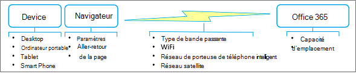

# Meilleures pratiques pour l’utilisation Office 365 sur un réseau lent

Ne serait-il pas bien si votre connexion Internet était toujours rapide et jamais en panne ? Peut-être ce jour-là sera-t-il le jour. Mais en attendant, il existe des choses pratiques que vous pouvez faire pour contourner un réseau instable et tout de même faire votre travail quotidien. Bien Office 365 est un service basé sur le cloud, il offre également de nombreuses façons d’travailler avec votre contenu hors connexion et de maintenir vos modifications synchronisées en toute fluidité. En outre, il est parfois plus efficace de travailler avec du contenu hors connexion simplement parce que les applications s’exécutent plus rapidement et que l’interface utilisateur est plus réactive. Le point est le Office 365 vous offre le meilleur des deux mondes. Voici comment en tirer parti.

> [!TIP]
> Vous voulez voir à quel point votre connexion réseau est lente (ou rapide) ? Essayez le [test de vitesse OOKLA](https://www.speedtest.net/) ou [l’application test de vitesse du réseau.](https://www.windowsphone.com/store/app/network-speed-test/9b9ae06b-2961-41ef-987d-b09567cffe70)

## Pourquoi mon réseau est-il si lent ?

Même si vous ne contrôlez pas les performances réseau, cela vous permet de comprendre ce qui se passe en arrière-plan. Internet est extrêmement complexe, mais il existe quelques concepts qui peuvent vous aider à mieux comprendre la situation. Le fait de suivre les meilleures pratiques de cet article peut vous aider à contourner les problèmes de performances et à réduire la frustration.

### Principaux facteurs qui affectent les performances du réseau

 **Bande passante et latence**: les deux mesures les plus importantes des performances du réseau sont la bande passante et la latence :

- La bande passante est le débit mesuré en bits par seconde. Plus la taille est grande, mieux vaut. La bande passante est comme un canal d’eau. Plus le canal est grand, plus il y a d’eau que vous pouvez « traverser ».

- La latence est le temps qu’il faut pour que le contenu passe d’un serveur ou d’un service à votre appareil et se mesure en millisecondes. Plus rapide est préférable. La latence peut être causée par un certain nombre de facteurs, notamment une bande passante faible, une connexion peu importante ou le temps de transmission.

 **Problèmes courants**: outre la bande passante et la latence, d’autres problèmes ont un impact sur les performances du réseau et sont souvent imprévisibles. Les performances réseau peuvent varier en fonction de l’heure de la journée ou de votre emplacement physique. Le réseau peut être journalisé lorsque certains événements se produisent lors de la pointe de l’utilisation d’Internet, tels qu’une catastrophe naturelle ou un événement public majeur. La taille et la complexité de la page chargée, ainsi que le nombre et la taille des fichiers transférés ont une incidence directe sur les performances. Une connexion WiFi peut se dégrader temporairement : par exemple, vous sondez une grande réunion de conférence de milliers en demandant à tout le monde de tweeter en même temps.

 **Considérations pour** un réseau satellite : un réseau satellite est utile lorsqu’un réseau de sécurité n’est pas réalisable, tel que le pays d’arrière-plan, un expédition de voyage ou une zone scientifique distante. Ces réseaux reposent sur des satellites positionnés sur une orbite géosynchrone à 22 000 km au-dessus du nord. Toutefois, une transmission parcourt en réalité environ 90 000 miles et un réseau satellite présente donc une latence plus lente (500 ms ou plus) qu’un réseau existant (20 à 50 ms). Dans les meilleures conditions, vous ne remarquerez peut-être pas cette latence, mais pour télécharger des fichiers de grande taille, des vidéos en continu et jouer à des jeux, vous le constaterez probablement. Un autre problème est le « fondu de la forêt » dans lequel une météo intense, telle que des équipements et des équipements, peut interrompre temporairement la transmission satellite.

## Êtes-vous sûr qu’il s’agit du réseau ?

Chaque fois que vous avez des problèmes de performances, assurez-vous d’abord que votre appareil n’est pas la cause première du problème. Il existe deux choses que vous pouvez faire et qui peuvent apporter une grande amélioration :

- Assurez-vous que votre appareil fonctionne bien et qu’il n’y a aucun programme malveillant sur votre ordinateur.

- Si possible, achetez plus de mémoire. L’ajout de mémoire est le moyen le plus simple et souvent le plus efficace d’améliorer les performances sur votre appareil. Il est particulièrement utile lorsque vous travaillez avec des fichiers et vidéos de grande taille.

Pour plus d’informations, [voir Windows Performance and maintenance](https://windows.microsoft.com/windows/performance-maintenance-help#performance-maintenance-help) and Astuces to improve PC performance in [Windows 10](https://support.microsoft.com/help/4002019/windows-10-improve-pc-performance).

## Meilleures pratiques pour l’utilisation de votre navigateur

Votre navigateur est votre passerelle vers Office 365, ce qui peut avoir un impact sur les performances, en particulier avec le temps qu’il faut pour charger une page et la fréquence d’aller-retour vers le service Office 365.

### Navigateurs en général

Voici quelques suggestions pour les navigateurs en général :

- Désactivez les extensions de navigateur qui peuvent avoir un impact sur les performances ou dont vous n’avez pas vraiment besoin.

- Augmentez la taille du cache pour vos fichiers Internet temporaires.

- Une fois que vous vous êtes inscrit à votre compte professionnel ou scolaire, gardez la fenêtre du navigateur ouverte tout au long de la journée. Vous pouvez ouvrir d’autres onglets et fenêtres sans vous y resserrer. Si vous devez vous connectez à un autre compte, utilisez la navigation privée.

- Une fois chaque page téléchargée et ouverte, gardez-les ouvertes à l’aide d’onglets. Il est facile de naviguer entre les onglets et d’utiliser la page plus tard dans la journée. Actualisez une page uniquement si vous avez besoin des dernières données sur cette page.

- Si l’ouverture d’une page prend trop de temps, arrêtez le téléchargement de la page (appuyez sur ÉCHAP), puis actualisez la page (appuyez sur F5).

- Dans la mesure du possible, réduisez les allers-retours vers Office 365. Par exemple, au lieu de pagination entre des listes ou des bibliothèques, utilisez la recherche pour localiser les fichiers d’une grande bibliothèque et le filtrage dans une liste afin d’obtenir directement les résultats voulus. Vous pouvez également créer des affichages qui réduisent le temps de chargement des pages. Pour plus d’informations, [voir Gérer les grandes listes et](https://support.office.com/article/b4038448-ec0e-49b7-b853-679d3d8fb784#BKMK_PAGES)bibliothèques dans Office 365 .

- Si les performances de la vidéo sont médiocres, vous pourrez peut-être télécharger la vidéo et la regarder sur votre appareil. Un lien de téléchargement peut être disponible, ou vous pouvez cliquer avec le bouton droit sur le lien vidéo et sélectionner **Enregistrer la cible sous**.

### Spécifique au navigateur

Voici quelques suggestions pour votre navigateur spécifique :

- **Internet Explorer :** mise à niveau vers Internet Explorer version 11 ou ultérieure pour améliorer sensiblement les performances par rapport aux versions précédentes. Pour plus d’informations, voir [le guide de résolution des problèmes pour Internet Explorer.](https://support.microsoft.com/help/2437121/troubleshooting-guide-for-internet-explorer-when-you-access-office-365)
- **FireFox**: pour plus d’informations, voir [Firefox est lent ou cesse de fonctionner.](https://support.mozilla.org/products/firefox/fix-problems/slowness-or-hanging)
- **Safari**: pour plus d’informations, [voir Apple - Safari](https://www.apple.com/safari/).
- **Chrome**: pour plus d’informations, voir [l’aide de Chrome.](https://support.google.com/chrome/?hl=en)

## Meilleures pratiques pour l’utilisation Outlook et Outlook Web App

La lecture, l’écriture et l’organisation du courrier électronique sont une grande partie de la journée de tout le monde. Les Outlook et Outlook Web App (OWA) offrent une prise en charge hors connexion. L’utilisation d’une application de messagerie sur votre smartphone est une autre solution utile. Utilisez les options suivantes qui correspondent le mieux à vos besoins :

- Mise à niveau vers la dernière version de Outlook pour améliorer sensiblement les performances par rapport aux versions précédentes.

- Outlook Web App vous permet de créer des messages hors connexion, des contacts et des événements de calendrier qui sont téléchargés lorsque OWA est ensuite en mesure de se connecter à Office 365. Pour plus d’informations sur la configuration et l’utilisation OWA en mode hors connexion, voir Utilisation Outlook [Web App hors connexion.](https://support.office.com/article/3214839c-0604-4162-8a97-6856b4c27b36)

- Outlook vous permet de travailler en mode mis en cache, dans lequel il se connecte automatiquement chaque fois que possible. Vous pouvez avoir Outlook télécharger l’intégralité de votre boîte aux lettres, ou seulement une partie de cette boîte aux lettres. Pour plus d’informations, voir [Activer le mode Exchange mis](https://support.office.com/article/7885af08-9a60-4ec3-850a-e221c1ed0c1c) en cache et travailler hors connexion dans [Outlook](https://support.office.com/article/f3a1251c-6dd5-4208-aef9-7c8c9522d633).

- Outlook propose également un mode hors connexion. Pour utiliser ce mode, vous devez d’abord configurer le mode mis en cache afin que les informations de votre compte sont copiées sur votre ordinateur. En mode hors connexion, Outlook tentez de se connecter à l’aide des paramètres d’envoi et de réception, ou lorsque vous le définissez manuellement pour qu’il fonctionne en ligne. Pour plus d’informations, voir Travail hors connexion pour éviter les frais de connexion de données, Modifier les [paramètres](https://support.office.com/article/827fe51f-5609-4062-82b4-3578057f9282)d’envoi et de réception lorsque vous travaillez hors connexion et passer du mode hors connexion au mode [en ligne.](https://support.office.com/article/2460e4a8-16c7-47fc-b204-b1549275aac9) 

- Si vous avez un smartphone, vous pouvez l’utiliser pour trier votre courrier électronique et votre calendrier sur le réseau de votre opérateur téléphonique.

> [!NOTE]
> Voici quelques conseils sur le moment où utiliser Outlook ou OWA. Si l’espace disque n’est pas un problème sur votre appareil, Outlook dispose d’un ensemble complet de fonctionnalités et peut fonctionner mieux pour vous. Si l’espace disque est un problème sur votre appareil, envisagez d’utiliser OWA qui comporte un sous-ensemble de fonctionnalités, mais qui fonctionne également mieux dans une situation en ligne. Bien entendu, vous pouvez utiliser l’une ou l’autre des deux, car elles fonctionnent bien ensemble.

## Meilleures pratiques en matière d’utilisation OneDrive Entreprise

OneDrive Entreprise est conçu de base pour fonctionner avec vos fichiers en ligne et hors connexion. Une fois que vous l’avez définie, la synchronisation des modifications se produit automatiquement et de manière fiable où et à chaque fois que vous les effectuez. Si le réseau est lent, vous pouvez utiliser la version hors connexion des fichiers.

L OneDrive Entreprise de synchronisation est disponible avec un abonnement SharePoint Online et Office 365  entreprise, ou vous pouvez télécharger l’application de synchronisation OneDrive Entreprise gratuitement. Cette application est également plus rapide que l’utilisation de la commande Ouvrir dans **l’Explorateur** **ou Télécharger** commande. Pour plus d’informations, voir [Configurer votre ordinateur pour synchroniser vos fichiers OneDrive Entreprise dans Office 365](https://support.office.com/article/23e1f12b-d896-4cb1-a238-f91d19827a16).

Voici quelques conseils supplémentaires pour l’utilisation de l OneDrive Entreprise de synchronisation :

- Si vous synchronisez une grande bibliothèque pour la première fois, démarrez la synchronisation pendant les heures de congé, par exemple, la nuit.
- Vous pouvez utiliser l’option Arrêter la synchronisation d’une bibliothèque [avec la fonctionnalité OneDrive Entreprise’application](https://support.office.com/article/a7e41f1f-3a98-4ca7-9443-f10250688330) pour arrêter temporairement la synchronisation des mises à jour. Toutefois, utilisez cette fonctionnalité pendant de brèves périodes, par exemple quelques heures à la fois, pour éviter la mise en file d’attente d’un grand nombre de mises à jour et pour minimiser le risque de conflits de fusion si plusieurs personnes travaillent sur le même document.

## Meilleures pratiques en matière d’utilisation OneNote

Chaque SharePoint site d’équipe dispose d’un bloc-OneNote intégré et vous pouvez facilement créer votre propre bloc-notes. OneNote est un excellent moyen de collecter les informations dont vous avez besoin chaque jour pour effectuer vos tâches. Par exemple, de nombreuses équipes utilisent OneNote comme point de collecte pour les réunions hebdomadaires, les notes de projet, les idées, les plans et les rapports d’état. Vous pouvez organiser correctement ces informations disparates à l’aide de pages, de sections et d’onglets.

L’une des OneNote est que vous pouvez accéder au contenu à partir de pratiquement n’importe quel appareil, qu’il s’agit d’un ordinateur de bureau, d’un ordinateur portable, d’une tablette ou d’un smartphone. Et vous n’avez pas à vous soucier de l’enregistrement ou de la synchronisation, OneNote le fait pour vous.

Pour plus d’informations, [voir Microsoft OneNote](https://office.microsoft.com/onenote).

## Meilleures pratiques pour l’utilisation Skype Entreprise et Lync Online

Voici des instructions générales pour l’utilisation Skype Entreprise ou Lync Online lorsque votre réseau est lent :

- Utilisez la messagerie instantanée dès que possible, car elle fonctionne bien sur un réseau lent.

- Évitez d’effectuer des appels téléphoniques sur un réseau privé virtuel (VPN) ou des connexions de service d’accès à distance (RAS).

- Assurez-vous que votre périphérique audio est approuvé. Pour plus d’informations, voir [Téléphones et appareils qualifiés pour Microsoft Lync.](/skypeforbusiness/lync-cert/ip-phones)

- Lorsque vous utilisez PowerPoint dans une présentation en ligne, réduisez la taille et la complexité des diapositives. Pour plus d’informations, [voir Astuces pour améliorer les performances de votre présentation.](https://support.office.com/article/34c82835-5f23-4bf0-98cc-72235bbd2949)

- Les performances vidéo dépendent fortement des performances du réseau. Évitez d’utiliser la vidéo si votre réseau est lent.

Pour plus d’informations, voir Qualité audio ou vidéo médiocre dans [Lync Online](https://support.microsoft.com/kb/2386655)ou comment résoudre les problèmes de connexion [dans Skype Entreprise](https://support.office.com/article/troubleshoot-connection-issues-in-skype-for-business-ca302828-783f-425c-bbe2-356348583771).

## Meilleures pratiques pour l’utilisation de SharePoint listes

L’utilisation de données de liste hors connexion pour « nettoyer », analyser ou signaler des données est un excellent moyen de réduire l’impact d’un réseau lent. Vous pouvez lire et écrire la plupart des listes à partir de Microsoft Access 2019 et Microsoft Access 2016 en les liant. Vous pouvez également exporter une liste vers une table Excel, qui crée une connexion de données à sens seul entre la table Excel et la liste. Découvrez comment travailler [en mode hors connexion avec des tables liées à SharePoint listes.](https://support.office.com/article/work-offline-with-tables-that-are-linked-to-sharepoint-lists-5d66594a-6176-4a25-a198-320f13ccf41e)

Pour plus d’informations, voir la section « En savoir plus sur la gestion des grandes listes » dans Gérer les grandes [listes](https://support.office.com/article/b4038448-ec0e-49b7-b853-679d3d8fb784)et bibliothèques dans Office 365 .

## Meilleures pratiques pour la personnalisation des pages web

Lorsque vous personnalisez une page web, vous risquez de provoquer par inadvertance des performances médiocres avec la page. Un certain nombre de facteurs peuvent avoir un impact, tels que la complexité et la taille de la page, le nombre de composants Web Parts ajoutés, le nombre d’éléments de liste ou de bibliothèque affichés initialement et la façon dont vous codez la page.

Pour plus d’informations, voir [Tune SharePoint Online performance](tune-sharepoint-online-performance.md).

## Meilleures pratiques en matière d’utilisation Project Online

Les instructions suivantes peuvent vous aider à améliorer les performances du réseau.

- Project Online et SharePoint Online nécessitent une synchronisation, ce qui peut prendre du temps. Si vos équipes de projet ont un faible taux de rotation, désactivez Project synchronisation de sites pour améliorer les performances Project publier et Project pages de détails. Limitez la synchronisation Active Directory aux groupes de ressources qui ont réellement besoin d’utiliser le système et surveillez les éventuels problèmes d’autorisation après la synchronisation de grands groupes.

- Si votre organisation utilise des sites de projet, créez-les à la demande plutôt que automatiquement. Cela accélère la première expérience de publication et évite de créer des sites et du contenu inutiles.

- Project Les pages de détails (PDP) peuvent déclencher un recalcul de l’ensemble du projet et lancer des actions de flux de travail, qui peuvent toutes deux être des opérations qui entraînent de nombreuses performances. Pour éviter de déclencher deux processus de mise à jour en même temps sur la même PDP, évitez de mettre à jour les champs de calendrier (date de début, date de fin, date d’état et date du jour) et les champs non programmés (nom du projet, description et propriétaire).

- Réduisez le nombre de composants WebPart et de champs personnalisés affichés sur chaque PDP. Créez une PDP dédiée avec les seuls champs qui nécessitent une mise à jour pour améliorer la charge et gagner du temps.

- Lorsque vous utilisez OData pour les rapports, limitez la quantité de données que vous interrogez lors de l’utilisation du filtrage côté serveur.

Pour plus d’informations, voir [Régler Project Online performances.](https://support.office.com/article/12ba0ebd-c616-42e5-b9b6-cad570e8409c)

## Quelle est la meilleure façon de signaler des problèmes ?

Microsoft améliore continuellement les performances globales de Office 365 en surveillant le réseau, en mesurant la bande passante et la latence, en améliorant le temps de chargement des pages, en réduisant les I/S disque, en reconçant les pages pour utiliser une stratégie de téléchargement minimale, en ajoutant du matériel aux centres de données et en ajoutant des centres de données. Pour plus d’informations sur la vérification de votre état actuel et la notification des problèmes, voir [Comment vérifier Office 365 l’état du service.](view-service-health.md)

## Voir aussi

[Planification réseau et optimisation des performances pour Office 365](network-planning-and-performance.md)

[Principes de connectivité réseau Office 365](microsoft-365-network-connectivity-principles.md)

[Gestion des points de terminaison Office 365](https://support.office.com/article/99cab9d4-ef59-4207-9f2b-3728eb46bf9a)

[Points de terminaison Office 365 - FAQ](https://support.office.com/article/d4088321-1c89-4b96-9c99-54c75cae2e6d)
