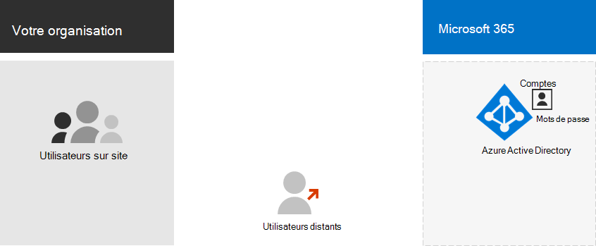

# Identité Cloud Microsoft 365 uniquement

*Cet article est valable pour Microsoft 365 Entreprise et Office 365 Entreprise.*

Avec l’identité Cloud uniquement, tous vos utilisateurs, groupes et contacts sont stockés dans le client Azure Active Directory (Azure AD) de votre abonnement Microsoft 365. Voici les composants de base de l’identité en nuage uniquement.
 

Les utilisateurs et leurs comptes d’utilisateur dans les organisations peuvent être catégorisés de plusieurs façons. Par exemple, certains sont employés et ont un statut permanent. Certains sont des fournisseurs, des sous-traitants ou des partenaires dont le statut est temporaire. Certains sont des utilisateurs externes qui n’ont pas de compte d’utilisateur, mais qui doivent toujours avoir accès à des ressources et des services spécifiques pour prendre en charge l’interaction et la collaboration. Par exemple :

- Les comptes client représentent les utilisateurs au sein de votre organisation auxquels vous octroyez une licence pour les services cloud

- Les comptes B2B représentent les utilisateurs externes à votre organisation que vous invitez à participer à la collaboration

Prenez le stock des types d’utilisateurs de votre organisation. Quels sont les regroupements ? Par exemple, vous pouvez regrouper des utilisateurs selon des fonctions ou des objectifs de haut niveau pour votre organisation.

Par ailleurs, certains services cloud peuvent être partagés avec des utilisateurs externes à votre organisation sans comptes d’utilisateur. Vous devrez identifier ces groupes d’utilisateurs également.

Vous pouvez utiliser des groupes dans Azure AD à plusieurs fins afin de simplifier la gestion de votre environnement Cloud. Par exemple, avec les groupes Azure AD, vous pouvez :

- Utilisez les licences basées sur les groupes pour attribuer automatiquement des licences pour Microsoft 365 à vos comptes d’utilisateur dès qu’elles sont ajoutées en tant que membres.
- Ajouter des comptes d’utilisateurs à des groupes spécifiques de manière dynamique en fonction des attributs de compte d’utilisateur, tels que le nom du service.
- Approvisionner automatiquement les utilisateurs pour les applications SaaS (Software as a service) et protéger l’accès à ces applications à l’aide de l’authentification multifacteur (MFA) et d’autres règles d’accès conditionnel.
- Mettre en service des autorisations et des niveaux d’accès pour les sites d’équipe SharePoint Online.

Vous créez des ***utilisateurs*** avec :

- [Le Centre d’administration Microsoft 365](https://docs.microsoft.com/office365/admin/add-users/add-users)
- [PowerShell pour Microsoft 365](create-user-accounts-with-microsoft-365-powershell.md)

Vous créez des ***groupes*** avec :

- [Le Centre d’administration Microsoft 365](https://docs.microsoft.com/office365/admin/create-groups/create-groups)
- [PowerShell pour Microsoft 365](manage-microsoft-365-groups-with-powershell.md)

## Étape suivante pour l’identité Cloud uniquement

[Attribution de licences aux comptes d’utilisateurs](assign-licenses-to-user-accounts.md)
