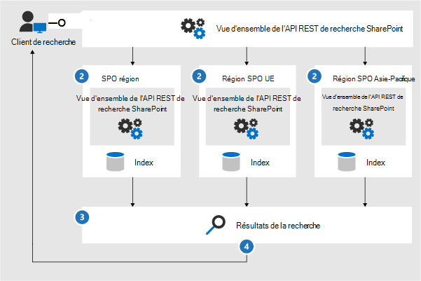
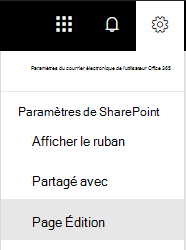

# <a name="configure-search-for-microsoft-365-multi-geo"></a>Configurer la recherche pour Microsoft 365 Multi-Geo

Dans un environnement multigéographique, chaque emplacement géographique comporte son propre index de recherche et son centre de recherche. Lorsqu’un utilisateur effectue une recherche, la requête est distribuée à tous les index et les résultats renvoyés sont fusionnés.

Par exemple, un utilisateur d’un emplacement géographique peut rechercher du contenu stocké dans un autre emplacement géographique ou du contenu sur un site SharePoint limité à un emplacement géographique différent. Si l’utilisateur a accès à ce contenu, la recherche affiche le résultat.

## <a name="which-search-clients-work-in-a-multi-geo-environment"></a>Quels sont les clients de recherche qui fonctionnent dans un environnement Multi-Géo ?

Ces clients peuvent renvoyer des résultats de tous les emplacements géographiques :

- OneDrive
- Delve
- Page d’accueil SharePoint
- Centre de recherche
- Applications de recherche personnalisée qui utilisent l’API de recherche SharePoint

### <a name="onedrive"></a>OneDrive

Dès que l’environnement Multi-Géo est configuré, les utilisateurs qui effectuent des recherches dans OneDrive obtiennent des résultats de tous les emplacements géographiques.

### <a name="delve"></a>Delve

Dès que l’environnement Multi-Géo est configuré, les utilisateurs qui effectuent des recherches dans Delve obtiennent des résultats de tous les emplacements géographiques.

Le flux Delve et la carte de visite affichent uniquement les aperçus des fichiers qui sont stockés dans l’emplacement central. Pour les fichiers stockés dans des emplacements satellites, l’icône du type de fichier apparaît à la place.

### <a name="the-sharepoint-home-page"></a>Page d’accueil SharePoint

Dès que l’environnement Multi-Géo est configuré, les utilisateurs voient les actualités, les sites récents et les sites suivis de plusieurs emplacements géographiques sur leur page d’accueil SharePoint. S’ils utilisent la zone de recherche sur la page d’accueil SharePoint, ils obtiennent des résultats fusionnés provenant de plusieurs emplacements géographiques.

### <a name="the-search-center"></a>Centre de recherche

Une fois que l’environnement Multi-Géo est configuré, chaque centre de recherche continue à afficher uniquement les résultats de son propre emplacement géographique. Les administrateurs doivent [modifier les paramètres de chaque centre de recherche](#_Set_up_a_1) pour obtenir des résultats de tous les emplacements géographiques. Par la suite, les utilisateurs qui effectuent une recherche dans le centre de recherche obtiennent des résultats de tous les emplacements géographiques.

### <a name="custom-search-applications"></a>Applications de recherche personnalisée

Comme d’habitude, les applications de recherche personnalisée interagissent avec les index de recherche en utilisant les API REST de recherche SharePoint existantes. Pour obtenir des résultats de tous les emplacements géographiques (ou une partie), l’application doit [appeler l’API et inclure les nouveaux paramètres de requête Multi-Géo](#_Get_custom_search) dans la demande. Cela déclenche une distribution ramifiée de la requête à tous les emplacements géographiques.

## <a name="whats-different-about-search-in-a-multi-geo-environment"></a>Quelles différences la recherche présente-t-elle dans un environnement multigéographique ?

Certaines fonctionnalités de recherche auxquelles vous êtes habitué fonctionnent différemment dans un environnement multigéographique.

<table>
<thead>
<tr class="header">
<th align="left">Fonctionnalité</th>
<th align="left">Mode de fonctionnement</th>
<th align="left">Solution de contournement</th>
</tr>
</thead>
<tbody>
<tr class="odd">
<td align="left">Résultats promus</td>
<td align="left">Vous pouvez créer des règles de requête avec des résultats promus à différents niveaux : pour le client entier, pour une collection de sites ou pour un site. Dans un environnement multigéographique, définissez les résultats promus au niveau du client pour promouvoir les résultats aux centres de recherche de tous les emplacements géographiques. Si vous souhaitez seulement promouvoir les résultats dans le centre de recherche qui se trouve dans l’emplacement géographique de la collection de sites ou du site, définissez les résultats promus au niveau de la collection de sites ou du site. Ces résultats ne sont pas promus dans d’autres emplacements géographiques.</td>
<td align="left">Si vous n’avez pas besoin d’autres résultats promus par emplacement géographique (par exemple, des règles différentes pour les déplacements), nous vous recommandons de définir les résultats promus au niveau du client.</td>
</tr>
<tr class="even">
<td align="left">Affinements de la recherche</td>
<td align="left">La recherche renvoie des affinements de tous les emplacements géographiques d’un client puis les regroupe. Le regroupement est ce qu’il y a de mieux, ce qui signifie que le nombre d’affinements peut ne pas être précis à 100 %. Pour la plupart des scénarios de recherche, cette précision est suffisante. </td>
<td align="left">Pour les applications basées sur la recherche qui dépendent de l’intégralité de l’affinement, effectuez une requête indépendante sur chaque emplacement géographique.</td>
</tr>
<tr class="odd">
<td align="left"></td>
<td align="left">La recherche multigéographique ne prend pas en charge la création dynamique de compartiments pour les affinements numériques.</td>
<td align="left">Utilisez le <a href="/sharepoint/dev/general-development/query-refinement-in-sharepoint">paramètre « Discretize » pour</a> les affinements numériques.</td>
</tr>
<tr class="even">
<td align="left">ID de document</td>
<td align="left">Si vous développez une application basée sur la recherche qui dépend des ID de document, notez que les ID de document d’un environnement multigéographique ne sont pas uniques parmi les emplacements géographiques, mais le sont par emplacement géographique.</td>
<td align="left">Nous avons ajouté une colonne qui identifie l’emplacement géographique. Utilisez cette colonne pour atteindre l’unicité. Cette colonne est nommée « GeoLocationSource ».</td>
</tr>
<tr class="odd">
<td align="left">Nombre de résultats</td>
<td align="left">La page des résultats de recherche affiche les résultats combinés des emplacements géographiques, mais il n’est pas possible d’afficher plus de 500 résultats par page.</td>
<td align="left"></td>
</tr>
<tr class="even">
<td align="left">Recherche hybride</td>
<td align="left">Dans un environnement SharePoint hybride avec <a href="/sharepoint/hybrid/learn-about-cloud-hybrid-search-for-sharepoint">recherche hybride dans le cloud</a>, le contenu local est ajouté à l’index Microsoft 365 de l’emplacement central.</td>
<td align="left"></td>
</tr>
</tbody>
</table>

## <a name="whats-not-supported-for-search-in-a-multi-geo-environment"></a>Quels sont les éléments qui ne sont pas pris en charge par la recherche dans un environnement multigéographique ?

Certaines fonctionnalités de recherche auxquelles vous êtes habitué ne sont pas prises en charge dans un environnement multigéographique.

<table>
<thead>
<tr class="header">
<th align="left">Fonctionnalité de recherche</th>
<th align="left">Remarque</th>
</tr>
</thead>
<tbody>
<tr class="odd">
<td align="left">Authentification d’application uniquement</td>
<td align="left">L’authentification d’application uniquement (accès privilégié depuis les services) n’est pas prise en charge dans la recherche multigéographique.</td>
</tr>
<tr class="even">
<td align="left">Invités</td>
<td align="left">Les invités obtiennent uniquement les résultats de l’emplacement géographique à partir de qui ils recherchent.</td>
</tr>
</tbody>
</table>

## <a name="how-does-search-work-in-a-multi-geo-environment"></a>Comment fonctionne la recherche dans un environnement multigéographique ?

Tous les clients de recherche utilisent les API REST de recherche SharePoint existantes pour interagir avec les index de recherche.



1. Un client de recherche appelle le point de terminaison REST de recherche avec la propriété de requête EnableMultiGeoSearch= true.
2. La requête est envoyée à tous les emplacements géographiques dans le client.
3. Les résultats de recherche de chaque emplacement géographique sont fusionnés et classés.
4. Le client obtient des résultats de recherche unifiés.

<span id="_Set_up_a" class="anchor"><span id="_Ref501388384" class="anchor"></span></span>Notez que nous ne fusionnons pas les résultats de recherche avant d’avoir reçu les résultats de tous les emplacements géographiques. Cela signifie que les recherches géographiques multiples souffrent d’une latence supplémentaire par rapport aux recherches dans un environnement ne comportant qu’un seul emplacement géographique.

<span id="_Set_up_a_1" class="anchor"><span id="_Ref505252370" class="anchor"></span></span>
## <a name="get-a-search-center-to-show-results-from-all-geo-locations"></a>Obtenir un centre de recherche pour afficher les résultats de tous les emplacements géographiques

Chaque centre de recherche possède plusieurs secteurs verticaux et vous devez configurer chaque secteur vertical individuellement.

1. Vérifiez que vous effectuez ces étapes avec un compte doté d’autorisations pour modifier la page des résultats de la recherche et le composant WebPart Search Result.

2. Accédez à la page des résultats de la recherche (reportez-vous à la [liste](https://support.office.com/article/174d36e0-2f85-461a-ad9a-8b3f434a4213) des pages des résultats de la recherche)

3. Sélectionnez le secteur vertical à configurer, cliquez sur l’icône d’engrenage **Paramètres** située en haut à droite, puis cliquez sur **Modifier la page**. La page des résultats de la recherche s’ouvre en mode Édition.

   

4. Dans le composant WebPart de résultats de recherche, déplacez le pointeur vers le coin supérieur droit et cliquez sur la flèche, puis sur **Modifier le composant WebPart** dans le menu. Le volet des outils du composant WebPart des résultats de recherche s’ouvre sous le ruban en haut à droite de la page.

   

5. Dans le volet des outils du composant WebPart, dans la section **Paramètres**, sous **Paramètres de contrôle des résultats**, sélectionnez **Afficher les résultats multigéographiques** pour que le composant WebPart Résultats de la recherche affiche les résultats de tous les emplacements géographiques.

6. Cliquez sur **OK** pour enregistrer vos changements et fermer le volet des outils du composant WebPart.

7. Vérifiez les changements que vous avez apportés au composant WebPart Résultats de la recherche en cliquant sur **Archiver** sur l’onglet Page du menu principal.

8. Publiez les changements en utilisant le lien fourni dans la note en haut de la page.

<span id="_Get_custom_search" class="anchor"><span id="_Ref501388387" class="anchor"></span></span>
## <a name="get-custom-search-applications-to-show-results-from-all-or-some-geo-locations"></a>Configurer des applications de recherche personnalisée pour qu’elles affichent les résultats de l’ensemble ou d’une partie des emplacements géographiques

Les applications de recherche personnalisée obtiennent les résultats de l’ensemble (ou d’une partie) des emplacements géographiques en spécifiant des paramètres de requête avec la demande à l’API REST de recherche SharePoint. Selon les paramètres, la requête est distribuée à tous les emplacements géographiques ou à certains emplacements géographiques. Par exemple, si vous devez seulement interroger un sous-ensemble des emplacements géographiques pour rechercher des informations pertinentes, vous pouvez contrôler la distribution ramifiée à ces derniers uniquement. Si la demande fonctionne, l’API REST de recherche SharePoint renvoie des données de réponse.

### <a name="requirement"></a>Conditions requises

Pour chaque emplacement géographique, vous devez vous assurer que tous les utilisateurs de l’organisation ont reçu l’autorisation de **lecture** du site web racine (par exemple contoso **APAC**.sharepoint.com/ et contoso **EU**.sharepoint.com/). [En savoir plus sur les autorisations](https://support.office.com/article/understanding-permission-levels-in-sharepoint-87ecbb0e-6550-491a-8826-c075e4859848).

### <a name="query-parameters"></a>Paramètres de requête

EnableMultiGeoSearch : il s’agit une valeur booléenne qui spécifie si la requête doit être étendue aux index des autres emplacements géographiques du client multigéographique. Définissez-la sur **true** pour étendre la requête et sur **false** pour ne pas l’étendre. Si vous n’incluez pas ce paramètre, la valeur par défaut est **false**, sauf lorsque vous effectuez un appel de l’API REST contre un site qui utilise le modèle Centre de recherche d’entreprise, dans ce cas, la valeur par défaut est **true**. Si vous utilisez ce paramètre dans un environnement qui n’est pas multigéographique, le paramètre est ignoré.

TypeClient : il s’agit d’une chaîne. Entrez un nom de client unique pour chaque application de recherche. Si vous n’incluez pas ce paramètre, la requête n’est pas étendue à d’autres emplacements géographiques.

MultiGeoSearchConfiguration : il s’agit d’une liste facultative d’emplacements géographiques dans le client multigéographique pour étendre la requête lorsque **EnableMultiGeoSearch** est défini sur **true**. Si vous n’incluez pas ce paramètre ou que vous le laissez vide, la requête est étendue à d’autres emplacements géographiques. Pour chaque emplacement géographique, entrez les éléments suivants au format JSON :

<table>
<thead>
<tr class="header">
<th align="left">Option</th>
<th align="left">Description</th>
</tr>
</thead>
<tbody>
<tr class="odd">
<td align="left">DataLocation</td>
<td align="left">L’emplacement géographique, par exemple NAM.</td>
</tr>
<tr class="even">
<td align="left">EndPoint</td>
<td align="left">Le point de terminaison auquel se connecter, par exemple https://contoso.sharepoint.com</td>
</tr>
<tr class="odd">
<td align="left">SourceId</td>
<td align="left">GUID de l’origine des résultats, par exemple B81EAB55-3140-4312-B0F4-9459D1B4FFEE.</td>
</tr>
</tbody>
</table>

Si vous omettez DataLocation ou EndPoint, ou si une DataLocation est dupliquée, la demande échoue. [Vous pouvez obtenir des informations sur le point de terminaison des emplacements géographiques d’un client à l’aide de Microsoft Graph](/sharepoint/dev/solution-guidance/multigeo-discovery).

### <a name="response-data"></a>Données de réponse

MultiGeoSearchStatus : il s’agit d’une propriété renvoyée par l’API de recherche SharePoint en réponse à une demande. La valeur de la propriété est une chaîne et fournit les informations suivantes sur les résultats renvoyés par l’API de recherche SharePoint :

<table>
<thead>
<tr class="header">
<th align="left">Valeur</th>
<th align="left">Description</th>
</tr>
</thead>
<tbody>
<tr class="odd">
<td align="left">Complet</td>
<td align="left">Résultats complets de <strong>tous</strong> les emplacements géographiques.</td>
</tr>
<tr class="even">
<td align="left">Partielle</td>
<td align="left">Résultats partiels d’un ou plusieurs emplacements géographiques. Les résultats sont incomplets en raison d’une erreur temporaire.</td>
</tr>
</tbody>
</table>

### <a name="query-using-the-rest-service"></a>Requête à l’aide du service REST

Avec une demande GET, spécifiez les paramètres de la requête dans l’URL. Avec une demande POST, vous transmettez les paramètres de la requête dans le corps au format JSON (JavaScript Object Notation).

#### <a name="request-headers"></a>En-têtes de demande

<table>
<thead>
<tr class="header">
<th align="left">Nom</th>
<th align="left">Valeur</th>
</tr>
</thead>
<tbody>
<tr class="odd">
<td align="left">Content-Type</td>
<td align="left">application/json;odata=verbose</td>
</tr>
</tbody>
</table>

#### <a name="sample-get-request-thats-fanned-out-to-all-geo-locations"></a>Exemple de demande GET étendue à **tous** les emplacements géographiques

```http
https:// \<tenant\>/\_api/search/query?querytext='sharepoint'&Properties='EnableMultiGeoSearch:true'&ClientType='my\_client\_id'
```

#### <a name="sample-get-request-to-fan-out-to-some-geo-locations"></a>Exemple de demande GET à distribuer à **certains** emplacements géographiques

```http
https:// \<tenant\>/\_api/search/query?querytext='site'&ClientType='my_client_id'&Properties='EnableMultiGeoSearch:true, MultiGeoSearchConfiguration:[{DataLocation\\:"NAM"\\,Endpoint\\:"https\\://contosoNAM.sharepoint.com"\\,SourceId\\:"B81EAB55-3140-4312-B0F4-9459D1B4FFEE"}\\,{DataLocation\\:"CAN"\\,Endpoint\\:"https\\://contosoCAN.sharepoint-df.com"}]'
```

> [!NOTE]
> Les symboles virgule et deux-points de la liste des emplacements géographiques pour la propriété MultiGeoSearchConfiguration sont précédés par le caractère **barre oblique inverse**, car les demandes GET utilisent des syboles deux-points pour séparer les propriétés, et des virgules pour séparer les arguments des propriétés. Sans barre oblique inverse comme caractère d’échappement, la propriété MultiGeoSearchConfiguration est interprétée de façon erronée.

#### <a name="sample-post-request-thats-fanned-out-to-all-geo-locations"></a>Exemple de demande POST étendue à **tous** les emplacements géographiques

```http
    {
    "request": {
            "__metadata": {
            "type": "Microsoft.Office.Server.Search.REST.SearchRequest"
        },
        "Querytext": "sharepoint",
        "Properties": {
            "results": [
                {
                    "Name": "EnableMultiGeoSearch",
                    "Value": {
                        "QueryPropertyValueTypeIndex": 3,
                        "BoolVal": true
                    }
                }
            ]
        },
        "ClientType": "my_client_id"
        }
    }
```

#### <a name="sample-post-request-thats-fanned-out-to-some-geo-locations"></a>Exemple de demande POST étendue à **certains** emplacements géographiques

```http
    {
        "request": {
            "Querytext": "SharePoint",
            "ClientType": "my_client_id",
            "Properties": {
                "results": [
                    {
                        "Name": "EnableMultiGeoSearch",
                        "Value": {
                            "QueryPropertyValueTypeIndex": 3,
                            "BoolVal": true
                        }
                    },
                    {
                        "Name": "MultiGeoSearchConfiguration",
                        "Value": {
                        "StrVal": "[{\"DataLocation\":\"NAM\",\"Endpoint\":\"https://contoso.sharepoint.com\",\"SourceId\":\"B81EAB55-3140-4312-B0F4-9459D1B4FFEE\"},{\"DataLocation\":\"CAN\",\"Endpoint\":\"https://contosoCAN.sharepoint.com\"}]",
                            "QueryPropertyValueTypeIndex": 1
                        }
                    }
                ]
            }
        }
    }
```

### <a name="query-using-csom"></a>Requête utilisant CSOM

Voici un exemple de requête CSOM étendue à **tous** les emplacements géographiques :

```CSOM
var keywordQuery = new KeywordQuery(ctx);
keywordQuery.QueryText = query.SearchQueryText;
keywordQuery.ClientType = <enter a string here>;
keywordQuery.Properties["EnableMultiGeoSearch"] = true;
```
