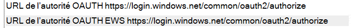

# <a name="how-to-configure-skype-for-business-on-premises-to-use-hybrid-modern-authentication"></a>Comment configurer Skype Entreprise en local pour utiliser l’authentification moderne hybride

*Cet article est valable pour Microsoft 365 Entreprise et Office 365 Entreprise.*

L’authentification moderne, qui est une méthode de gestion des identités qui offre une authentification et une autorisation utilisateur plus sécurisées, est disponible pour les environnements hybrides Skype Entreprise serveur local et serveur Exchange, ainsi que pour les environnements Skype Entreprise partagés.

 **Important** Voulez-vous en savoir plus sur l’authentification moderne (MA) et pourquoi préférer l’utiliser dans votre entreprise ou organisation ? Consultez [ce document](hybrid-modern-auth-overview.md) pour obtenir une vue d’ensemble. Si vous avez besoin de savoir quelles topologies Skype Entreprise sont pris en charge avec MA, cela est documenté ici !

 **Avant de commencer,** j’utilise les termes ci-après :

- Authentification moderne (MA)

- Authentification moderne hybride (HMA)

- Exchange local (EXCH)

- Exchange Online (EXO)

- Skype Entreprise local (SFB)

- Skype Entreprise Online (SFBO)

En outre, si un graphique de cet article possède un objet grisé ou est grisé, cela signifie que l’élément affiché en gris **n’est** pas inclus dans la configuration propre à MA.

## <a name="read-the-summary"></a>Lire le résumé

Ce résumé décompose le processus en étapes qui pourraient sinon être perdues pendant l’exécution et est utile pour qu’une liste de contrôle globale puisse suivre l’endroit où vous vous trouvez dans le processus.

1. Tout d’abord, assurez-vous que vous répondez à toutes les conditions préalables.

1. Étant donné que **de nombreux** éléments prérequis sont courants pour Skype Entreprise et Exchange, consultez l’article de vue d’ensemble de votre liste de contrôle préalable à [la req.](hybrid-modern-auth-overview.md) Faites-le  *avant de*  commencer l’une des étapes de cet article.

1. Collectez les informations spécifiques à HMA dont vous aurez besoin dans un fichier ou OneNote.

1. Activer l’authentification moderne pour EXO (si elle n’est pas déjà allumée).

1. Activer l’authentification moderne pour SFBO (si elle n’est pas déjà allumée).

1. Activer l’authentification moderne hybride Exchange local.

1. Activer l’authentification moderne hybride Skype Entreprise en local.

Ces étapes allument MA pour SFB, SFBO, EXCH et EXO, c’est-à-dire tous les produits qui peuvent participer à une configuration HMA de SFB et SFBO (y compris les dépendances sur EXCH/EXO). En d’autres termes, si vos utilisateurs sont des boîtes aux lettres d’accueil ou ont été créées dans une partie de l’hybride (EXO + SFBO, EXO + SFB, EXCH + SFBO ou EXCH + SFB), votre produit terminé ressemblera à ceci :


Comme vous pouvez le constater, il existe quatre endroits différents pour activer MA ! Pour une expérience utilisateur de qualité, nous vous recommandons d’activer MA aux quatre emplacements ci-après. Si vous ne pouvez pas activer MA à tous ces emplacements, ajustez les étapes afin d’activer MA uniquement dans les emplacements nécessaires pour votre environnement.

Consultez la [rubrique Prise en charge de Skype Entreprise avec MA](/skypeforbusiness/plan-your-deployment/modern-authentication/topologies-supported) pour les topologies pris en charge.

 **Important** Vérifiez que toutes les conditions préalables sont remplies avant de commencer. Vous trouverez ces informations dans la vue d’ensemble de l’authentification moderne hybride [et les conditions préalables.](hybrid-modern-auth-overview.md)

## <a name="collect-all-hma-specific-info-youll-need"></a>Collectez toutes les informations propres à HMA dont vous aurez besoin

Une fois que vous avez vérifié que vous répondez aux conditions [préalables](hybrid-modern-auth-overview.md) à l’utilisation de l’authentification moderne (voir la remarque ci-dessus), vous devez créer un fichier pour contenir les informations dont vous aurez besoin pour configurer HMA dans les étapes suivantes. Exemples utilisés dans cet article :

- **Domaine SIP/SMTP**

  - Exemple : contoso.com (fédéré avec Office 365)

- **ID client**

  - GUID qui représente votre client Office 365 client (à la connexion de contoso.onmicrosoft.com).

- **URL de service Web CU5 SFB 2015**

Vous aurez besoin d’URL de service web interne et externe pour tous les pools SfB 2015 déployés. Pour les obtenir, exécutez la liste suivante à partir Skype Entreprise Management Shell :

```powershell
Get-CsService -WebServer | Select-Object PoolFqdn, InternalFqdn, ExternalFqdn | FL
```

- Exemple : Interne : https://lyncwebint01.contoso.com

- Exemple : Externe : https://lyncwebext01.contoso.com

Si vous utilisez un serveur Édition Standard, l’URL interne est vide. Dans ce cas, utilisez le fqdn du pool pour l’URL interne.

## <a name="turn-on-modern-authentication-for-exo"></a>Activer l’authentification moderne pour EXO

Suivez les instructions ci-après [: Exchange Online : comment activer votre client pour l’authentification moderne.](https://social.technet.microsoft.com/wiki/contents/articles/32711.exchange-online-how-to-enable-your-tenant-for-modern-authentication.aspx)

## <a name="turn-on-modern-authentication-for-sfbo"></a>Activer l’authentification moderne pour SFBO

Suivez les instructions ci-après [: Skype Entreprise Online : activer votre client pour l’authentification moderne.](https://social.technet.microsoft.com/wiki/contents/articles/34339.skype-for-business-online-enable-your-tenant-for-modern-authentication.aspx)

## <a name="turn-on-hybrid-modern-authentication-for-exchange-on-premises"></a>Activer l’authentification moderne hybride pour Exchange local

Suivez les instructions ci-après : Comment configurer Exchange Server [local pour utiliser l’authentification moderne hybride](configure-exchange-server-for-hybrid-modern-authentication.md).

## <a name="turn-on-hybrid-modern-authentication-for-skype-for-business-on-premises"></a>Activer l’authentification moderne hybride pour Skype Entreprise local

### <a name="add-on-premises-web-service-urls-as-spns-in-azure-active-directory"></a>Ajouter des URL de service web local en tant que SNS dans Azure Active Directory

Vous devez maintenant exécuter des commandes pour ajouter les URL (collectées précédemment) en tant que principaux de service dans SFBO.

 **Remarque** Les noms principaux de service (SSN) identifient les services web et les associent à un principal de sécurité (par exemple, un nom de compte ou un groupe) afin que le service puisse agir au nom d’un utilisateur autorisé. Les clients qui s’authentifier sur un serveur utilisent les informations contenues dans les SNS.

1. Tout d’abord, connectez-Azure Active Directory (Azure AD) [avec ces instructions.](/powershell/azure/active-directory/overview)

2. Exécutez cette commande, en local, pour obtenir la liste des URL de service web SFB.

   Notez que l’AppPrincipalId commence par `00000004` . Cela correspond à Skype Entreprise Online.

   Prenez note (et capture d’écran pour comparaison ultérieure) de la sortie de cette commande, qui inclut un SE et une URL WS, mais se compose principalement de SNS qui commencent par `00000004-0000-0ff1-ce00-000000000000/` .

```powershell
Get-MsolServicePrincipal -AppPrincipalId 00000004-0000-0ff1-ce00-000000000000 | Select -ExpandProperty ServicePrincipalNames
```

3. Si les **URL** SFB internes ou externes de l’environnement local sont manquantes (par exemple, nous devons ajouter ces enregistrements spécifiques https://lyncwebint01.contoso.com à cette https://lyncwebext01.contoso.com) liste).

    N’oubliez pas  *de remplacer les exemples d’URL* ci-dessous par vos URL réelles dans les commandes Ajouter !

```powershell
$x= Get-MsolServicePrincipal -AppPrincipalId 00000004-0000-0ff1-ce00-000000000000
$x.ServicePrincipalnames.Add("https://lyncwebint01.contoso.com/")
$x.ServicePrincipalnames.Add("https://lyncwebext01.contoso.com/")
Set-MSOLServicePrincipal -AppPrincipalId 00000004-0000-0ff1-ce00-000000000000 -ServicePrincipalNames $x.ServicePrincipalNames
```

4. Vérifiez que vos nouveaux enregistrements ont été ajoutés en exécutant à nouveau la commande **Get-MsolServicePrincipal** de l’étape 2 et en regardant la sortie. Comparez la liste ou la capture d’écran d’avant à la nouvelle liste de SSN. Vous pouvez également faire une capture d’écran de la nouvelle liste pour vos enregistrements. Si vous avez réussi, vous verrez les deux nouvelles URL dans la liste. En suivant notre exemple, la liste des SNS inclut désormais les URL spécifiques https://lyncwebint01.contoso.com et https://lyncwebext01.contoso.com/ .

### <a name="create-the-evosts-auth-server-object"></a>Créer l’objet serveur DNS EvoSTS

Exécutez la commande suivante dans Skype Entreprise Management Shell.

```powershell
New-CsOAuthServer -Identity evoSTS -MetadataURL https://login.windows.net/common/FederationMetadata/2007-06/FederationMetadata.xml -AcceptSecurityIdentifierInformation $true -Type AzureAD
```

### <a name="enable-hybrid-modern-authentication"></a>Activer l’authentification moderne hybride

Il s’agit de l’étape qui allume ma. Toutes les étapes précédentes peuvent être exécutés à l’avance sans modifier le flux d’authentification client. Lorsque vous êtes prêt à modifier le flux d’authentification, exécutez cette commande dans Skype Entreprise Management Shell.

```powershell
Set-CsOAuthConfiguration -ClientAuthorizationOAuthServerIdentity evoSTS
```

## <a name="verify"></a>Vérifier

Une fois que vous avez activé HMA, la connexion suivante d’un client utilise le nouveau flux d’authentification. Notez que le simple fait d’allumer HMA ne déclenche pas de réauthentication pour un client. Les clients se réauthentent en fonction de la durée de vie des jetons d’th et/ou des jetons dont ils ont.

Pour tester que HMA fonctionne après l’avoir activé, dé sign out of a test SFB Windows client and be sure to click 'delete my credentials'. Connectez-vous à nouveau. Le client doit maintenant utiliser le flux d’authentification moderne et votre connexion inclura désormais une invite **Office 365** pour un compte professionnel ou scolaire, visible juste avant que le client contacte le serveur et vous connecte.

Vous devez également vérifier les « Informations de configuration » Skype Entreprise clients pour une « autorité OAuth ». Pour ce faire sur votre ordinateur client, maintenez la touche Ctrl longue en même temps que vous cliquez avec le bouton droit sur l’icône Skype Entreprise dans la Windows notification. Cliquez **sur Informations de** configuration dans le menu qui s’affiche. Dans la fenêtre « Skype Entreprise configuration » qui s’affiche sur le Bureau, recherchez les informations suivantes :



Vous devez également maintenir la touche CTRL en même temps que vous cliquez avec le bouton droit sur l’icône du client Outlook (également dans le bac Windows Notifications) et cliquez sur « État de la connexion ». Recherchez l’adresse SMTP du client par rapport à un type AuthN de « Bearer » qui représente le jeton du porteur utilisé \* dans OAuth.

## <a name="related-articles"></a>Articles connexes

[Lien vers la vue d’ensemble de l’authentification moderne.](hybrid-modern-auth-overview.md)

Avez-vous besoin de savoir comment utiliser l’authentification moderne (ADAL) pour vos clients Skype Entreprise client ? Nous avons des étapes [à suivre ici.](./hybrid-modern-auth-overview.md)