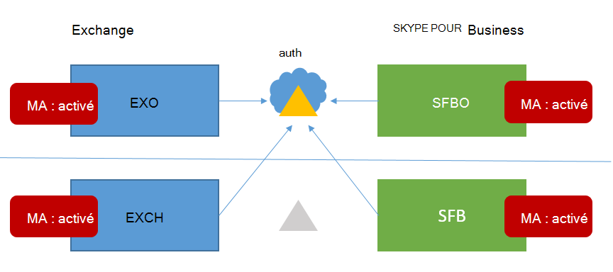

# <a name="how-to-configure-skype-for-business-on-premises-to-use-hybrid-modern-authentication"></a>Comment configurer Skype Entreprise en local pour utiliser l’authentification moderne hybride

*Cet article est valable pour Microsoft 365 Entreprise et Office 365 Entreprise.*

L’authentification moderne, qui est une méthode de gestion des identités qui offre une authentification et une autorisation utilisateur plus sécurisées, est disponible pour Skype Entreprise serveur local et le serveur Exchange local, ainsi que pour les hybrides Skype Entreprise de domaine partagé.

> [!IMPORTANT]
> Voulez-vous en savoir plus sur l’authentification moderne (MA) et pourquoi vous préféreriez l’utiliser dans votre entreprise ou organisation ? Consultez [ce document](hybrid-modern-auth-overview.md) pour obtenir une vue d’ensemble. Si vous avez besoin de savoir quelles topologies Skype Entreprise sont prises en charge avec ma, cela est documenté ici !

**Avant de commencer**, j’utilise les termes suivants :

- Authentification moderne (MA)

- Authentification moderne hybride (HMA)

- Exchange local (EXCH)

- Exchange Online (EXO)

- Skype Entreprise local (SFB)

- Skype Entreprise Online (SFBO)

En outre, si un graphique de cet article a un objet grisé ou grisé, cela signifie que l’élément affiché en gris **n’est pas** inclus dans la configuration spécifique à MA.

## <a name="read-the-summary"></a>Lire le résumé

Ce résumé décompose le processus en étapes qui pourraient autrement être perdues pendant l’exécution, et est utile pour une liste de vérification globale afin de suivre l’endroit où vous vous situez dans le processus.

1. Tout d’abord, assurez-vous que vous remplissez toutes les conditions préalables.

1. Étant donné que de nombreux **prérequis sont courants** pour Skype Entreprise et Exchange, [consultez l’article de vue d’ensemble de votre check-list de pré-q](hybrid-modern-auth-overview.md). Effectuez cette opération  *avant*  de commencer l’une des étapes décrites dans cet article.

1. Collectez les informations spécifiques à HMA dont vous aurez besoin dans un fichier ou OneNote.

1. Activez l’authentification moderne pour EXO (si elle n’est pas déjà activée).

1. Activez l’authentification moderne pour SFBO (si elle n’est pas déjà activée).

1. Activez l’authentification moderne hybride pour Exchange en local.

1. Activez l’authentification moderne hybride pour Skype Entreprise localement.

Ces étapes activent ma pour SFB, SFBO, EXCH et EXO, c’est-à-dire tous les produits qui peuvent participer à une configuration HMA de SFB et SFBO (y compris les dépendances sur EXCH/EXO). En d’autres termes, si vos utilisateurs sont hébergés ou ont des boîtes aux lettres créées dans n’importe quelle partie de l’hybride (EXO + SFBO, EXO + SFB, EXCH + SFBO ou EXCH + SFB), votre produit fini ressemblera à ceci :



Comme vous pouvez le voir, il existe quatre endroits différents pour activer ma! Pour une expérience utilisateur optimale, nous vous recommandons d’activer la gestion des ressources dans les quatre emplacements suivants. Si vous ne pouvez pas activer MA dans tous ces emplacements, ajustez les étapes afin d’activer ma uniquement dans les emplacements nécessaires à votre environnement.

Consultez la [rubrique Supportability pour Skype Entreprise avec MA](/skypeforbusiness/plan-your-deployment/modern-authentication/topologies-supported) pour les topologies prises en charge.

> [!IMPORTANT]
> Vérifiez que vous avez rempli toutes les conditions préalables avant de commencer. Vous trouverez ces informations dans la [vue d’ensemble et les prérequis de l’authentification moderne hybride](hybrid-modern-auth-overview.md).

## <a name="collect-all-hma-specific-info-youll-need"></a>Collecter toutes les informations spécifiques à HMA dont vous aurez besoin

Une fois que vous avez vérifié que vous remplissez les [conditions préalables](hybrid-modern-auth-overview.md) à l’utilisation de l’authentification moderne (voir la remarque ci-dessus), vous devez créer un fichier contenant les informations dont vous aurez besoin pour configurer HMA dans les étapes à venir. Exemples utilisés dans cet article :

- **Domaine SIP/SMTP**

  - Exemple : contoso.com (fédéré avec Office 365)

- **ID client**

  - GUID qui représente votre locataire Office 365 (à la connexion de contoso.onmicrosoft.com).

- **URL du service web CU5 SFB 2015**

Vous aurez besoin d’URL de service web internes et externes pour tous les pools SfB 2015 déployés. Pour obtenir ces informations, exécutez ce qui suit à partir de Skype Entreprise Management Shell :

```powershell
Get-CsService -WebServer | Select-Object PoolFqdn, InternalFqdn, ExternalFqdn | FL
```

- Exemple : Interne: https://lyncwebint01.contoso.com

- Exemple : Externe: https://lyncwebext01.contoso.com

Si vous utilisez un serveur Standard Edition, l’URL interne est vide. Dans ce cas, utilisez le fqdn du pool pour l’URL interne.

## <a name="turn-on-modern-authentication-for-exo"></a>Activer l’authentification moderne pour EXO

Suivez les instructions ici : [Exchange Online : Comment activer votre locataire pour l’authentification moderne.](https://social.technet.microsoft.com/wiki/contents/articles/32711.exchange-online-how-to-enable-your-tenant-for-modern-authentication.aspx)

## <a name="turn-on-modern-authentication-for-sfbo"></a>Activer l’authentification moderne pour SFBO

Suivez les instructions ici : [Skype Entreprise Online : activez votre locataire pour l’authentification moderne](https://social.technet.microsoft.com/wiki/contents/articles/34339.skype-for-business-online-enable-your-tenant-for-modern-authentication.aspx).

## <a name="turn-on-hybrid-modern-authentication-for-exchange-on-premises"></a>Activer l’authentification moderne hybride pour Exchange en local

Suivez les instructions ici : [Comment configurer Exchange Server localement pour utiliser l’authentification moderne hybride](configure-exchange-server-for-hybrid-modern-authentication.md).

## <a name="turn-on-hybrid-modern-authentication-for-skype-for-business-on-premises"></a>Activer l’authentification moderne hybride pour Skype Entreprise localement

### <a name="add-on-premises-web-service-urls-as-spns-in-azure-active-directory"></a>Ajouter des URL de service web locaux en tant que SPN dans Azure Active Directory

Vous devez maintenant exécuter des commandes pour ajouter les URL (collectées précédemment) en tant que principaux de service dans SFBO.

> [!NOTE]
> Les noms de principal de service (SPN) identifient les services web et les associent à un principal de sécurité (par exemple, un nom de compte ou un groupe) afin que le service puisse agir au nom d’un utilisateur autorisé. Les clients qui s’authentifient sur un serveur utilisent les informations contenues dans les SPN.

1. Tout d’abord, connectez-vous à Azure Active Directory (Azure AD) avec [ces instructions](/powershell/azure/active-directory/overview).

2. Exécutez cette commande, localement, pour obtenir la liste des URL de service web SFB.

   Notez que l’AppPrincipalId commence par `00000004`. Cela correspond à Skype Entreprise Online.

   Notez (et capture d’écran pour une comparaison ultérieure) la sortie de cette commande, qui inclut une URL SE et WS, mais principalement composée de noms de principal du service qui commencent par `00000004-0000-0ff1-ce00-000000000000/`.

   ```powershell
   Get-MsolServicePrincipal -AppPrincipalId 00000004-0000-0ff1-ce00-000000000000 | Select -ExpandProperty ServicePrincipalNames
   ```

3. Si les URL SFB internes **ou** externes de l’environnement local sont manquantes (par exemple, https://lyncwebint01.contoso.com et https://lyncwebext01.contoso.com) nous devons ajouter ces enregistrements spécifiques à cette liste.

    Veillez à remplacer  *les exemples d’URL ci-dessous* par vos URL réelles dans les commandes Ajouter !

    ```powershell
    $x= Get-MsolServicePrincipal -AppPrincipalId 00000004-0000-0ff1-ce00-000000000000
    $x.ServicePrincipalnames.Add("https://lyncwebint01.contoso.com/")
    $x.ServicePrincipalnames.Add("https://lyncwebext01.contoso.com/")
    Set-MSOLServicePrincipal -AppPrincipalId 00000004-0000-0ff1-ce00-000000000000 -ServicePrincipalNames $x.ServicePrincipalNames
    ```

4. Vérifiez que vos nouveaux enregistrements ont été ajoutés en exécutant à nouveau la commande **Get-MsolServicePrincipal** à l’étape 2 et en examinant la sortie. Comparez la liste ou la capture d’écran d’avant à la nouvelle liste de noms de principal du service. Vous pouvez également effectuer une capture d’écran de la nouvelle liste de vos enregistrements. Si vous avez réussi, vous verrez les deux nouvelles URL dans la liste. En suivant notre exemple, la liste des SPN inclut désormais les URL https://lyncwebint01.contoso.com spécifiques et https://lyncwebext01.contoso.com/.

### <a name="create-the-evosts-auth-server-object"></a>Créer l’objet serveur d’authentification EvoSTS

Exécutez la commande suivante dans l’interpréteur de commandes Skype Entreprise Management Shell.

```powershell
New-CsOAuthServer -Identity evoSTS -MetadataURL https://login.windows.net/common/FederationMetadata/2007-06/FederationMetadata.xml -AcceptSecurityIdentifierInformation $true -Type AzureAD
```

### <a name="enable-hybrid-modern-authentication"></a>Activer l’authentification moderne hybride

Il s’agit de l’étape qui active la gestion des applications. Toutes les étapes précédentes peuvent être exécutées à l’avance sans modifier le flux d’authentification du client. Lorsque vous êtes prêt à modifier le flux d’authentification, exécutez cette commande dans Skype Entreprise Management Shell.

```powershell
Set-CsOAuthConfiguration -ClientAuthorizationOAuthServerIdentity evoSTS
```

## <a name="verify"></a>Vérifier

Une fois que vous avez activé HMA, la prochaine connexion d’un client utilise le nouveau flux d’authentification. Notez que l’activation de HMA ne déclenche pas de nouvelle authentification pour n’importe quel client. Les clients se réauthentifient en fonction de la durée de vie des jetons d’authentification et/ou des certificats dont ils disposent.

Pour tester que HMA fonctionne une fois que vous l’avez activé, déconnectez-vous d’un client Windows SFB de test et veillez à cliquer sur « Supprimer mes informations d’identification ». Reconnectez-vous. Le client doit maintenant utiliser le flux d’authentification moderne et votre connexion inclut désormais une invite **de Office 365** pour un compte « Professionnel ou scolaire », visible juste avant que le client ne contacte le serveur et vous connecte.

Vous devez également vérifier les « informations de configuration » pour Skype Entreprise clients pour une « autorité OAuth ». Pour ce faire sur votre ordinateur client, maintenez la touche CTRL enfoncée en même temps que vous cliquez avec le bouton droit sur l’icône Skype Entreprise dans la barre d’état des notifications Windows. Cliquez sur **Informations de configuration** dans le menu qui s’affiche. Dans la fenêtre « informations de configuration Skype Entreprise » qui s’affiche sur le bureau, recherchez les éléments suivants :

:::image type="content" alt-text="Les informations de configuration d’un client Skype Entreprise à l’aide de l’authentification moderne affichent une URL d’autorité OAUTH Lync et EWS de https://login.windows.net/common/oauth2/authorize." source="../media/4e54edf5-c8f8-4e7f-b032-5d413b0232de.png":::

Vous devez également maintenir la touche CTRL enfoncée en même temps que vous cliquez avec le bouton droit sur l’icône du client Outlook (également dans la barre d’état des notifications Windows), puis cliquez sur « État de la connexion ». Recherchez l’adresse SMTP du client par rapport à un type AuthN de « Porteur\* », qui représente le jeton du porteur utilisé dans OAuth.

## <a name="related-articles"></a>Articles connexes

[Revenez à la vue d’ensemble de l’authentification moderne](hybrid-modern-auth-overview.md).

Devez-vous savoir comment utiliser l’authentification moderne pour vos clients Skype Entreprise ? Nous avons des étapes à suivre ici : [vue d’ensemble de l’authentification moderne hybride et prérequis pour l’utiliser avec des serveurs Skype Entreprise et Exchange locaux](./hybrid-modern-auth-overview.md).
