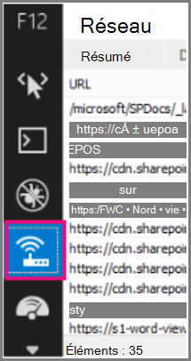

# <a name="content-delivery-networks-cdns"></a>Réseaux de distribution de contenu (CDN)

*Cet article est valable pour Microsoft 365 Entreprise et Office 365 Entreprise.*

Les CDN permettent de maintenir Office 365 rapides et fiables pour les utilisateurs finaux. Les services cloud tels que Office 365 utilisent des CDN pour mettre en cache des ressources statiques plus proches des navigateurs qui leur demandent d’accélérer les téléchargements et de réduire la latence perçue de l’utilisateur final. Les informations contenues dans cette rubrique vous aideront à en savoir plus sur les réseaux de distribution de contenu (CDN) et leur utilisation par Office 365.

## <a name="what-exactly-is-a-cdn"></a>Qu’est-ce qu’une CDN exactement ?

Un CDN est un réseau distribué géographiquement composé de serveurs proxy et de fichiers dans des centres de données connectés par des réseaux principaux à haut débit. Les CDN sont utilisés pour réduire la latence et les temps de chargement d’un ensemble spécifié de fichiers et d’objets dans un site web ou un service. Un CDN peut avoir plusieurs milliers de points de terminaison pour une maintenance optimale des demandes entrantes à partir de n’importe quel emplacement.

Les CDN sont couramment utilisés pour fournir des téléchargements plus rapides de contenu générique pour un site web ou un service tel que des fichiers Javascript, des icônes et des images, et peuvent également fournir un accès privé au contenu utilisateur, tel que des fichiers dans SharePoint bibliothèques de documents en ligne, des fichiers multimédias de streaming et du code personnalisé.

Les CDN sont utilisés par la plupart des services cloud d’entreprise. Les services cloud tels que Office 365 ont des millions de clients téléchargeant simultanément un mélange de contenu propriétaire (par exemple, des e-mails) et de contenu générique (par exemple, des icônes). Il est plus efficace de placer les images utilisées par tout le monde, comme les icônes, le plus près possible de l’ordinateur de l’utilisateur. Il n’est pas pratique pour chaque service cloud de créer CDN centres de données qui stockent ce contenu générique dans chaque région métropolitaine, ou même dans chaque hub Internet majeur dans le monde, de sorte que certains de ces CDN sont partagés.

## <a name="how-do-cdns-make-services-work-faster"></a>Comment les CDN accélèrent-ils le fonctionnement des services ?

Le téléchargement d’objets courants tels que des images de site et des icônes à plusieurs reprises peut prendre de la bande passante réseau qui peut être mieux utilisée pour télécharger du contenu personnel important, comme des e-mails ou des documents. Étant donné que Office 365 utilise une architecture qui inclut des CDN, les icônes, les scripts et d’autres contenus génériques peuvent être téléchargés à partir de serveurs plus proches des ordinateurs clients, ce qui accélère les téléchargements. Cela signifie un accès plus rapide à votre contenu personnel, qui est stocké en toute sécurité dans Office 365 centres de données.

Les CDN permettent d’améliorer les performances des services cloud de plusieurs façons :

- Les CDN déplacent une partie de la charge de téléchargement du réseau et des fichiers du service cloud, libérant ainsi les ressources du service cloud pour servir le contenu utilisateur et d’autres services en réduisant la nécessité de traiter les demandes de ressources statiques.
- Les CDN sont conçus pour fournir un accès aux fichiers à faible latence en implémentant des réseaux et des serveurs de fichiers hautes performances, et en tirant parti des protocoles réseau mis à jour tels que [HTTP/2](https://en.wikipedia.org/wiki/HTTP/2) avec une compression très efficace et un multiplexage des requêtes.
- CDN réseaux utilisent de nombreux points de terminaison distribués à l’échelle mondiale pour rendre le contenu le plus proche possible des utilisateurs.

## <a name="the-office-365-cdn"></a>Le Office 365 CDN

Le Office 365 réseau de distribution de contenu intégré (CDN) permet aux administrateurs Office 365 de fournir de meilleures performances aux SharePoint  Les pages en ligne en mettant en cache les ressources statiques plus proches des navigateurs qui les demandent, ce qui permet d’accélérer les téléchargements et de réduire la latence. Le Office 365 CDN utilise le [protocole HTTP/2](https://en.wikipedia.org/wiki/HTTP/2) pour améliorer les vitesses de compression et de téléchargement.

> [!NOTE]
> La Office 365 CDN est uniquement disponible pour les locataires dans le cloud **de production** (dans le monde entier). Les locataires du gouvernement des États-Unis, de la Chine et de l’Allemagne ne prennent actuellement pas en charge les Office 365 CDN.

Le réseau de distribution de contenu Office 365 est composé de plusieurs réseaux de distribution de contenu qui vous permettent d’héberger des ressources statiques à différents emplacements (ou _origines_) et de les servir à partir de réseaux à haut débit mondiaux. Selon le type de contenu que vous souhaitez héberger sur le réseau de distribution de contenu Office 365, vous pouvez ajouter des origines **publiques**, **privées** ou les deux.


Le contenu des origines **publiques** du réseau de distribution de contenu Office 365 est anonymement accessible à toute personne qui dispose des URL d’accès aux ressources hébergées. Étant donné que l’accès au contenu dans les origines publiques est anonyme, vous devez uniquement les utiliser pour mettre en cache du contenu générique non sensible tel que des fichiers Javascript, des scripts, des icônes et des images. Le réseau de distribution de contenu Office 365 est utilisé par défaut pour télécharger des ressources génériques, telles que les applications clientes Office 365, à partir d’une origine publique.

**Les origines privées** dans le Office 365 CDN fournissent un accès privé au contenu utilisateur, tel que SharePoint bibliothèques de documents, sites et images propriétaires en ligne. L’accès au contenu des origines privées est sécurisé à l’aide de jetons générés dynamiquement, de sorte qu’il n’est accessible qu’aux utilisateurs autorisés à accéder à la bibliothèque de documents ou à l’emplacement de stockage d’origine. Les origines privées du réseau de distribution de contenu Office 365 ne peuvent être utilisées que pour du contenu SharePoint Online, et vous ne pouvez accéder aux ressources que par redirection à partir de votre client SharePoint Online.

Le réseau de distribution de contenu Office 365 est inclus dans votre abonnement SharePoint Online.

Pour plus d’informations sur l’utilisation de la Office 365 CDN, consultez [Utiliser le réseau de distribution de contenu Office 365 avec SharePoint Online](use-microsoft-365-cdn-with-spo.md).

Pour visionner une série de courtes vidéos qui fournissent des informations conceptuelles et howTO sur l’utilisation de la Office 365 CDN, visitez la [chaîne YouTube SharePoint Developer Patterns and Practices](https://aka.ms/sppnp-videos).

## <a name="other-microsoft-cdns"></a>Autres CDN Microsoft

Bien qu’ils ne font pas partie du Office 365 CDN, vous pouvez utiliser ces CDN dans votre locataire Office 365 pour accéder aux bibliothèques de développement SharePoint, au code personnalisé et à d’autres fins qui ne relèvent pas du Office 365 CDN.

### <a name="azure-cdn"></a>Azure CDN.

>[!NOTE]
>À compter du troisième trimestre 2020, SharePoint Online commencera à mettre en cache des vidéos sur le Azure CDN pour prendre en charge la lecture et la fiabilité améliorées de la vidéo. Les vidéos les plus populaires seront diffusées à partir du point de terminaison CDN le plus proche de l’utilisateur. Ces données resteront dans la limite de Microsoft Purview. Il s’agit d’un service gratuit pour tous les locataires et il ne nécessite aucune action du client à configurer.

Vous pouvez utiliser la **Azure CDN** pour déployer votre propre instance CDN pour l’hébergement de composants WebPart, bibliothèques et autres ressources de ressources personnalisés, ce qui vous permet d’appliquer des clés d’accès à votre stockage CDN et d’exercer un contrôle accru sur votre configuration CDN. L’utilisation de la Azure CDN n’est pas gratuite et nécessite un abonnement Azure.

Pour plus d’informations sur la configuration d’une instance Azure CDN, consultez [Démarrage rapide : Intégrer un compte de stockage Azure à Azure CDN](/azure/cdn/cdn-create-a-storage-account-with-cdn).

Pour obtenir un exemple de la façon dont le Azure CDN peut être utilisé pour héberger SharePoint composants WebPart, consultez [Déployer votre composant WebPart côté client SharePoint sur Azure CDN](/sharepoint/dev/spfx/web-parts/get-started/deploy-web-part-to-cdn).

Pour plus d’informations sur le module PowerShell Azure CDN, consultez [Gérer Azure CDN avec PowerShell](/azure/cdn/cdn-manage-powershell).

### <a name="microsoft-ajax-cdn"></a>Microsoft Ajax CDN

**L’CDN Ajax** de Microsoft est une CDN en lecture seule qui offre de nombreuses bibliothèques de développement populaires, notamment jQuery (et toutes ses autres bibliothèques), ASP.NET Ajax, Bootstrap, Knockout.js, etc.
  
Pour inclure ces scripts dans votre projet, remplacez simplement toutes les références à ces bibliothèques disponibles publiquement par des références à l’adresse CDN au lieu de l’inclure dans votre projet lui-même. Par exemple, utilisez le code suivant pour créer un lien vers jQuery :

``` html
<script src=https://ajax.aspnetcdn.com/ajax/jquery-2.1.1.js> </script>
```

Pour plus d’informations sur l’utilisation du CDN Microsoft Ajax, consultez [Microsoft Ajax CDN](/aspnet/ajax/cdn/overview).

## <a name="how-does-office-365-use-content-from-a-cdn"></a>Comment Office 365 utiliser le contenu d’un CDN ?

Quel que soit le CDN que vous configurez pour votre locataire Office 365, le processus de récupération des données de base est le même.

1. Votre client (un navigateur ou une application cliente Office) demande des données à partir de Office 365.

2. Office 365 retourne les données directement à votre client ou, si les données font partie d’un ensemble de contenu hébergé par le CDN, redirige votre client vers l’URL CDN.

    a. Si les données sont déjà mises en cache dans une origine _publique_, votre client télécharge les données directement à partir de l’emplacement CDN le plus proche vers votre client.

    b. Si les données sont déjà mises en cache dans une origine _privée_, le service CDN vérifie les autorisations de votre compte d’utilisateur Office 365 sur l’origine. Si vous disposez d’autorisations, SharePoint Online génère dynamiquement une URL personnalisée composée du chemin d’accès à la ressource dans le CDN et deux jetons d’accès, et retourne l’URL personnalisée à votre client. Votre client télécharge ensuite les données directement à partir de l’emplacement CDN le plus proche vers votre client à l’aide de l’URL personnalisée.

3. Si les données ne sont pas mises en cache au CDN, le nœud CDN demande les données à Office 365, puis met en cache les données pendant un certain temps après le téléchargement des données par votre client.

Le CDN détermine le centre de données le plus proche du navigateur de l’utilisateur et, à l’aide de la redirection, télécharge les données demandées à partir de là. CDN redirection est rapide et peut faire gagner beaucoup de temps de téléchargement aux utilisateurs.

## <a name="how-should-i-set-up-my-network-so-that-cdns-work-best-with-office-365"></a>Comment configurer mon réseau pour que les CDN fonctionnent mieux avec Office 365 ?

La réduction de la latence entre les clients sur votre réseau et les points de terminaison CDN est la considération clé pour garantir des performances optimales. Vous pouvez utiliser les meilleures pratiques [décrites dans La gestion des points](managing-office-365-endpoints.md) de terminaison Office 365 pour vous assurer que votre configuration réseau permet aux navigateurs clients d’accéder directement au CDN plutôt que de routage CDN le trafic via des proxys centraux afin d’éviter d’introduire une latence inutile.

Vous pouvez également lire [Office 365 principes de connectivité réseau](./microsoft-365-network-connectivity-principles.md) pour comprendre les concepts qui sous-tendent l’optimisation des performances Office 365 réseau.

## <a name="is-there-a-list-of-all-the-cdns-that-office-365-uses"></a>Existe-t-il une liste de tous les CDN utilisés par Office 365 ?

Les CDN utilisés par Office 365 sont toujours susceptibles d’être modifiés et, dans de nombreux cas, plusieurs CDN partenaires sont configurés dans le cas où l’un d’eux n’est pas disponible. Les cdN principaux utilisés par Office 365 sont les suivants :

|CDN  |Company  |Utilisation  |Liens  |
|---------|---------|---------|---------|
|Office 365 CDN     |Microsoft Azure         |Ressources génériques dans les origines publiques, SharePoint contenu utilisateur dans les origines privées         |[Microsoft Azure CDN](https://azure.microsoft.com/documentation/services/cdn/)         |
|Azure CDN.     |Microsoft         |Code personnalisé, solutions SharePoint Framework         |[Microsoft Azure CDN](https://azure.microsoft.com/documentation/services/cdn/)         |
|Microsoft Ajax CDN (lecture seule)     |Microsoft         |Bibliothèques courantes pour Ajax, jQuery, ASP.NET, Bootstrap, Knockout.js etc.         |[Microsoft Ajax CDN](/aspnet/ajax/cdn/overview)         |

## <a name="what-performance-gains-does-a-cdn-provide"></a>Quels gains de performances une CDN procure-t-elle ?

Il existe de nombreux facteurs impliqués dans la mesure des différences spécifiques de performances entre les données téléchargées directement à partir de Office 365 et les données téléchargées à partir d’une CDN spécifique, telles que votre emplacement par rapport à votre locataire et au point de terminaison CDN le plus proche, le nombre de ressources sur une page qui sont traitées par le CDN, et les modifications temporaires de la latence et de la bande passante du réseau. Toutefois, un test A/B simple peut vous aider à montrer la différence de temps de téléchargement pour un fichier spécifique.

Les captures d’écran suivantes illustrent la différence de vitesse de téléchargement entre l’emplacement du fichier natif dans Office 365 et le même fichier hébergé sur le [réseau de distribution de contenu Microsoft Ajax](/aspnet/ajax/cdn/overview). Ces captures d’écran proviennent de l’onglet **Réseau** dans les outils de développement d’Internet Explorer 11. Ces captures d’écran montrent la latence sur la bibliothèque populaire jQuery. Pour afficher cet écran, dans Internet Explorer, appuyez sur **F12** et sélectionnez l’onglet **Réseau** symbolisé par une icône Wi-Fi.
  

  
Cette capture d’écran montre la bibliothèque chargée dans la galerie de pages maîtres sur le site SharePoint Online lui-même. Le temps nécessaire pour charger la bibliothèque est de 1,51 seconde.
  

  
La deuxième capture d’écran montre le même fichier remis par le CDN de Microsoft. Cette fois, la latence est d’environ 496 millisecondes. Il s’agit d’une amélioration importante qui montre qu’une seconde entière est rasée du temps total de téléchargement de l’objet.
  


## <a name="is-my-data-safe"></a>Mes données sont-ils sécurisées ?

Nous prenons grand soin de protéger les données qui gèrent votre entreprise. Les données stockées dans le Office 365 CDN sont chiffrées en transit et au repos, et l’accès aux données du Office 365 SharePoint CDN est sécurisé par Office 365 autorisations utilisateur et d’autorisation de jeton. Les demandes de données dans le Office 365 SharePoint CDN doivent être référencées (redirigées) à partir de votre locataire Office 365 ou un jeton d’autorisation ne sera pas généré.

Pour garantir la sécurité de vos données, nous vous recommandons de ne jamais stocker de contenu utilisateur ou d’autres données sensibles dans un CDN public. Étant donné que l’accès aux données dans une CDN publique est anonyme, les CDN publics ne doivent être utilisés que pour héberger du contenu générique tel que des fichiers de script web, des icônes, des images et d’autres ressources non sensibles.

> [!NOTE]
> Les fournisseurs de CDN tiers peuvent avoir des normes de confidentialité et de conformité différentes des engagements énoncés par le Centre de gestion de la confidentialité Office 365. Les données mises en cache via le service CDN peuvent ne pas être conformes aux conditions de traitement des données Microsoft (DPT) et peuvent se trouver en dehors des limites de conformité du Centre de gestion de la confidentialité Office 365.

Pour obtenir des informations détaillées sur la confidentialité et la protection des données pour les fournisseurs Office 365 CDN, consultez les rubriques suivantes :  

- En savoir plus sur Office 365 la confidentialité et la protection des données dans le Centre de gestion de la [confidentialité Microsoft](https://www.microsoft.com/trustcenter)
- En savoir plus sur la confidentialité et la protection des données [d’Akamai au Centre de confidentialité Akamai](https://www.akamai.com/us/en/about/compliance/data-protection-at-akamai.jsp)
- En savoir plus sur la confidentialité et la protection des données Azure dans le Centre de gestion de la [confidentialité Azure](https://azure.microsoft.com/overview/trusted-cloud/)

## <a name="how-can-i-secure-my-network-with-all-these-3rd-party-services"></a>Comment sécuriser mon réseau avec tous ces services tiers ?

L’utilisation d’un large éventail de services partenaires permet à Office 365 de mettre à l’échelle et de répondre aux exigences de disponibilité, ainsi que d’améliorer l’expérience utilisateur lors de l’utilisation de Office 365. Les services tiers Office 365 tirent parti incluent à la fois des listes de révocation de certificats , telles que des crl.microsoft.com ou des sa.symcb.com, et des CDN , tels que r3.res.outlook.com. Chaque CDN nom de domaine complet généré par Office 365 est un nom de domaine complet personnalisé pour Office 365. Si vous êtes envoyé à un nom de domaine complet à la demande de Office 365 vous pouvez être assuré que le fournisseur de CDN contrôle le nom de domaine complet et le contenu sous-jacent à cet emplacement.
  
Pour les clients qui souhaitent séparer les demandes destinées à un centre de données Microsoft ou Office 365 des demandes destinées à un tiers, nous avons rédigé des conseils sur la [gestion des points de terminaison Office 365](https://support.office.com/article/99cab9d4-ef59-4207-9f2b-3728eb46bf9a).

## <a name="is-there-a-list-of-all-the-fqdns-that-leverage-cdns"></a>Existe-t-il une liste de tous les noms de domaine complets qui tirent parti des CDN ?

La liste des noms de domaine complets et la façon dont ils tirent parti des CDN changent au fil du temps. Reportez-vous à notre page publiée [Office 365 URL et plages d’adresses IP](./urls-and-ip-address-ranges.md) pour vous tenir au courant des derniers noms de domaine complets qui tirent parti des CDN.

Vous pouvez également utiliser le [service web d’adresse IP et d’URL Office 365](microsoft-365-ip-web-service.md) pour demander les URL Office 365 actuelles et les plages d’adresses IP au format CSV ou JSON.

## <a name="can-i-use-my-own-cdn-and-cache-content-on-my-local-network"></a>Puis-je utiliser mon propre CDN et le contenu du cache sur mon réseau local ?

Nous recherchons continuellement de nouvelles façons de répondre aux besoins de nos clients et explorons actuellement l’utilisation des solutions proxy de mise en cache et d’autres solutions CDN locales.

Bien qu’il ne fait pas partie du Office 365 CDN, vous pouvez également utiliser le **Azure CDN** pour héberger des composants WebPart, des bibliothèques et d’autres ressources de ressources personnalisés, ce qui vous permet d’appliquer des clés d’accès à votre stockage CDN et d’exercer un contrôle accru sur votre configuration CDN. L’utilisation de la Azure CDN n’est pas gratuite et nécessite un abonnement Azure. Pour plus d’informations sur la configuration d’une instance Azure CDN, consultez [Démarrage rapide : Intégrer un compte de stockage Azure à Azure CDN](/azure/cdn/cdn-create-a-storage-account-with-cdn).

## <a name="im-using-azure-expressroute-for-office-365-does-that-change-things"></a>J’utilise Azure ExpressRoute pour Office 365, est-ce que cela change les choses ?

[Azure ExpressRoute pour Office 365](azure-expressroute.md) fournit une connexion dédiée à Office 365 infrastructure séparée de l’Internet public. Cela signifie que les clients doivent toujours se connecter via des connexions non ExpressRoute pour se connecter à des CDN et à une autre infrastructure Microsoft qui n’est pas explicitement incluse dans la liste des services pris en charge par ExpressRoute. Pour plus d’informations sur la façon d’acheminer un trafic spécifique tel que des demandes destinées à des CDN, reportez-vous à [Office 365 gestion du trafic réseau](routing-with-expressroute.md).

## <a name="can-i-use-cdns-with-sharepoint-server-on-premises"></a>Puis-je utiliser des CDN avec SharePoint Server en local ?

L’utilisation de CDN n’a de sens que dans un contexte SharePoint Online et doit être évitée avec SharePoint Server. Cela est dû au fait que tous les avantages liés à l’emplacement géographique ne sont pas valables si le serveur est situé localement ou géographiquement proche de toute façon. En outre, s’il existe une connexion réseau aux serveurs où il est hébergé, le site peut être utilisé sans connexion Internet et ne peut donc pas récupérer les fichiers CDN. Sinon, vous devez utiliser un CDN s’il existe une bibliothèque et des fichiers disponibles et stables pour votre site.
  
Voici un bref lien que vous pouvez utiliser pour revenir : [https://aka.ms/o365cdns]()
  
## <a name="see-also"></a>Voir aussi

[Principes de connectivité réseau Office 365](./microsoft-365-network-connectivity-principles.md)

[Évaluation de la connectivité réseau Office 365](assessing-network-connectivity.md)

[Gestion des points de terminaison Office 365](managing-office-365-endpoints.md)

[URL et plages d’adresses IP Office 365](./urls-and-ip-address-ranges.md)

[Utilisation du réseau de distribution de contenu Office 365 avec SharePoint Online](use-microsoft-365-cdn-with-spo.md)

[Centre de gestion de la confidentialité Microsoft](https://www.microsoft.com/trustcenter)

[Optimisation des performances Office 365](tune-microsoft-365-performance.md)
