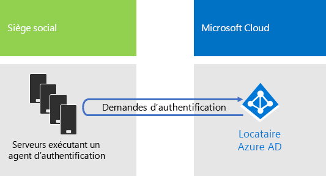

# Identité de Contoso Corporation

**Résumé :** Découvrez comment Contoso tire parti de la solution de gestion des identités IDaaS et propose à ses employés une authentification basée sur le cloud, et une authentification fédérée à ses partenaires et ses clients.

Microsoft propose une solution de gestion des identités IDaaS dans toutes ses offres cloud dotées d’Azure Active Directory (AD). Pour adopter Microsoft 365 Entreprise, la solution IDaaS de Contoso doit tirer parti de son fournisseur d’identités local et continuer d’intégrer l’authentification fédérée avec ses fournisseurs d’identité tiers approuvés existants.

## Forêt Windows Server AD de Contoso

Contoso utilise une forêt Windows Server AD (Active Directory) unique pour sept sous-domaines de contoso.com, un pour chaque région du monde. Le siège social, les bureaux régionaux et les succursales possèdent des contrôleurs de domaine pour l’authentification et l’autorisation locales.

La Figure 1 présente la forêt et les domaines régionaux de Contoso dans les régions du monde où se trouvent des centres régionaux.

 
**Figure 1 : forêt et domaines de Contoso dans le monde**

Contoso souhaite utiliser les comptes et les groupes de la forêt contoso.com pour faciliter l’authentification et l’autorisation de ses applications et de ses charges de travail dans le cloud.

## Infrastructure d’authentification fédérée de Contoso

Contoso autorise les éléments suivants :

- Les clients ont le droit d’utiliser leurs comptes Microsoft, Facebook ou Google Mail pour se connecter à leur site web public.
- Les fournisseurs et les partenaires peuvent utiliser leurs comptes LinkedIn, Salesforce ou Google Mail pour se connecter à l’extranet des partenaires.

La Figure 2 montre que le réseau de périmètre de Contoso comprend un site web public, un extranet des partenaires et des serveurs pour les services ADFS (services de fédération Active Directory). Le réseau de périmètre est connecté à Internet, qui contient des clients, des partenaires et des services Internet.

**Figure 2 : prise en charge de l’authentification fédérée par Contoso pour ses clients et ses partenaires**
 
Les serveurs des services ADFS du réseau de périmètre utilisent leurs informations d’identification client pour se connecter au site web public et leurs informations d’identification partenaire pour accéder à l’extranet des partenaires.

Contoso a décidé de conserver cette infrastructure pour la dédier à l’authentification des clients et des partenaires. Les ingénieurs en identité de Contoso examinent actuellement la possibilité de convertir cette infrastructure en solutions [B2B](https://docs.microsoft.com/azure/active-directory/b2b/hybrid-organizations) et [B2C](https://docs.microsoft.com/azure/active-directory-b2c/solution-articles) Azure AD.

## Identité hybride avec authentification directe pour l’authentification basée sur le cloud

Contoso voulait tirer parti de sa forêt Windows Server AD locale pour configurer l’authentification aux ressources cloud de Microsoft 365. L’entreprise a opté pour l’authentification directe avec la synchronisation de hachage de mot de passe.

### Authentification directe

Pour l’authentification des informations d’identification utilisateur, Contoso utilise l’authentification directe. Quand un utilisateur Contoso accède à des ressources cloud, les informations d’identification envoyées sont transmises par Azure AD à un serveur qui exécute un agent d’authentification dans le centre de données du siège de Contoso. L’un des serveurs de l’agent d’authentification valide les informations d’identification utilisateur au nom d’Azure AD.

La Figure 3 montre un ensemble de serveurs situés au siège de Contoso, qui exécutent l’agent d’authentification, lequel traite les demandes d’authentification transmises par Azure AD. 

 
**Figure 3 : infrastructure de l’authentification directe de Contoso**

Contoso a opté pour l’authentification directe pour répondre à l’une de ses mesures de sécurité, à savoir évaluer toutes les tentatives d’authentification qui présenteraient un changement d’état du compte d’utilisateur, de stratégie de mot de passe et d’heure de connexion apporté à la forêt Windows Server AD locale.

### Synchronisation de hachage de mot de passe

La synchronisation de hachage de mot de passe synchronise la forêt Windows Server AD locale avec le client Azure AD de l’abonnement Microsoft 365 Entreprise, en copiant les comptes d’utilisateur et de groupe et une version hachée des mots de passe des comptes d’utilisateur. Contoso a opté pour la synchronisation de hachage de mot de passe pour proposer une autre méthode d’authentification avec le client Azure AD au cas où l’authentification directe ne serait pas disponible.

Pour procéder à la synchronisation de hachage de mot de passe en cours, Contoso a déployé l’outil Azure AD Connect sur un serveur de son centre de données situé à Paris. La Figure 4 montre le serveur exécutant Azure AD Connect qui interroge la forêt Windows Server AD de Contoso pour trouver d’éventuelles modifications et synchronise ces modifications avec le client Azure AD.

 
**Figure 4 : infrastructure de la synchronisation d’annuaires de synchronisation de hachage de mot de passe de Contoso**

## Stratégies d’accès conditionnel basées sur l’identité

Contoso a créé un ensemble de [stratégies d’accès conditionnel](identity-access-policies.md) Azure AD pour garantir l’application des modifications de mot de passe et de l’authentification multifacteur quand Azure AD détecte un risque de connexion pour une demande d’authentification.

La Figure 5 montre l’ensemble de stratégies d’accès conditionnel basées sur l’identité de Contoso.

 
**Figure 5 : stratégies d’accès conditionnel basées sur l’identité de Contoso**

## Étape suivante

[Découvrez](contoso-win10.md) comment Contoso tire parti de son infrastructure System Center Configuration Manager pour déployer et maintenir à jour Windows 10 Entreprise au sein de son organisation.

## Voir aussi

[Identité pour Microsoft 365 Entreprise](identity-infrastructure.md)

[Guide de déploiement](deploy-microsoft-365-enterprise.md)

[Guides de laboratoire de test](m365-enterprise-test-lab-guides.md)
