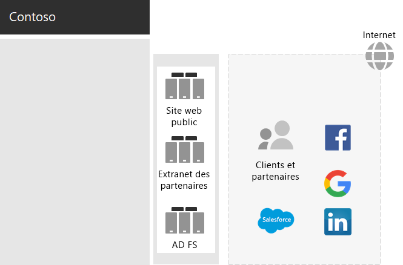
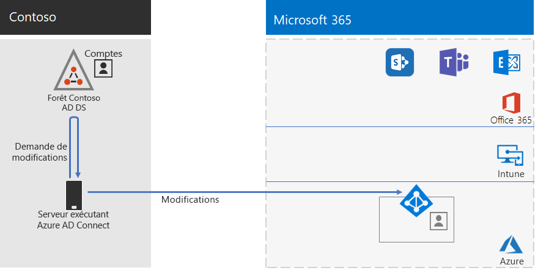

# Identité de Contoso Corporation

Microsoft fournit l’identité en tant que service (IDaaS) dans ses offres cloud via Azure Active Directory (Azure AD). Pour adopter Microsoft 365 pour entreprise, la solution Contoso IDaaS devait utiliser son fournisseur d’identité local et inclure l’authentification fédérée avec ses fournisseurs d’identité tiers approuvés existants.

## La forêt de services de domaine Active Directory Contoso

Contoso utilise une seule forêt services de domaine Active Directory (AD DS) pour contoso\.com avec sept sous-domaines, un pour chaque région du monde. Le siège social, les centres régionaux et les succursales disposent de contrôleurs de domaine pour l’authentification locale et l’autorisation.

Voici la forêt Contoso avec des domaines régionaux pour les différentes parties du monde qui contiennent des hubs régionaux.

:::image type="content" alt-text="La forêt et les domaines de Contoso dans le monde entier." source="../media/contoso-identity/contoso-identity-fig1.png" lightbox="../media/contoso-identity/contoso-identity-fig1.png":::
 
Contoso a décidé d’utiliser les comptes et les groupes de la forêt com contoso\.pour l’authentification et l’autorisation de ses charges de travail et services Microsoft 365.

## Infrastructure d’authentification fédérée Contoso

Contoso autorise les éléments suivants :

- Les clients doivent utiliser leurs comptes Microsoft, Facebook ou Google Mail pour se connecter au site web public de l’entreprise.
- Les fournisseurs et les partenaires doivent utiliser leurs comptes LinkedIn, Salesforce ou Google Mail pour se connecter à l’extranet partenaire de l’entreprise.

Voici la zone DMZ Contoso contenant un site web public, un extranet partenaire et un ensemble de serveurs Services ADFS (AD FS). La zone DMZ est connectée à Internet qui contient des clients, des partenaires et des services Internet.

 
Les serveurs AD FS dans la zone DMZ facilitent l’authentification des informations d’identification du client par leurs fournisseurs d’identité pour l’accès au site web public et les informations d’identification du partenaire pour l’accès à l’extranet du partenaire.

Contoso a décidé de conserver cette infrastructure et de la dédier à l’authentification du client et du partenaire. Les architectes d’identité Contoso examinent la conversion de cette infrastructure en solutions [B2B](/azure/active-directory/b2b/hybrid-organizations) et [B2C](/azure/active-directory-b2c/solution-articles) Azure AD.

## Identité hybride avec authentification directe pour l’authentification basée sur le cloud

Contoso souhaitait utiliser sa forêt AD DS locale pour l’authentification au niveau des ressources cloud Microsoft 365. Il a décidé d’utiliser la synchronisation de hachage de mot de passe (PHS).

PHS synchronise la forêt AD DS locale avec le locataire Azure AD de son abonnement Microsoft 365 pour entreprise, en copiant des comptes d’utilisateur et de groupe et une version hachée des mots de passe de compte d’utilisateur.

Pour effectuer la synchronisation d’annuaires, Contoso a déployé l’outil Azure AD Connect sur un serveur de son centre de données Paris.

Voici le serveur exécutant Azure AD Connect qui interroge la forêt Contoso AD DS pour connaître les modifications, puis synchronise ces modifications avec le locataire Azure AD.

 
## Stratégies d’accès conditionnel pour Confiance nulle l’identité et l’accès aux appareils

Contoso a créé un jeu d’Azure AD et Intune [stratégies d’accès conditionnel](../security/office-365-security/identity-access-policies.md) pour trois niveaux de protection :

- *Les* protections de point de départ s’appliquent à tous les comptes d’utilisateur.
- Les protections *d’entreprise* s’appliquent aux cadres supérieurs et aux cadres supérieurs.
- Les protections *de sécurité spécialisées* s’appliquent à des utilisateurs spécifiques des services financiers, juridiques et de recherche qui ont accès à des données hautement réglementées.

Voici l’ensemble des stratégies d’identité et d’accès conditionnel de l’appareil contoso qui en résultent.

:::image type="content" alt-text="Stratégies d’accès conditionnel d’identité et d’appareil de Contoso." source="../media/contoso-identity/contoso-identity-fig5.png" lightbox="../media/contoso-identity/contoso-identity-fig5.png":::
 
## Étape suivante

Découvrez comment Contoso utilise son infrastructure Microsoft Endpoint Configuration Manager pour [déployer et maintenir les Windows 10 Entreprise actuelles](contoso-win10.md) au sein de son organisation.

## Voir aussi

[Déployer l’identité pour Microsoft 365](deploy-identity-solution-overview.md)

[Vue d’ensemble de Microsoft 365 pour entreprise](microsoft-365-overview.md)

[Guides de laboratoire de test](m365-enterprise-test-lab-guides.md)