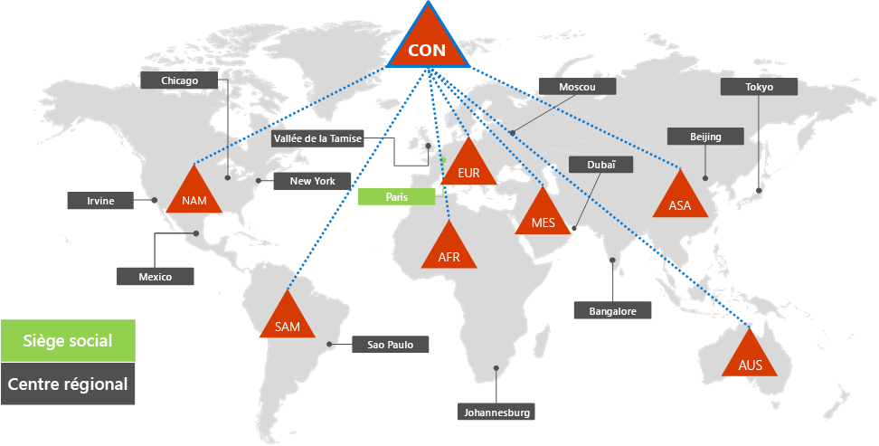
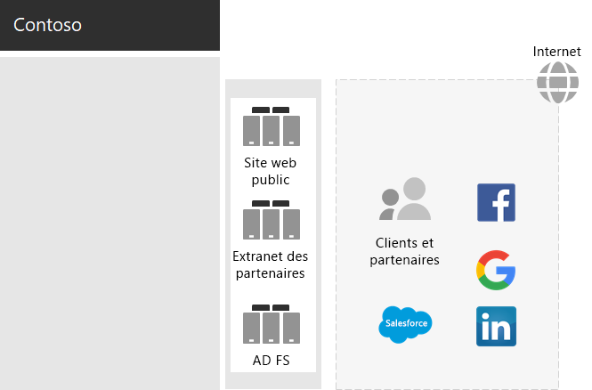
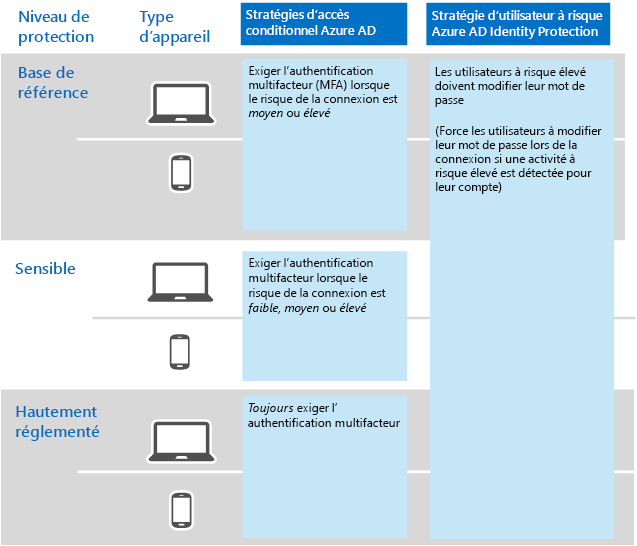

# Identité de Contoso Corporation

**Résumé :** Découvrez comment Contoso tire parti de la solution de gestion des identités IDaaS et propose à ses employés une authentification basée sur le cloud, et une authentification fédérée à ses partenaires et ses clients.

Microsoft fournit une IDaaS dans toutes ses offres cloud avec Azure Active Directory (Azure AD). Pour adopter Microsoft 365 Entreprise, la solution IDaaS de Contoso doit tirer parti de son fournisseur d’identités local et intégrer l’authentification fédérée avec ses fournisseurs d’identité tiers approuvés existants.

## Ensemble des services de domaine Active Directory Domain Services de Contoso

Contoso utilise une seule forêt Windows Server Active Directory Domain Services (AD DS) pour contoso.com et sept sous-domaines (un par région). Le siège social, les centres régionaux et les succursales disposent de contrôleurs de domaine pour l’authentification locale et l’autorisation.

La Figure 1 présente la forêt et les domaines régionaux de Contoso dans les régions du monde où se trouvent des centres régionaux.

 
**Figure 1 : forêt et domaines de Contoso dans le monde**

Contoso souhaitait utiliser les comptes et les groupes de la forêt contoso.com pour faciliter l’authentification et l’autorisation de ses services et de ses charges de travail Microsoft 365.

## Infrastructure d’authentification fédérée de Contoso

Contoso autorise les éléments suivants :

- Les clients ont le droit d’utiliser leurs comptes Microsoft, Facebook ou Google Mail pour se connecter à leur site web public.
- Les fournisseurs et les partenaires peuvent utiliser leurs comptes LinkedIn, Salesforce ou Google Mail pour se connecter à l’extranet des partenaires.

La Figure 2 montre que le réseau de périmètre de Contoso comprend un site web public, un extranet des partenaires et des serveurs pour les services ADFS (services de fédération Active Directory). Le réseau de périmètre est connecté à Internet, qui contient des clients, des partenaires et des services Internet.

**Figure 2 : prise en charge de l’authentification fédérée par Contoso pour ses clients et ses partenaires**
 
Les serveurs AD FS du DMZ facilitent l’authentification des informations d’identification client par leurs fournisseurs d’identité pour accéder au site web public et des informations d’identification partenaires pour accéder à l’extranet des partenaires.

Contoso a décidé de conserver cette infrastructure et de la dédier aux authentifications de clients et de partenaires. Les architectes d’identité Contoso examinent la conversion de cette infrastructure en solutions [B2B](https://docs.microsoft.com/azure/active-directory/b2b/hybrid-organizations) et [B2C](https://docs.microsoft.com/azure/active-directory-b2c/solution-articles) Azure AD.

## Identité hybride avec authentification directe pour l’authentification basée sur le cloud

Contoso souhaite tirer parti de son ensemble local AD DS pour l’authentification aux ressources cloud de Microsoft 365. Il a décidé du hachage de synchronisation du mot de passe (PHS).

PBS synchronise la version de l’ensemble local AD DS avec le client Azure AD de l’abonnement Microsoft 365 Entreprise, copie des comptes d’utilisateur et de groupe et une version hachurée de mots de passe du compte utilisateur. 

Pour effectuer la synchronisation d’annuaire en cours, Contoso a déployé l’outil Azure AD Connect sur un serveur dans son centre de données de Paris. La figure 3 montre le serveur exécutant la connexion Azure Active Directory Connect interrogeant l’ensemble Contoso AD DS pour les modifications de l’interrogation et la synchronisation de ces modifications avec le client Azure AD.

 
**Figure 3 : infrastructure de la synchronisation d’annuaires de synchronisation de hachage de mot de passe de Contoso**

## Stratégies d’accès conditionnel basé sur l’identité et l’appareil

Contoso a créé un jeu d’Azure AD et Intune [stratégies d’accès conditionnel](identity-access-policies.md) pour trois niveaux de protection :

- **Référence** les protections s’appliquent à tous les comptes d’utilisateurs
- **Sensibles**les protections s’appliquent aux cadres dirigeants et membres du personnel exécutif
- **Hautement réglementée**les protections s’appliquent à des utilisateurs spécifiques financiers, légaux et leur emplacement géographique de recherche ayant accès aux données hautement réglementées

La Figure 4 montre l’ensemble de stratégies d’accès conditionnel basées sur l’identité et l’appareil.

 
**Figure 4 : stratégies d’accès conditionnel basées sur l’identité et l’appareil de Contoso**

## Étape suivante

[Découvrez](contoso-win10.md) comment Contoso tire parti de son infrastructure System Center Configuration Manager pour déployer et maintenir à jour Windows 10 Entreprise au sein de son organisation.

## Voir aussi

[Identité pour Microsoft 365 Entreprise](identity-infrastructure.md)

[Guide de déploiement](deploy-microsoft-365-enterprise.md)

[Guides de laboratoire de test](m365-enterprise-test-lab-guides.md)
