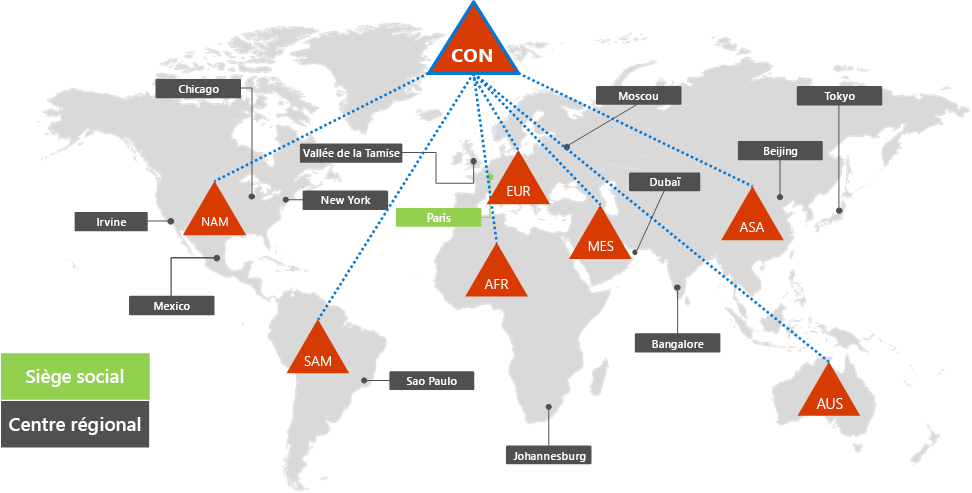
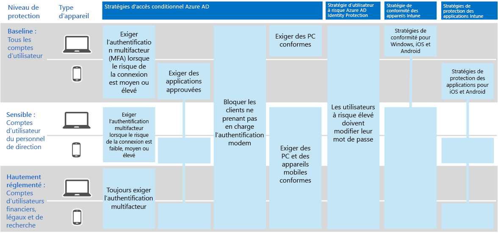

# Identité de Contoso Corporation

Microsoft fournit l’identité en tant que service (IDaaS) dans ses offres cloud via Azure Active Directory (Azure AD). Pour adopter Microsoft 365 pour entreprise, la solution Contoso IDaaS devait utiliser son fournisseur d’identité local et inclure l’authentification fédérée avec ses fournisseurs d’identité tiers existants.

## Forêt des services de domaine Active Directory contoso

Contoso utilise une forêt AD DS (Active Directory Domain Services) unique pour contoso com avec sept sous-domaines, un pour chaque région \. du monde. Le siège social, les centres régionaux et les succursales disposent de contrôleurs de domaine pour l’authentification locale et l’autorisation.

Voici la forêt Contoso avec des domaines régionaux pour les différentes régions du monde qui contiennent des centres régionaux.

 
Contoso a décidé d’utiliser les comptes et les groupes de la forêt contoso com pour l’authentification et l’autorisation de ses charges de travail et \. services Microsoft 365.

## Infrastructure d’authentification fédérée Contoso

Contoso autorise les éléments suivants :

- Les clients qui utilisent leurs comptes Microsoft, Facebook ou Google Mail pour se connectent au site web public de l’entreprise.
- Fournisseurs et partenaires qui utilisent leurs comptes LinkedIn, Salesforce ou Google Mail pour se connectent à l’extranet partenaire de l’entreprise.

Voici le DMZ Contoso contenant un site web public, un extranet partenaire et un ensemble de serveurs AD FS (Active Directory Federation Services). Le DMZ est connecté à Internet qui contient des clients, des partenaires et des services Internet.

 
Les serveurs AD FS dans la DMZ facilitent l’authentification des informations d’identification client par leurs fournisseurs d’identité pour accéder au site web public et aux informations d’identification des partenaires pour l’accès à l’extranet du partenaire.

Contoso a décidé de conserver cette infrastructure et de la dédier à l’authentification des clients et des partenaires. Les architectes d’identité Contoso examinent la conversion de cette infrastructure en solutions [B2B](/azure/active-directory/b2b/hybrid-organizations) et [B2C](/azure/active-directory-b2c/solution-articles) Azure AD.

## Identité hybride avec authentification directe pour l’authentification basée sur le cloud

Contoso souhaitait utiliser sa forêt AD DS sur site pour l’authentification aux ressources cloud de Microsoft 365. Il a décidé d’utiliser la synchronisation de hachage de mot de passe (PHS).

PHS synchronise la forêt AD DS sur site avec le client Azure AD de son abonnement Microsoft 365 pour entreprise, en copiant les comptes d’utilisateur et de groupe et une version hachée des mots de passe de compte d’utilisateur.

Pour la synchronisation d’annuaires, Contoso a déployé l’outil Azure AD Connect sur un serveur dans son centre de données parisien.

Voici le serveur exécutant Azure AD Connect qui recherche les modifications dans la forêt Contoso AD DS, puis les synchronise avec le client Azure AD.

 
## Stratégies d’accès conditionnel basé sur l’identité et l’appareil

Contoso a créé un jeu d’Azure AD et Intune [stratégies d’accès conditionnel](../security/defender-365-security/identity-access-policies.md) pour trois niveaux de protection :

- *Les* protections de référence s’appliquent à tous les comptes d’utilisateur.
- *Les* protections sensibles s’appliquent aux cadres supérieurs et aux cadres.
- *Les protections hautement réglementées* s’appliquent à des utilisateurs spécifiques des services financiers, juridiques et de recherche qui ont accès aux données hautement réglementées.

Voici l’ensemble des stratégies d’accès conditionnel aux appareils et aux identités Contoso.

 
## Étape suivante

Découvrez comment Contoso utilise son infrastructure Microsoft Endpoint Configuration Manager pour déployer et conserver [windows 10 Entreprise](contoso-win10.md) actuel au sein de son organisation.

## Voir aussi

[Feuille de route relative à l’identité pour Microsoft 365](identity-roadmap-microsoft-365.md)

[Vue d’ensemble de Microsoft 365 pour entreprise](microsoft-365-overview.md)

[Guides de laboratoire de test](m365-enterprise-test-lab-guides.md)