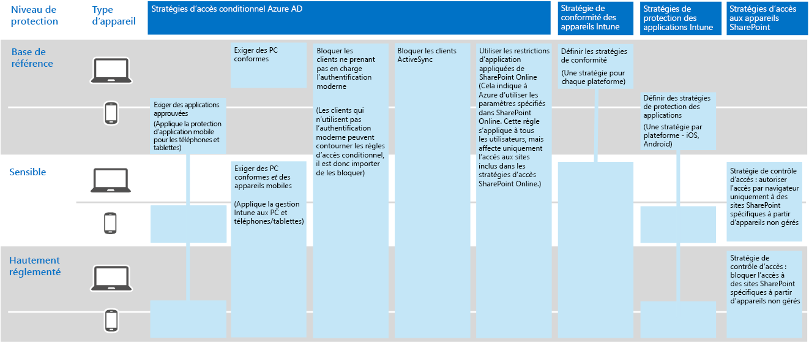

# Protection des informations de Contoso Corporation

**Résumé :** Comprendre la façon dont Contoso utilise les fonctionnalités de protection des informations dans Microsoft 365 Entreprise pour sécuriser ses biens numériques dans le cloud.

Contoso prend la protection et la sécurité de ses informations très au sérieux. Par exemple, la fuite ou la destruction de sa propriété intellectuelle comprenant les conceptions de produits et les techniques de fabrication propriétaires placerait la société dans une situation de désavantage compétitif.

Avant de migrer ses biens numériques sensibles et précieux vers le cloud, elle s’est assurée que ses besoins locaux en matière de classification et de protection des informations ont été pris en charge et implémentés dans les services informatiques de Microsoft 365 Entreprise.

## Classification de la sécurité des données selon Contoso

Contoso a effectué une analyse de ses données et déterminé les niveaux suivants :

||||
|:-------|:-----|:-----|
| **Niveau 1 : ligne de base** | **Niveau 2 : sensible** | **Niveau 3 : hautement réglementé** |
| Les données sont chiffrées et accessibles uniquement par les utilisateurs authentifiés.     Niveau accordé à toutes les données stockées localement et dans le cloud et aux charges de travail, telles qu’Office 365. Les données sont chiffrées lorsqu’elles se trouvent dans le service et lorsqu’elles transitent entre le service et les appareils clients.    Les données de niveau 1 incluent, par exemple, les communications d’entreprise normales (courrier électronique) et les fichiers des collaborateurs de l’administration, des ventes et du support technique. | Niveau 1 avec une authentification et une protection renforcées contre la perte de données :     Une authentification forte est une authentification multifacteur avec validation SMS. La protection contre la perte de données permet de s’assurer que les informations sensibles ou critiques ne circulent pas à l’extérieur du réseau local.
    Les données de niveau 2 sont, par exemple, des informations financières et juridiques ainsi que les données de recherche et de développement de nouveaux produits. | Niveau 2 avec des niveaux de chiffrement, d’authentification et d’audit plus élevés.      Niveaux de chiffrement des données au repos et dans le cloud les plus élevés, conformes aux réglementations locales, associés à une authentification multifacteur des cartes à puce et aux fonctionnalités d’audit et d’alerte ciblées.     Les données de niveau 3 concernent, par exemple, les informations d’identification personnelle des clients et des partenaires, les spécifications techniques de produits et les techniques de fabrication propriétaires.  |
||||

## Stratégies de traitement des informations de Contoso
Le tableau suivant répertorie les stratégies de traitement des informations de Contoso.

|||||
|:-------|:-----|:-----|:-----|
|  | **Accès** | **Rétention des données** | **Protection des informations** |
| Valeur commerciale faible (Niveau 1: Ligne de base) | Autoriser l’accès pour tous  | 6 mois | Utiliser le chiffrement |
| Valeur commerciale moyenne (Niveau 2: Sensible) | Autoriser l’accès aux collaborateurs, aux sous-traitants et aux partenaires de Contoso     Utiliser l’authentification multifacteur (MFA), le protocole TLS (Transport Layer Security) et la gestion des applications mobiles (MAM) | 2 ans  | Utiliser les valeurs de hachage pour l’intégrité des données  |
| Valeur commerciale élevée (Niveau 3 : hautement réglementé) | Autoriser l’accès aux cadres et aux responsables des équipes techniques et de fabrication     Système RMS avec les périphériques réseau gérés uniquement  | 7 ans  | Utiliser des signatures numériques pour la non-répudiation des données  |
|||||

## Chemin d’accès de Contoso vers la protection des informations avec Microsoft 365 Entreprise

Contoso a utilisé les étapes suivantes pour préparer Microsoft 365 Entreprise à ses besoins en matière de protection des informations :

1. Identification des informations à protéger

   Contoso a réalisé un examen approfondi de ses biens numériques existants situés sur des partages de fichiers et des sites SharePoint locaux avant de classer chacun d’eux.

2. Définition des stratégies d’accès, de rétention et de protection des informations pour les niveaux de données

   En fonction des niveaux de données, Contoso a déterminé la configuration requise détaillée en matière de stratégie, utilisée pour protéger les biens numériques existants lors de leur migration vers le cloud.

3. Création des étiquettes Azure Information Protection et de leurs paramètres pour différents niveaux d’informations

   Contoso a créé les étiquettes sensibilité pour leurs niveaux de données sensibles et l’étiquette hautement rigoureuses, y compris le chiffrement, les autorisations et les filigranes.

4. Création de sites SharePoint Online protégés pour les données sensibles et hautement réglementés avec des autorisations qui verrouillent l’accès

   Les sites sensibles et hautement réglementés ont été configurés en tant que [sites isolés](https://docs.microsoft.com/office365/enterprise/isolated-sharepoint-online-team-sites) dans lesquels les autorisations de site d’équipe SharePoint Online par défaut ont été personnalisées à des groupes Azure Active Directory Domain Service (Azure AD).  Les sites SharePoint Online sensibles et hautement rigoureuses ont été également configurés avec une étiquette de rétention correspondante. Les fichiers stockés sur des sites SharePoint Online hautement rigoureuses sont protégés avec l’étiquette de la sensibilité hautement rigoureuses. Pour plus d’informations, consultez le scénario[Sites SharePoint Online et Microsoft Teams pour les données hautement réglementées](teams-sharepoint-online-sites-highly-regulated-data.md).

5.  Migration des données de partages de fichiers et de sites SharePoint locaux vers leurs nouveaux sites SharePoint Online

    Les fichiers migrés vers les nouveaux sites SharePoint Online ont hérité des étiquettes de rétention par défaut attribuées au site.

6.  Formation des employés sur la façon d’utiliser les étiquettes Azure Information Protection pour les nouveaux documents, d’interagir avec les services informatiques Contoso lors de la création de nouveaux sites SharePoint Online, et de toujours stocker les biens numériques sur les sites SharePoint Online

    Cette partie étant considérée comme la plus difficile de la transition en protection des informations pour le cloud, les services informatiques et de gestion de Contoso ont dû modifier les mauvaises habitudes de stockage des informations des employés de l’organisation pour toujours étiqueter leurs biens numériques et ne jamais utiliser de partages de fichiers locaux tiers ou de clés USB.

## Stratégies d’accès conditionnel régissant la protection des informations

Conjointement avec son identité et son infrastructure de gestion des périphériques mobiles, et dans le cadre de son déploiement d’Exchange Online et de SharePoint Online, Contoso a configuré l’ensemble suivant de stratégies d’accès conditionnel qu’il a appliquées aux groupes Azure AD appropriés :

- [Stratégies d’accès aux applications gérées et non gérées sur les périphériques](identity-access-policies.md)
- [Stratégies d’accès à Exchange Online](secure-email-recommended-policies.md)
- [Stratégies d’accès à SharePoint Online](sharepoint-file-access-policies.md)

La figure 1 indique le jeu de résultats des stratégies de protection des informations de Contoso.

**Figure 1 : stratégies d’accès conditionnel à SharePoint Online, à Exchange Online et aux périphériques**
 
>[!Note]
>Contoso a également configuré d’autres stratégies d’accès conditionnel pour l’identité et la connexion. Consultez l’article [Identité pour Contoso Corporation](contoso-identity.md).
>

Ces stratégies vous assurent que :

- Les applications sont permises et les stratégies de protection des applications définissent les applications autorisées et les actions qu’elles peuvent effectuer avec les données de votre organisation.
- les PC et les périphériques mobiles sont conformes ;
- Exchange Online utilise le chiffrement de messages Office 365 pour Exchange Online ;
- SharePoint Online utilise des restrictions d’application appliquées ;
- SharePoint Online utilise les stratégies de contrôle d’accès pour assurer un accès réservé au navigateur et bloquer l’accès aux périphériques non gérés.

## Mappage des fonctionnalités de Microsoft 365 Entreprise aux niveaux de données de Contoso

Le tableau suivant décrit le mappage des niveaux de données de Contoso aux fonctionnalités de protection des informations de Microsoft 365 Entreprise.

|||||
|:-------|:-----|:-----|:-----|
| | **Office 365** | **Windows 10 et Office 365 ProPlus** | **EMS** |
| Niveau 1 : ligne de base  | Stratégies d’accès conditionnel à SharePoint Online et à Exchange Online   Autorisations sur les sites SharePoint Online | Étiquettes de niveau de confidentialité   BitLocker   Protection des informations Windows | Stratégies d’accès conditionnel aux périphériques et stratégies de gestion des applications mobiles |
| Niveau 2 : Sensible | Niveau 1 plus :     Étiquettes de niveau de confidentialité   Étiquettes Office 365 sur les sites SharePoint Online   Protection contre la perte de données Office 365 pour SharePoint Online et Exchange Online   Sites SharePoint Online isolés  | Niveau 1 plus :     Étiquettes de sensibilité sur les biens numériques   Gouvernance des données avancée Office 365 | Niveau 1 |
| Niveau 3 : hautement réglementé | Niveau 2 plus :    Chiffrement Bring Your Own Key (BYOK) et protection des informations commerciales secrètes   Azure Key Vault pour les applications métier qui interagissent avec les services Office 365 | Niveau 2 | Niveau 1 |
|||||

## Étape suivante

[Découvrez](contoso-security-summary.md) la façon dont Contoso utilise les fonctionnalités de sécurité Microsoft 365 Entreprise pour l’identité et la gestion de l’accès, la protection contre les menaces, la protection des informations et la gestion de la sécurité.

## Voir aussi

[Protection des informations pour Microsoft 365 Entreprise](infoprotect-infrastructure.md)

[Guide de déploiement](deploy-microsoft-365-enterprise.md)

[Guides de laboratoire de test](m365-enterprise-test-lab-guides.md)

