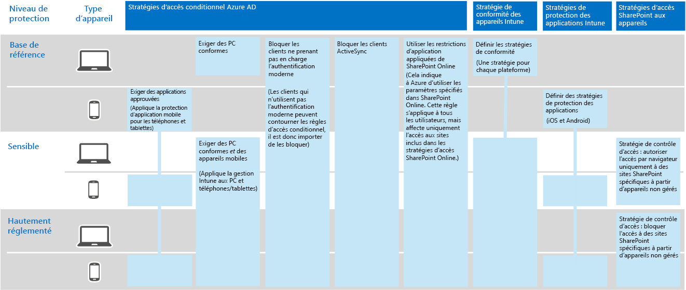
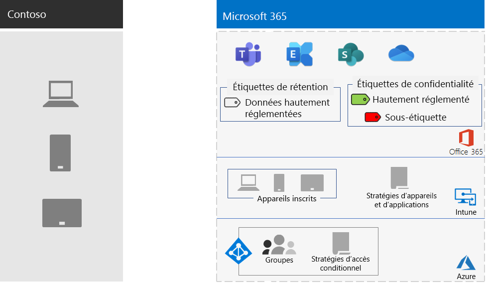

# Protection des informations de Contoso Corporation

Contoso est sérieux quant à la sécurité de ses informations. La fuite ou la destruction de la propriété intellectuelle qui décrit leurs conceptions de produits et techniques de fabrication propriétaires les placent dans un inconvénient concurrentiel.

Avant de déplacer leurs biens numériques sensibles vers le cloud, Contoso s’est assuré que les exigences de classification et de protection des informations sur site étaient prises en charge par les services informatiques de Microsoft 365 entreprise.

## Classification de la sécurité des données Contoso

Contoso a effectué une analyse de ses données et déterminé les niveaux de classification suivants.

| Niveau 1 : ligne de base | Niveau 2 : Sensible | Niveau 3 : hautement réglementé |
|:-------|:-----|:-----|
| Les données sont chiffrées et uniquement accessibles par des utilisateurs authentifiés.    Fourni pour toutes les données stockées sur site et dans le cloud stockage et charges de travail. Les données sont chiffrées pendant qu’elles résident dans le service et en transit entre le service et les appareils clients.   Les données de niveau 1 incluent, par exemple, les communications d’entreprise normales (courrier électronique) et les fichiers des collaborateurs de l’administration, des ventes et du support technique. | Niveau 1 avec une authentification et une protection renforcées contre la perte de données.    L’authentification forte inclut Azure AD Multi-Factor Authentication (MFA) avec validation SMS. La protection contre la perte de données garantit que les informations sensibles ou critiques ne se déplacent pas en dehors du cloud Microsoft.  Les données de niveau 2 sont, par exemple, des informations financières et juridiques ainsi que les données de recherche et de développement de nouveaux produits. | Niveau 2 avec des niveaux de chiffrement, d’authentification et d’audit plus élevés.  Niveaux de chiffrement des données au repos et dans le cloud les plus élevés, conformes aux réglementations locales, associés à une authentification multi-facteur avec cartes à puce et fonctionnalités d’audit et d’alerte granulaires.   Les données de niveau 3 sont, par exemple, des informations personnelles client et partenaire, des spécifications d’ingénierie de produit et des techniques de fabrication propriétaires.  |
||||

## Stratégies d’information de Contoso
Le tableau suivant répertorie les stratégies d’information de Contoso.

| Valeur | Access | Rétention des données | Protection des informations |
|:-------|:-----|:-----|:-----|
| Valeur commerciale faible (Niveau 1: Ligne de base) | Autoriser l’accès à tous.  | 6 mois | Utiliser le chiffrement. |
| Valeur commerciale moyenne (Niveau 2: Sensible) | Autoriser l’accès aux employés, sous-traitants et partenaires de Contoso.    Utiliser l’authentification multi-facteur (MFA), le chiffrement TLS (Transport Layer Security) et la gestion des applications mobiles (MAM). | 2 ans  | Utiliser les valeurs de hachage pour l’intégrité des données.  |
| Valeur commerciale élevée (Niveau 3 : hautement réglementé) | Autoriser l’accès aux cadres et aux responsables des équipes techniques et de fabrication.     Système de gestion des droits (RMS) avec les appareils réseau gérés seulement.  | 7 ans  | Utiliser des signatures numériques pour le non-reniement.  |
|||||

## Chemin d’accès Contoso à la protection des informations avec Microsoft 365 entreprise

Contoso a suivi les étapes suivantes pour préparer Microsoft 365 entreprise aux exigences de protection des informations :

1. Identifier les informations à protéger

   Contoso a fait un examen approfondi de ses biens numériques existants situés sur des sites SharePoint partages de fichiers et classé chaque bien.

2. Déterminer les stratégies d’accès, de rétention et de protection des informations pour les niveaux de données

   En fonction des niveaux de données, Contoso a déterminé la configuration requise détaillée en matière de stratégie, utilisée pour protéger les biens numériques existants lors de leur migration vers le cloud.

3. Créer des étiquettes de niveau de sensibilité et leurs paramètres pour les différents niveaux d’informations

   Contoso a créé des étiquettes de confidentialité pour ses niveaux de données dont les étiquettes hautement réglementées incluent chiffrement, autorisations et filigranes.

4. Déplacer des données à partir de sites SharePoint et de partages de fichiers locaux vers leurs nouveaux sites SharePoint sites

    Les fichiers ayant migré vers les nouveaux sites SharePoint ont hérité des étiquettes de rétention par défaut attribuées au site.

5. Former les employés à l’utilisation des étiquettes de sensibilité pour les nouveaux documents, à interagir avec le service it de Contoso lors de la création de sites SharePoint et à toujours stocker des biens numériques sur des sites SharePoint sites

    La modification des mauvaises habitudes de stockage des informations des travailleurs est souvent considérée comme la partie la plus difficile de la transition de protection des informations pour le cloud. Contoso it and management needed to get employees to always label and store their digital assets in the cloud, refrain from using on-premises file shares, and not use third-party cloud storage services or USB drives.

## Stratégies d’accès conditionnel régissant la protection des informations

Dans le cadre de son déploiement de Exchange Online et SharePoint, Contoso a configuré l’ensemble de stratégies d’accès conditionnel suivant et les a appliquées aux groupes appropriés :

- [Stratégies d’accès aux applications gérées et non gérées sur les périphériques](../security/office-365-security/identity-access-policies.md)
- [Stratégies d’accès à Exchange Online](../security/office-365-security/secure-email-recommended-policies.md)
- [Stratégies d’accès SharePoint](../security/office-365-security/sharepoint-file-access-policies.md)

Voici un ensemble de stratégies Contoso pour la protection des informations.

>[!Note]
>Contoso a également configuré d’autres stratégies d’accès conditionnel pour l’identité et la connexion. Consultez l’[Identité de Contoso Corporation](contoso-identity.md#conditional-access-policies-for-identity-and-device-access).
>

Ces stratégies vous assurent que :

- Les applications autorisées et les actions qu’elles peuvent prendre avec les données de l’organisation sont définies par les stratégies de protection des applications.
- les PC et les périphériques mobiles sont conformes ;
- Exchange Online utilise Office 365 chiffrement de messages (OME) pour Exchange Online.
- SharePoint utilise des restrictions appliquées par l’application.
- SharePoint utilise les stratégies de contrôle d’accès pour assurer un accès réservé au navigateur et bloquer l’accès aux matériels non gérés.

## Mappage Microsoft 365 des fonctionnalités d’entreprise aux niveaux de données Contoso

Le tableau suivant maie les niveaux de données Contoso aux fonctionnalités de protection des informations Microsoft 365 entreprise.

| Level | Microsoft 365 services cloud | Windows 10 et Microsoft 365 Apps for enterprise | Sécurité et conformité |
|:-------|:-----|:-----|:-----|
| Niveau 1 : ligne de base  | Stratégies d’accès conditionnel à SharePoint et à Exchange Online   Autorisations sur les sites SharePoint | Étiquettes de confidentialité   BitLocker   Protection des informations Windows | Stratégies d’accès conditionnel aux matériels et stratégies de gestion des applications mobiles |
| Niveau 2 : Sensible | Niveau 1 plus :     Étiquettes de confidentialité   Étiquettes de rétention Microsoft 365 sur les sites SharePoint   Protection contre la perte de données pour SharePoint et Exchange Online   Sites SharePoint isolés  | Niveau 1 plus :     Étiquettes de sensibilité sur les biens numériques  | Niveau 1 |
| Niveau 3 : hautement réglementé | Niveau 2 plus :    Apportez votre propre chiffrement de clé (BYOK) et protection pour les informations commerciales secrètes   Coffre de clés Azure pour les applications métier qui interagissent avec Microsoft 365 services | Niveau 2 | Niveau 1 |
|||||

Voici la configuration de la protection des informations Contoso qui en résulte.

## Étape suivante

Découvrez comment Contoso  utilise les fonctionnalités de sécurité dans Microsoft 365 entreprise pour la gestion des identités et des accès, la protection contre les menaces, la protection des informations et la gestion de la sécurité.

## Voir aussi

[Feuille de route de sécurité](../security/office-365-security/security-roadmap.md)

[Vue d’ensemble de Microsoft 365 pour entreprise](microsoft-365-overview.md)

[Guides de laboratoire de test](m365-enterprise-test-lab-guides.md)