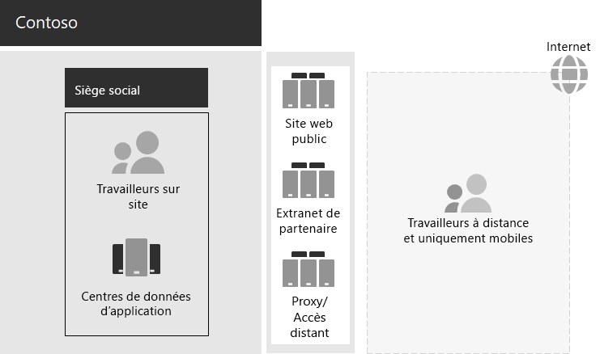

# Infrastructure informatique de Contoso et besoins de l’entreprise

Contoso passe d’une infrastructure informatique centralisée locale à une configuration cloud qui intègre des applications et des charges de travail de productivité personnelles basées sur le cloud.

## Infrastructure informatique Contoso existante

Contoso utilise une infrastructure informatique locale centralisée avec des centres de données situés au siège social parisien.

Voici le siège social avec des centres de données d’application, un DMZ et Internet.

Les centres de données d’applications hébergent les éléments suivants : 

- Applications métier personnalisées qui utilisent SQL Server et d’autres bases de données Linux.
- Ensemble d’anciens serveurs SharePoint.
- Serveurs au niveau des équipes et de l’organisation pour le stockage des fichiers.

De plus, chaque bureau central régional prend en charge un ensemble de serveurs possédant un groupe d’applications similaire. Ces serveurs sont contrôlés par les services informatiques régionaux.

Il est toujours compliqué d’effectuer des recherches dans les applications et les données de ces centres de données répartis partout dans le monde.

Dans la DMZ du siège social de Contoso, différents ensembles de serveurs fournissent :

- Hébergement pour le site web public Contoso, à partir duquel les clients peuvent commander des produits, des composants, des fournitures et des services.
- Hébergement de l’extranet des partenaires de Contoso pour la collaboration et la communication avec les partenaires.
- Accès à distance basé sur un réseau privé virtuel (VPN) à l’intranet et au proxy web de Contoso pour les collaborateurs présents au siège social parisien.

## Besoins commerciaux de Contoso

Les besoins commerciaux de Contoso sont en cinq catégories principales :

**Productivité**

- Faciliter la collaboration

  Remplacez la collaboration basée sur le courrier électronique et le partage de fichiers par un modèle en ligne qui permet des modifications en temps réel sur les documents, des réunions en ligne plus faciles et des threads de conversation capturés.
- Améliorer la productivité pour les travailleurs mobiles et à distance

  Avec de nombreux employés travaillant à domicile ou sur le terrain, remplacez la solution VPN en goulot d’étranglement par un accès performant aux données et ressources Contoso dans le cloud.
- Accroître la créativité et l’innovation

  Profiter des dernières méthodes de développement d’idées et d’apprentissage visuel, notamment l’entrée manuscrite et la visualisation 3D.

**Sécurité**

- Gestion des identités et des accès

  Appliquer plusieurs formes d’authentification et autres formes d’authentification et protéger les informations d’identification des comptes d’utilisateur et d’administrateur.

- Protection contre les menaces

  Protéger contre les menaces externes de sécurité, notamment la messagerie et les programmes malveillants basés sur le système d’exploitation.

- Protection des informations

  Verrouiller l’accès aux biens numériques sensibles tels que les données client, les spécifications de conception et de fabrication et les informations des employés, et les chiffrer.

- Gestion de la sécurité

  Surveillez la posture de sécurité et détectez et répondez aux menaces en temps réel.

**Accès mobile et à distance, et partenaires professionnels**

- Améliorer la sécurité pour les travailleurs à distance et mobiles

  Implémentez la gestion de votre propre appareil (BYOD) et de votre entreprise pour garantir un accès sécurisé, un comportement d’application correct et la protection des données d’entreprise.

- Réduire l’infrastructure d’accès distant pour les employés

  Réduisez les coûts de maintenance et de support et améliorez les performances pour la solution d’accès à distance en déplaçant les ressources couramment accessibles vers le cloud.

- Fournir une meilleure connectivité et réduire la surcharge pour les transactions de l’entreprise à la charge (B2B)

  Remplacez un extranet partenaire coûteux et coûteux par une solution basée sur le cloud qui utilise l’authentification fédérée.

**Conformité**

- Respecter les exigences réglementaires locales

  Assurer la conformité avec les réglementations industrielles et régionales en matière de stockage de données, de chiffrement, de confidentialité des données et de réglementations relatives aux données personnelles, telles que le Règlement général sur la protection des données (R GDPR) pour l’Union européenne.

**Gestion**

- Réduire la surcharge informatique pour la gestion des logiciels en cours d’exécution sur les PC et appareils clients

  Automatisez l’installation des mises à jour Windows système d’exploitation et Applications Microsoft 365 pour les grandes entreprises au sein de l’organisation.

## Mappage des besoins métier de Contoso Microsoft 365 entreprise

Le service informatique de Contoso a déterminé le mappage suivant des besoins de l’entreprise Microsoft 365 E5 fonctionnalités avant le déploiement :

| Catégorie | Besoin métier | Microsoft 365 pour les produits ou fonctionnalités d’entreprise |
|:-------|:-----|:-----|
| Productivité |  |  |
|  | Faciliter la collaboration | Microsoft Teams, SharePoint, OneDrive |
|  | Améliorer la productivité pour les travailleurs mobiles et à distance | Charges de travail Microsoft 365 et données informatiques |
|  | Accroître la créativité et l’innovation | Windows Ink, Cortana at Work, PowerPoint |
| Sécurité |  |  |
|  | Gestion des identités et des accès | Comptes d’administrateur général dédiés avec Azure AD Multi-Factor Authentication (MFA) et Azure AD Privileged Identity Management (PIM)   Authentification multifacteur pour tous les comptes d’utilisateur   Accès conditionnel   Lecteur de sécurité   Windows Hello   Windows Credential Guard |
|  | Protection contre les menaces | Advanced Threat Analytics   Windows Defender   Defender pour Office 365   Microsoft Defender pour Office 365   Microsoft 365 et réponse aux menaces   |
|  | Protection des informations | Azure Information Protection   Protection contre la perte de données (DLP)   Protection des informations Windows (WIP)   Microsoft Cloud App Security   Microsoft Intune |
|  | Gestion de la sécurité | Azure Defender    Centre de sécurité Windows Defender |
| Accès mobile et à distance, et partenaires professionnels |  |  |
|  | Meilleure sécurité pour les travailleurs mobiles et à distance | Microsoft Intune |
|  | Réduire l’infrastructure d’accès distant pour les employés | Charges de travail Microsoft 365 et données informatiques |
|  | Améliorer la connectivité et réduire la surcharge pour les transactions B2B | Authentification fédérée et ressources informatiques |
| Conformité |  |  |
|  | Respecter les exigences réglementaires locales | Fonctionnalités R GDPR dans Microsoft 365 |
| Gestion |  |  |
|  | Réduire la surcharge pour l’installation des mises à jour client | Mises à jour pour Windows 10 Entreprise   Mises à jour pour les Applications Microsoft 365 pour les entreprises |
||||

## Étape suivante

Découvrez le réseau local de Contoso [Corporation](contoso-networking.md) et la façon dont il a été optimisé pour l’accès et la latence Microsoft 365 ressources informatiques.

## Voir aussi

[Vue d’ensemble de Microsoft 365 pour entreprise](microsoft-365-overview.md)

[Guides de laboratoire de test](m365-enterprise-test-lab-guides.md)
