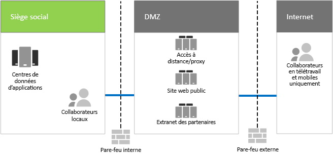

# Infrastructure informatique et besoins métier de Contoso

**Résumé :** Comprendre la structure de base de l’infrastructure informatique locale de Contoso et les besoins métier pouvant être satisfaits par Microsoft 365 Entreprise.

Contoso est passé d’une infrastructure informatique centralisée locale à une infrastructure cloud incluant des charges de travail de productivité et des applications cloud.

## Infrastructure informatique actuelle de Contoso

Contoso utilise une infrastructure informatique locale centralisée avec des centres de données situés au siège social parisien.

La Figure 1 présente le siège social avec les centres de données d’applications, un DMZ et Internet.

**Figure 1 : Infrastructure informatique existante de Contoso**
 
Les centres de données d’applications hébergent les éléments suivants : 

- Ligne personnalisée d’applications métier qui utilise SQL Server et d’autres bases de données Linux.
- Ensemble d’anciens serveurs SharePoint.
- Serveurs au niveau des équipes et de l’organisation pour le stockage des fichiers.

Cette infrastructure intègre également chaque bureau central régional qui prend en charge un ensemble de serveurs avec un ensemble d’applications similaire. Ces serveurs sont contrôlés par les services informatiques régionaux.

Il est toujours compliqué d’effectuer des recherches dans les applications et les données de ces centres de données répartis partout dans le monde.

Dans le DMZ du siège social de Contoso, les différents groupes de serveurs fournissent les éléments suivants :

- Accès à distance VPN à l’intranet et au proxy web de Contoso pour les collaborateurs présents au siège social parisien.
- Hébergement du site web public de Contoso à partir duquel les clients peuvent commander des produits, des composants, des fournitures ou des services.
- Hébergement de l’extranet des partenaires de Contoso pour la collaboration et la communication avec les partenaires.

## Besoins métier de Contoso

Les besoins métier de Contoso sont regroupés dans cinq catégories principales :

Productivité :

- Faciliter la collaboration

  Remplacer la collaboration basée sur la messagerie et le partage de fichiers grâce à un modèle en ligne qui permet de modifier en temps réel les documents, de simplifier les réunions en ligne et de capturer des fils de conversation.
- Améliorer la productivité pour les travailleurs mobiles et à distance

  En raison du grand nombre d’employés travaillant à la maison ou sur le terrain, remplacer la solution VPN engorgée avec un accès performant aux données et aux ressources de Contoso dans le cloud.
- Accroître la créativité et l’innovation

  Profiter des dernières méthodes de développement d’idées et d’apprentissage visuel, notamment l’entrée manuscrite et la visualisation 3D.

Sécurité :

- Gestion des identités et des accès

  Appliquer une authentification multifacteur et d’autres formes d’authentification, et protéger les informations d’identification de compte utilisateur et administrateur.

- Protection contre les menaces

  Protéger contre les menaces externes de sécurité, notamment la messagerie et les programmes malveillants basés sur le système d’exploitation.

- Protection des informations

  Verrouiller l’accès aux biens numériques sensibles tels que les données client, les spécifications de conception et les informations des employés, et les chiffrer.

- Gestion de la sécurité

  Surveiller la posture de sécurité et être en mesure de détecter et de traiter les menaces en temps réel.

Accès mobile et à distance, et partenaires professionnels :

- Meilleure sécurité pour les travailleurs mobiles et à distance

  Appliquer un mode de gestion adapté aux appareils BYOD (Bring Your Own Device) ainsi qu'à ceux appartenant à l’entreprise, pour assurer un accès sécurisé, un bon fonctionnement des applications et une protection des données de l'entreprise.

- Réduire l’infrastructure d’accès distant pour les employés

  Réduire les frais de maintenance et d’assistance, et améliorer les performances pour la solution d’accès à distance en déplaçant des ressources régulièrement consultées vers le cloud.

- Fournir une meilleure connectivité et réduire les frais généraux pour les transactions Business-to-Business (B2B)

  Remplacer l’extranet obsolescent et coûteux par une solution cloud utilisant l’authentification fédérée.

Conformité :

- Respecter les exigences réglementaires locales

  Être et rester conforme aux réglementations régionales et du secteur en matière de stockage des données, de chiffrement, de confidentialité des données et de réglementations des données personnelles, telles que le Règlement général sur la protection des données (RGPD) dans l’Union européenne.

Gestion :

- Réduire les frais généraux informatiques pour la gestion des logiciels s’exécutant sur des périphériques et des PC client

  Automatiser l’installation des mises à jour pour le système d’exploitation Windows et Microsoft Office au sein de l’organisation.

## Mappage des besoins métier de Contoso à Microsoft 365 Entreprise

Le service informatique de Contoso a déterminé le mappage suivant des besoins métier aux fonctionnalités de Microsoft 365 Entreprise E5 avant le déploiement :

||||
|:-------|:-----|:-----|
| **Catégorie** | **Besoin métier** | **Produits ou fonctionnalités Microsoft 365 Entreprise** |
| Productivité |  |  |
|  | Faciliter la collaboration | Teams, SharePoint Online, Skype Entreprise Online |
|  | Améliorer la productivité pour les travailleurs mobiles et à distance | Charges de travail Office 365 et données informatiques |
|  | Accroître la créativité et l’innovation | Windows Ink, Cortana at Work, PowerPoint |
| Sécurité |  |  |
|  | Gestion des identités et des accès | Comptes Administrateur général dédiés avec l’authentification multifacteur (MFA) et Azure AD Privileged Identity Management (PIM)   Authentification multifacteur pour tous les comptes d’utilisateur   Accès conditionnel   Windows Hello   Windows Credential Guard |
|  | Protection contre les menaces | Advanced Threat Analytics   Windows Defender   Protection avancée contre les menaces   Office 365-Protection avancée contre les menaces   Examen et réponse contre les menaces Office 365   |
|  | Protection des informations | Azure Information Protection   Protection contre la perte de données Office 365 (DLP)   Protection des informations Windows   Microsoft Cloud App Security   Microsoft Intune |
|  | Gestion de la sécurité | Azure Security Center    Centre de sécurité Windows Defender |
| Accès mobile et à distance, et partenaires professionnels |  |  |
|  | Meilleure sécurité pour les travailleurs mobiles et à distance | Microsoft Intune |
|  | Réduire l’infrastructure d’accès distant pour les employés | Charges de travail Office 365 et données informatiques |
|  | Fournir une meilleure connectivité et réduire les frais généraux pour les transactions B2B | Authentification fédérée et ressources informatiques |
| Conformité |  |  |
|  | Respecter les exigences réglementaires locales | Fonctionnalités RGPD dans Office 365 |
| Gestion |  |  |
|  | Réduire les frais généraux informatiques pour l’installation de mises à jour du client | Anneaux de déploiement   Mise à niveau de Windows 10 en place et Autopilot   Office 365 ProPlus |
||||

## Étape suivante

[En savoir plus](contoso-networking.md) sur le réseau local de Contoso Corporation et sur la façon dont il a été optimisé pour l’accès et la latence vers des ressources informatiques Microsoft 365 au sein de son organisation.

## Voir aussi

[Guide de déploiement](deploy-microsoft-365-enterprise.md)

[Guides de laboratoire de test](m365-enterprise-test-lab-guides.md)
