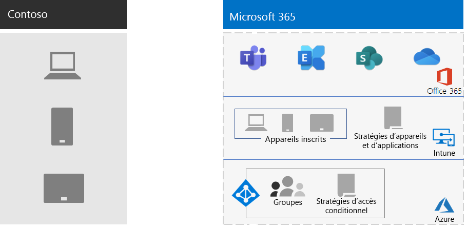

# Gestion des appareils mobiles pour Contoso

Microsoft 365 entreprise inclut Intune et un ensemble de services Azure qui prise en charge la gestion et la sécurité des appareils mobiles et des applications.

Contoso compte de nombreux employés à mobilité fixe. Certains ont des bureaux à Contoso et d’autres n’ont pas de bureau. Contoso avait besoin d’un moyen pour activer la productivité des employés, tout en maintenant les appareils, les données Contoso stockées sur ces appareils et le comportement des applications sécurisés.

## Prévision

Contoso a identifié les cas d’utilisation Intune suivants de la gestion des appareils mobiles pour Microsoft 365 entreprise :

- Protégez Exchange Online courrier électronique et les données afin qu’ils soient accessibles en toute sécurité par les appareils mobiles.
- Implémentez un programme BYOD (Bring-your-own-device) pour les employés de Contoso.
- Émettre des téléphones et des tablettes partagées à usage limité pour les employés de Contoso.

Contoso n’utilise pas Intune pour :

- Autoriser les employés à accéder en toute sécurité Microsoft 365 à partir d’une borne publique non sécurisée.
- Protégez le courrier électronique et les données locaux afin qu’ils soient accessibles en toute sécurité par les appareils mobiles, car il n’existe aucun serveur Microsoft Exchange local.

## Déployer

Voici la configuration de l’infrastructure de gestion des appareils mobiles de Contoso :

- Définir Intune comme autorité de gestion des périphériques mobiles (MDM) et utiliser Intune sur Azure pour administrer le contenu et gérer les appareils
- Création Azure Active Directory groupes (Azure AD) pour les appareils pour l’inscription, les paramètres Intune et les stratégies d’accès conditionnel basé sur l’appareil

  Pour plus d’informations, voir [Stratégies d’accès conditionnel Contoso.](contoso-identity.md#conditional-access-policies-for-identity-and-device-access)

- A activé la plateforme d’appareils Apple pour prendre en charge les employés avec des iPad, des iMacs et des iPhone, ainsi que des iPhones d’entreprise
- Les politiques de conditions générales de Contoso ont été créées. Elles sont affichées pendant l’installation du portail de l’entreprise sur les appareils mobiles.
- Pour les appareils qui ne sont pas inscrits, implémenté un ensemble de stratégies de gestion des applications mobiles (MAM) pour exiger l’authentification pour l’accès Microsoft 365 services
- Des stratégies Intune ont été créées pour appliquer :
  - Applications autorisées.
  - Chiffrement de l’appareil pour empêcher l’accès non autorisé.
  - Code confidentiel ou mot de passe à six chiffres.
  - Période d’inactivité.
  - Protection antivirus et programmes malveillants, et mises à jour de signatures Windows Defender sur Windows 10 appareils.
  - Les mises à jour automatiques Windows 10 appareils qui incluent les dernières mises à jour de sécurité.
  - Le fait de pousser des certificats vers des appareils gérés.
  - Une séparation claire des données professionnelles et personnelles. Les utilisateurs ou les administrateurs peuvent effacer de l’appareil les données d’entreprise sélectionnées, tout en conservant des données personnelles telles que des images, des comptes de messagerie personnels et des fichiers personnels.

Contoso a inscrit les PC déployés et les smartphones et tablettes d’entreprise en les ajoutant aux groupes d’appareils Intune appropriés. Ils ont également mis en place un programme BYOD pour que les employés inscrivent leurs appareils personnels. Les appareils inscrits reçoivent des stratégies Intune, ce qui entraîne la gestion et la sécurisation des appareils et de leurs applications. Les appareils qui ne sont pas inscrits ont des stratégies de gestion des applications mobiles (MAM) qui spécifient les applications autorisées.

Voici l’architecture de déploiement de la gestion des appareils mobiles Contoso.

## Étape suivante

Découvrez comment Contoso utilise les fonctionnalités de [protection](contoso-info-protect.md) des informations de Microsoft 365 entreprise pour classifier, identifier et protéger les biens numériques essentiels au sein de son organisation.

## Voir aussi

[Gestion des appareils pour Microsoft 365](device-management-roadmap-microsoft-365.md)

[Vue d’ensemble de Microsoft 365 pour entreprise](microsoft-365-overview.md)

[Guides de laboratoire de test](m365-enterprise-test-lab-guides.md)

