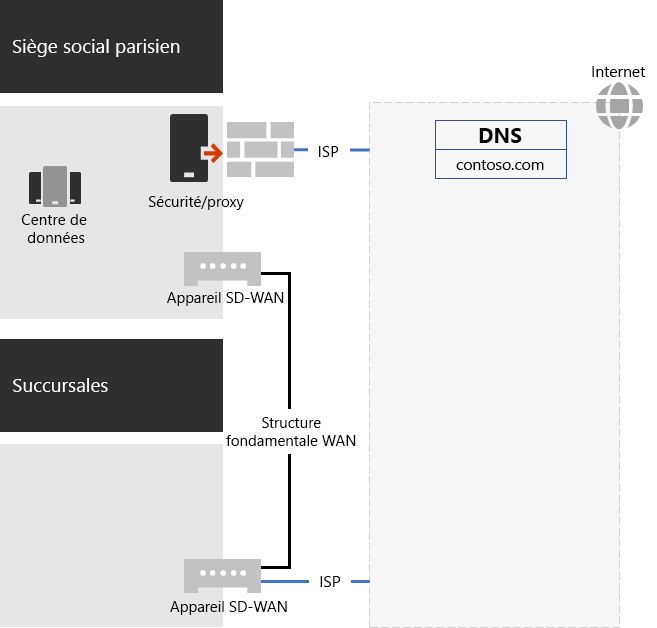
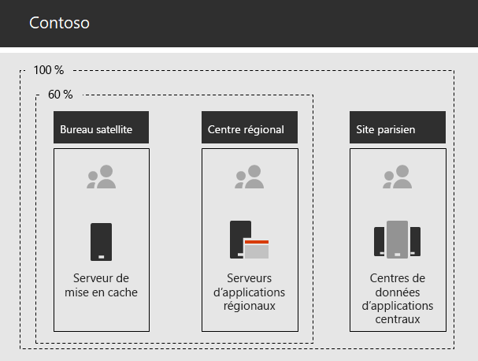

# Mise en réseau de Contoso Corporation

**Résumé :** Comprendre l’infrastructure réseau Contoso et la façon dont elle utilise la technologie SD-WAN pour assurer la performance optimale de la connectivité réseau avec les services informatiques Microsoft 365 Entreprise.

Pour adopter une infrastructure informatique incluse, les ingénieurs réseau de Contoso ont radicalement modifié la manière dont le trafic réseau circule vers les services informatiques. Au lieu d’utiliser un modèle « Hub and Spoke » qui concentre la connectivité réseau sur le siège social, ils ont cherché à mapper les emplacements utilisateur à la sortie Internet locale et les connexions locales aux emplacements réseau de Microsoft sur Internet.

## Infrastructure réseau de Contoso

Voici les éléments du réseau de Contoso qui permettent de relier leurs bureaux entre eux dans le monde entier :

- Réseau WAN MPLS

  Un réseau WAN MPLS permet de connecter le siège social de Paris aux bureaux régionaux et les bureaux régionaux aux succursales dans une configuration « Hub and Spoke ». Il s’agit pour les utilisateurs d’accéder aux serveurs locaux qui composent les applications métier au bureau de Paris. Il achemine également tout le trafic Internet générique au bureau de Paris où les périphériques de sécurité réseau traitent les demandes. Dans chaque bureau, les routeurs acheminent le trafic vers les hôtes ou les points d’accès sans fil sur les sous-réseaux qui utilisent l’espace d’adressage IP privé.

- Accès Internet local direct pour le trafic Office 365

  Chaque bureau dispose d’un périphérique SD-WAN avec l’un des circuits en réseau ISP Internet local doté de sa propre connectivité Internet via un serveur proxy. Il est généralement implémenté sous la forme d’une liaison WAN vers ISP local qui fournit également des adresses IP publiques et des adresses IP du serveur DNS local pour le serveur proxy.

- Présence sur Internet

  Contoso est propriétaire du nom de domaine public contoso.com. Le site web public de Contoso pour les commandes de produits se compose d’un ensemble de serveurs dans un centre de données connecté à Internet sur le site parisien. Contoso utilise une plage d’adresses IP publiques disponible 24 h/24 sur Internet.

La figure 1 indique l’infrastructure réseau de Contoso et ses connexions à Internet.

 
**Figure 1 : Réseau de Contoso**

## Utilisation de la technologie SD-WAN pour la connectivité réseau optimale à Microsoft

Contoso a suivi les [principes de connectivité réseau Office 365](https://docs.microsoft.com/office365/enterprise/office-365-network-connectivity-principles) suivants :

1. Identifier et différencier le trafic réseau Office 365
2. Sortir les connexions réseau localement
3. Éviter les épingles de réseau
4. Ignorer les périphériques de sécurité réseau en double

Il existe trois catégories de trafic réseau pour Office 365 : Optimiser, Autoriser et Par défaut. Le trafic Optimiser et Autoriser correspond au trafic réseau de confiance qui est chiffré et sécurisé aux points de terminaison et destiné aux centres de données Microsoft.

Contoso a décidé d’utiliser la sortie Internet directe pour le trafic de catégorie Optimiser et Autoriser et pour transférer le trafic de catégorie Par défaut vers la connexion Internet centrale basée à Paris.

Ils ont décidé de déployer des périphériques SD-WAN à chacun de leur bureau afin de suivre simplement ces principes et assurer la performance optimale de la connectivité réseau avec les services informatiques Microsoft 365 Entreprise.

Les périphériques SD-WAN disposent d’un port LAN pour le réseau de bureaux local et plusieurs ports WAN. Un port WAN se connecte à leur réseau MPLS et les autres ports WAN se connectent aux circuits ISP locaux. Le périphérique SD-WAN achemine le trafic réseau de catégorie Optimiser et Autoriser vers les liaisons ISP.

## Ligne d’infrastructure d’applications pour les entreprises de Contoso

Contoso a conçu son infrastructure d’applications et serveur pour les entreprises pour les éléments suivants :

- Les succursales utilisent des serveurs de mise en cache locale pour stocker les documents et les sites web internes les plus sollicités.
- Les centres régionaux utilisent les serveurs d’applications régionaux pour les bureaux régionaux et les succursales. Ces serveurs se synchronisent avec les serveurs du siège social à Paris.
- Le site de Paris comporte les centres de données contenant les serveurs d’applications centralisés qui servent l’organisation entière.

La figure 2 indique le pourcentage du trafic réseau lors de l’accès aux serveurs au sein de l’intranet de Contoso.

 
**Figure 2 : infrastructure des applications internes de Contoso**

Pour les utilisateurs des centres régionaux et des succursales, 60 % des ressources requises par les collaborateurs peuvent être prises en charge par les serveurs de ces sites. Les 40 % des demandes de ressources restantes doivent accéder au siège social parisien par le biais d’une connexion WAN.

## Analyse des réseaux de Contoso et préparation de son réseau pour Microsoft 365 Entreprise

L’adoption réussie des services Microsoft 365 Entreprise par les utilisateurs de Contoso dépend de la connectivité performante et à haut niveau de disponibilité à Internet ou directement aux services de cloud computing Microsoft. Afin de planifier et d’implémenter une connectivité optimisée aux services de cloud computing Microsoft 365 Entreprise, Contoso a pris les mesures suivantes :

1. Création d’un diagramme de réseau WAN d’entreprise pour simplifier la planification

   Contoso a commencé à planifier son réseau en créant un diagramme montrant ses sites, la connectivité réseau existante, les périphériques du périmètre du réseau existants et les classes de service gérés sur le réseau. Contoso a utilisé ce diagramme pour chaque étape suivante de la planification et de l’implémentation de la connectivité réseau.

2. Création d’un plan pour la connectivité réseau de Microsoft 365 Entreprise

   Contoso a utilisé les [principes de connectivité réseau Office 365](https://docs.microsoft.com/office365/enterprise/office-365-network-connectivity-principles) et fourni les architectures réseau de référence pour déterminer SD-WAN comme sa topologie par défaut pour la connectivité Office 365.

3. Analyse de l’utilisation de la connexion à Internet et de la bande passante WAN MPLS à chaque bureau, et de la bande passante accrue, le cas échéant

   L’utilisation actuelle de chaque bureau a été analysée et les circuits ont été augmentés afin que le trafic informatique Microsoft 365 prévu soit assuré avec une moyenne de 20 % de capacité inutilisée.

4. Optimisation des performances vers les services réseau Microsoft

   Contoso a choisi l’ensemble de points de terminaison Office 365, Intune et Azure, et a configuré les pare-feux, les périphériques de sécurité et les autres systèmes dans le chemin d’accès Internet afin d’assurer des performances optimales. Les points de terminaison du trafic de catégorie Optimiser et Autoriser pour Office 365 ont été configurés dans les périphériques SD-WAN ayant fourni l’accès direct à Internet.

5. Configuration du DNS interne

   Le DNS doit être fonctionnel et le trafic Office 365 doit y être vérifié.

6. Validation de la connectivité des ports et des points de terminaison réseau

   Contoso a exécuté des outils de test de connectivité réseau fournis par Microsoft pour valider la connectivité pour les services cloud de Microsoft 365 Entreprise.

7. Optimisation des ordinateurs des employés pour la connectivité réseau

   Les ordinateurs individuels ont été vérifiés pour s’assurer que les dernières mises à jour du système d’exploitation ont été installées et que la surveillance de la sécurité des points de terminaison est active sur tous les clients.

## Étape suivante

[En savoir plus](contoso-identity.md) sur la façon dont Contoso exploite son fournisseur d’identité local dans le cloud pour les employés, et fédère l’authentification pour les clients et les partenaires professionnels.

## Voir aussi

[Mise en réseau pour Microsoft 365 Entreprise](networking-infrastructure.md)

[Guide de déploiement](deploy-microsoft-365-enterprise.md)

[Guides de laboratoire de test](m365-enterprise-test-lab-guides.md)
