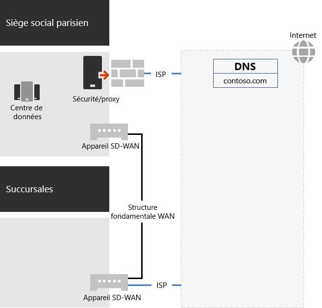
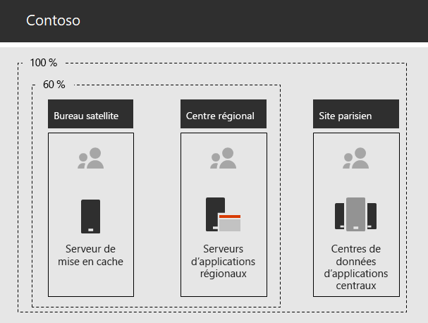

# Mise en réseau de Contoso Corporation

Pour adopter une infrastructure cloud inclusive, Contoso a conçu un changement fondamental dans la façon dont le trafic réseau vers les services cloud se déplace. Au lieu d’un modèle interne de hub-and-spoke qui met l’accent sur la connectivité réseau et le trafic pour le niveau suivant de la hiérarchie office, ils mappent les emplacements utilisateur à la sortie Internet locale et aux connexions locales vers l’emplacement réseau Microsoft 365 le plus proche sur Internet.

## Infrastructure réseau

Voici les éléments réseau qui relient les bureaux Contoso dans le monde entier :

- Réseau étendu de commutation multiprotocole WAN (MPLS) 

  Un réseau WAN MPLS connecte le siège social parisien aux bureaux régionaux et régionaux aux succursales dans une configuration de hub. Le réseau permet aux utilisateurs d’accéder aux serveurs locaux qui sont des applications métier au siège social parisien. Il a également pour effet d’router tout trafic Internet générique vers le bureau parisien, où les appareils de sécurité réseau excursent les demandes. Dans chaque bureau, les routeurs livrent le trafic aux hôtes câblés ou aux points d’accès sans fil sur les sous-réseaux, qui utilisent l’espace d’adressa visite IP privé.

- Accès Internet direct local pour le trafic Microsoft 365 réseau

  Chaque bureau dispose d’un périphérique de réseau wan (SD-WAN) défini par logiciel qui dispose d’un ou de plusieurs circuits réseau isp Internet locaux avec sa propre connectivité Internet via un serveur proxy. Cela est généralement implémenté en tant que liaison wan vers un isp local qui fournit également des adresses IP publiques et un serveur DNS local.

- Présence sur Internet

  Contoso possède le nom de domaine public contoso \. com. Le site web public contoso pour la commande de produits est un ensemble de serveurs dans un centre de données connecté à Internet sur le campus parisien. Contoso utilise une plage d’adresses IP publiques /24 sur Internet.

La figure 1 illustre l’infrastructure réseau contoso et ses connexions à Internet.

 
**Figure 1 : Réseau Contoso**

## Utilisation de la technologie SD-WAN pour la connectivité réseau optimale à Microsoft

Contoso a suivi les [principes de connectivité réseau Microsoft 365](microsoft-365-network-connectivity-principles.md) pour :

- Identification et différenciation du trafic réseau Microsoft 365
- Sortir les connexions réseau localement
- Éviter les épingles de réseau
- Ignorer les périphériques de sécurité réseau en double

Il existe trois catégories de trafic réseau pour Microsoft 365 : *Optimiser,* Autoriser *et* *Par défaut*. Le trafic Optimiser et Autoriser est un trafic réseau approuvé chiffré et sécurisé aux points de terminaison et destiné au Microsoft 365 réseau.

Contoso a décidé d’effectuer les opérations suivantes :

- Utilisez la sortie Internet directe pour optimiser et autoriser le trafic de catégorie et pour le trafic de catégorie Par défaut vers la connexion Internet centrale basée à Paris.

- Déployez des périphériques SD-WAN à chaque bureau comme moyen simple de suivre ces principes et d’obtenir des performances réseau optimales pour Microsoft 365 services informatiques.

  Les appareils SD-WAN ont un port réseau local LAN pour le réseau local et plusieurs ports WAN. Un port WAN se connecte à son réseau MPLS. Un autre se connecte à un circuit isp local. L’appareil SD-WAN achemine le trafic réseau de catégorie Optimiser et Autoriser sur le lien du fournisseur de services Internet.

## Infrastructure d’applications métier Contoso

Contoso a conçu son infrastructure intranet d’application métier et de serveur pour les opérations suivantes :

- Les succursales utilisent des serveurs de mise en cache locale pour stocker les documents et les sites web internes les plus sollicités.
- Les centres régionaux utilisent les serveurs d’applications régionaux pour les bureaux régionaux et les succursales. Ces serveurs se synchronisent avec les serveurs du siège social à Paris.
- Les centres de données du campus parisien contiennent des serveurs d’applications centralisés qui servent l’ensemble de l’organisation.

La figure 2 montre le pourcentage de capacité du trafic réseau utilisé lors de l’accès aux serveurs sur l’intranet Contoso.

 
**Figure 2 : Infrastructure Contoso pour les applications internes**

Pour les centres régionaux ou satellites, 60 % des ressources requises par les employés peuvent être servies par des serveurs de succursales et de centres régionaux. Les 40 % de demandes de ressources supplémentaires doivent passer par la liaison WAN vers le campus parisien.

## Analyse et préparation du réseau pour Microsoft 365 entreprise

L’adoption Microsoft 365 pour les services d’entreprise par les utilisateurs de Contoso dépend d’une connectivité hautement disponible et performante à Internet ou directement aux services cloud de Microsoft. Contoso a pris les mesures suivantes pour planifier et implémenter une connectivité optimisée Microsoft 365 pour les services cloud d’entreprise :

1. Créer un diagramme de réseau WAN d’entreprise pour faciliter la planification

   Pour commencer la planification du réseau, Contoso a créé un diagramme montrant ses bureaux, la connectivité réseau existante, les périphériques de périmètre réseau existants et les classes de service qui sont gérées sur le réseau. Ils ont utilisé ce diagramme pour chaque étape suivante de la planification et de l’implémentation de la connectivité réseau.

2. Créer un plan de Microsoft 365 pour la connectivité réseau d’entreprise

   Contoso a utilisé les principes Microsoft 365 de connectivité réseau et des [exemples](microsoft-365-network-connectivity-principles.md) d’architectures réseau de référence pour identifier SD-WAN comme topologie préférée pour la Microsoft 365 réseau.

3. Analyser l’utilisation de la connexion Internet et la bande passante MPLS-WAN à chaque bureau et augmenter la bande passante selon les besoins

   L’utilisation actuelle de chaque bureau a été analysée et les circuits ont été augmentés afin que le trafic informatique Microsoft 365 prévu fonctionne avec une capacité inutilisée moyenne de 20 %.

4. Optimiser les performances pour les services réseau Microsoft

   Contoso a déterminé l’ensemble des points de terminaison Office 365, Intune et Azure, ainsi que des pare-feux, des périphériques de sécurité et d’autres systèmes configurés dans le chemin d’accès Internet pour obtenir des performances optimales. Les points de terminaison pour Office 365 trafic de catégorie Optimiser et Autoriser ont été configurés sur les périphériques SD-WAN pour le routage sur le circuit ISP.

5. Configurer le DNS interne

   Le DNS doit être fonctionnel et le trafic Microsoft 365 doit y être vérifié.

6. Valider la connectivité des points de terminaison et des ports réseau

   Contoso a mis en place des outils de test de connectivité réseau Microsoft pour valider la connectivité Microsoft 365 pour les services cloud d’entreprise.

7. Optimiser les ordinateurs des employés pour la connectivité réseau

   Les ordinateurs individuels ont été vérifiés pour s’assurer que les dernières mises à jour du système d’exploitation ont été installées et que la surveillance de la sécurité des points de terminaison était active sur tous les clients.

## Étape suivante

Découvrez comment Contoso exploite ses services de domaine [Active Directory](contoso-identity.md) locaux dans le cloud pour les employés et fédère l’authentification pour les clients et les partenaires commerciaux.

## Voir aussi

[Feuille de route réseau pour les Microsoft 365](networking-roadmap-microsoft-365.md)

[Vue d’ensemble de Microsoft 365 pour entreprise](microsoft-365-overview.md)

[Guides de laboratoire de test](m365-enterprise-test-lab-guides.md)
