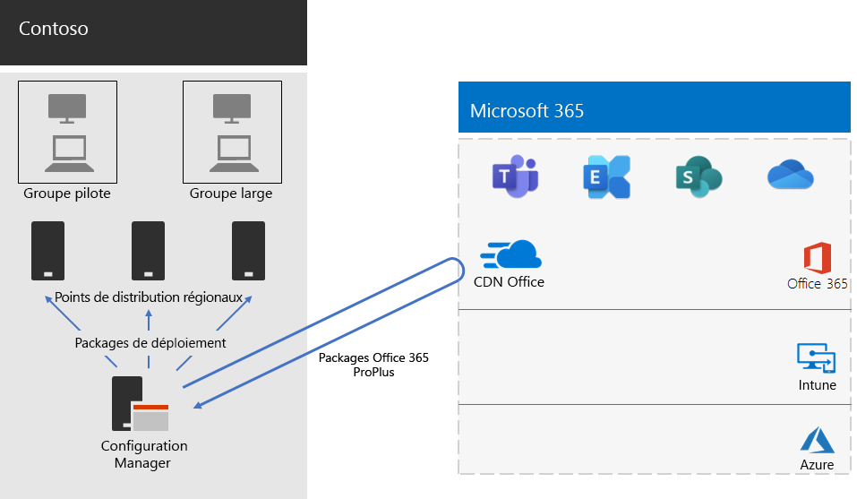

# Déploiement de Microsoft 365 Apps for enterprise pour Consoto.

Contoso a mis à niveau ses PC vers Windows 10 Entreprise et Applications Microsoft 365 pour les grandes entreprises pour permettre une collaboration plus efficace, une meilleure sécurité et une expérience de bureau plus moderne. Après avoir évalué leurs besoins en matière d’infrastructure et d’entreprise, Contoso a identifié ces exigences clés pour le déploiement :

- Tous les PC doivent s’exécuter Applications Microsoft 365 pour les grandes entreprises.
- Le déploiement doit utiliser les outils de gestion et l’infrastructure existants lorsque cela est possible.
- Le déploiement doit gérer plusieurs langues et architectures existantes sur les appareils des utilisateurs.
- Les PC doivent rester à jour et sécurisés avec des coûts d’administration informatiques minimaux et un impact minimal pour les utilisateurs.

## Outils de déploiement

En fonction de leurs besoins, Contoso a choisi de déployer Windows 10 Entreprise et Applications Microsoft 365 pour les grandes entreprises via Configuration Manager (Current Branch). Configuration Manager assure la mise à l’échelle des environnements de grande taille et permet de contrôler de manière étendue l’installation, les mises à jour et les paramètres. Il inclut également des fonctionnalités intégrées qui simplifient et optimisent le déploiement et la gestion d’Office, notamment :

- Cache d’homologue, qui peut vous aider avec une capacité réseau limitée lors du déploiement sur des appareils dans des emplacements distants.
- Le tableau de bord de gestion des clients Office, qui facilite le déploiement de Office et de surveillance des mises à jour et donne aux administrateurs l’accès aux dernières fonctionnalités de déploiement et de gestion.
- Déploiement intelligent du module linguistique, y compris le déploiement automatique de la même langue que le système d’exploitation.
- Méthode entièrement prise en charge et facile à utiliser pour supprimer des versions existantes de Office d’un client pendant le déploiement.

Outre Configuration Manager, Contoso a utilisé le [Shared Computer Toolkit readiness pour les compléments Office et VBA](/deployoffice/readiness-toolkit-application-compatibility-microsoft-365-apps), un outil gratuit de Microsoft, pour évaluer les problèmes de compatibilité avec leurs macros et compléments Office.

## Gestion du déploiement et des mises à jour

Applications Microsoft 365 pour les grandes entreprises a un nouveau modèle de mise en production : Office en tant que service. Le modèle de service facilite la mise à jour des nouvelles fonctionnalités. Mais il faut souvent que les services informatiques modifient la façon dont ils déploient et testent de nouvelles versions. Pour réduire les problèmes de compatibilité et garantir que leurs ordinateurs restent à jour, Contoso a déployé Windows et Office en deux étapes :

- Tout d’abord, ils ont déployé Applications Microsoft 365 pour les grandes entreprises sur un petit ensemble d’appareils représentatifs au sein de l’organisation. Ce groupe pilote a été utilisé pour tester des applications, des compléments et du matériel avec Applications Microsoft 365 pour les grandes entreprises.
- Quatre mois plus tard, après avoir résolu tous les problèmes essentiels rencontrés avec les applications, les compléments et le matériel dans le groupe pilote, Contoso a déployé Microsoft 365 Apps for enterprise sur le reste des périphériques de l’organisation (groupe large).

Au lieu de gérer les mises à jour de Office à l’aide de Configuration Manager, Contoso a activé les mises à jour automatiques à partir du cloud. Les mises à jour basées sur le cloud réduisent la surcharge administrative tout en garantissant que les appareils restent à jour.

Contoso a suivi la même approche en deux étapes pour les mises à jour de fonctionnalités que celles utilisées pour le déploiement de Office : les appareils du groupe pilote ont reçu des mises à jour de fonctionnalités quatre mois plus tôt que les appareils du reste de l’organisation (le groupe large). Pour activer cette option pour Office, Contoso a utilisé deux [canaux de mise à jour](/DeployOffice/overview-update-channels) recommandés :

- Canal d’entreprise semi-annuel (préversion) pour les mises à jour du groupe pilote
- canal Semi-Annual Enterprise pour les mises à jour du grand groupe

Étant donné que le canal d’entreprise semi-annuel (préversion) a publié une version des applications Microsoft 365 pour les grandes entreprises quatre mois plus tôt que le canal d’entreprise semi-annuel, Contoso a le temps de valider les mises à jour sans avoir à les gérer.

## Processus de déploiement

Pour effectuer le déploiement d’Office, Contoso a implémenté le processus suivant, qui inclut les recommandations concernant les meilleures pratiques de Microsoft suivantes :

1. Avant le déploiement, Contoso utilisait le Shared Computer Toolkit Readiness pour Office Complément et VBA pour tester leurs applications et Office compléments afin d’évaluer leur compatibilité avec Applications Microsoft 365 pour les grandes entreprises.
1. Dans Configuration Manager, ils ont activé le cache d’homologue sur leurs appareils clients, ce qui permet de limiter la capacité réseau lors du déploiement sur des appareils clients dans des emplacements distants. 
1. Contoso a défini deux groupes de déploiement en tant que regroupements d’appareils dans Configuration Manager : un groupe pilote et un groupe large. Le groupe pilote, qui comprenait un petit ensemble d’appareils représentatifs au sein de l’organisation, a été utilisé pour des tests supplémentaires d’applications, de compléments et de matériel avec Windows 10 Entreprise et Applications Microsoft 365 pour les grandes entreprises.
1. Ils ont créé des packages de déploiement pour Office à l’aide du tableau de bord de gestion des clients Office et de l’Assistant Installation Office 365, qui font tous deux partie de la console Configuration Manager. Ils ont créé deux packages Applications Microsoft 365 pour les grandes entreprises, l’un pour le groupe pilote sur le canal Semi-Annual Enterprise (préversion) et l’autre pour le groupe étendu sur le canal Semi-Annual Enterprise.
2. Chaque package Office incluait des modules linguistiques anglais, Français et allemand. Si un appareil nécessitait une langue qui n’était pas incluse dans le package Office, ce module linguistique a été téléchargé automatiquement à partir du Office réseau de distribution de contenu (CDN).
3. La société a utilisé la fonctionnalité intégrée dans le package Office afin de supprimer automatiquement toutes les versions MSI d’Office existantes avant d’installer Microsoft 365 Apps for enterprise.
4. Dans Configuration Manager, ils ont déployé les packages Windows et Office sur des points de distribution sur leur réseau. Ils ont ensuite exécuté les séquences de tâches de déploiement Configuration Manager pour déployer le package pilote Applications Microsoft 365 pour les grandes entreprises sur le groupe pilote.
5. Après avoir résolu les problèmes de compatibilité avec le groupe pilote, Contoso a exécuté les séquences de tâches pour déployer le package Applications Microsoft 365 pour les grandes entreprises sur le groupe étendu.

Étant donné que Contoso a choisi de mettre à jour automatiquement les appareils à partir du cloud, il n’était pas nécessaire de gérer le processus dans le Gestionnaire de Configuration. Leurs appareils sont automatiquement mis à jour directement à partir du cloud sur le canal de mise à jour qui a été défini dans le déploiement initial.

Voici l’architecture de déploiement de l’installation de Contoso Applications Microsoft 365 pour les grandes entreprises et des mises à jour en cours.

 
## Étape suivante

Découvrez comment Contoso [utilise Microsoft Intune](contoso-mdm.md) dans Microsoft 365 pour les entreprises afin de gérer ses appareils et les applications qu’ils exécutent au sein de l’organisation.

## Voir aussi

[Applications Microsoft 365 pour les entreprises](/deployoffice/deployment-guide-microsoft-365-apps)

[Vue d’ensemble de Microsoft 365 pour entreprise](microsoft-365-overview.md)

[Guides de laboratoire de test](m365-enterprise-test-lab-guides.md)