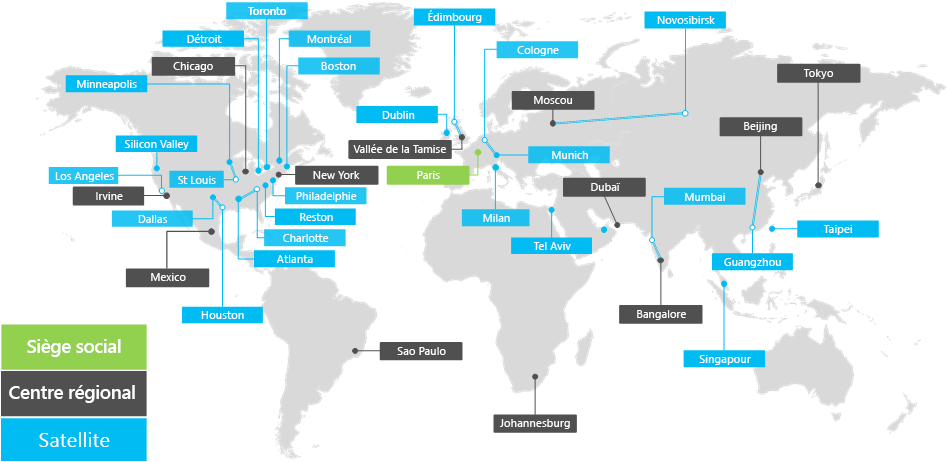

# Présentation de la société Contoso Corporation

**Résumé :** Comprendre le fonctionnement de la société Contoso Corporation et la hiérarchie de ses bureaux internationaux.

La société Contoso est une entreprise internationale dont le siège est à Paris. Il s’agit d’un conglomérat de production, de ventes et de service après-vente comptant plus de 100 000 produits.

## Contoso dans le monde

Dans la Figure 1, le siège social de l’entreprise se situe à Paris, tandis que ses centres régionaux et ses succursales sont répartis sur plusieurs continents.

**Figure 1 : bureaux internationaux de Contoso**
 
Les bureaux internationaux de Contoso sont organisés en trois niveaux.

- Siège social

  Le siège social de Contoso Corporation s’intègre à une vaste zone d’activité, dans la banlieue parisienne, comportant des dizaines de bâtiments pour l’administration, l’ingénierie et la fabrication. Tous les centres de données de Contoso et la présence Internet résident dans le siège social.

  Le siège social compte 25 000 collaborateurs.

- Centres régionaux

  Les centres régionaux sont implantés dans différentes régions du monde et possèdent 60 % des équipes des ventes et du support technique. Chaque centre régional est relié au siège social grâce à une connexion WAN haut débit. 

  Chaque centre régional compte en moyenne 2 000 collaborateurs.

- Succursales

  Les succursales représentent 80 % des ventes et du personnel d’assistance et offrent une présence physique et sur site aux clients de Contoso dans les villes importantes ou des régions plus petites. Chaque succursale est connectée à un centre régional par le biais d’un lien WAN haut débit.

  Chaque succursale compte en moyenne 250 collaborateurs.

25 % des collaborateurs de Contoso travaillent en permanence sur le terrain. Ce pourcentage est supérieur dans les centres régionaux et les succursales.
Pour Contoso, il est essentiel de fournir un meilleur support technique aux collaborateurs qui passent tout leur temps sur le terrain.

## Conceptions envisagées pour Microsoft 365 Entreprise

Les architectes informatiques de Contoso ont identifié les exigences et considérations suivantes en matière de conception lors du déploiement de Microsoft 365 Entreprise : 

- Plusieurs implantations géographiques avec des réglementations et des exigences de conformité locales
- Un centre de données intranet central dans les locaux du siège social et des serveurs d’application régionaux qui hébergent en interne la gamme d’applications professionnelles
- L’existence d’une infrastructure System Center Configuration Manager
- Un mélange d’appareils informatiques clients, comprenant Windows, Mac et Linux
- Un mélange d’appareils mobiles personnels et entreprise, notamment smartphones et tablettes iOS (iPhone et iPad) et Android
- Nombreux collaborateurs en télétravail et mobiles
- Nombreux partenaires commerciaux
- Une grande quantité de d’informations client et informations d’identification personnelle
- Une grande quantité de propriété intellectuelle de qualité sous forme de directives de conception pour les produits et de secrets commerciaux fabrication

## Étape suivante

[En savoir plus](contoso-infra-needs.md) sur l’infrastructure informatique locale de Contoso Corporation et comment leurs besoins commerciaux ont été traités avec Microsoft 365 Entreprise.

## Voir aussi

[Guide de déploiement](deploy-microsoft-365-enterprise.md)

[Guides de laboratoire de test](m365-enterprise-test-lab-guides.md)

