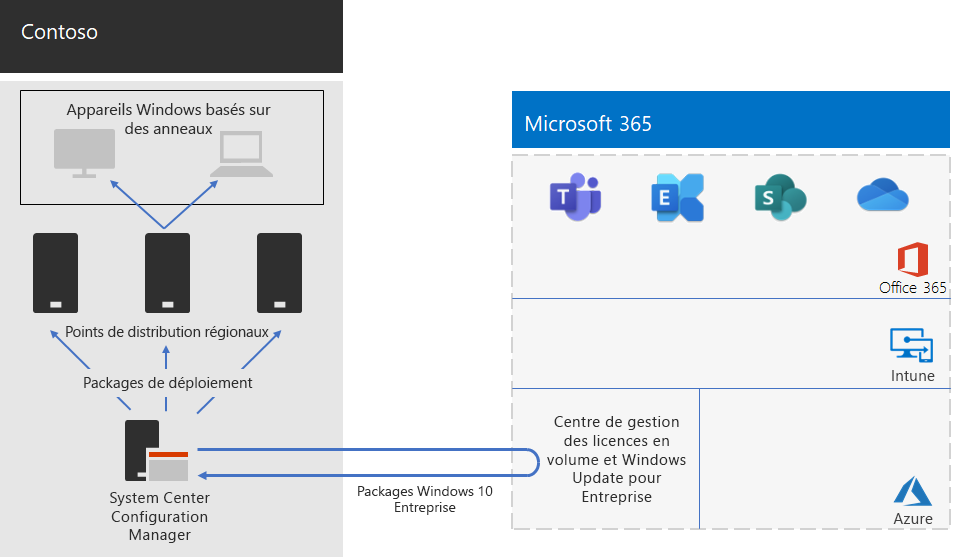

# Déploiement de Windows 10 Entreprise pour Contoso

**Résumé :** Comprendre la façon dont Contoso a utilisé System Center Configuration Manager pour déployer les mises à niveau sur place pour Windows 10 Entreprise.

Avant le déploiement large de Microsoft 365 Entreprise, Contoso disposait de périphériques et de PC compatibles avec Windows qui exécutaient un mélange de Windows 7 (10 %), Windows 8.1 (65 %) et Windows 10 (25 %). Contoso souhaitait mettre à niveau ses PC vers Windows 10 Entreprise afin de profiter de la sécurité améliorée et des frais informatiques généraux réduits grâce aux déploiements automatisés des mises à jour. 

Après évaluation de ses besoins d’infrastructure et de ses besoins métier, Contoso a identifié les exigences principales suivantes en matière de déploiement :

- Le plus possible de PC et de périphériques doivent exécuter Windows 10 Entreprise
- Déploiement des mises à niveau sur place exploitant l’infrastructure System Center Configuration Manager existante
- Contrôler les versions de Windows 10 Entreprise à déployer, et les mises à jour sont effectuées via des anneaux
- Les PC et les périphériques doivent rester à jour moyennant des coûts d’administration informatique minimes et avec un faible impact pour les utilisateurs finaux

Une version « à jour » est définie comme la version de Windows 10 Entreprise prise en charge qui répond aux besoins métier de Contoso, ce qui peut être différent d’avoir tous les PC compatibles avec Windows exécutant la dernière version de Windows 10 Entreprise.

## Outils de déploiement

Avant et pendant les mises à niveau sur place de Windows 10 Entreprise, Contoso a utilisé les solutions de Windows Analytics suivantes :

- Préparation des mises à niveau  

  Collecte les données du pilote, des applications et du système en vue d’une analyse, puis identifie les problèmes de compatibilité susceptibles d’empêcher une mise à niveau et les correctifs aux problèmes suggérés et connus par Microsoft.

- Conformité des mises à niveau  

  Collecte les données de diagnostic et du système, notamment la progression de l’installation mise à jour, les données de configuration de Windows Update pour Entreprise (WUfB), les données Antivirus Windows Defender et autres informations spécifiques de la mise à jour, puis stocke ces données dans l’utilisation et l’analyse cloud.

- Intégrité du périphérique  

  Collecte les données de diagnostic et du système Windows 10, notamment la progression de l’installation mise à jour, les données de configuration de Windows Update pour Entreprise (WUfB), les données Antivirus Windows Defender et autres informations spécifiques de la mise à jour, puis stocke ces données dans l’utilisation et l’analyse cloud.
 
Contoso dispose d’une infrastructure System Center Configuration Manager (branche actuelle) existante. Le gestionnaire de configuration s’adapte à des environnements volumineux et offre un contrôle extensif sur l’installation, les mises à jour et les paramètres. Il dispose également de fonctionnalités intégrées pour simplifier et accroître l’efficacité du déploiement et de la gestion de Windows 10 Entreprise.

## Processus de planification

Avant le déploiement, Contoso a défini les anneaux suivants :

- Trois anneaux pour la gestion intermédiaire de la validation et du déploiement 
  - Un anneau pour les versions précédentes 
  - Un anneau pour les nouvelles versions publiées
  - Un anneau pour une version précédente 
- Un anneau pour le déploiement large de Windows 10 Entreprise en fonction des données provenant des anneaux de validation

Contoso a également utilisé la solution de préparation des mises à niveau de Windows Analytics pour déterminer l’ensemble des applications installées et leur compatibilité avec Windows 10 Entreprise.

## Processus de déploiement

Pour effectuer le déploiement de mises à niveau sur place de Windows 10 Entreprise, Contoso a implémenté le processus suivant, qui inclut les recommandations concernant les meilleures pratiques de Microsoft suivantes :

1. Activation d’un cache d’homologue pour le gestionnaire de configuration
2. Création de packages Windows personnalisés basés sur des images du centre de service de gestion des licences en volume
3. Utilisation du gestionnaire de configuration pour déployer les packages Windows aux points de distribution au sein de son réseau et des versions déployées pour les trois anneaux de gestion intermédiaire de la validation et du déploiement.
4. Exécution de l’évaluation de réussite pour les PC et les périphériques dans les trois anneaux de gestion intermédiaire de la validation et du déploiement utilisant des solutions de conformité de mise à jour et d’intégrité des périphériques de Windows Analytics.
5. En fonction des informations de Windows Analytics, Contoso a déterminé la version de Windows 10 Entreprise à déployer vers l’anneau de déploiement large.
6. Exécution des séquences de tâches du déploiement du gestionnaire de configuration pour déployer le package Windows sélectionné vers l’anneau de déploiement large.
7. Surveillance des PC et des périphériques dans l’anneau de déploiement large en utilisant des solutions de conformité de mise à jour et d’intégrité des périphériques de Windows Analytics pour résoudre les problèmes.

La figure 1 décrit la mise à niveau sur place et l’architecture de déploiement de mises à jour en cours.

 
**Figure 1 : Infrastructure de déploiement de Windows 10 Entreprise de Contoso**

Cette infrastructure se compose des éléments suivants :

- System Center Configuration Manager qui :
  - obtient des images pour les packages Windows 10 Entreprise à partir du centre de gestion des licences en volume Microsoft dans The Microsoft Network ;
  - est le point d’administration central pour les packages de déploiement.
- Les points de distribution régionaux généralement situés dans les succursales de Contoso.
- Les périphériques et les PC Windows dans divers emplacements qui reçoivent et installent les packages de déploiement pour la mise à niveau sur place ou les mises à jour en continu basées sur l’appartenance à un anneau.

## Étape suivante

[En savoir plus](contoso-o365pp.md) sur la façon dont Contoso exploite son infrastructure System Center Configuration Manager pour déployer et conserver la version actuelle d’Office 365 ProPlus au sein de son organisation. 

## Voir aussi

[Windows 10 Entreprise pour Microsoft 365 Entreprise](windows10-infrastructure.md)

[Guide de déploiement](deploy-microsoft-365-enterprise.md)

[Guides de laboratoire de test](m365-enterprise-test-lab-guides.md)
