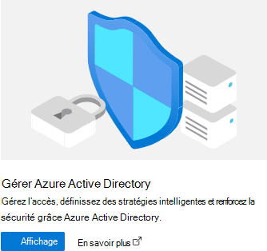

# <a name="cross-tenant-mailbox-migration-preview"></a>Migration de boîtes aux lettres entre locataires (préversion)

En règle générale, lors de fusions ou de cessions, vous devez pouvoir déplacer les boîtes aux lettres Exchange Online de vos utilisateurs dans un nouveau locataire. La migration de boîtes aux lettres interlocataires permet aux administrateurs clients d’utiliser des interfaces connues telles que Exchange Online PowerShell et MRS pour effectuer la transition des utilisateurs vers leur nouvelle organisation.

Les administrateurs peuvent utiliser l’applet de commande **New-MigrationBatch** , disponible via le rôle de gestion _Déplacer les boîtes aux lettres_ , pour effectuer des déplacements entre locataires.

Les utilisateurs qui migrent doivent être présents dans le système Exchange Online client cible en tant que MailUsers, marqués avec des attributs spécifiques pour permettre les déplacements entre locataires. Les déplacements du système échouent pour les utilisateurs qui ne sont pas correctement configurés dans le locataire cible.

Une fois les déplacements terminés, la boîte aux lettres de l’utilisateur source est convertie en mailUser et l’adresse targetAddress (indiquée sous la forme ExternalEmailAddress dans Exchange) est marquée avec l’adresse de routage vers le locataire de destination. Ce processus laisse l’ancien MailUser dans le locataire source et permet la coexistence et le routage du courrier. Lorsque les processus métier l’autorisent, le client source peut supprimer le MailUser source ou le convertir en contact de messagerie.

Les migrations de boîtes aux lettres Exchange entre clients sont prises en charge pour les client en mode hybride ou en mode cloud uniquement, ou toute combinaison des deux.

Cet article décrit le processus de déplacement de boîtes aux lettres interlocataires et fournit des conseils sur la façon de préparer les locataires sources et cibles pour les déplacements de contenu de boîte aux lettres Exchange Online.

> [!IMPORTANT]
> N’utilisez pas cette fonctionnalité pour migrer des boîtes aux lettres sur n’importe quel type de mise en attente. La migration des boîtes aux lettres sources pour les utilisateurs en attente n’est pas prise en charge.  
> Lorsqu’une boîte aux lettres est migrée entre locataires avec cette fonctionnalité, seul le contenu visible par l’utilisateur dans la boîte aux lettres (e-mail, contacts, calendrier, tâches et notes) est migré. à la cible (locataire de destination). Une fois la migration réussie, la boîte aux lettres source est supprimée. Cela signifie qu’après la migration, en aucun cas, la boîte aux lettres source n’est disponible, détectable ou accessible dans le locataire source.

> [!NOTE]
> Si vous souhaitez afficher un aperçu de notre nouvelle fonctionnalité Partage de domaine pour le courrier électronique parallèlement à vos migrations de boîtes aux lettres interlocataires, remplissez le formulaire [à l’adresse aka.ms/domainsharingpreview](https://aka.ms/domainsharingpreview). Le partage de domaine pour la messagerie permet aux utilisateurs de locataires Microsoft 365 distincts d’envoyer et de recevoir des e-mails à l’aide d’adresses du même domaine personnalisé. La fonctionnalité est destinée à résoudre les scénarios dans lesquels les utilisateurs de locataires distincts doivent représenter une marque d’entreprise commune dans leurs adresses e-mail. La préversion actuelle prend en charge le partage indéfiniment des domaines et des domaines partagés pendant la coexistence de boîtes aux lettres entre locataires.

## <a name="preparing-source-and-target-tenants"></a>Préparation des locataires source et cible

### <a name="prerequisites-for-source-and-target-tenants"></a>Conditions préalables pour les locataires source et cible

Avant de commencer, assurez-vous que vous disposez des autorisations nécessaires pour configurer l’application Déplacer la boîte aux lettres dans Azure, le point de terminaison de migration EXO et la relation d’organisation EXO.

En outre, au moins un groupe de sécurité compatible avec la messagerie dans le client source est requis. Ces groupes sont utilisés pour définir la liste des boîtes aux lettres qui peuvent être déplacées du client source (ou parfois appelé client ressource) vers le client cible. Cela permet à l’administrateur du locataire source de restreindre ou d’étendre l’ensemble spécifique de boîtes aux lettres qui doivent être déplacées, ce qui empêche la migration des utilisateurs involontaires. Les groupes imbriqués ne sont pas pris en charge.

Vous devez également communiquer avec votre entreprise partenaire de confiance (avec laquelle vous allez déplacer des boîtes aux lettres) pour obtenir son ID de locataire Microsoft 365. Cet ID de locataire est utilisé dans le champ Nom de domaine de la relation d’organisation.

Pour obtenir l’ID de locataire d’un abonnement, connectez-vous au [Centre d'administration Microsoft 365](https://go.microsoft.com/fwlink/p/?linkid=2024339) et accédez à [https://aad.portal.azure.com/\#blade/Microsoft_AAD_IAM/ActiveDirectoryMenuBlade/Properties](https://aad.portal.azure.com/#blade/Microsoft_AAD_IAM/ActiveDirectoryMenuBlade/Properties). Cliquez sur l’icône de copie de la propriété ID de locataire pour la copier dans le Presse-papiers.

### <a name="configuration-steps-to-enable-your-tenants-for-cross-tenant-mailbox-migrations"></a>Étapes de configuration pour activer vos locataires pour les migrations de boîtes aux lettres interlocataires

> [!NOTE]
> Vous devez d’abord configurer la cible (destination). Pour effectuer ces étapes, vous n’êtes pas obligé d’avoir ou de connaître les informations d’identification de l’administrateur du locataire pour le locataire source et le locataire cible. Les étapes peuvent être effectuées individuellement pour chaque client par différents administrateurs.

### <a name="prepare-the-target-destination-tenant-by-creating-the-migration-application-and-secret"></a>Préparer le client cible (destination) en créant l’application de migration et le secret

1. Connectez-vous à votre portail Azure AD (<https://portal.azure.com>) avec vos informations d’identification d’administrateur de locataire cible

   

2. Cliquez sur Afficher sous Gérer Azure Active Directory.

   

3. Dans la barre de navigation de gauche, sélectionnez inscriptions d'applications.

4. Sélectionnez Nouvelle inscription.

   

5. Dans la page Inscrire une application, sous Types de comptes pris en charge, sélectionnez Comptes dans n’importe quel annuaire organisationnel (n’importe quel annuaire Azure AD - Multilocataire). Ensuite, sous URI de redirection (facultatif), sélectionnez Web et entrez <https://office.com>. Enfin, sélectionnez Inscrire.

   

6. En haut à droite de la page, vous verrez une fenêtre contextuelle de notification indiquant que l’application a été créée.

7. Retour sur Accueil, Azure Active Directory, puis cliquez sur inscriptions d'applications.

8. Sous Applications détenues, recherchez l’application que vous avez créée et cliquez dessus.

9. Sous ^Essentials, vous devez copier l’ID d’application (client) car vous en aurez besoin ultérieurement pour créer une URL pour le locataire cible.

10. Maintenant, dans la barre de navigation de gauche, cliquez sur Autorisations d’API pour afficher les autorisations attribuées à votre application.

11. Par défaut, Utilisateur. Les autorisations de lecture sont attribuées à l’application que vous avez créée, mais nous n’en avons pas besoin pour les migrations de boîtes aux lettres. Vous pouvez supprimer cette autorisation.

    

12. Maintenant, nous devons ajouter une autorisation pour la migration de boîtes aux lettres, sélectionnez Ajouter une autorisation

13. Dans les fenêtres Demander des autorisations d’API, sélectionnez API utilisées par mon organisation, recherchez Office 365 Exchange Online, puis sélectionnez-la.

    

14. Ensuite, sélectionnez Autorisations d’application.

15. Ensuite, sous Sélectionner les autorisations, développez Boîte aux lettres, cochez Mailbox.Migration et Ajouter des autorisations en bas de l’écran.

    

16. Sélectionnez maintenant Certificats & secrets dans la barre de navigation de gauche de votre application.

17. Sous Secrets client, sélectionnez Nouvelle clé secrète client.

    

18. Dans la fenêtre Ajouter une clé secrète client, entrez une description et configurez les paramètres d’expiration souhaités.

    > [!NOTE]
    > Il s’agit du mot de passe qui sera utilisé lors de la création de votre point de terminaison de migration. Il est extrêmement important que vous copiez ce mot de passe dans le Presse-papiers et ou que vous copiez ce mot de passe dans l’emplacement sécurisé/secret du mot de passe. C’est la seule fois que vous serez en mesure de voir ce mot de passe! Si vous le perdez ou si vous devez le réinitialiser, vous pouvez vous reconnecter à notre Portail Azure, accéder à inscriptions d'applications, rechercher votre application de migration, sélectionner Secrets & certificats et créer un secret pour votre application.

19. Maintenant que vous avez créé l’application de migration et le secret, vous devez donner votre consentement à l’application. Pour donner votre consentement à l’application, revenez à la page d’accueil Azure Active Directory, cliquez sur Applications d’entreprise dans le volet de navigation de gauche, recherchez l’application de migration que vous avez créée, sélectionnez-la, puis sélectionnez Autorisations dans le volet de navigation gauche.

20. Cliquez sur le bouton Accorder le consentement administrateur pour [votre locataire].

21. Une nouvelle fenêtre de navigateur s’ouvre et sélectionne Accepter.

22. Vous pouvez revenir à la fenêtre de votre portail et sélectionner Actualiser pour confirmer votre acceptation.

23. Formulez l’URL à envoyer à votre partenaire approuvé (administrateur du locataire source) pour qu’il puisse également accepter la demande pour activer la migration de boîte aux lettres. Voici un exemple de l’URL à leur fournir, vous aurez besoin de l’ID d’application de l’application que vous avez créée :

    ```powershell
    https://login.microsoftonline.com/sourcetenant.onmicrosoft.com/adminconsent?client_id=[application_id_of_the_app_you_just_created]&redirect_uri=https://office.com
    ```

    > [!NOTE]
    > Vous aurez besoin de l’ID d’application de l’application de migration de boîte aux lettres que vous venez de créer.
    >
    > Vous devez remplacer sourcetenant.onmicrosoft.com dans l’exemple ci-dessus par le nom onmicrosoft.com correct de vos locataires sources.
    >
    > Vous devez également remplacer [application_id_of_the_app_you_just_created] par l’ID d’application de l’application de migration de boîte aux lettres que vous venez de créer.

### <a name="prepare-the-target-tenant-by-creating-the-exchange-online-migration-endpoint-and-organization-relationship"></a>Préparez le client cible en créant le point de terminaison de la migration vers Exchange Online et la relation avec l'organisation.

1. [Connectez-vous à Exchange Online PowerShell](/powershell/exchange/connect-to-exchange-online-powershell) dans le locataire Exchange Online cible.

2. Créer un point de terminaison de migration pour les déplacements de boîtes aux lettres interlocataires

   > [!NOTE]
   > Vous aurez besoin de l’ID d’application de l’application de migration de boîte aux lettres que vous venez de créer et du mot de passe (secret) que vous avez configuré pendant ce processus. En outre, selon l’instance Cloud Microsoft 365, votre point de terminaison peut être différent. Reportez-vous à la page [points de terminaison Microsoft 365](/microsoft-365/enterprise/microsoft-365-endpoints) et sélectionnez l’instance appropriée pour votre locataire, puis passez en revue l’adresse Exchange Online Optimiser l’adresse requise et remplacez le cas échéant.

   ```powershell

   # Enable customization if tenant is dehydrated
   $dehydrated=Get-OrganizationConfig | select isdehydrated
   if ($dehydrated.isdehydrated -eq $true) {Enable-OrganizationCustomization}
   $AppId = "[guid copied from the migrations app]"
   $Credential = New-Object -TypeName System.Management.Automation.PSCredential -ArgumentList $AppId, (ConvertTo-SecureString -String "[this is your secret password you saved in the previous steps]" -AsPlainText -Force)
   New-MigrationEndpoint -RemoteServer outlook.office.com -RemoteTenant "sourcetenant.onmicrosoft.com" -Credentials $Credential -ExchangeRemoteMove:$true -Name "[the name of your migration endpoint]" -ApplicationId $AppId
   ```

3. Créez ou modifiez votre objet de relation d’organisation existant sur votre locataire source.

   ```powershell
   $sourceTenantId="[tenant id of your trusted partner, where the source mailboxes are]"
   $orgrels=Get-OrganizationRelationship
   $existingOrgRel = $orgrels | ?{$_.DomainNames -like $sourceTenantId}
   If ($null -ne $existingOrgRel)
   {
       Set-OrganizationRelationship $existingOrgRel.Name -Enabled:$true -MailboxMoveEnabled:$true -MailboxMoveCapability Inbound
   }
   If ($null -eq $existingOrgRel)
   {
       New-OrganizationRelationship "[name of the new organization relationship]" -Enabled:$true -MailboxMoveEnabled:$true -MailboxMoveCapability Inbound -DomainNames $sourceTenantId
   }
   ```

### <a name="prepare-the-source-current-mailbox-location-tenant-by-accepting-the-migration-application-and-configuring-the-organization-relationship"></a>Préparer le locataire source (emplacement actuel de la boîte aux lettres) en acceptant l’application de migration et en configurant la relation d’organisation

1. À partir d’un navigateur, accédez au lien URL fourni par votre partenaire approuvé pour donner son consentement à l’application de migration de boîte aux lettres. L’URL se présente comme suit :

   ```powershell
   https://login.microsoftonline.com/sourcetenant.onmicrosoft.com/adminconsent?client_id=[application_id_of_the_app_you_just_created]&redirect_uri=https://office.com
   ```

   > [!NOTE]
   > Vous aurez besoin de l’ID d’application de l’application de migration de boîte aux lettres que vous venez de créer.
   > Vous devez remplacer sourcetenant.onmicrosoft.com dans l’exemple ci-dessus par le nom onmicrosoft.com correct de vos locataires sources.
   > Vous devez également remplacer [application_id_of_the_app_you_just_created] par l’ID d’application de l’application de migration de boîte aux lettres que vous venez de créer.

2. Acceptez l’application lorsque la fenêtre contextuelle s’affiche. Vous pouvez également vous connecter à votre portail Azure Active Directory et trouver l’application sous Applications d’entreprise.

3. [Connectez-vous à Exchange Online PowerShell](/powershell/exchange/connect-to-exchange-online-powershell) sur le locataire source Exchange Online.
4. Créez une relation d’organisation ou modifiez votre objet de relation d’organisation existant sur votre locataire cible (de destination) dans Exchange Online PowerShell :

   ```powershell
   $targetTenantId="[tenant id of your trusted partner, where the mailboxes are being moved to]"
   $appId="[application id of the mailbox migration app you consented to]"
   $scope="[name of the mail enabled security group that contains the list of users who are allowed to migrate]"
   $orgrels=Get-OrganizationRelationship
   $existingOrgRel = $orgrels | ?{$_.DomainNames -like $targetTenantId}
   If ($null -ne $existingOrgRel)
   {
       Set-OrganizationRelationship $existingOrgRel.Name -Enabled:$true -MailboxMoveEnabled:$true -MailboxMoveCapability RemoteOutbound -OAuthApplicationId $appId -MailboxMovePublishedScopes $scope
   }
   If ($null -eq $existingOrgRel)
   {
       New-OrganizationRelationship "[name of your organization relationship]" -Enabled:$true -MailboxMoveEnabled:$true -MailboxMoveCapability RemoteOutbound -DomainNames $targetTenantId -OAuthApplicationId $appId -MailboxMovePublishedScopes $scope
   }
   ```

> [!NOTE]
> L’ID client que vous entrez en tant que $sourceTenantId et $targetTenantId est le GUID et non le nom de domaine du client. Pour obtenir un exemple d’ID client et des informations sur la recherche de votre ID client, consultez [Rechercher votre ID client Microsoft 365](/onedrive/find-your-office-365-tenant-id).

### <a name="how-do-i-know-this-worked"></a>Comment savoir si cela a fonctionné ?

Vous pouvez vérifier la configuration de la migration de boîtes aux lettres entre clients en exécutant l’applet de commande [Test-MigrationServerAvailability](/powershell/module/exchange/Test-MigrationServerAvailability) sur le point de terminaison de migration entre clients que vous avez créé sur votre client cible.

```powershell
Test-MigrationServerAvailability -EndPoint "Migration endpoint for cross-tenant mailbox moves" -TestMailbox "Primary SMTP of MailUser object in target tenant"
```

### <a name="move-mailboxes-back-to-the-original-source"></a>Déplacer les boîtes aux lettres vers la source d’origine

Si une boîte aux lettres est nécessaire pour revenir au locataire source d’origine, le même ensemble d’étapes et de scripts doit être exécuté dans les nouveaux locataires source et cible. L’objet Relation d’organisation existant est mis à jour ou ajouté, et non recréé

## <a name="prepare-target-user-objects-for-migration"></a>Préparer les objets utilisateur cibles pour la migration

Les utilisateurs qui migrent doivent être présents dans le locataire cible et Exchange Online système (en tant que MailUsers) marqués avec des attributs spécifiques pour permettre les déplacements entre locataires. Les déplacements du système échouent pour les utilisateurs qui ne sont pas correctement configurés dans le locataire cible. La section suivante détaille la configuration requise de l’objet MailUser pour le locataire cible.

### <a name="prerequisites-for-target-user-objects"></a>Prérequis pour les objets utilisateur cibles

Vérifiez que les objets et attributs suivants sont définis dans l’organisation cible.

> [!TIP]
> Microsoft développe une fonctionnalité pour fournir une méthode automatisée sécurisée pour définir la plupart des attributs de la section suivante. Cette fonctionnalité, nommée Cross-Tenant Identity Mapping, est actuellement à la recherche de clients désireux de participer à une petite préversion privée. Pour plus d’informations sur cette fonctionnalité en préversion et sur la façon dont elle peut simplifier vos processus de migration interlocataire, consultez l’article **[Mappage d’identités entre](cross-tenant-identity-mapping.md)** locataires.

1. Pour toute boîte aux lettres déplacée à partir d’une organisation source, vous devez provisionner un objet MailUser dans l’organisation cible :

   - Target MailUser doit avoir les attributs suivants de la boîte aux lettres source ou attribués avec le nouvel objet User :

     - ExchangeGUID (flux direct de la source vers la cible) : le GUID de boîte aux lettres doit correspondre. Le processus de déplacement ne se poursuit pas s’il n’est pas présent sur l’objet cible.
     - ArchiveGUID (flux direct de la source vers la cible) : le GUID d’archive doit correspondre. Le processus de déplacement ne se poursuit pas s’il n’est pas présent sur l’objet cible. (Cela n’est nécessaire que si la boîte aux lettres source est activée pour l’archivage).
     - LegacyExchangeDN (flow as proxyAddress, « x500:\<LegacyExchangeDN> ») : le legacyExchangeDN doit être présent sur la cible MailUser sous la forme x500 : proxyAddress. En outre, vous devez également copier toutes les adresses x500 de la boîte aux lettres source vers l’utilisateur de messagerie cible. Les processus de déplacement ne se poursuivent pas si ceux-ci ne sont pas présents sur l’objet cible. En outre, cette étape est importante pour activer la capacité de réponse pour les e-mails envoyés avant la migration. L’adresse de l’expéditeur/destinataire dans chaque élément de courrier électronique et le cache de saisie semi-automatique dans Microsoft Outlook et dans Microsoft Outlook Web App (OWA) utilisent la valeur de l’attribut LegacyExchangeDN. Si un utilisateur ne peut pas être localisé à l’aide de la valeur LegacyExchangeDN, la remise des messages électroniques peut échouer avec une notification d’échec de remise 5.1.1.
     - UserPrincipalName : l’UPN s’aligne sur la NOUVELLE identité ou la société cible de l’utilisateur (par exemple, user@northwindtraders.onmicrosoft.com).
     - Adresse SMTP principale : l’adresse SMTP principale s’aligne sur la NOUVELLE entreprise de l’utilisateur (par exemple, user@northwind.com).
     - TargetAddress/ExternalEmailAddress : MailUser fait référence à la boîte aux lettres actuelle de l’utilisateur hébergée dans le locataire source (par exemple, user@contoso.onmicrosoft.com). Lors de l’attribution de cette valeur, vérifiez que vous avez ou que vous affectez également PrimarySMTPAddress, sinon cette valeur définit PrimarySMTPAddress, ce qui entraînera des échecs de déplacement.
     - Vous ne pouvez pas ajouter d’adresses proxy smtp héritées de la boîte aux lettres source à MailUser cible. Par exemple, vous ne pouvez pas conserver contoso.com sur le MEU dans fabrikam.onmicrosoft.com objets de locataire). Les domaines sont associés à un seul client Azure AD ou Exchange Online.

     Exemple **d’objet** MailUser cible :

     | Attribut            | Valeur                                                                                                                   |
     | -------------------- | ----------------------------------------------------------------------------------------------------------------------- |
     | Alias                | LaraN                                                                                                                   |
     | RecipientType        | MailUser                                                                                                                |
     | RecipientTypeDetails | MailUser                                                                                                                |
     | UserPrincipalName    | LaraN@northwintraders.onmicrosoft.com                                                                                   |
     | PrimarySmtpAddress   | Lara.Newton@northwind.com                                                                                               |
     | ExternalEmailAddress | SMTP:LaraN@contoso.onmicrosoft.com                                                                                      |
     | ExchangeGuid         | 1ec059c7-8396-4d0b-af4e-d6bd4c12a8d8                                                                                    |
     | LegacyExchangeDN     | /o=Première organisation/ou=Groupe d’administration Exchange                                                                  |
     |                      | (FYDIBOHF23SPDLT)/cn=Destinataires/cn=74e5385fce4b46d19006876949855035Lara                                                 |
     | EmailAddresses       | x500:/o=First Organization/ou=Exchange Administrative Group (FYDIBOHF23SPDLT)/cn=Recipients/cn=d11ec1a2cacd4f81858c8190 |
     |                      | 7273f1f9-Lara                                                                                                           |
     |                      | smtp:LaraN@northwindtraders.onmicrosoft.com                                                                             |
     |                      | SMTP:Lara.Newton@northwind.com                                                                                          |

     Exemple d’objet Mailbox **source** :

     | Attribut            | Valeur                                                                   |
     | -------------------- | ----------------------------------------------------------------------- |
     | Alias                | LaraN                                                                   |
     | RecipientType        | UserMailbox                                                             |
     | RecipientTypeDetails | UserMailbox                                                             |
     | UserPrincipalName    | LaraN@contoso.onmicrosoft.com                                           |
     | PrimarySmtpAddress   | Lara.Newton@contoso.com                                                 |
     | ExchangeGuid         | 1ec059c7-8396-4d0b-af4e-d6bd4c12a8d8                                    |
     | LegacyExchangeDN     | /o=Première organisation/ou=Groupe d’administration Exchange                  |
     |                      | (FYDIBOHF23SPDLT)/cn=Recipients/cn=d11ec1a2cacd4f81858c81907273f1f9Lara |
     | EmailAddresses       | smtp:LaraN@contoso.onmicrosoft.com                                      |
     |                      | SMTP:Lara.Newton@contoso.com                                            |

   - Des attributs supplémentaires peuvent déjà être inclus dans l’écriture différée hybride Exchange. Si ce n’est pas le cas, ils doivent être inclus.
   - msExchBlockedSendersHash : réécrit en ligne les données des expéditeurs sécurisés et bloqués des clients dans Active Directory local.
   - msExchSafeRecipientsHash : réécrit en ligne les données des expéditeurs sécurisés et bloqués des clients dans Active Directory local.
   - msExchSafeSendersHash : réécrit en ligne les données d’expéditeurs sécurisés et bloqués des clients dans Active Directory local.

2. Si la taille des éléments récupérables de la boîte aux lettres source est supérieure à la valeur par défaut de notre base de données (30 Go), les déplacements ne se poursuivent pas, car le quota cible est inférieur à la taille de la boîte aux lettres source. Vous pouvez mettre à jour l’objet MailUser cible pour faire passer les indicateurs de boîte aux lettres ELC de l’environnement source à la cible, ce qui déclenche le développement du quota de MailUser à 100 Go par le système cible, ce qui permet le déplacement vers la cible. Dans un environnement hybride, vous devez définir le msExchELCMailboxFlags approprié sur l’utilisateur ADUser cible.

3. Les locataires cibles non hybrides peuvent modifier le quota sur le dossier Éléments récupérables pour mailUsers avant la migration en exécutant la commande suivante pour activer la conservation pour litige sur l’objet MailUser cible et en augmentant le quota à 100 Go :

   ```powershell
   Set-MailUser -Identity <MailUserIdentity> -EnableLitigationHoldForMigration
   ```

   Notez que cela ne fonctionnera pas pour les locataires en mode hybride.

4. Les utilisateurs de l’organisation cible doivent disposer d’une licence avec les abonnements Exchange Online appropriés applicables à l’organisation. Vous pouvez appliquer une licence avant le déplacement d’une boîte aux lettres, mais uniquement une fois que l’utilisateur MailUser cible est correctement configuré avec ExchangeGUID et les adresses proxy. L’application d’une licence avant l’application d’ExchangeGUID entraîne l’approvisionnement d’une nouvelle boîte aux lettres dans l’organisation cible.

   > [!NOTE]
   > Lorsque vous appliquez une licence sur une boîte aux lettres ou un objet MailUser, toutes les adresses proxy de type SMTP sont nettoyées pour garantir que seuls les domaines vérifiés sont inclus dans le tableau Exchange EmailAddresses.

5. Vous devez vous assurer que l’objet MailUser cible n’a pas d’ExchangeGuid précédent qui ne correspond pas à l’ExchangeGuid source. Cela peut se produire si le MEU cible était précédemment concédé sous licence pour Exchange Online et approvisionnait une boîte aux lettres. Si le MailUser cible était précédemment sous licence pour ou avait un ExchangeGuid qui ne correspond pas à l’ExchangeGuid source, vous devez effectuer un nettoyage de l’meU cloud. Pour ces MEU cloud, vous pouvez exécuter `Set-User <identity> -PermanentlyClearPreviousMailboxInfo`.

   > [!CAUTION]
   > Ce processus est irréversible. Si l’objet a une boîte aux lettres supprimée de manière réversible, il ne peut pas être restauré après ce point. Toutefois, une fois effacé, vous pouvez synchroniser l’ExchangeGuid approprié avec l’objet cible et MRS connectera la boîte aux lettres source à la boîte aux lettres cible nouvellement créée. (Consultez le blog EHLO sur le nouveau paramètre.)

   Recherchez les objets qui étaient auparavant des boîtes aux lettres à l’aide de cette commande.

   ```powershell
   Get-User <identity> | select Name, *recipient* | Format-Table -AutoSize
   ```

   Voici un exemple.

   ```powershell
   Get-User John@northwindtraders.com |select name, *recipient*| Format-Table -AutoSize

   Name       PreviousRecipientTypeDetails     RecipientType RecipientTypeDetails
   ----       ---------------------------- ------------- --------------------
   John       UserMailbox                  MailUser      MailUser
   ```

   Effacez la boîte aux lettres supprimée de manière réversible à l’aide de cette commande.

   ```powershell
   Set-User <identity> -PermanentlyClearPreviousMailboxInfo
   ```

   Voici un exemple.

   ```powershell
   Set-User John@northwindtraders.com -PermanentlyClearPreviousMailboxInfo -Confirm

   Are you sure you want to perform this action?
   Delete all existing information about user "John@northwindtraders.com"?. This operation will clear existing values from Previous home MDB and Previous Mailbox GUID of the user. After deletion, reconnecting to the previous mailbox that existed in the cloud will not be possible and any content it had will be unrecoverable PERMANENTLY.
   Do you want to continue?
   [Y] Yes  [A] Yes to All  [N] No  [L] No to All  [?] Help (default is "Y"): Y
   ```

### <a name="perform-mailbox-migrations"></a>Effectuer des migrations de boîtes aux lettres

Les migrations de boîtes aux lettres Exchange interlocataires sont lancées à partir du locataire cible en tant que lots de migration. Cela ressemble à la façon dont les lots de migration d’intégration fonctionnent lors de la migration d’Exchange local vers Microsoft 365.

### <a name="create-migration-batches"></a>Créer des lots de migration

Voici un exemple d’applet de commande de lot de migration pour lancer des déplacements.

```powershell
New-MigrationBatch -Name T2Tbatch -SourceEndpoint target_source_7977 -CSVData ([System.IO.File]::ReadAllBytes('users.csv')) -Autostart -TargetDeliveryDomain target.onmicrosoft.com

Identity                   Status  Type               TotalCount
--------                   ------  ----               ----------
T2Tbatch                   Syncing ExchangeRemoteMove 1
```

> [!NOTE]
> L’adresse e-mail dans le fichier CSV doit être celle spécifiée dans le locataire cible (par exemple, userA@targettenant.onmicrosoft.com), et non celle du locataire source.
>
> [Pour plus d’informations sur l’applet de commande, cliquez ici](/powershell/module/exchange/new-migrationbatch)
>
> [Pour obtenir des exemples d’informations de fichier CSV, cliquez ici](/exchange/csv-files-for-mailbox-migration-exchange-2013-help)

Voici un exemple minimal de fichier CSV :

```csv
EmailAddress
userA@targettenant.onmicrosoft.com
userB@targettenant.onmicrosoft.com
userC@targettenant.onmicrosoft.com
```

La soumission par lots de migration est également prise en charge à partir du nouveau [centre d’administration Exchange](https://go.microsoft.com/fwlink/p/?linkid=2059104) lors de la sélection de l’option inter-locataires.

### <a name="update-on-premises-mailusers"></a>Mettre à jour mailUsers local

Une fois que la boîte aux lettres passe de la source à la cible, vous devez vous assurer que les utilisateurs de messagerie locaux, à la fois dans la source et la cible, sont mis à jour avec la nouvelle adresse targetAddress. Dans les exemples, le targetDeliveryDomain utilisé dans le déplacement est **contoso.onmicrosoft.com**. Mettez à jour les utilisateurs de messagerie avec cette adresse cible.

## <a name="frequently-asked-questions"></a>Questions fréquemment posées

### <a name="do-we-need-to-update-remotemailboxes-in-source-on-premises-after-the-move"></a>Devons-nous mettre à jour les RemoteMailboxes dans la source locale après le déplacement ?

Oui, vous devez mettre à jour targetAddress (RemoteRoutingAddress/ExternalEmailAddress) des utilisateurs locaux sources lorsque la boîte aux lettres du locataire source se déplace vers le locataire cible. Bien que le routage du courrier puisse suivre les références entre plusieurs utilisateurs de messagerie avec des adresses cibles différentes, les recherches de disponibilité pour les utilisateurs de messagerie DOIVENT cibler l’emplacement de l’utilisateur de boîte aux lettres. Les recherches de disponibilité ne chassent pas plusieurs redirections.

### <a name="do-teams-meetings-migrate-cross-tenant"></a>Les réunions Teams migrent-elles entre locataires ?

Les réunions seront déplacées, mais l’URL de réunion Teams ne se met pas à jour lorsque les éléments migrent entre locataires. Étant donné que l’URL n’est pas valide dans le locataire cible, vous devez supprimer et recréer les réunions Teams.

### <a name="does-the-teams-chat-folder-content-migrate-cross-tenant"></a>Le contenu du dossier de conversation Teams migre-t-il entre locataires ?

Non, le contenu du dossier de conversation Teams ne migre pas entre locataires. Lorsqu’une boîte aux lettres est migrée entre locataires avec cette fonctionnalité, seul le contenu visible par l’utilisateur dans la boîte aux lettres (e-mail, contacts, calendrier, tâches et notes) est migré.

### <a name="how-can-i-see-just-moves-that-are-cross-tenant-moves-not-my-onboarding-and-off-boarding-moves"></a>Comment puis-je voir uniquement les déplacements qui sont des déplacements interlocataires, et non mes déplacements d’intégration et de désinsaisonnement ?

Utilisez le paramètre _Flags_ . Voici un exemple.

```powershell
Get-MoveRequest -Flags "CrossTenant"
```

### <a name="can-you-provide-example-scripts-for-copying-attributes-used-in-testing"></a>Pouvez-vous fournir des exemples de scripts pour copier les attributs utilisés dans le cadre du test ?

> [!NOTE]
> EXEMPLE : EN L’ÉTAT, AUCUNE GARANTIE Ce script suppose une connexion à la boîte aux lettres source (pour obtenir les valeurs sources) et à la cible Active Directory local Domain Services (pour tamponner l’objet ADUser).

```powershell
# This will export users from the source tenant with the CustomAttribute1 = "Cross-Tenant-Project"
# These are the 'target' users to be moved to the Northwind org tenant
$outFileUsers = "$home\desktop\UsersToMigrate.txt"
$outFileUsersXML = "$home\desktop\UsersToMigrate.xml"
Get-Mailbox -Filter "CustomAttribute1 -like 'Cross-Tenant-Project'" -ResultSize Unlimited | Select-Object -ExpandProperty  Alias | Out-File $outFileUsers
$mailboxes = Get-Content $outFileUsers
$mailboxes | ForEach-Object {Get-Mailbox $_} | Select-Object PrimarySMTPAddress,Alias,SamAccountName,FirstName,LastName,DisplayName,Name,ExchangeGuid,ArchiveGuid,LegacyExchangeDn,EmailAddresses | Export-Clixml $outFileUsersXML
```

```powershell
# Copy the file $outfile to the desktop of the target on-premises then run the below to create MEU in Target
$mailboxes = Import-Clixml $home\desktop\UsersToMigrate.xml
add-type -AssemblyName System.Web
foreach ($m in $mailboxes) {
    $organization = "@contoso.onmicrosoft.com"
    $mosi = $m.Alias+$organization
    $Password = [System.Web.Security.Membership]::GeneratePassword(16,4) | ConvertTo-SecureString -AsPlainText -Force
    $x500 = "x500:" +$m.LegacyExchangeDn
    $tmpUser = New-MailUser -MicrosoftOnlineServicesID $mosi -PrimarySmtpAddress $mosi -ExternalEmailAddress $m.PrimarySmtpAddress -FirstName $m.FirstName -LastName $m.LastName -Name $m.Name -DisplayName $m.DisplayName -Alias $m.Alias -Password $Password
    $tmpUser | Set-MailUser -EmailAddresses @{add=$x500} -ExchangeGuid $m.ExchangeGuid -ArchiveGuid $m.ArchiveGuid -CustomAttribute1 "Cross-Tenant-Project"
    $tmpx500 = $m.EmailAddresses | ?{$_ -match "x500"}
    $tmpx500 | %{Set-MailUser $m.Alias -EmailAddresses @{add="$_"}}
    }
```

```powershell
# Now sync the changes from On-Premises to Azure and Exchange Online in the Target tenant
# This action should create the target mail enabled users (MEUs) in the Target tenant
Start-ADSyncSyncCycle
```

### <a name="how-do-we-access-outlook-on-day-1-after-the-user-mailbox-is-moved"></a>Comment accéder à Outlook le jour 1 après le déplacement de la boîte aux lettres de l’utilisateur ?

Étant donné qu’un seul locataire peut posséder un domaine, l’ancienne adresse SMTPAddress principale n’est pas associée à l’utilisateur dans le locataire cible une fois le déplacement de la boîte aux lettres terminé . uniquement les domaines associés au nouveau locataire. Outlook utilise le nouvel UPN de l’utilisateur pour s’authentifier auprès du service et le profil Outlook s’attend à trouver l’adresse SMTP principale héritée correspondant à la boîte aux lettres dans le système cible. Étant donné que l’adresse héritée ne se trouve pas dans le système cible, le profil Outlook ne se connecte pas pour trouver la boîte aux lettres nouvellement déplacée.

Pour ce déploiement initial, les utilisateurs doivent reconstruire leur profil avec leur nouvel UPN, leur nouvelle adresse SMTP principale et le contenu OST resynchroniser.

> [!NOTE]
> Planifiez en conséquence au fur et à mesure que vous effectuez le traitement par lot de vos utilisateurs. Vous devez tenir compte de l’utilisation et de la capacité du réseau lorsque des profils client Outlook sont créés et que les fichiers OST et OAB suivants sont téléchargés sur les clients.

### <a name="what-exchange-rbac-roles-do-i-need-to-be-member-of-to-set-up-or-complete-a-cross-tenant-move"></a>De quels rôles RBAC Exchange dois-je être membre pour configurer ou effectuer un déplacement interlocataire ?

Il existe une matrice de rôles basée sur l’hypothèse de tâches déléguées lors de l’exécution d’un déplacement de boîte aux lettres. Actuellement, deux rôles sont requis :

- Le premier rôle est pour une tâche de configuration unique qui établit l’autorisation de déplacer du contenu vers ou hors de la limite de votre locataire/organisation. Étant donné que le déplacement des données hors du contrôle de votre organisation est une préoccupation essentielle pour toutes les entreprises, nous avons opté pour le rôle le plus élevé attribué d’administrateur d’organisation (OrgAdmin). Ce rôle doit modifier ou configurer une nouvelle OrganizationRelationship qui définit -MailboxMoveCapability avec l’organisation distante. Seul l’OrgAdmin peut modifier le paramètre MailboxMoveCapability, tandis que les autres attributs de l’OrganizationRelationship peuvent être gérés par l’administrateur de partage fédéré.

- Le rôle d’exécution des commandes de déplacement réelles peut être délégué à une fonction de niveau inférieur. Le rôle déplacer des boîtes aux lettres est attribué à la capacité de déplacer des boîtes aux lettres dans ou hors de l’organisation.

### <a name="how-do-we-target-which-smtp-address-is-selected-for-targetaddress-targetdeliverydomain-on-the-converted-mailbox-to-mailuser-conversion"></a>Comment cibler l’adresse SMTP sélectionnée pour targetAddress (TargetDeliveryDomain) sur la boîte aux lettres convertie (en conversion MailUser) ?

La boîte aux lettres Exchange se déplace à l’aide de MRS pour créer l’adresse targetAddress sur la boîte aux lettres source d’origine lors de la conversion en mailUser en faisant correspondre une adresse e-mail (proxyAddress) sur l’objet cible. Le processus prend la valeur -TargetDeliveryDomain passée dans la commande de déplacement, puis recherche un proxy correspondant pour ce domaine côté cible. Lorsque nous trouvons une correspondance, la proxyAddress correspondante est utilisée pour définir externalEmailAddress (targetAddress) sur l’objet de boîte aux lettres convertie (maintenant MailUser).

### <a name="how-mail-flow-works-after-migration"></a>Comment fonctionne le flux de messagerie après la migration ?

Le flux de messagerie interlocataire après la migration fonctionne de la même façon que le flux de messagerie hybride Exchange. Chaque boîte aux lettres migrée a besoin de la source MailUser avec l’adresse cible appropriée pour transférer les messages entrants du locataire source vers les boîtes aux lettres dans le locataire cible. Les règles de transport, les fonctionnalités de sécurité et de conformité s’exécutent comme configuré dans chaque locataire par lequel le courrier transite. Par conséquent, pour les messages entrants, les fonctionnalités telles que l’anti-courrier indésirable, la mise en quarantaine, ainsi que les règles de transport et de journalisation s’exécutent d’abord dans le locataire source, puis dans le locataire cible.

### <a name="how-do-mailbox-permissions-transition"></a>Comment les autorisations de boîte aux lettres sont-ils transférées ?

Les autorisations de boîte aux lettres incluent Envoyer au nom de et Accès aux boîtes aux lettres :

- Send On Behalf Of (AD:publicDelegates) stocke le DN des destinataires ayant accès à la boîte aux lettres d’un utilisateur en tant que délégué. Cette valeur est stockée dans Active Directory et ne se déplace pas actuellement dans le cadre de la transition de boîte aux lettres. Si publicDelegates est défini sur la boîte aux lettres source, vous devrez les restaurer sur la boîte aux lettres cible une fois la conversion meU en boîte aux lettres terminée dans l’environnement cible en exécutant `Set-Mailbox <principle> -GrantSendOnBehalfTo <delegate>`.

- Les autorisations de boîte aux lettres stockées dans la boîte aux lettres sont déplacées avec la boîte aux lettres lorsque le principal et le délégué sont déplacés vers le système cible. Par exemple, l’utilisateur TestUser *7 bénéficie de FullAccess à la boîte aux lettres TestUser_8 dans le locataire SourceCompany.onmicrosoft.com. Une fois le déplacement de la boîte aux lettres terminé vers TargetCompany.onmicrosoft.com, les mêmes autorisations sont configurées dans le répertoire cible. Les exemples d’utilisation \_de Get-MailboxPermission* pour TestUser_7 dans les locataires source et cible sont présentés ci-dessous. Les applets de commande Exchange sont préfixées par source et cible en conséquence.

Voici un exemple de sortie de l’autorisation de boîte aux lettres avant un déplacement.

```powershell
Get-SourceMailboxPermission TestUser_7 | Format-Table -AutoSize User, AccessRights, IsInherited, Deny

User                                             AccessRights                         IsInherited Deny
----                                             ------------                         ----------- ----
NT AUTHORITY\SELF                                {FullAccess, ReadPermission}         False       False
TestUser_8@SourceCompany.onmicrosoft.com         {FullAccess}                         False       False
```

Voici un exemple de sortie de l’autorisation de boîte aux lettres après le déplacement.

```powershell
Get-TargetMailboxPermission TestUser_7 | Format-Table -AutoSize User, AccessRights, IsInherited, Deny

User                                             AccessRights                         IsInherited Deny
----                                             ------------                         ----------- ----
NT AUTHORITY\SELF                                {FullAccess, ReadPermission}         False       False
TestUser_8@TargetCompany.onmicrosoft.com         {FullAccess}                         False       False
```

> [!NOTE]
> Les autorisations de calendrier et de boîte aux lettres interlocataires ne sont PAS prises en charge. Vous devez organiser les principaux et les délégués en lots de déplacement consolidés afin que ces boîtes aux lettres connectées soient transférées en même temps à partir du locataire source.

### <a name="what-x500-proxy-should-be-added-to-the-target-mailuser-proxy-addresses-to-enable-migration"></a>Quel proxy X500 doit être ajouté aux adresses proxy MailUser cibles pour permettre la migration ?

La migration de boîtes aux lettres inter-locataires nécessite que la valeur LegacyExchangeDN de l’objet de boîte aux lettres source soit estampillée en tant qu’adresse e-mail x500 sur l’objet MailUser cible.

Exemple :

```powershell
LegacyExchangeDN value on source mailbox is:
/o=First Organization/ou=Exchange Administrative Group(FYDIBOHF23SPDLT)/cn=Recipients/cn=d11ec1a2cacd4f81858c81907273f1f9Lara

so, the x500 email address to be added to target MailUser object would be:
x500:/o=First Organization/ou=Exchange Administrative Group (FYDIBOHF23SPDLT)/cn=Recipients/cn=d11ec1a2cacd4f81858c81907273f1f9-Lara
```

> [!NOTE]
> En plus de ce proxy X500, vous devez copier tous les proxys X500 de la boîte aux lettres de la source vers la boîte aux lettres de la cible.

### <a name="can-the-source-and-target-tenants-utilize-the-same-domain-name"></a>Les locataires source et cible peuvent-ils utiliser le même nom de domaine ?

Non, les noms de domaine du locataire source et du locataire cible doivent être uniques. Par exemple, un domaine source de contoso.com et le domaine cible de fourthcoffee.com.

### <a name="will-shared-mailboxes-move-and-still-work"></a>Les boîtes aux lettres partagées seront-elles déplacées et fonctionneront-elles toujours ?

Oui, toutefois, nous conservons uniquement les autorisations de magasin comme décrit dans les articles suivants :

- [Gérer les autorisations des destinataires dans Exchange Online](/exchange/recipients-in-exchange-online/manage-permissions-for-recipients)

- [Comment accorder des autorisations de boîte aux lettres Exchange et Outlook dans Office 365 dédié](https://support.microsoft.com/topic/how-to-grant-exchange-and-outlook-mailbox-permissions-in-office-365-dedicated-bac01b2c-08ff-2eac-e1c8-6dd01cf77287)

### <a name="do-you-have-any-recommendations-for-batches"></a>Avez-vous des recommandations pour les lots ?

Ne pas dépasser 2 000 boîtes aux lettres par lot. Nous vous recommandons vivement d’envoyer des lots deux semaines avant la date de basculement, car il n’y a aucun impact sur les utilisateurs finaux pendant la synchronisation. Si vous avez besoin d’aide pour les quantités de boîtes aux lettres supérieures à 50 000, vous pouvez contacter la liste de distribution des commentaires techniques sur crosstenantmigrationpreview@service.microsoft.com.

### <a name="what-if-i-use-service-encryption-with-customer-key"></a>Que se passe-t-il si j’utilise le chiffrement du service avec la clé client ?

La boîte aux lettres sera déchiffrée avant le déplacement. Vérifiez que la clé client est configurée dans le locataire cible si elle est toujours nécessaire. Pour plus d’informations [, voir ici](/microsoft-365/compliance/customer-key-overview) .

### <a name="what-is-the-estimated-migration-time"></a>Quelle est la durée estimée de la migration ?

Pour vous aider à planifier votre migration, le tableau présenté [ici](/exchange/mailbox-migration/office-365-migration-best-practices#estimated-migration-times) présente les instructions sur la fin des migrations de boîtes aux lettres en bloc ou des migrations individuelles. Ces estimations sont basées sur une analyse des données des migrations de clients précédentes. Étant donné que chaque environnement est unique, votre vitesse de migration exacte peut varier.

N’oubliez pas que cette fonctionnalité est actuellement en préversion et que le contrat SLA, et que les niveaux de service applicables ne s’appliquent pas aux problèmes de performances ou de disponibilité pendant l’état de préversion de cette fonctionnalité.

### <a name="protecting-documents-in-the-source-tenant-consumable-by-users-in-the-destination-tenant"></a>Protection des documents dans le locataire source consommable par les utilisateurs du locataire de destination.\*\*

La migration interlocataire ne migre que les données de boîte aux lettres et rien d’autre. Il existe plusieurs autres options, documentées dans le billet de blog suivant, qui peuvent vous aider : <https://techcommunity.microsoft.com/t5/security-compliance-and-identity/mergers-and-spinoffs/ba-p/910455>

### <a name="can-i-have-the-same-labels-in-the-destination-tenant-as-you-had-in-the-source-tenant-either-as-the-only-set-of-labels-or-an-additional-set-of-labels-for-the-migrated-users-depending-on-alignment-between-the-organizations"></a>Puis-je avoir les mêmes étiquettes dans le locataire de destination que dans le locataire source, soit comme seul ensemble d’étiquettes, soit comme un ensemble supplémentaire d’étiquettes pour les utilisateurs migrés, en fonction de l’alignement entre les organisations.\*\*

Étant donné que les migrations interlocataires n’exportent pas d’étiquettes et qu’il n’existe aucun moyen de partager des étiquettes entre locataires, vous ne pouvez y parvenir qu’en recréant les étiquettes dans le locataire de destination.

### <a name="do-you-support-moving-microsoft-365-groups"></a>Prenez-vous en charge le déplacement de Groupes Microsoft 365 ?

Actuellement, la fonctionnalité de migration de boîtes aux lettres inter-locataires ne prend pas en charge la migration de Groupes Microsoft 365.

### <a name="can-a-source-tenant-admin-perform-an-ediscovery-search-against-a-mailbox-after-the-mailbox-has-been-migrated-to-the-newtarget-tenant"></a>Un administrateur de locataire source peut-il effectuer une recherche eDiscovery sur une boîte aux lettres une fois que la boîte aux lettres a été migrée vers le locataire nouveau/cible ?

Non, après une migration de boîte aux lettres entre locataires, eDiscovery sur la boîte aux lettres de l’utilisateur migré dans la source ne fonctionne pas. Cela est dû au fait qu’il n’y a plus de boîte aux lettres dans la source à rechercher, car la boîte aux lettres a été migrée vers le locataire cible et appartient désormais au locataire cible. eDiscovery, la migration post-boîte aux lettres ne peut être effectuée que dans le locataire cible (où la boîte aux lettres existe maintenant). Si une copie de la boîte aux lettres source doit être conservée dans le locataire source après la migration, l’administrateur de la source peut copier le contenu vers une autre boîte aux lettres avant la migration pour les futures opérations eDiscovery sur les données.

### <a name="at-which-point-will-the-destination-mailuser-be-converted-to-a-destination-mailbox-and-the-source-mailbox-converted-to-a-source-mailuser"></a>À quel moment le MailUser de destination sera-t-il converti en boîte aux lettres de destination et la boîte aux lettres source convertie en mailUser source ?

Ces conversions se produisent automatiquement pendant le processus de migration. Aucune étape manuelle n’est nécessaire.

### <a name="at-which-step-should-i-assign-the-exchange-online-license-to-destination-mailusers"></a>À quelle étape dois-je attribuer la licence Exchange Online à MailUsers de destination ?

Cette opération peut être effectuée avant la fin de la migration, mais vous ne devez pas attribuer de licence avant d’tamponner l’attribut _ExchangeGuid_ ou la conversion de l’objet MailUser en boîte aux lettres échouera et une boîte aux lettres sera créée à la place. Pour atténuer ce risque, il est préférable d’attendre la fin de la migration et d’attribuer des licences pendant la période de grâce de 30 jours.

### <a name="can-i-use-azure-ad-connect-to-sync-users-to-the-new-tenant-if-i-am-keeping-the-on-prem-active-directory"></a>Puis-je utiliser Azure AD Connect pour synchroniser les utilisateurs avec le nouveau locataire si je conserve l’annuaire Active Directory local ?

Oui. Il est possible que deux instances d’Azure AD Connect se synchronisent avec différents locataires.
Toutefois, il y a certaines choses que vous devez connaître.

- Le préprovisionnement des comptes d’utilisateur avec le script fourni dans cet article ne doit pas être effectué. Au lieu de cela, une synchronisation sélective de l’unité d’organisation des utilisateurs dans l’étendue de la migration peut être effectuée pour remplir le locataire cible ; vous recevrez un avertissement indiquant que l’UPN ne correspond pas pendant la configuration d’Azure AD Connect.
- En fonction de votre état actuel d’Exchange hybride, vous devez vérifier que les objets d’annuaire locaux ont les attributs requis (tels que msExchMailboxGUID et proxyAddresses) correctement renseignés avant de tenter de se synchroniser avec un autre locataire, sinon vous rencontrerez des problèmes de double boîte aux lettres et d’échecs de migration.
- Vous devez prendre des mesures supplémentaires pour gérer la transition UPN, en la modifiant localement une fois la migration terminée pour un utilisateur, sauf si vous déplacez également le domaine personnalisé pendant une migration à basculement.

## <a name="known-issues"></a>Problèmes connus

- **Problème : la fonctionnalité Teams post-migration dans le locataire source sera limitée.** Une fois la boîte aux lettres migrée vers le locataire cible, Teams dans le locataire source n’a plus accès à la boîte aux lettres de l’utilisateur. Par conséquent, si un utilisateur se connecte à Teams avec les informations d’identification du locataire source, il y aura une perte de fonctionnalités telles que l’impossibilité de mettre à jour votre image de profil, l’absence d’application de calendrier et l’impossibilité de rechercher et de rejoindre des équipes publiques.

- **Problème : Les archives développées automatiquement ne peuvent pas être migrées.** La fonctionnalité de migration interlocataire prend en charge les migrations de la boîte aux lettres principale et de la boîte aux lettres d’archivage pour un utilisateur spécifique. Si l’utilisateur de la source a toutefois une archive développée automatiquement, c’est-à-dire plusieurs boîtes aux lettres d’archivage, la fonctionnalité ne peut pas migrer les archives supplémentaires et doit échouer.

- **Problème : Cloud MailUsers avec le bloc proxyAddress smtp non détenu déplace l’arrière-plan.** Lorsque vous créez des objets MailUser de locataire cible, vous devez vous assurer que toutes les adresses proxy SMTP appartiennent à l’organisation du locataire cible. S’il existe un proxyAddress SMTP sur l’utilisateur de messagerie cible qui n’appartient pas au locataire local, la conversion de MailUser en Boîte aux lettres est empêchée. Cela est dû à notre assurance que les objets de boîte aux lettres peuvent uniquement envoyer du courrier à partir de domaines pour lesquels le locataire fait autorité (domaines revendiqués par le locataire) :

  - Lorsque vous synchronisez des utilisateurs locaux à l’aide d’Azure AD Connect, vous approvisionnez des objets MailUser locaux avec ExternalEmailAddress pointant vers le locataire source où se trouve la boîte aux lettres (LaraN@contoso.onmicrosoft.com) et vous marquez primarySMTPAddress en tant que domaine qui réside dans le locataire cible (Lara.Newton@northwind.com). Ces valeurs sont synchronisées avec le locataire et un utilisateur de messagerie approprié est provisionné et prêt pour la migration. Un exemple d’objet est présenté ici.

    ```powershell
    Get-MailUser LaraN | select ExternalEmailAddress, EmailAddresses

    ExternalEmailAddress               EmailAddresses
    --------------------               --------------
    SMTP:LaraN@contoso.onmicrosoft.com {SMTP:lara.newton@northwind.com}
    ```

  > [!NOTE]
  > _L’adresse contoso.onmicrosoft.com_ _n’est pas_ présente dans le tableau EmailAddresses/proxyAddresses.

- **Problème : Les objets MailUser avec des adresses SMTP principales « externes » sont modifiés/réinitialisés aux domaines revendiqués de l’entreprise « internes »**

  Les objets MailUser sont des pointeurs vers des boîtes aux lettres non locales. Dans le cas de migrations de boîtes aux lettres interlocataires, nous utilisons des objets MailUser pour représenter la boîte aux lettres source (du point de vue de l’organisation cible) ou la boîte aux lettres cible (du point de vue de l’organisation source). Les mailUsers auront une adresse ExternalEmailAddress (targetAddress) qui pointe vers l’adresse smtp de la boîte aux lettres réelle (ProxyTest@fabrikam.onmicrosoft.com) et l’adresse primarySMTP qui représente l’adresse SMTP affichée de l’utilisateur de la boîte aux lettres dans le répertoire. Certaines organisations choisissent d’afficher l’adresse SMTP principale sous la forme d’une adresse SMTP externe, et non sous la forme d’une adresse détenue/vérifiée par le locataire local (par exemple, fabrikam.com plutôt que comme contoso.com). Toutefois, une fois qu’un objet de plan de service Exchange est appliqué à MailUser via des opérations de licence, l’adresse SMTP principale est modifiée pour s’afficher en tant que domaine vérifié par l’organisation locale (contoso.com). Il existe deux raisons possibles :

  - Lorsqu’un plan de service Exchange est appliqué à un mailUser, le processus Azure AD commence à appliquer le nettoyage du proxy pour s’assurer que l’organisation locale n’est pas en mesure d’envoyer des messages électroniques, des usurpations d’identité ou des messages à partir d’un autre locataire. Toute adresse SMTP sur un objet destinataire avec ces plans de service est supprimée si l’adresse n’est pas vérifiée par l’organisation locale. Comme c’est le cas dans l’exemple, le domaine Fabikam.com n’est PAS vérifié par le locataire contoso.onmicrosoft.com, de sorte que le nettoyage supprime ce domaine fabrikam.com. Si vous souhaitez conserver ces domaines externes sur MailUser, avant la migration ou après la migration, vous devez modifier vos processus de migration pour supprimer les licences une fois le déplacement terminé ou avant le déplacement pour vous assurer que la personnalisation externe attendue est appliquée aux utilisateurs. Vous devez vous assurer que l’objet de boîte aux lettres dispose d’une licence appropriée pour ne pas affecter le service de messagerie.
  - Un exemple de script pour supprimer les plans de service sur un MailUser dans le locataire contoso.onmicrosoft.com est présenté ici.

    ```powershell
    $LO = New-MsolLicenseOptions -AccountSkuId "contoso:ENTERPRISEPREMIUM" DisabledPlans "LOCKBOX_ENTERPRISE","EXCHANGE_S_ENTERPRISE","INFORMATION_BARRIERS","MIP_S_CLP2","MIP_S_CLP1","MYANALYTICS_P2","EXCHANGE_ANALYTICS","EQUIVIO_ANALYTICS","THREAT_INTELLIGENCE","PAM_ENTERPRISE","PREMIUM_ENCRYPTION"
    Set-MsolUserLicense -UserPrincipalName ProxyTest@contoso.com LicenseOptions $lo
    ```

    Les résultats de l’ensemble de ServicePlans affectés sont affichés ici.

    ```powershell
    (Get-MsolUser -UserPrincipalName ProxyTest@contoso.com).licenses | Select-Object -ExpandProperty ServiceStatus |sort ProvisioningStatus -Descending

    ServicePlan           ProvisioningStatus
    -----------           ------------------
    ATP_ENTERPRISE        PendingProvisioning
    MICROSOFT_SEARCH      PendingProvisioning
    INTUNE_O365           PendingActivation
    PAM_ENTERPRISE        Disabled
    EXCHANGE_ANALYTICS    Disabled
    EQUIVIO_ANALYTICS     Disabled
    THREAT_INTELLIGENCE   Disabled
    LOCKBOX_ENTERPRISE    Disabled
    PREMIUM_ENCRYPTION    Disabled
    EXCHANGE_S_ENTERPRISE Disabled
    INFORMATION_BARRIERS  Disabled
    MYANALYTICS_P2        Disabled
    MIP_S_CLP1            Disabled
    MIP_S_CLP2            Disabled
    ADALLOM_S_O365        PendingInput
    RMS_S_ENTERPRISE      Success
    YAMMER_ENTERPRISE     Success
    PROJECTWORKMANAGEMENT Success
    BI_AZURE_P2           Success
    WHITEBOARD_PLAN3      Success
    SHAREPOINTENTERPRISE  Success
    SHAREPOINTWAC         Success
    KAIZALA_STANDALONE    Success
    OFFICESUBSCRIPTION    Success
    MCOSTANDARD           Success
    Deskless              Success
    STREAM_O365_E5        Success
    FLOW_O365_P3          Success
    POWERAPPS_O365_P3     Success
    TEAMS1                Success
    MCOEV                 Success
    MCOMEETADV            Success
    BPOS_S_TODO_3         Success
    FORMS_PLAN_E5         Success
    SWAY                  Success
    ```

    L’adresse PrimarySMTPAddress de l’utilisateur n’est plus nettoyée. Le domaine fabrikam.com n’appartient pas au locataire contoso.onmicrosoft.com et est conservé en tant qu’adresse SMTP principale indiquée dans le répertoire.

    Voici un exemple.

    ```powershell
    Get-Recipient ProxyTest | Format-Table -AutoSize UserPrincipalName, PrimarySmtpAddress, ExternalEmailAddress, ExternalDirectoryObjectId
    UserPrincipalName               PrimarySmtpAddress              ExternalEmailAddress                 ExternalDirectoryObjectId
    -----------------               ------------------              --------------------                 -------------------------
    ProxyTest@fabrikam.com          ProxyTest@fabrikam.com          SMTP:ProxyTest@fabrikam.com          e2513482-1d5b-4066-936a-cbc7f8f6f817
    ```

    - Lorsque msExchRemoteRecipientType est défini sur 8 (DeprovisionMailbox), pour les MailUsers locaux migrés vers le locataire cible, la logique de nettoyage du proxy dans Azure supprime les domaines non détenus et réinitialise le primarySMTP à un domaine détenu. En effaçant msExchRemoteRecipientType dans l’objet MailUser local, la logique de nettoyage du proxy ne s’applique plus.

      Vous trouverez ci-dessous l’ensemble complet des plans de service actuels qui incluent Exchange Online.

      | Nom                                             |
      | ------------------------------------------------ |
      | Stockage eDiscovery (Premium) (500 Go)            |
      | Référentiel sécurisé client                                 |
      | Protection contre la perte de données                             |
      | Services CAL Exchange Enterprise (EOP, DLP)      |
      | Exchange Essentials                              |
      | Exchange Foundation                              |
      | Exchange Online (P1)                             |
      | Exchange Online (plan 1)                         |
      | Exchange Online (plan 2)                         |
      | Archivage Exchange Online pour Exchange Online    |
      | Archivage Exchange Online pour Exchange Server    |
      | module complémentaire utilisateur inactif Exchange Online             |
      | Exchange Online Kiosk                            |
      | Exchange Online Multi-Geo                        |
      | Exchange Online (plan 1)                           |
      | Exchange Online POP                              |
      | Exchange Online Protection                       |
      | Recherche de connecteurs Graph avec index               |
      | Obstacles aux informations                             |
      | Protection des informations pour Office 365 – Premium  |
      | Protection des informations pour Office 365 – Standard |
      | Insights par MyAnalytics                          |
      | Gouvernance des informations Microsoft                 |
      | Audit de Microsoft Purview (Premium)                |
      | Microsoft Bookings                               |
      | Centre d’affaires Microsoft                        |
      | Enquêtes sur les données Microsoft                    |
      | Microsoft MyAnalytics (complet)                     |
      | Conformité des communications Microsoft              |
      | Microsoft Communications DLP                     |
      | Clé client Microsoft                           |
      | Microsoft 365 Advanced Auditing                  |
      | Gestion des enregistrements Microsoft                     |
      | Office 365 eDiscovery (Premium)                  |
      | Office 365 Advanced eDiscovery                   |
      | Microsoft Defender pour Office 365 (Plan 1)       |
      | Microsoft Defender pour Office 365 (Plan 2)       |
      | Office 365 Privileged Access Management          |
      | Chiffrement Premium dans Office 365                 |
