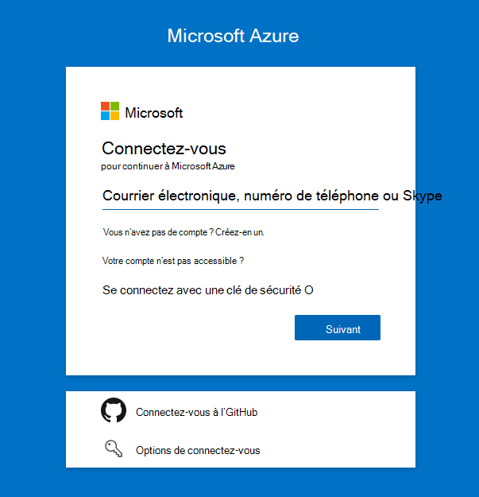
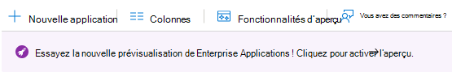
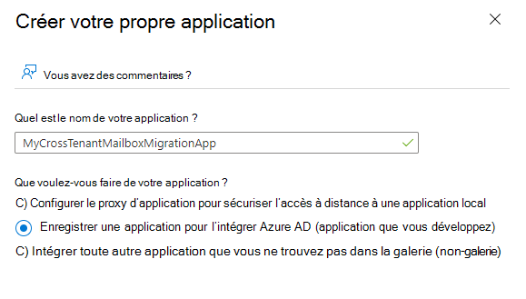
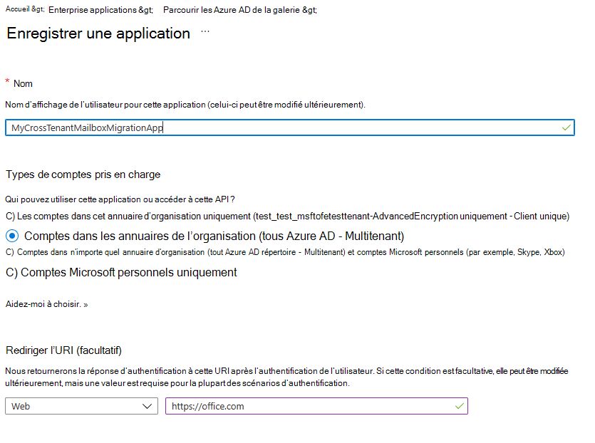
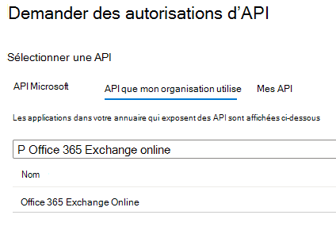
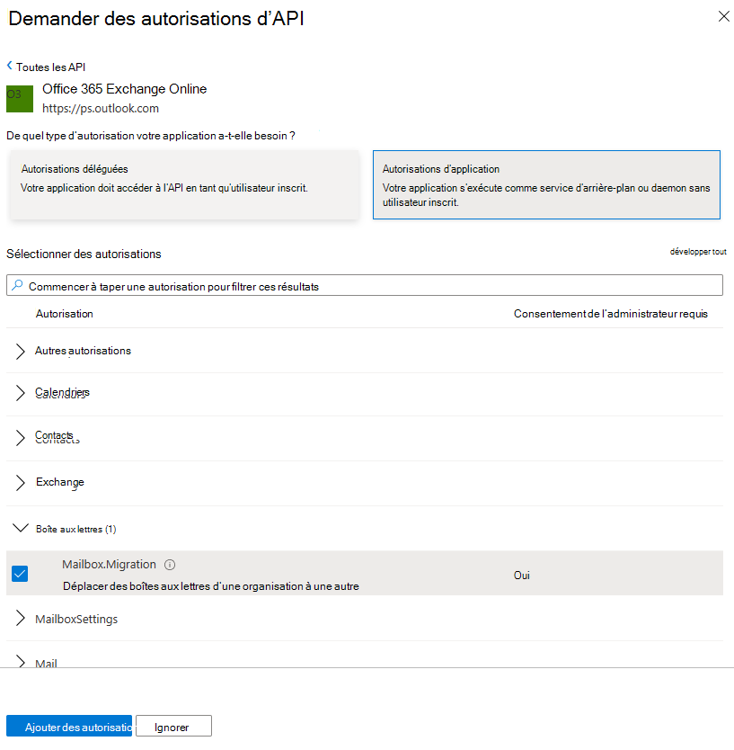

# <a name="cross-tenant-mailbox-migration-preview"></a>Migration de boîtes aux lettres entre locataires (prévisualisation)

En commun, lors de fusions ou de désint ressaisissements, vous avez besoin de la possibilité de déplacer la boîte aux lettres Exchange Online utilisateur vers un nouveau client. La migration de boîtes aux lettres inter-clients permet aux administrateurs clients d’utiliser des interfaces connues telles que Remote PowerShell et MRS pour migrer les utilisateurs vers leur nouvelle organisation.

Les administrateurs peuvent utiliser la cmdlet New-MigrationBatch, disponible via le rôle de gestion Déplacer des boîtes aux lettres, pour exécuter des déplacements entre les locataires.

Les utilisateurs qui migrent doivent être présents dans le système d’Exchange Online client cible en tant que MailUsers, marqués avec des attributs spécifiques pour activer les déplacements entre clients. Les déplacements du système échouent pour les utilisateurs qui ne sont pas correctement configurer dans le client cible.

Lorsque les déplacements sont terminés, la boîte aux lettres de l’utilisateur source est convertie en MailUser et l’adresse cible (affichée sous le nom ExternalEmailAddress dans Exchange) est estampillée avec l’adresse de routage vers le client de destination. Ce processus laisse l’utilisateur mailuser hérité dans le client source et autorise une période de coexistence et de routage du courrier. Lorsque les processus d’entreprise le permettent, le client source peut supprimer la source MailUser ou les convertir en contact de messagerie.

Les migrations Exchange boîtes aux lettres entre les locataires sont uniquement pris en charge pour les locataires hybrides ou cloud, ou toute combinaison des deux.

Cet article décrit le processus de déplacement de boîtes aux lettres entre les locataires et fournit des instructions sur la préparation des locataires sources et cibles pour les déplacements de contenu de boîtes aux lettres Exchange Online client.

   > [!NOTE]
   > Nous avons récemment mis à jour nos étapes de configuration pour permettre la migration de boîtes aux lettres entre clients afin de ne plus nécessiter Azure Key Vault ! Si vous débutez avec cette prévisualisation, aucune action n’est requise et vous pouvez continuer et suivre les étapes détaillées dans ce document. Si vous avez commencé à configurer vos locataires à l’aide de la méthode AKV précédente, nous vous recommandons vivement d’arrêter ou de supprimer cette configuration pour commencer à utiliser cette nouvelle méthode. Si vous avez des migrations de boîtes aux lettres en cours avec la méthode AKV précédente, patientez jusqu’à ce que vos migrations existantes soient terminées et suivez les étapes ci-dessous pour activer la nouvelle méthode simplifiée. Les étapes de configuration requises d’Azure Key Vault sont archivées, mais elles sont trouvées **[ici,](https://github.com/microsoft/cross-tenant/wiki/V1-Content#cross-tenant-mailbox-migration-preview)** pour référence.

## <a name="preparing-source-and-target-tenants"></a>Préparation des locataires sources et cibles

### <a name="prerequisites-for-source-and-target-tenants"></a>Conditions préalables pour les locataires sources et cibles

Avant de commencer, assurez-vous que vous avez les autorisations nécessaires pour configurer l’application déplacer la boîte aux lettres dans Azure, le point de terminaison de migration EXO et la relation d’organisation EXO.

En outre, au moins un groupe de sécurité à messagerie dans le client source est requis. Ces groupes sont utilisés pour cibler la liste des boîtes aux lettres qui peuvent passer du client source (ou parfois appelé ressource) au client cible. Cela permet à l’administrateur client source de restreindre ou d’étendue l’ensemble spécifique de boîtes aux lettres qui doivent être déplacées, ce qui empêche la migration des utilisateurs non voulus. Les groupes imbrmbrés ne sont pas pris en charge.

Vous devrez également communiquer avec votre société partenaire de confiance (avec laquelle vous déplacerez des boîtes aux lettres) pour obtenir leur ID Microsoft 365 client approuvé. Cet ID de client est utilisé dans le champ Organization Relationship DomainName.

Pour obtenir l’ID de locataire d’un abonnement, connectez-vous au [Centre d'administration Microsoft 365](https://go.microsoft.com/fwlink/p/?linkid=2024339) puis allez à [https://aad.portal.azure.com/\#blade/Microsoft_AAD_IAM/ActiveDirectoryMenuBlade/Properties](https://aad.portal.azure.com/#blade/Microsoft_AAD_IAM/ActiveDirectoryMenuBlade/Properties) . Cliquez sur l’icône de copie de la propriété ID de client pour la copier dans le Presse-papiers.

### <a name="configuration-steps-to-enable-your-tenants-for-cross-tenant-mailbox-migrations"></a>Étapes de configuration pour activer vos locataires pour les migrations de boîtes aux lettres entre locataires

   > [!NOTE]
   > Vous devez d’abord configurer la cible (destination). Pour effectuer ces étapes, vous n’êtes pas obligé d’avoir ou de connaître les informations d’identification d’administrateur client pour le client source et cible. Les étapes peuvent être effectuées individuellement pour chaque client par différents administrateurs.

### <a name="prepare-the-target-destination-tenant-by-creating-the-migration-application-and-secret"></a>Préparer le client cible (destination) en créant l’application de migration et la question secrète

1. Connectez-vous à votre portail Azure AD client cible ( ) avec <https://portal.azure.com> vos informations d’identification d’administrateur client cible

   

2. Sous les services Azure, cliquez sur Azure Active Directory.

3. Dans la barre de navigation de gauche, sélectionnez Enterprise Applications.

4. Sélectionner une nouvelle application

   

5. Sélectionnez Créer votre propre application

   

6. Entrez un nom pour votre application (peut être spécifique aux conventions d’attribution de noms de votre organisation), sélectionnez Inscrire une application à intégrer à Azure AD, puis Créer.

   

7. Dans la page Enregistrer une application, sous Types de comptes pris en charge, sélectionnez les comptes directement dans n’importe quelle organisation (n’importe quel Azure AD - Multi-client). Ensuite, sous URI de redirection (facultatif), sélectionnez Web et entrez <https://office.com> . Enfin, sélectionnez Enregistrer.

   

8. Dans le coin supérieur droit de la page, vous verrez une fenêtre de notification qui indique que l’application a été correctement créée.

9. Revenir à La page d’accueil, Azure Active Directory cliquez sur Inscriptions d’applications.

10. Sous Applications propriétés, recherchez l’application que vous avez créée et cliquez dessus.

11. Sous ^Essentials, vous devrez copier l’ID de l’application (client), car vous en aurez besoin ultérieurement pour créer une URL pour le client cible.

12. À présent, dans la barre de navigation de gauche, cliquez sur autorisations d’API pour afficher les autorisations attribuées à votre application.

13. Par défaut, les autorisations User.Read sont attribuées à l’application que vous avez créée, mais nous ne les exigeons pas pour les migrations de boîtes aux lettres, vous pouvez supprimer cette autorisation.

    

14. Maintenant, nous devons ajouter des autorisations pour la migration de boîtes aux lettres, sélectionnez Ajouter une autorisation

15. Dans les fenêtres Demander des autorisations d’API, sélectionnez les API des utilisateurs de mon organisation, puis recherchez Office 365 exchange online, sélectionnez-le.

    

16. Ensuite, sélectionnez Autorisations d’application

17. Ensuite, sous Sélectionner des autorisations, développez Boîte aux lettres, vérifiez Mailbox.Migration et Ajoutez les autorisations en bas de l’écran.

    

18. Maintenant, sélectionnez Certificats & secrets dans la barre de navigation de gauche de votre application.

19. Sous Les secrets client, sélectionnez nouvelle secret client.

    

20. Dans la fenêtre Ajouter une secret client, entrez une description et configurez les paramètres d’expiration souhaités.

      > [!NOTE]
      > Il s’agit du mot de passe qui sera utilisé lors de la création de votre point de terminaison de migration. Il est extrêmement important de copier ce mot de passe dans le Presse-papiers ou de copier ce mot de passe dans un emplacement sécurisé/secret. C’est la seule fois que vous pourrez voir ce mot de passe ! Si vous la perdez ou si vous devez la réinitialiser, vous pouvez vous connecter à notre portail Azure, vous connecter aux inscriptions d’application, rechercher votre application de migration, sélectionner des certificats Secrets & et créer une nouvelle question secrète pour votre application.

21. Maintenant que vous avez créé l’application de migration et la question secrète, vous devez consentir à l’application. Pour consentir à l’application, revenir à la page d’accueil de Azure Active Directory, cliquez sur les applications Enterprise dans le navigation de gauche, recherchez votre application de migration que vous avez créée, sélectionnez-la, puis sélectionnez Autorisations sur le navigation de gauche.

22. Cliquez sur le bouton Accorder le consentement administrateur pour [votre client].

23. Une nouvelle fenêtre de navigateur s’ouvre et sélectionnez Accepter.

24. Vous pouvez revenir à la fenêtre de votre portail et sélectionner Actualiser pour confirmer votre acceptation.

25. Formuler l’URL à envoyer à votre partenaire approuvé (administrateur client source) afin qu’il puisse également accepter l’application pour activer la migration de boîtes aux lettres. Voici un exemple de l’URL à leur fournir, vous aurez besoin de l’ID d’application de l’application que vous avez créée :

    ```powershell
    https://login.microsoftonline.com/sourcetenant.onmicrosoft.com/adminconsent?client_id=[application_id_of_the_app_you_just_created]&redirect_uri=https://office.com
    ```

    > [!NOTE]
    > Vous aurez besoin de l’ID d’application de l’application de migration de boîtes aux lettres que vous avez créée.
    >
    > Vous devrez remplacer sourcetenant.onmicrosoft.com dans l’exemple ci-dessus par vos locataires sources onmicrosoft.com nom correct.
    >
    > Vous devrez également remplacer [application_id_of_the_app_you_just_created] par l’ID d’application de l’application de migration de boîte aux lettres que vous avez créée.

### <a name="prepare-the-target-tenant-by-creating-the-exchange-online-migration-endpoint-and-organization-relationship"></a>Préparer le client cible en créant le point de terminaison de migration Exchange Online relation organisationnelle

1. Créez une connexion PowerShell distante au client Exchange Online cible.

2. Créer un point de terminaison de migration pour les déplacements de boîtes aux lettres entre locataires

   > [!NOTE]
   > Vous aurez besoin de l’ID d’application de l’application de migration de boîte aux lettres que vous avez créée et du mot de passe (la question secrète) que vous avez configuré au cours de ce processus. En outre, selon la Microsoft 365 instance cloud que vous utilisez votre point de terminaison peut être différente. Reportez-vous à la page [Microsoft 365](/microsoft-365/enterprise/microsoft-365-endpoints) points de terminaison et sélectionnez l’instance correcte pour votre client et consultez l’Exchange Online Optimiser l’adresse requise et remplacer le cas échéant.

   ```powershell
   $AppId = "[guid copied from the migrations app]"

   $Credential = New-Object -TypeName System.Management.Automation.PSCredential -ArgumentList $AppId, (ConvertTo-SecureString -String "[this is your secret password you saved in the previous steps]" -AsPlainText -Force)

   New-MigrationEndpoint -RemoteServer outlook.office.com -RemoteTenant "sourcetenant.onmicrosoft.com" -Credentials $Credential -ExchangeRemoteMove:$true -Name "[the name of your migration endpoint]" -ApplicationId $AppId
   ```

3. Créez un objet relation organisationnel existant ou modifiez-le sur votre client source.

   ```powershell
   $sourceTenantId="[tenant id of your trusted partner, where the source mailboxes are]"
   $orgrels=Get-OrganizationRelationship
   $existingOrgRel = $orgrels | ?{$_.DomainNames -like $sourceTenantId}
   If ($null -ne $existingOrgRel)
   {
       Set-OrganizationRelationship $existingOrgRel.Name -Enabled:$true -MailboxMoveEnabled:$true -MailboxMoveCapability Inbound
   }
   If ($null -eq $existingOrgRel)
   {
       New-OrganizationRelationship "[name of the new organization relationship]" -Enabled:$true -MailboxMoveEnabled:$true -MailboxMoveCapability Inbound -DomainNames $sourceTenantId
   }
   ```

### <a name="prepare-the-source-current-mailbox-location-tenant-by-accepting-the-migration-application-and-configuring-the-organization-relationship"></a>Préparer le client source (emplacement de boîte aux lettres actuel) en acceptant l’application de migration et en configurant la relation organisationnelle

1. À partir d’un navigateur, go to the URL link provided by your trusted partner to consent to the mailbox migration application. L’URL ressemblera à ceci :

   ```powershell
   https://login.microsoftonline.com/sourcetenant.onmicrosoft.com/adminconsent?client_id=[application_id_of_the_app_you_just_created]&redirect_uri=https://office.com
   ```

   > [!NOTE]
   > Vous aurez besoin de l’ID d’application de l’application de migration de boîtes aux lettres que vous avez créée.
   > Vous devrez remplacer sourcetenant.onmicrosoft.com dans l’exemple ci-dessus par vos locataires sources onmicrosoft.com nom correct.
   > Vous devrez également remplacer [application_id_of_the_app_you_just_created] par l’ID d’application de l’application de migration de boîte aux lettres que vous avez créée.

2. Acceptez l’application lorsque la fenêtre pop-up s’affiche. Vous pouvez également vous connecter à votre portail Azure Active Directory et trouver l’application sous Enterprise applications.

3. Créez un nouvel objet de relation organisationnelle ou modifiez-le sur votre client cible (destination) à partir d’une Exchange Online Remote PowerShell.

   ```powershell
   $targetTenantId="[tenant id of your trusted partner, where the mailboxes are being moved to]"
   $appId="[application id of the mailbox migration app you consented to]"
   $scope="[name of the mail enabled security group that contains the list of users who are allowed to migrate]"
   $orgrels=Get-OrganizationRelationship
   $existingOrgRel = $orgrels | ?{$_.DomainNames -like $targetTenantId}
   If ($null -ne $existingOrgRel)
   {
       Set-OrganizationRelationship $existingOrgRel.Name -Enabled:$true -MailboxMoveEnabled:$true -MailboxMoveCapability RemoteOutbound -OAuthApplicationId $appId -MailboxMovePublishedScopes $scope
   }
   If ($null -eq $existingOrgRel)
   {
       New-OrganizationRelationship "[name of your organization relationship]" -Enabled:$true -MailboxMoveEnabled:$true -MailboxMoveCapability RemoteOutbound -DomainNames $targetTenantId -OAuthApplicationId $appId -MailboxMovePublishedScopes $scope
   }
   ```

### <a name="how-do-i-know-this-worked"></a>Comment savoir si cela a fonctionné ?

Vous pouvez vérifier la configuration de la migration de boîtes aux lettres entre les locataires en exécutant la cmdlet [Test-MigrationServerAvailability](/powershell/module/exchange/Test-MigrationServerAvailability) sur le point de terminaison de migration entre locataires que vous avez créé sur votre client cible.

   > [!NOTE]
   > Test-MigrationServerAvailability -Endpoint « [the name of your cross-tenant migration endpoint] » -TestMailbox « [email address of a source mailbox that is part of your migration scope] »

### <a name="move-mailboxes-back-to-the-original-source"></a>Déplacer les boîtes aux lettres vers la source d’origine

Si une boîte aux lettres est nécessaire pour revenir au client source d’origine, le même ensemble d’étapes et de scripts doit être exécuté dans les nouveaux locataires source et cible. L’objet Relation d’organisation existant sera mis à jour ou appendé, et non recréé

## <a name="prepare-target-user-objects-for-migration"></a>Préparer les objets utilisateur cibles pour la migration

Les utilisateurs qui migrent doivent être présents dans le client cible et le système Exchange Online (en tant que MailUsers) marqués avec des attributs spécifiques pour activer les déplacements entre clients. Les déplacements du système échouent pour les utilisateurs qui ne sont pas correctement configurer dans le client cible. La section suivante détaille les conditions requises pour l’objet MailUser pour le client cible.

### <a name="prerequisites-for-target-user-objects"></a>Conditions préalables pour les objets utilisateur cibles

Vous devez vous assurer que les objets et attributs suivants sont définies dans l’organisation cible.

1. Pour toute boîte aux lettres à partir d’une organisation source, vous devez mettre en service un objet MailUser dans l’organisation cible :

   - L’utilisateur de messagerie cible doit avoir les attributs de la boîte aux lettres source ou affectés avec le nouvel objet User :
      - ExchangeGUID (flux direct de la source à la cible) : le GUID de boîte aux lettres doit correspondre. Le processus de déplacement ne se poursuit pas s’il n’est pas présent sur l’objet cible.
      - ArchiveGUID (flux direct de la source à la cible) : le GUID d’archivage doit correspondre. Le processus de déplacement ne se poursuit pas s’il n’est pas présent sur l’objet cible. (Cette demande est requise uniquement si la boîte aux lettres source est activée pour l’archivage).
      - LegacyExchangeDN (flow as proxyAddress, « x500: « ) : LegacyExchangeDN doit être présent sur mailUser cible en tant que \<LegacyExchangeDN> x500 : proxyAddress. En outre, vous devez également copier toutes les adresses x500 de la boîte aux lettres source vers l’utilisateur de messagerie cible. Les processus de déplacement ne se déroulent pas s’ils ne sont pas présents sur l’objet cible.
      - UserPrincipalName : UPN s’alignera sur la nouvelle identité ou la société cible de l’utilisateur (par exemple, user@northwindtraders.onmicrosoft.com).
      - Adresse SMTP principale : l’adresse SMTP principale s’alignera sur la société NEW de l’utilisateur (par exemple, user@northwind.com).
      - TargetAddress/ExternalEmailAddress : MailUser référencera la boîte aux lettres actuelle de l’utilisateur hébergée dans le client source (par exemple, user@contoso.onmicrosoft.com). Lors de l’affectation de cette valeur, vérifiez que vous avez/attribuez également PrimarySMTPAddress, sinon cette valeur définira PrimarySMTPAddress qui provoquera des échecs de déplacement.
      - Vous ne pouvez pas ajouter d’adresses proxy smtp héritées de la boîte aux lettres source à mailUser cible. Par exemple, vous ne pouvez pas conserver contoso.com sur l’fabrikam.onmicrosoft.com objets client). Les domaines sont associés à un seul Azure AD ou Exchange Online client uniquement.

     Exemple **d’objet** MailUser cible :

     | Attribut            | Valeur                                                                                                                   |
     | -------------------- | ----------------------------------------------------------------------------------------------------------------------- |
     | Alias                | LaraN                                                                                                                   |
     | RecipientType        | MailUser                                                                                                                |
     | RecipientTypeDetails | MailUser                                                                                                                |
     | UserPrincipalName    | LaraN@northwintraders.onmicrosoft.com                                                                                   |
     | PrimarySmtpAddress   | Lara.Newton@northwind.com                                                                                               |
     | ExternalEmailAddress | SMTP:LaraN@contoso.onmicrosoft.com                                                                                      |
     | ExchangeGuid         | 1ec059c7-8396-4d0b-af4e-d6bd4c12a8d8                                                                                    |
     | LegacyExchangeDN     | /o=First Organization/ou=Exchange Administrative Group                                                                  |
     |                      | (FYDIBOHF23SPDLT)/cn=Recipients/cn=74e5385fce4b46d19006876949855035Lara                                                 |
     | EmailAddresses       | x500:/o=First Organization/ou=Exchange Administrative Group (FYDIBOHF23SPDLT)/cn=Recipients/cn=d11ec1a2cacd4f81858c8190 |
     |                      | 7273f1f9-Lara                                                                                                           |
     |                      | smtp:LaraN@northwindtraders.onmicrosoft.com                                                                             |
     |                      | SMTP:Lara.Newton@northwind.com                                                                                          |
     |                      |                                                                                                                         |

     Exemple **d’objet mailbox** source :

     | Attribut            | Valeur                                                                   |
     | -------------------- | ----------------------------------------------------------------------- |
     | Alias                | LaraN                                                                   |
     | RecipientType        | UserMailbox                                                             |
     | RecipientTypeDetails | UserMailbox                                                             |
     | UserPrincipalName    | LaraN@contoso.onmicrosoft.com                                           |
     | PrimarySmtpAddress   | Lara.Newton@contoso.com                                                 |
     | ExchangeGuid         | 1ec059c7-8396-4d0b-af4e-d6bd4c12a8d8                                    |
     | LegacyExchangeDN     | /o=First Organization/ou=Exchange Administrative Group                  |
     |                      | (FYDIBOHF23SPDLT)/cn=Recipients/cn=d11ec1a2cacd4f81858c81907273f1f9Lara |
     | EmailAddresses       | smtp:LaraN@contoso.onmicrosoft.com                                      |
     |                      | SMTP:Lara.Newton@contoso.com                                            |
     |                      |                                                                         |

   - Des attributs supplémentaires peuvent déjà être inclus dans Exchange’écriture hybride. Si ce n’est pas le cas, elles doivent être incluses.
   - msExchBlockedSendersHash : écrit en ligne les données d’expéditeurs sécurisés et bloqués des clients vers Active Directory local.
   - msExchSafeRecipientsHash : écrit en ligne les données d’expéditeurs sécurisés et bloqués des clients vers Active Directory local.
   - msExchSafeSendersHash : écrit en ligne les données d’expéditeurs sécurisés et bloqués des clients vers Active Directory local.

2. Si la boîte aux lettres source est sur LitigationHold et que la taille des éléments récupérables de la boîte aux lettres source est supérieure à la taille par défaut de notre base de données (30 Go), les déplacements ne se déroulent pas car le quota cible est inférieur à la taille de boîte aux lettres source. Vous pouvez mettre à jour l’objet MailUser cible pour faire passer les indicateurs de boîte aux lettres ELC de l’environnement source à la cible, ce qui déclenche l’extension du quota de MailUser par le système cible à 100 Go, ce qui permet le déplacement vers la cible. Ces instructions ne fonctionnent que pour l’identité hybride en cours d’exécution Azure AD Connecter, car les commandes pour marquer les indicateurs ELC ne sont pas exposées aux administrateurs client.

    > [!NOTE]
    > EXEMPLE – EN L’ABSENCE DE GARANTIE
    >
    > Ce script suppose une connexion à la boîte aux lettres source (pour obtenir les valeurs sources) et à la cible Active Directory sur site (pour marquer l’objet ADUser). Si le litige ou la récupération d’élément unique est activé pour la source, définissez-le sur le compte de destination.  Cela augmente la taille du benne du compte de destination à 100 Go.

    ```powershell
    $ELCValue = 0
    if ($source.LitigationHoldEnabled) {$ELCValue = $ELCValue + 8} if ($source.SingleItemRecoveryEnabled) {$ELCValue = $ELCValue + 16} if ($ELCValue -gt 0) {Set-ADUser -Server $domainController -Identity $destination.SamAccountName -Replace @{msExchELCMailboxFlags=$ELCValue}}
    ```

3. Les locataires cibles non hybrides peuvent modifier le quota sur le dossier Éléments récupérables des utilisateurs de messagerie avant la migration en exécutant la commande suivante pour activer la attente pour litige sur l’objet MailUser et en augmentant le quota à 100 Go : `Set-MailUser -EnableLitigationHoldForMigration` Notez que cela ne fonctionne pas pour les locataires dans un mode hybride.

4. Les utilisateurs de l’organisation cible doivent être titulaires d’une licence Exchange Online abonnements applicables à l’organisation. Vous pouvez appliquer une licence avant un déplacement de boîte aux lettres, mais seulement une fois que l’utilisateur de messagerie cible est correctement installé avec ExchangeGUID et les adresses proxy. L’application d’une licence avant l’application d’ExchangeGUID entraîne la mise en service d’une nouvelle boîte aux lettres dans l’organisation cible.

    > [!NOTE]
    > Lorsque vous appliquez une licence à un objet Mailbox ou MailUser, toutes les adresses proxy de type SMTP sont nettoyées pour garantir que seuls les domaines vérifiés sont inclus dans le tableau Exchange EmailAddresses.

5. Vous devez vous assurer que le MailUser cible n’a aucun ExchangeGuid précédent qui ne correspond pas à l’ExchangeGuid source. Cela peut se produire si l’utilisateur utilisateur à messagerie cible a été précédemment titulaire d’une licence Exchange Online et a fourni une boîte aux lettres. Si la cible MailUser a déjà été titulaire d’une licence ExchangeGuid ou qu’elle avait un ExchangeGuid qui ne correspond pas à l’ExchangeGuid source, vous devez effectuer un nettoyage de l’UI de cloud. Pour ces meus cloud, vous pouvez exécuter `Set-User <identity> -PermanentlyClearPreviousMailboxInfo` .

    > [!CAUTION]
    > Ce processus est irréversible. Si l’objet possède une boîte aux lettres supprimée (softDeleted), il ne peut pas être restauré après ce point. Une fois effacé, toutefois, vous pouvez synchroniser l’objet ExchangeGuid correct avec l’objet cible et MRS connectera la boîte aux lettres source à la boîte aux lettres cible nouvellement créée. (Référencez le blog EHLO sur le nouveau paramètre.)

    Recherchez des objets qui étaient auparavant des boîtes aux lettres à l’aide de cette commande.

    ```powershell
    Get-User <identity> | select Name, *recipient* | Format-Table -AutoSize
    ```

    Voici un exemple.

    ```powershell
    Get-User John@northwindtraders.com |select name, *recipient*| Format-Table -AutoSize

    Name       PreviousRecipientTypeDetails     RecipientType RecipientTypeDetails
    ----       ---------------------------- ------------- --------------------
    John       UserMailbox                  MailUser      MailUser
    ```

    Effacez la boîte aux lettres supprimée (à l’aide de cette commande).

    ```powershell
    Set-User <identity> -PermanentlyClearPreviousMailboxInfo
    ```

    Voici un exemple.

    ```powershell
    Set-User John@northwindtraders.com -PermanentlyClearPreviousMailboxInfo -Confirm
    
    Are you sure you want to perform this action?
    Delete all existing information about user "John@northwindtraders.com"?. This operation will clear existing values from Previous home MDB and Previous Mailbox GUID of the user. After deletion, reconnecting to the previous mailbox that existed in the cloud will not be possible and any content it had will be unrecoverable PERMANENTLY.
    Do you want to continue?
    [Y] Yes  [A] Yes to All  [N] No  [L] No to All  [?] Help (default is "Y"): Y
    ```

### <a name="perform-mailbox-migrations"></a>Effectuer des migrations de boîtes aux lettres

Les migrations entre Exchange boîtes aux lettres sont lancées à partir du client cible en tant que lots de migration. Il s’agit de la manière dont fonctionnent les lots de migration par embarquement lors de la migration de Exchange en local vers Microsoft 365.

### <a name="create-migration-batches"></a>Créer des lots de migration

Voici un exemple de cmdlet de lot de migration pour supprimer les déplacements.

```powershell
New-MigrationBatch -Name T2Tbatch -SourceEndpoint target_source_7977 -CSVData ([System.IO.File]::ReadAllBytes('users.csv')) -Autostart -TargetDeliveryDomain target.onmicrosoft.com

Identity                   Status  Type               TotalCount
--------                   ------  ----               ----------
T2Tbatch                   Syncing ExchangeRemoteMove 1
```

> [!NOTE]
> L’adresse de messagerie dans le fichier CSV doit être celle spécifiée dans le client cible, et non le client source.
>
> [Pour plus d’informations sur la cmdlet, cliquez ici](/powershell/module/exchange/new-migrationbatch)
>
> [Pour obtenir un exemple de fichier CSV, cliquez ici](/exchange/csv-files-for-mailbox-migration-exchange-2013-help)

L’envoi de lot de migration est également pris en charge à partir du nouveau <a href="https://go.microsoft.com/fwlink/p/?linkid=2059104" target="_blank">centre Exchange’administration</a> lorsque vous sélectionnez l’option entre les locataires.

### <a name="update-on-premises-mailusers"></a>Mettre à jour les mailusers locaux

Une fois que la boîte aux lettres passe de la source à la cible, vous devez vous assurer que les utilisateurs de messagerie locaux, à la fois dans la source et la cible, sont mis à jour avec la nouvelle adresse cible. Dans les exemples, le targetDeliveryDomain utilisé dans le déplacement **est contoso.onmicrosoft.com**. Mettez à jour les utilisateurs de messagerie avec cette adresse cible.

## <a name="frequently-asked-questions"></a>Foire aux questions

**Devons-nous mettre à jour RemoteMailboxes dans la source sur site après le déplacement ?**

Oui, vous devez mettre à jour l’adresse cible (RemoteRoutingAddress/ExternalEmailAddress) des utilisateurs locaux source lorsque la boîte aux lettres du client source se déplace vers le client cible.  Bien que le routage du courrier puisse suivre les références entre plusieurs utilisateurs de messagerie avec des adresses cibles différentes, les recherches de libre/occupé pour les utilisateurs de messagerie doivent cibler l’emplacement de l’utilisateur de boîte aux lettres. Les recherche de libre/occupé ne pourront pas poursuivre plusieurs redirections.

**Les réunions Teams-elles migrer entre les locataires ?**

Les réunions se déplacent, mais l’URL Teams réunion n’est pas mise à jour lorsque les éléments migrent entre les locataires. Étant donné que l’URL n’est pas valide dans le client cible, vous devez supprimer et recréer Teams réunions.

**Le contenu Teams de conversation migre-t-il entre les locataires ?**

Non, le contenu Teams de conversation ne migre pas entre les locataires.

**Comment puis-je voir uniquement les déplacements qui sont des déplacements inter-locataires, et non mes déplacements d’intégration et de off-embarquement ?**

Utilisez le _paramètre Flags._ Voici un exemple.

```powershell
Get-MoveRequest -Flags "CrossTenant"
```

**Pouvez-vous fournir des exemples de scripts pour copier les attributs utilisés lors des tests ?**

> [!NOTE]
> EXEMPLE : EN L’ABSENCE DE GARANTIE. Ce script suppose une connexion à la boîte aux lettres source (pour obtenir les valeurs sources) et à la cible des services de domaine Active Directory locaux (pour marquer l’objet ADUser). Si le litige ou la récupération d’élément unique est activé pour la source, définissez-le sur le compte de destination.  Cela augmente la taille du benne du compte de destination à 100 Go.


   ```powershell
   # This will export users from the source tenant with the CustomAttribute1 = "Cross-Tenant-Project"
   # These are the 'target' users to be moved to the Northwind org tenant
   $outFileUsers = "$home\desktop\UsersToMigrate.txt"
   $outFileUsersXML = "$home\desktop\UsersToMigrate.xml"
   Get-Mailbox -Filter "CustomAttribute1 -like 'Cross-Tenant-Project'" -ResultSize Unlimited | Select-Object -ExpandProperty  Alias | Out-File $outFileUsers
   $mailboxes = Get-Content $outFileUsers
   $mailboxes | ForEach-Object {Get-Mailbox $_} | Select-Object PrimarySMTPAddress,Alias,SamAccountName,FirstName,LastName,DisplayName,Name,ExchangeGuid,ArchiveGuid,LegacyExchangeDn,EmailAddresses | Export-Clixml $outFileUsersXML
   ```

   ```powershell
   # Copy the file $outfile to the desktop of the target on-premises then run the below to create MEU in Target
   $mailboxes = Import-Clixml $home\desktop\UsersToMigrate.xml
   add-type -AssemblyName System.Web
   foreach ($m in $mailboxes) {
       $organization = "@contoso.onmicrosoft.com"
       $mosi = $m.Alias+$organization
       $Password = [System.Web.Security.Membership]::GeneratePassword(16,4) | ConvertTo-SecureString -AsPlainText -Force
       $x500 = "x500:" +$m.LegacyExchangeDn
       $tmpUser = New-MailUser -MicrosoftOnlineServicesID $mosi -PrimarySmtpAddress $mosi -ExternalEmailAddress $m.PrimarySmtpAddress -FirstName $m.FirstName -LastName $m.LastName -Name $m.Name -DisplayName $m.DisplayName -Alias $m.Alias -Password $Password
       $tmpUser | Set-MailUser -EmailAddresses @{add=$x500} -ExchangeGuid $m.ExchangeGuid -ArchiveGuid $m.ArchiveGuid -CustomAttribute1 "Cross-Tenant-Project"
       $tmpx500 = $m.EmailAddresses | ?{$_ -match "x500"}
       $tmpx500 | %{Set-MailUser $m.Alias -EmailAddresses @{add="$_"}}
       }
   ```

   ```powershell
   # Now sync the changes from On-Premises to Azure and Exchange Online in the Target tenant
   # This action should create the target mail enabled users (MEUs) in the Target tenant
   Start-ADSyncCycle
   ```

**Comment pouvons-nous accéder Outlook jour 1 une fois que la boîte aux lettres d’utilisation a été déplacée ?**

Étant donné qu’un seul client peut posséder un domaine, l’ancienne adresse SMTP principale n’est pas associée à l’utilisateur dans le client cible une fois le déplacement de la boîte aux lettres terminé . uniquement les domaines associés au nouveau client. Outlook utilise le nouvel UPN des utilisateurs pour s’authentifier au service et le profil Outlook s’attend à trouver l’adresse SMTPAddress principale héritée pour correspondre à la boîte aux lettres dans le système cible. Étant donné que l’adresse héritée ne se trouve pas dans le système cible, le profil Outlook ne se connecte pas pour rechercher la boîte aux lettres nouvellement déplacée.

Pour ce déploiement initial, les utilisateurs devront reconstruire leur profil avec leur nouvel UPN, l’adresse SMTP principale et synchroniser à nouveau le contenu OST.

> [!NOTE]
> Planifiez en conséquence le traitement par lots de vos utilisateurs. Vous devez tenir compte de l’utilisation et de la capacité du réseau lorsque Outlook profils clients sont créés et que les fichiers OST et OAB suivants sont téléchargés vers les clients.

**De quels Exchange RBAC ai-je besoin d’être membre pour configurer ou effectuer un déplacement entre locataires ?**

Il existe une matrice de rôles basée sur l’hypothèse de tâches déléguées lors de l’exécution d’un déplacement de boîte aux lettres. Actuellement, deux rôles sont requis :

- Le premier rôle est une tâche de configuration qui établit l’autorisation de déplacer du contenu vers ou hors de vos limites client/organisation. Étant donné que le déplacement des données hors de votre contrôle organisationnel est une préoccupation critique pour toutes les entreprises, nous avons choisi le rôle d’administrateur d’organisation (OrgAdmin) le plus élevé. Ce rôle doit modifier ou configurer un nouvel OrganizationRelationship qui définit la -MailboxMoveCapability avec l’organisation distante. Seul l’OrgAdmin peut modifier le paramètre MailboxMoveCapability, tandis que d’autres attributs de OrganizationRelationship peuvent être gérés par l’administrateur du partage fédéré.

- Le rôle d’exécution des commandes de déplacement réelles peut être délégué à une fonction de niveau inférieur. Le rôle de déplacement de boîtes aux lettres est affecté à la possibilité de déplacer des boîtes aux lettres dans ou hors de l’organisation.

**Comment cibler l’adresse SMTP sélectionnée pour targetAddress (TargetDeliveryDomain) sur la boîte aux lettres convertie (en conversion MailUser) ?**

Exchange déplacements de boîtes aux lettres à l’aide du service MRS tissent l’adresse cible sur la boîte aux lettres source d’origine lors de la conversion en MailUser en correspondant à une adresse e-mail (proxyAddress) sur l’objet cible. Le processus prend la valeur -TargetDeliveryDomain transmise à la commande de déplacement, puis recherche un proxy correspondant pour ce domaine côté cible. Lorsque nous trouvons une correspondance, le proxyAddress correspondant est utilisé pour définir ExternalEmailAddress (targetAddress) sur l’objet de boîte aux lettres convertie (désormais MailUser).

**Comment les autorisations de boîte aux lettres sont-ils en cours de transition ?**

Les autorisations de boîte aux lettres incluent Envoyer de la part de et Accès aux boîtes aux lettres :

- Send On Behalf Of (AD:publicDelegates) stocke le nom DN des destinataires ayant accès à la boîte aux lettres d’un utilisateur en tant que délégué. Cette valeur est stockée dans Active Directory et ne se déplace actuellement pas dans le cadre de la transition de boîte aux lettres. Si publicDelegates est définie sur la boîte aux lettres source, vous devrez le restamper sur la boîte aux lettres cible une fois la conversion de l’utilisateur à l’utilisateur à boîte aux lettres terminée dans l’environnement cible en cours `Set-Mailbox <principle> -GrantSendOnBehalfTo <delegate>` d’exécution.

- Les autorisations de boîte aux lettres stockées dans la boîte aux lettres sont déplacées avec la boîte aux lettres lorsque le principal et le délégué sont déplacés vers le système cible. Par exemple, l’utilisateur TestUser_7 accès total à la boîte aux lettres TestUser_8 dans le client SourceCompany.onmicrosoft.com. Une fois le déplacement de la boîte aux TargetCompany.onmicrosoft.com terminé, les mêmes autorisations sont définies dans le répertoire cible. Des exemples *d’utilisation de Get-MailboxPermission* TestUser_7 dans les clients source et cible sont présentés ci-dessous. Exchange cmdlets sont précédées du préfixe source et cible en conséquence.

Voici un exemple de sortie de l’autorisation de boîte aux lettres avant un déplacement.

```powershell
Get-SourceMailboxPermission TestUser_7 | Format-Table -AutoSize User, AccessRights, IsInherited, Deny

User                                             AccessRights                         IsInherited Deny
----                                             ------------                         ----------- ----
NT AUTHORITY\SELF                                {FullAccess, ReadPermission}         False       False
TestUser_8@SourceCompany.onmicrosoft.com         {FullAccess}                         False       False
```

Voici un exemple de sortie de l’autorisation de boîte aux lettres après le déplacement.

```powershell
Get-TargetMailboxPermission TestUser_7 | Format-Table -AutoSize User, AccessRights, IsInherited, Deny

User                                             AccessRights                         IsInherited Deny
----                                             ------------                         ----------- ----
NT AUTHORITY\SELF                                {FullAccess, ReadPermission}         False       False
TestUser_8@TargetCompany.onmicrosoft.com         {FullAccess}                         False       False
```

> [!NOTE]
> Les autorisations de calendrier et de boîte aux lettres entre locataires ne sont PAS pris en charge. Vous devez organiser les principaux et les délégués en lots de déplacement consolidés afin que ces boîtes aux lettres connectées soient transitionn es en même temps à partir du client source.

**Quel proxy X500 doit être ajouté aux adresses proxy MailUser cibles pour permettre la migration ?**

La migration de boîtes aux lettres entre locataires nécessite que la valeur LegacyExchangeDN de l’objet de boîte aux lettres source soit estampillée comme adresse de messagerie x500 sur l’objet MailUser cible.

Exemple :

```powershell
LegacyExchangeDN value on source mailbox is:
/o=First Organization/ou=Exchange Administrative Group(FYDIBOHF23SPDLT)/cn=Recipients/cn=d11ec1a2cacd4f81858c81907273f1f9Lara

so, the x500 email address to be added to target MailUser object would be:
x500:/o=First Organization/ou=Exchange Administrative Group (FYDIBOHF23SPDLT)/cn=Recipients/cn=d11ec1a2cacd4f81858c81907273f1f9-Lara
```

> [!NOTE]
> Outre ce proxy X500, vous devez copier tous les proxys X500 de la boîte aux lettres dans la source vers la boîte aux lettres dans la cible.

**Le client source et cible peut-il utiliser le même nom de domaine ?**

Non. Les noms de domaine du client source et cible doivent être uniques. Par exemple, un domaine source de contoso.com et le domaine cible de fourthcoffee.com.

**Les boîtes aux lettres partagées seront-ils toujours en déplacement et fonctionneront-ils ?**

Oui, toutefois, nous ne conserveons que les autorisations du Store comme décrit dans les articles suivants :

- [Documentation Microsoft | Gérer les autorisations pour les destinataires dans Exchange Online](/exchange/recipients-in-exchange-online/manage-permissions-for-recipients)

- [Support Microsoft | Comment accorder des autorisations Exchange et Outlook aux boîtes aux lettres dans Office 365 dédié](https://support.microsoft.com/topic/how-to-grant-exchange-and-outlook-mailbox-permissions-in-office-365-dedicated-bac01b2c-08ff-2eac-e1c8-6dd01cf77287)

**Avez-vous des recommandations pour les lots ?**

Ne dépassez pas 2 000 boîtes aux lettres par lot. Nous vous recommandons vivement d’envoyer des lots deux semaines avant la date de cut-over, car cela n’a aucun impact sur les utilisateurs finaux lors de la synchronisation. Si vous avez besoin de conseils pour les quantités de boîtes aux lettres de plus de 50 000, vous pouvez accéder à la liste de distribution des commentaires techniques sur crosstenantmigrationpreview@service.microsoft.com.

**Que se passe-t-il si j’utilise le chiffrement de service avec la clé client ?**

La boîte aux lettres sera déchiffrée avant le déplacement. Assurez-vous que la clé client est configurée dans le client cible si elle est toujours requise. Pour [plus d’informations,](/microsoft-365/compliance/customer-key-overview) voir ici.

**Quelle est la durée de migration estimée ?**

Pour vous aider à planifier [](/exchange/mailbox-migration/office-365-migration-best-practices#estimated-migration-times) votre migration, le tableau présenté ici présente les instructions relatives à la fin des migrations de boîtes aux lettres en bloc ou individuelles. Ces estimations sont basées sur une analyse des données des migrations de clients précédentes. Étant donné que chaque environnement est unique, votre vitesse de migration exacte peut varier.

N’oubliez pas que cette fonctionnalité est actuellement en prévisualisation et le SLA, et que les niveaux de service applicables ne s’appliquent pas aux problèmes de performances ou de disponibilité pendant l’état d’aperçu de cette fonctionnalité.

**Rendre les documents protégés dans le client source consommable par les utilisateurs dans le client de destination.**

La migration entre clients migre uniquement les données de boîte aux lettres et rien d’autre. Plusieurs autres options, documentées dans le billet de blog suivant, peuvent vous aider : <https://techcommunity.microsoft.com/t5/security-compliance-and-identity/mergers-and-spinoffs/ba-p/910455>

**Puis-je avoir les mêmes étiquettes dans le client de destination que dans le client source, soit comme le seul ensemble d’étiquettes, soit comme un ensemble supplémentaire d’étiquettes pour les utilisateurs migrés en fonction de l’alignement entre les organisations.**

Étant donné que les migrations entre locataires n’exportent pas d’étiquettes et qu’il n’existe aucun moyen de partager des étiquettes entre les locataires, vous ne pouvez y parvenir qu’en recréant les étiquettes dans le client de destination.

**Prise en charge du déplacement Microsoft 365 groupes ?**

Actuellement, la fonctionnalité migrations de boîtes aux lettres entre locataires ne prend pas en charge la migration de groupes Microsoft 365 client.

**Un administrateur client source peut-il effectuer une recherche de découverte électronique sur une boîte aux lettres après la migration de la boîte aux lettres vers le nouveau client/client cible ?**

Non, après une migration de boîtes aux lettres entre les locataires, eDiscovery par rapport à la boîte aux lettres de l’utilisateur migré dans la source ne fonctionne pas. Cela est dû au fait qu’il n’existe plus de boîte aux lettres dans la source à rechercher, car la boîte aux lettres a été miggrée vers le client cible et appartient maintenant au client cible. eDiscovery, la migration post-boîte aux lettres peut uniquement être effectuée dans le client cible (où la boîte aux lettres existe maintenant). Si une copie de la boîte aux lettres source doit être persistante dans le client source après la migration, l’administrateur de la source peut copier le contenu dans une autre boîte aux lettres avant la migration pour les futures opérations eDiscovery sur les données.

## <a name="known-issues"></a>Problèmes connus

- **Problème : la fonctionnalité de Teams post-migration dans le client source sera limitée.** Une fois la boîte aux lettres migrée vers le client cible, Teams dans le client source n’aura plus accès à la boîte aux lettres de l’utilisateur. Ainsi, si un utilisateur se connecte à Teams avec les informations d’identification du client source, il y aura une perte de fonctionnalités telles que l’impossibilité de mettre à jour votre image de profil, aucune application de calendrier et l’impossibilité de rechercher et rejoindre des équipes publiques.

- **Problème : les archives à extension automatique ne peuvent pas être migrées.** La fonctionnalité de migration entre locataires prend en charge les migrations de la boîte aux lettres principale et de la boîte aux lettres d’archivage pour un utilisateur spécifique. Si l’utilisateur dans la source dispose toutefois d’une archive étendue automatiquement , ce qui signifie que plusieurs boîtes aux lettres d’archivage, la fonctionnalité ne peut pas migrer les archives supplémentaires et doit échouer.

- **Problème : les mailusers cloud avec un proxyAddress smtp non propriétaire bloquent mrs déplace l’arrière-plan.** Lorsque vous créez des objets MailUser de client cible, vous devez vous assurer que toutes les adresses proxy SMTP appartiennent à l’organisation du client cible. Si un proxy SMTP ProxyAddress existe sur l’utilisateur de messagerie cible qui n’appartient pas au client local, la conversion de MailUser en boîte aux lettres est empêchée. Cela est dû à notre assurance que les objets de boîte aux lettres peuvent uniquement envoyer des messages à partir de domaines pour lesquels le client fait autorité (domaines revendiqués par le client) :

  - Lorsque vous synchronisez des utilisateurs en local à l’aide de Azure AD Connecter, vous provisionnez les objets MailUser locaux avec ExternalEmailAddress pointant vers le client source où la boîte aux lettres existe (LaraN@contoso.onmicrosoft.com) et vous marquez PrimarySMTPAddress comme un domaine qui réside dans le client cible (Lara.Newton@northwind.com). Ces valeurs sont synchronisées avec le client et un utilisateur de messagerie approprié est provisioné et prêt pour la migration. Un exemple d’objet est illustré ici.

    ```powershell
    Get-MailUser LaraN | select ExternalEmailAddress, EmailAddresses

    ExternalEmailAddress               EmailAddresses
    --------------------               --------------
    SMTP:LaraN@contoso.onmicrosoft.com {SMTP:lara.newton@northwind.com}
    ```

   > [!NOTE]
   > *L contoso.onmicrosoft.com’adresse* de messagerie *n’est* pas présente dans le tableau EmailAddresses/proxyAddresses.

- **Problème : les objets MailUser avec des adresses SMTP principales « externes » sont modifiés/réinitialisés sur les domaines revendiqués par l’entreprise « internes »**

  Les objets MailUser sont des pointeurs vers des boîtes aux lettres non locales. Dans le cas des migrations de boîtes aux lettres entre locataires, nous utilisons des objets MailUser pour représenter la boîte aux lettres source (du point de vue de l’organisation cible) ou la boîte aux lettres cible (du point de vue de l’organisation source). Les utilisateurs de messagerie auront une adresse ExternalEmailAddress (targetAddress) qui pointe vers l’adresse smtp de la boîte aux lettres réelle (ProxyTest@fabrikam.onmicrosoft.com) et l’adresse PRIMARYSMTP qui représente l’adresse SMTP affichée de l’utilisateur de boîte aux lettres dans l’annuaire. Certaines organisations choisissent d’afficher l’adresse SMTP principale en tant qu’adresse SMTP externe, et non en tant qu’adresse propriétaire/vérifiée par le client local (par exemple, fabrikam.com plutôt que contoso.com).  Toutefois, une fois qu’un objet plan de service Exchange est appliqué à MailUser via des opérations de gestion des licences, l’adresse SMTP principale est modifiée pour s’afficher en tant que domaine vérifié par l’organisation locale (contoso.com). Il existe deux raisons possibles :

  - Lorsqu’un plan de service Exchange est appliqué à un mailuser, le processus Azure AD commence à appliquer le nettoyage de proxy pour s’assurer que l’organisation locale n’est pas en mesure d’envoyer du courrier, de l’usurpation ou du courrier à partir d’un autre client. Toute adresse SMTP sur un objet destinataire avec ces plans de service sera supprimée si l’adresse n’est pas vérifiée par l’organisation locale. Comme c’est le cas dans l’exemple, le domaine Fabikam.com n’est PAS vérifié par le client contoso.onmicrosoft.com, de sorte que le nettoyage supprime ce fabrikam.com domaine. Si vous souhaitez rendre persistants ces domaines externes sur MailUser, avant la migration ou après la migration, vous devez modifier vos processus de migration afin d’obtenir des licences par bande une fois le déplacement terminé ou avant le déplacement pour vous assurer que la marque externe attendue est appliquée aux utilisateurs. Vous devez vous assurer que l’objet de boîte aux lettres est correctement titulaire d’une licence pour ne pas affecter le service de messagerie.
  - Un exemple de script pour supprimer les plans de service sur un MailUser dans le contoso.onmicrosoft.com client est illustré ici.

    ```powershell
    $LO = New-MsolLicenseOptions -AccountSkuId "contoso:ENTERPRISEPREMIUM" DisabledPlans "LOCKBOX_ENTERPRISE","EXCHANGE_S_ENTERPRISE","INFORMATION_BARRIERS","MIP_S_CLP2","MIP_S_CLP1","MYANALYTICS_P2","EXCHANGE_ANALYTICS","EQUIVIO_ANALYTICS","THREAT_INTELLIGENCE","PAM_ENTERPRISE","PREMIUM_ENCRYPTION"
    Set-MsolUserLicense -UserPrincipalName ProxyTest@contoso.com LicenseOptions $lo
    ```

       Les résultats de l’ensemble des Plans de service affectés sont affichés ici.

    ```powershell
    (Get-MsolUser -UserPrincipalName ProxyTest@contoso.com).licenses | Select-Object -ExpandProperty ServiceStatus |sort ProvisioningStatus -Descending

    ServicePlan           ProvisioningStatus
    -----------           ------------------
    ATP_ENTERPRISE        PendingProvisioning
    MICROSOFT_SEARCH      PendingProvisioning
    INTUNE_O365           PendingActivation
    PAM_ENTERPRISE        Disabled
    EXCHANGE_ANALYTICS    Disabled
    EQUIVIO_ANALYTICS     Disabled
    THREAT_INTELLIGENCE   Disabled
    LOCKBOX_ENTERPRISE    Disabled
    PREMIUM_ENCRYPTION    Disabled
    EXCHANGE_S_ENTERPRISE Disabled
    INFORMATION_BARRIERS  Disabled
    MYANALYTICS_P2        Disabled
    MIP_S_CLP1            Disabled
    MIP_S_CLP2            Disabled
    ADALLOM_S_O365        PendingInput
    RMS_S_ENTERPRISE      Success
    YAMMER_ENTERPRISE     Success
    PROJECTWORKMANAGEMENT Success
    BI_AZURE_P2           Success
    WHITEBOARD_PLAN3      Success
    SHAREPOINTENTERPRISE  Success
    SHAREPOINTWAC         Success
    KAIZALA_STANDALONE    Success
    OFFICESUBSCRIPTION    Success
    MCOSTANDARD           Success
    Deskless              Success
    STREAM_O365_E5        Success
    FLOW_O365_P3          Success
    POWERAPPS_O365_P3     Success
    TEAMS1                Success
    MCOEV                 Success
    MCOMEETADV            Success
    BPOS_S_TODO_3         Success
    FORMS_PLAN_E5         Success
    SWAY                  Success
    ```

    L’adresse PrimarySMTPAddress de l’utilisateur n’est plus nettoyée. Le fabrikam.com n’appartient pas au client contoso.onmicrosoft.com et est persistant en tant qu’adresse SMTP principale affichée dans l’annuaire.

    Voici un exemple.

    ```powershell
    Get-Recipient ProxyTest | Format-Table -AutoSize UserPrincipalName, PrimarySmtpAddress, ExternalEmailAddress, ExternalDirectoryObjectId
    UserPrincipalName               PrimarySmtpAddress              ExternalEmailAddress                 ExternalDirectoryObjectId
    -----------------               ------------------              --------------------                 -------------------------
    ProxyTest@fabrikam.com          ProxyTest@fabrikam.com          SMTP:ProxyTest@fabrikam.com          e2513482-1d5b-4066-936a-cbc7f8f6f817
    ```

    - Lorsque msExchRemoteRecipientType est définie sur 8 (DeprovisionMailbox), pour les mailusers locaux migrés vers le client cible, la logique de nettoyage de proxy dans Azure supprime les domaines non propriétaires et réinitialise le primarySMTP sur un domaine propriétaire. En effaissant msExchRemoteRecipientType dans l’mailuser local, la logique de nettoyage proxy ne s’applique plus.

      Vous trouverez ci-dessous l’ensemble complet des plans de service actuels qui incluent Exchange Online.

      | Nom                                             |
      | ------------------------------------------------ |
      | Advanced eDiscovery Stockage (500 Go)              |
      | Référentiel sécurisé client                                 |
      | Protection contre la perte de données                             |
      | Services CAL Exchange Enterprise (EOP, DLP)      |
      | Exchange Essentials                              |
      | Exchange Foundation                              |
      | Exchange Online (P1)                             |
      | Exchange Online (plan 1)                         |
      | Exchange Online (plan 2)                         |
      | Archivage Exchange Online pour Exchange Online    |
      | Archivage Exchange Online pour Exchange Server    |
      | Exchange Online de l’utilisateur inactif             |
      | Exchange Online Kiosk                            |
      | Exchange Online Multi-Geo                        |
      | Exchange Online (plan 1)                           |
      | Exchange Online POP                              |
      | Exchange Online Protection                       |
      | Obstacles à l’information                             |
      | Protection des informations pour Office 365 – Premium  |
      | Protection des informations pour Office 365 – Standard |
      | Informations par MyAnalytics                          |
      | Microsoft 365 audit avancé                  |
      | Microsoft Bookings                               |
      | Microsoft Business Center                        |
      | Microsoft MyAnalytics (complet)                     |
      | Office 365 Advanced eDiscovery                   |
      | Microsoft Defender pour Office 365 (Plan 1)       |
      | Microsoft Defender pour Office 365 (Plan 2)       |
      | Office 365 Privileged Access Management          |
      | Premium chiffrement dans Office 365                 |
      |                                                  |
