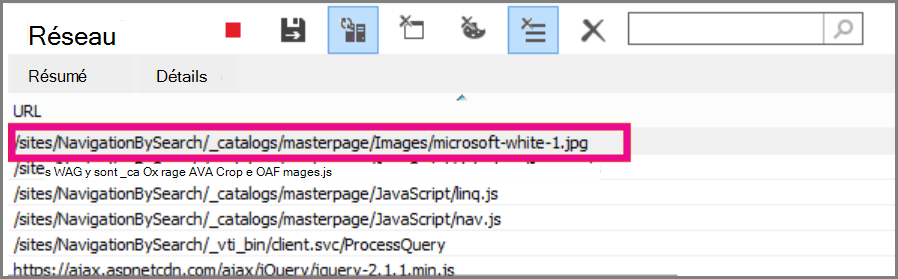
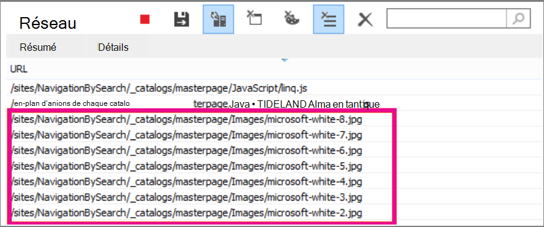

# <a name="delay-loading-images-and-javascript-in-sharepoint-online"></a>Différer le chargement des images et des éléments JavaScript dans SharePoint Online

Cet article explique comment réduire le temps de chargement des pages SharePoint Online à l’aide de JavaScript pour retarder le chargement des images et en attendant de charger javaScript non essentiel jusqu’à ce qu’une fois la page chargée.
  
Les images peuvent affecter négativement les vitesses de chargement des pages sur SharePoint Online. Par défaut, la plupart des navigateurs Internet modernes pré-extraient des images lors du chargement d’une page HTML. Cela peut ralentir inutilement le chargement de la page si les images ne sont pas visibles à l’écran tant que l’utilisateur n’a pas fait défiler vers le bas. Les images peuvent empêcher le navigateur de charger la partie visible de la page. Pour contourner ce problème, vous pouvez utiliser JavaScript pour ignorer le chargement des images en premier. En outre, le chargement de JavaScript non essentiel peut également ralentir les temps de téléchargement sur vos pages SharePoint. Cette rubrique décrit certaines méthodes que vous pouvez utiliser pour améliorer les temps de chargement des pages avec JavaScript dans SharePoint Online.
  
## <a name="improve-page-load-times-by-delaying-image-loading-in-sharepoint-online-pages-by-using-javascript"></a>Améliorer les temps de chargement des pages en retardant le chargement d’images dans les pages SharePoint Online à l’aide de JavaScript

Vous pouvez utiliser JavaScript pour empêcher un navigateur web de pré-extraire des images. Cela accélère le rendu global des documents. Pour ce faire, vous supprimez la valeur de l’attribut src de la balise et vous la \ remplacez par le chemin d’accès à un fichier dans un attribut de données tel que : data-src. Par exemple :
  
```html

```

À l’aide de cette méthode, le navigateur ne télécharge pas les images immédiatement. Si l’image se trouve déjà dans la fenêtre d’affichage, JavaScript indique au navigateur de récupérer l’URL de l’attribut de données et de l’insérer comme valeur pour l’attribut src. L’image se charge uniquement à mesure que l’utilisateur défile et qu’elle est affichée.
  
Pour que tout cela se produise, vous devez utiliser JavaScript.
  
Dans un fichier texte, définissez la fonction **isElementInViewport()** pour vérifier si un élément se trouve dans la partie du navigateur visible par l’utilisateur.
  
```javascript
function isElementInViewport(el) {
  if (!el)
    return false;
  var rect = el.getBoundingClientRect();
  return (
    rect.top >= 0 &amp;&amp;
    rect.left >= 0 &amp;&amp;
    rect.bottom <= (window.innerHeight || document.documentElement.clientHeight) &amp;&amp;
    rect.right <= (window.innerWidth || document.documentElement.clientWidth)
  );
}
```

Ensuite, utilisez **isElementInViewport()** dans la fonction **loadItemsInView().** La fonction **loadItemsInView()** charge toutes les images qui ont une valeur pour l’attribut data-src si elles se trouvent dans la partie du navigateur visible par l’utilisateur. Ajoutez la fonction suivante au fichier texte :
  
```javascript
function loadItemsInView() {
  //Select elements by the row id.
  $("#row [data-src]").each(function () {
      var isVisible = isElementInViewport(this);
      if (isVisible) {
          if ($(this).attr("src") == undefined) {
              $(this).attr("src", $(this).data("src"));
          }
      }
  });
}
```

Enfin, appelez **loadItemsInView()** à partir de **window.onscroll(),** comme indiqué dans l’exemple suivant. Cela garantit que toutes les images qui se trouvent dans la fenêtre d’affichage sont chargées au fur et à mesure que l’utilisateur en a besoin, mais pas avant. Ajoutez ce qui suit au fichier texte :
  
```javascript
//Example of calling loadItemsInView() from within window.onscroll()
$(window).on("scroll", function () {
    loadItemsInView();
});

```

Pour SharePoint Online, vous devez attacher la fonction suivante à l’événement de défilement sur la balise #s4-workspace \<div\> . Cela est dû au fait que les événements de fenêtre sont remplacés afin de garantir que le ruban reste attaché en haut de la page.
  
```javascript
//Keep the ribbon at the top of the page
$('#s4-workspace').on("scroll", function () {
    loadItemsInView();
});
```

Enregistrez le fichier texte sous la forme d’un fichier JavaScript avec l’extension .js, par exemple delayLoadImages.js.
  
Une fois que vous avez terminé d’écrire delayLoadImages.js, vous pouvez ajouter le contenu du fichier à une page maître dans SharePoint Online. Pour ce faire, ajoutez un lien de script à l’en-tête dans la page maître. Une fois qu’il se trouve dans une page maître, le Code JavaScript est appliqué à toutes les pages de votre site SharePoint Online qui utilisent cette mise en page maître. Sinon, si vous envisagez de l’utiliser uniquement sur une page de votre site, utilisez le composant WebPart éditeur de script pour incorporer le Code JavaScript dans la page. Pour plus d’informations, consultez ces rubriques :
  
- [Comment appliquer une page maître à un site dans SharePoint 2013](/sharepoint/dev/general-development/how-to-apply-a-master-page-to-a-site-in-sharepoint)

- [Procédure : Créer une mise en page dans SharePoint 2013](/sharepoint/dev/general-development/how-to-create-a-page-layout-in-sharepoint)

### <a name="example-referencing-the-javascript-delayloadimagesjs-file-from-a-master-page-in-sharepoint-online"></a>Exemple : référencement du fichier delayLoadImages.js JavaScript à partir d’une page maître dans SharePoint Online
  
Pour que cela fonctionne, vous devez également référencer jQuery dans la page maître. Dans l’exemple suivant, vous pouvez voir dans le chargement de page initial qu’il n’y a qu’une seule image chargée, mais qu’il y en a plusieurs autres sur la page.
  

  
La capture d’écran suivante montre le reste des images qui sont téléchargées après leur défilement dans l’affichage.
  

  
Retarder le chargement d’images à l’aide de JavaScript peut être une technique efficace pour augmenter les performances ; Toutefois, si la technique est appliquée sur un site web public, les moteurs de recherche ne sont pas en mesure d’analyser les images de la même façon qu’ils analysent une image régulièrement formée. Cela peut affecter les classements sur les moteurs de recherche, car les métadonnées de l’image elle-même ne sont pas vraiment présentes tant que la page n’est pas chargée. Les analyseurs du moteur de recherche lisent uniquement le code HTML et ne voient donc pas les images comme du contenu sur la page. Les images sont l’un des facteurs utilisés pour classer les pages dans les résultats de la recherche. Une façon de contourner ce problème consiste à utiliser du texte d’introduction pour vos images.
  
## <a name="github-code-sample-injecting-javascript-to-improve-performance"></a>Exemple de code GitHub : Injection de JavaScript pour améliorer les performances

Ne manquez pas l’article et l’exemple de code sur [l’injection JavaScript](https://go.microsoft.com/fwlink/p/?LinkId=524759) fournie sur GitHub.
  
## <a name="see-also"></a>Voir aussi

[Navigateurs pris en charge dans Office 2013 et Applications Microsoft 365 pour les grandes entreprises](https://support.office.com/article/57342811-0dc4-4316-b773-20082ced8a82)
  
[Comment appliquer une page maître à un site dans SharePoint 2013](/sharepoint/dev/general-development/how-to-apply-a-master-page-to-a-site-in-sharepoint)
  
[Procédure : Créer une mise en page dans SharePoint 2013](/sharepoint/dev/general-development/how-to-create-a-page-layout-in-sharepoint)