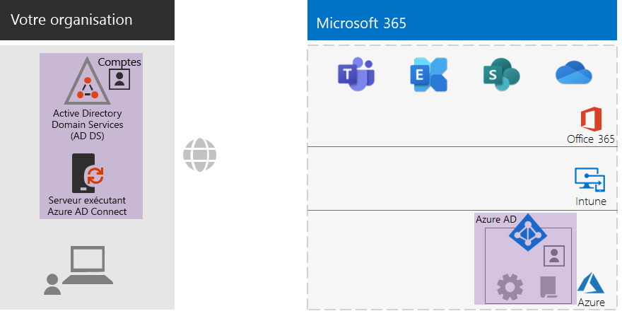
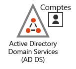
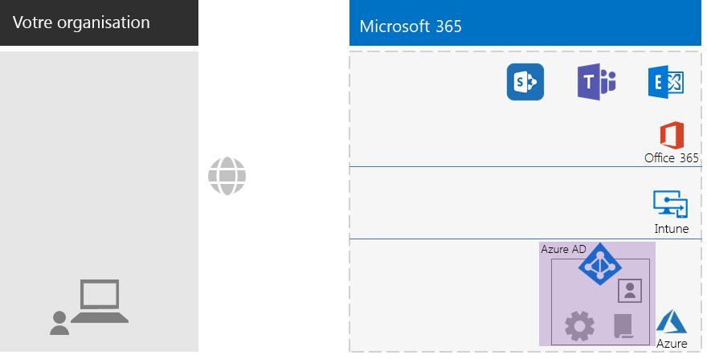
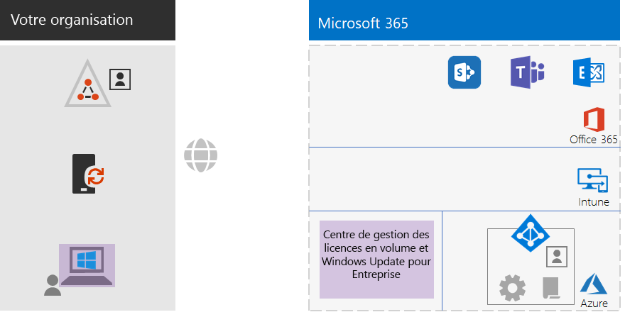
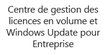
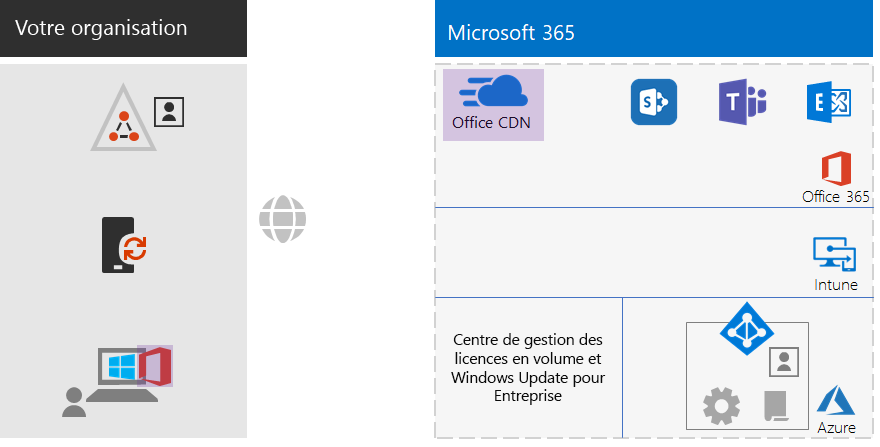
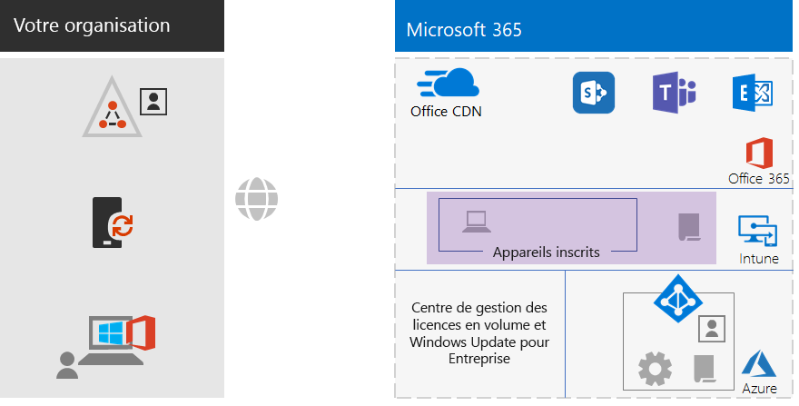
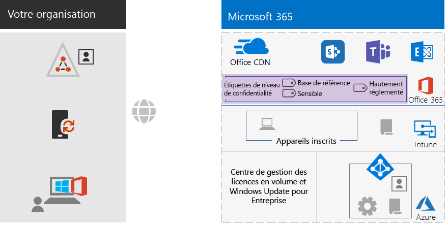
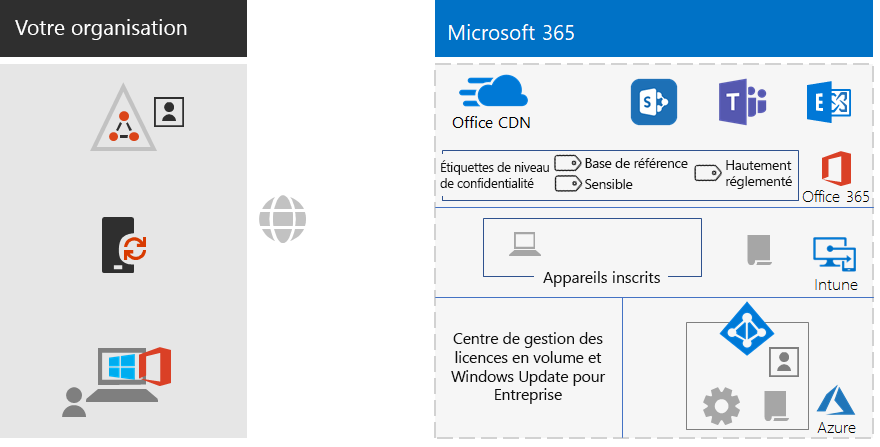

# Infrastructure de base de Microsoft 365 Entreprise pour les non-entreprises

Les organisations tierces peuvent également déployer Microsoft 365 Entreprise et tirer parti de la valeur commerciale d’une infrastructure intégrée et sécurisée qui permet de créer des équipes et de déverrouiller leur créativité. Une entreprise tierce possède généralement :

- Une petite quantité d’infrastructure informatique locale, par exemple, des serveurs de messagerie et de fichiers et un domaine AD DS (Active Directory Domain Services), ou aucune.
- Une petite équipe informatique, la plupart des informaticiens généraux, plutôt que des spécialistes d’une technologie ou d’une charge de travail spécifique telle que la mise en réseau ou la messagerie électronique.

Pour votre organisation de plus petite taille, Microsoft propose [ Microsoft 365 Business](https://www.microsoft.com/microsoft-365/business). Toutefois, il existe des raisons pour lesquelles vous pourriez avoir besoin de Microsoft 365 Entreprise, par exemple :

- Votre organisation a ou aura besoin de plus de 300 licences Microsoft 365, soit la valeur maximale pour Microsoft 365 Business.
- Votre organisation a besoin des fonctionnalités avancées de productivité, de voix, de sécurité et d’analyse qui ne sont pas disponibles avec Microsoft 365 Business.

Cet article vous explique comment simplifier le déploiement de l’infrastructure de base de Microsoft 365 Entreprise adaptée à votre organisation non-entreprise.

## Tout d’abord, configurez votre abonnement

Vous devez configurer les domaines DNS (Domain Name System) pour votre abonnement. Si vous disposez déjà d’un abonnement Office 365, cela devrait être fait. Si ce n’est pas le cas , suivez les instructions de la section [Ajouter un domaine à Office 365](https://docs.microsoft.com/office365/admin/setup/add-domain?view=o365-worldwide).

Vous devez ensuite configurer une sécurité supplémentaire pour Microsoft 365. Suivez les instructions de la section[ configurer l’augmentation de la sécurité](https://docs.microsoft.com/office365/securitycompliance/tenant-wide-setup-for-increased-security).

## Phase 1 : Mise en réseau

Les organisations qui ne sont pas des entreprises ont généralement une connexion Internet locale dans chacun de leurs bureaux et n’utilisent pas de serveur proxy, de pare-feu ou d’autres appareils d’inspection des paquets. De même, dans chacun de ces bureaux, le fournisseur d’accès Internet possède un serveur DNS local. Ainsi, le trafic est dirigé vers les réseaux Microsoft 365 le plus proche du bureau et des utilisateurs locaux.

Par conséquent, il vous suffit de vérifier auprès de votre fournisseur d’accès Internet que la connexion à chaque emplacement de bureau :

- Utilise un serveur DNS local.
- Convient aux besoins actuels et à venir, tandis que vos utilisateurs commencent à utiliser d’autres services Cloud Microsoft 365.

Si vous utilisez des serveurs proxy, des pare-feu ou des appareils d’inspection des paquets, veuillez consulter la page [Infrastructure réseau pour Microsoft 365 Entreprise](networking-infrastructure.md) pour en savoir plus.

### Votre configuration jusqu’à présent

Voici un résumé visuel avec l’élément phase 1 mis en surbrillance. **Votre organisation** peut se répartir entre plusieurs bureaux, chacun d’eux disposant d’une connexion Internet locale avec un fournisseur d’accès Internet qui utilise un serveur DNS local. Grâce au fournisseur d’accès Internet, les utilisateurs de chaque bureau peuvent accéder à l’emplacement réseau Microsoft 365 le plus proche et aux ressources de votre abonnement Microsoft 365.

## Phase 2 : Identité

Chacun des employés de votre organisation doit être en mesure de se connecter, ce qui nécessite un compte d’utilisateur dans le client Azure Active Directory (Azure AD) de votre abonnement Microsoft 365 Entreprise. Les groupes sont ensuite utilisés pour contenir des comptes d’utilisateurs et d’autres groupes afin de communiquer ou d’accéder aux ressources autorisées, telles qu’un site SharePoint Online ou une équipe. 

### Comptes d’administrateur

Protégez les comptes d’utilisateur de votre administrateur général en demandant des mots de passe forts et une authentification multifacteurs (MFA). Voir [Protéger des comptes Administrateur général](identity-designate-protect-admin-accounts.md#protect-global-administrator-accounts) pour plus d’informations.

Si votre organisation requiert un niveau de sécurité élevé et que vous avez Microsoft 365 Entreprise E5, utilisez Azure AD Privileged Identity Management pour activer l’accès administrateur en temps réel. Voir [Configurer des administrateurs généraux à la demande](identity-designate-protect-admin-accounts.md#set-up-on-demand-global-administrators) pour plus d’informations.

### Recommandations pour les groupes

Si vous avez un domaine AD DS local, continuez à utiliser ces groupes dans Microsoft 365 Entreprise comme groupes dans Azure AD.

Si vous n’avez pas de domaine AD DS local, créez des groupes de sécurité dans Azure AD à l’aide de ces niveaux de sécurité.

| Niveau de sécurité | Description | Exemples |
|:-------|:-----|:-----|
| Base de référence | Il s’agit d’une norme minimale pour la protection des données, ainsi que les identités et les appareils qui accèdent à vos données.    Il s’agit généralement de la plupart des données de votre organisation gérées par la plupart de vos utilisateurs. | Groupes pour les travailleurs de premier rang, tels ventes, marketing, service clientèle, administration et fabrication. |
| Sensible | Il s’agit d’une protection supplémentaire pour un sous-ensemble de vos données qui doivent être protégées au-delà du niveau de base. Ces groupes contiennent des utilisateurs qui utilisent et créent des données sensibles propres aux services et projets qui ne sont pas destinés à être mis à la disposition de tout le monde. | Équipes produit ou marketing qui développent de futurs produits |
| Hautement réglementé | Il s’agit du niveau de protection le plus élevé pour un petit nombre de données très classifiées, considérées comme des secrets de propriété intellectuelle ou des secrets commerciaux ou des données qui doivent respecter les réglementations en matière de sécurité. |  Les équipes de recherche, juridiques et financières, tout comme celles qui stockent ou utilisent les données des clients ou des partenaires. |
||||

### Identité hybride

Si vous avez un domaine AD DS local, vous devez synchroniser l’ensemble des comptes d’utilisateurs, des groupes et des contacts de votre domaine avec le locataire Azure AD de votre abonnement Microsoft 365 Entreprise. Pour votre entité non-entreprise, configurez Azure AD Connect sur un serveur avec la synchronisation de hachage de mot de passe. Si vous souhaitez en savoir plus, veuillez consulter la section [Synchroniser les identités](identity-azure-ad-connect.md).

### Plus d’accès utilisateur sécurisé avec stratégies d’accès conditionnel

Azure AD évalue les conditions des connexions utilisateur et peut utiliser les stratégies d’accès conditionnel pour accorder ou refuser l’accès et imposer d’autres actions à entreprendre pour terminer la connexion. Par exemple, si Azure AD détermine que la connexion se produit sous des conditions de risque moyen ou élevé, il peut être nécessaire pour l’utilisateur d’effectuer une authentification multifacteur pour achever la connexion.

Les stratégies d’accès conditionnel s’appliquent à tous les comptes d’utilisateur ou groupes. Pour simplifier l’attribution de stratégies d’accès conditionnel, créez les groupes de sécurité Azure AD suivants au sein de votre organisation :

- BASE DE RÉFÉRENCE

  Contient les groupes ou comptes d’utilisateur pour les utilisateurs ayant accès aux données de base.

- SENSIBLE

  Contient les groupes ou comptes d’utilisateur pour les utilisateurs ayant accès aux données de sensibles.

- HAUTEMENT RÉGLEMENTÉ

  Contient les groupes ou comptes d’utilisateur pour les utilisateurs ayant accès aux données hautement réglementées.

- COND-ACCÈS-EXCLURE

  Un groupe vide que vous pouvez utiliser pour exclure provisoirement un utilisateur des stratégies d’accès conditionnel.

Voici la liste des stratégies d’accès conditionnel Azure AD à activer ou créer.

| Stratégie d’accès conditionnel Azure AD | Groupes auxquels elle s’applique |
|:------|:-----|
| Stratégie de référence: exiger l’authentification multifacteur pour les administrateurs | Cette stratégie s’applique aux rôles d’administrateur, de sorte qu’aucun groupe ne doit être spécifié. Cette stratégie doit juste être activée. Toutes les stratégies suivantes doivent être créées et activées. |
| Bloquer les clients ne prenant pas en charge l’authentification moderne | Dans les paramètres de stratégie, sélectionnez «tous les utilisateurs». |
| Exiger l’authentification multifacteur lorsque les risques de connexion sont moyens ou élevés (requiert Microsoft 365 Entreprise E5) | BASE DE RÉFÉRENCE |
| Exiger l’authentification multifacteur lorsque les risques de connexion sont bas, moyens ou élevés (requiert Microsoft 365 Entreprise E5) | SENSIBLE |
| Toujours exiger l’authentification multifacteur  | HAUTEMENT RÉGLEMENTÉ |
| Exiger des applications approuvées sur les appareils iOS et Android | BASE DE RÉFÉRENCE, SENSIBLE, HAUTEMENT RÉGLEMENTÉ |
| Exiger des PC conformes | BASE DE RÉFÉRENCE |
| Nécessitez des PC conformes et des appareils iOS et Android | SENSIBLE, HAUTEMENT RÉGLEMENTÉ |
|||

Voici la Azure Active Directory Identity Protection (requiert Microsoft 365 Entreprise E5) stratégie de risque pour les utilisateurs à créer et à activer.

| Stratégie d’utilisateur à risque Azure AD Identity Protection | Groupes auxquels elle s’applique |
|:------|:-----|
| Les utilisateurs à risque élevé doivent modifier leur mot de passe | Dans les paramètres de stratégie, sélectionnez «tous les utilisateurs». |
|||

Voir [Stratégies d’accès aux identités et aux appareils communes](identity-access-policies.md) pour les instructions.

### Utiliser des groupes pour faciliter la gestion

Voici quelques fonctionnalités qui vous permettent de simplifier la gestion des groupes et des licences.

| Fonctionnalité | Utilisation |
|:------|:-----|
| Gestion des groupes en libre-service | Autoriser la gestion des groupes Azure AD par les propriétaires de groupes au lieu du personnel informatique. Pour plus d’informations, voir [Gestion des groupes en libre-service](identity-self-service-group-management.md#allow-users-to-create-and-manage-their-own-groups). |
| Appartenance à un groupe dynamique | Configurer l’ajout ou la suppression automatique de comptes d’utilisateurs à partir d’Azure AD Groupes sur la base des attributs de compte d’utilisateur, tels que service ou pays. Pour plus d’informations, voir[appartenance aux groupes dynamiques](identity-self-service-group-management.md#set-up-dynamic-group-membership). |
| Gestion des licences en fonction des groupes  | Utilisez l’appartenance au groupe pour attribuer ou retirer automatiquement des licences aux comptes d’utilisateurs. Pour plus d’informations, voir [gestion des licences basée sur les groupes](identity-self-service-group-management.md#set-up-automatic-licensing). |
|  |  |

Si vous utilisez une licence basée sur les groupes, créez un groupe nommé «sous licence» pour qu’il contienne les noms des comptes d’utilisateurs auxquels une licence Microsoft 365 Entreprise est attribuée.

### Surveiller l’accès utilisateur

Si vous avez Microsoft 365 Entreprise E5, vous pouvez utiliser Azure Active Directory Identity Protection pour contrôler et analyser les connexions de l’utilisateur pour la compromission des informations d’identification. Pour plus d’informations, voir [protéger contre la compromission des informations d’identification](identity-multi-factor-authentication.md#protect-against-credential-compromise).

### Votre configuration jusqu’à présent

Voici une synthèse graphique de la phase Identité pour l’identité hybride. Les nouveaux éléments sont recouverts par un rectangle violet transparent.

 
Ces éléments incluent :
 
|||
|:------:|:-----|
|  | Un domaine AD DS local avec des comptes d’utilisateurs et des groupes. |
|  | Un serveur basé sur Windows exécutant Azure AD Connect. |
|  | L’ensemble synchronisé de comptes et groupes AD DS dans Azure AD. |
|  | Les paramètres Azure AD pour l’authentification, sécurisation des comptes généraux et simplification de la gestion des groupes et des licences. |
|  | Stratégies d’accès conditionnel Azure AD. |
|||

Voici une synthèse graphique de la phase Identité pour l’identité réservée au cloud. Les nouveaux éléments sont recouverts par un rectangle violet transparent.

 
Ces éléments incluent :
 
|||
|:------:|:-----|
|  | Les paramètres Azure AD pour l’authentification, la sécurisation des comptes généraux et la simplification de la gestion des groupes et des licences. |
|  | Stratégies d’accès conditionnel Azure AD. |
|||

## Phase 3 : Windows 10 Entreprise

Voici les options disponibles pour vous assurer que vos appareils Windows 10 Entreprise sont intégrés à l’infrastructure d’identité et de sécurité de Microsoft 365 :

- Hybride (vous avez un domaine AD DS local)

  Veuillez joindre au client Azure AD chaque appareil Windows 10 Entreprise déjà joint à votre domaine AD DS. Pour plus d’informations, consultez [Comment configurer des appareils hybrides joints à Azure Active Directory](https://go.microsoft.com/fwlink/p/?linkid=872870).

  Pour chaque nouvel appareil Windows 10 Entreprise, joignez-le à votre domaine AD DS, puis joignez-le au client Azure AD.

  Pour chaque appareil Windows 10 Entreprise, inscrivez-les pour la gestion des appareils mobiles. Si vous souhaitez en savoir plus, veuillez consulter la page [Inscrire un appareil Windows 10 avec Intune à l'aide d’une stratégie de groupe](https://go.microsoft.com/fwlink/p/?linkid=872871).

- Réservé(e) au cloud (vous n’avez pas de domaine AD DS local)

  Joignez chaque appareil Windows 10 Entreprise au client Azure AD de votre abonnement.

  Si vous souhaitez en savoir plus, veuillez consulter la page [Joindre votre appareil professionnel au réseau de votre organisation](https://docs.microsoft.com/fr-FR/azure/active-directory/user-help/user-help-join-device-on-network).

Une fois installé et joint, chaque appareil Windows 10 Entreprise installe automatiquement les mises à jour à partir du service cloud Windows Update pour les entreprises. Il n’est généralement pas nécessaire dans une organisation qui n’est pas une entreprise de configurer une infrastructure pour distribuer et installer les mises à jour de Windows 10.

### Votre configuration jusqu’à présent

Voici un résumé visuel de la phase Windows 10 Entreprise, avec les nouveaux éléments mis en surbrillance.

 
Voici les nouveaux éléments de Windows 10 Enterprise mis en évidence :

|||
|:------:|:-----|
|  | Windows 10 Entreprise est installé sur les appareils Windows, avec l’ordinateur portable local comme exemple. |
|  | Le Centre de gestion des licences en volume Microsoft, qui fournit des images pour les nouvelles installations de Windows 10 Entreprise, et le service Windows Update pour les entreprises, qui fournit les dernières mises à jour. |
|||

## Phase 4 : Office 365 ProPlus

Microsoft 365 Entreprise inclut Office 365 ProPlus, la version d’abonnement de Microsoft Office. Comme Office 2016 ou Office 2019, Office 365 ProPlus est installé directement sur vos appareils clients. Office 365 ProPlus reçoit toutefois de nouvelles mises à jour qui incluent de nouvelles fonctionnalités régulièrement. Si vous souhaitez en savoir plus, veuillez consulter la page [À propos d'Office 365 ProPlus en entreprise](https://docs.microsoft.com/deployoffice/about-office-365-proplus-in-the-enterprise).

Puisque votre organisation n’est pas une entreprise, installez manuellement Office 365 ProPlus sur vos appareils. Cette opération peut être effectuée dans le cadre de la préparation d’un nouvel appareil, ou par l’utilisateur dans le cadre de ses processus d’intégration.

Dans les deux cas, l’administrateur ou l’utilisateur se connecte au portail Office 365 sur https://portal.office.com. Sous l'onglet **Accueil de Microsoft Office**, cliquez sur **installer Office** et exécutez le processus d’installation.

Les mises à jour de fonctionnalités d’Office 365 ProPlus sont téléchargées chaque mois par chaque ordinateur sur lequel il est installé. Il n’est généralement pas nécessaire dans une organisation autre qu’entreprise de configurer une infrastructure pour distribuer et installer les mises à jour d’Office 365 ProPlus. 

### Votre configuration jusqu’à présent

Voici un résumé visuel de la phase Office 365 ProPlus, avec les nouveaux éléments mis en surbrillance.

 
Ces éléments Office 365 ProPlus incluent :
 
|||
|:------:|:-----|
|  | Office 365 ProPlus est installé sur les appareils, avec l’ordinateur portable local comme exemple. |
|  | Réseau de distribution de contenu (CDN) Office 365 ProPlus, dont les appareils accèdent aux mises à jour d’Office 365 ProPlus. |
|||

## Phase 5 : Gestion des appareils mobiles

Microsoft 365 Entreprise inclut Microsoft Intune pour la gestion des appareils mobiles. Avec Intune, vous pouvez gérer les appareils Windows, iOS, Android, macOS pour protéger l’accès aux ressources de votre organisation, y compris vos données. Intune utilise les comptes d’utilisateurs, de groupes et d’ordinateurs d’Azure AD.

Intune fournit deux types de gestion des appareils mobiles :

- La gestion des périphériques mobiles (MDM) s’avère lorsque les appareils sont inscrits dans Intune. Une fois inscrits, il s’agit de périphériques gérés qui peuvent recevoir les stratégies, règles et paramètres utilisés par votre organisation. Ces types d’appareils sont généralement détenus par votre organisation et émis pour vos employés.

- Les utilisateurs possédant leur propre appareil personnel peuvent ne pas vouloir inscrire leurs appareils ou être gérés par Intune avec vos stratégies et paramètres. Toutefois, vous devez encore protéger les ressources et les données de votre organisation. Pour ce scénario, vous pouvez protéger vos applications à l’aide de la gestion des applications mobiles (GAM).  

Les stratégies Intune peuvent renforcer la conformité des appareils et la protection des applications. Voici la liste des stratégies Intune à créer.

| Stratégies Intune | Groupes auxquels elle s’applique |
|:------|:-----|
| Stratégie de conformité des appareils pour Windows | BASE DE RÉFÉRENCE, SENSIBLE, HAUTEMENT RÉGLEMENTÉ |
| Stratégie de conformité des appareils pour iOS | SENSIBLE, HAUTEMENT RÉGLEMENTÉ |
| Stratégie de conformité des appareils pour macOS | SENSIBLE, HAUTEMENT RÉGLEMENTÉ |
| Stratégie de conformité des appareils pour Android et Android Entreprise | SENSIBLE, HAUTEMENT RÉGLEMENTÉ |
| Stratégie de protection des applications pour iOS | BASE DE RÉFÉRENCE, SENSIBLE, HAUTEMENT RÉGLEMENTÉ |
| Stratégie de protection des applications pour macOS | BASE DE RÉFÉRENCE, SENSIBLE, HAUTEMENT RÉGLEMENTÉ |
| Stratégie de conformité des applications pour Android et Android Entreprise | BASE DE RÉFÉRENCE, SENSIBLE, HAUTEMENT RÉGLEMENTÉ |
|||
    
Voir [Stratégies d’accès aux identités et aux appareils communes](identity-access-policies.md) pour les instructions.

### Votre configuration jusqu’à présent

Voici un résumé visuel de la phase gestion des appareils mobiles, avec les nouveaux éléments mis en surbrillance.

 
Les éléments nouveaux et mis en surbrillance pour la gestion des appareils mobiles incluent :

|||
|:------:|:-----|
|  | Les appareils inscrits dans Intune, avec l’ordinateur portable local exécutant Windows 10 Entreprise comme exemple. |
|  | Les stratégies Intune pour la conformité des appareils et la protection des applications. |
|||

## Phase 6 : Protection des informations

Microsoft 365 Entreprise offre une foule de fonctionnalités de protection des informations qui vous permettent de traiter les données de manière différente en appliquant différents niveaux de gouvernance, de sécurité et de protection. 

Par exemple, une correspondance normale entre la plupart des employés et les documents sur lesquels ils travaillent a besoin d’un niveau de protection de base. Les dossiers financiers, les données client et votre propriété intellectuelle nécessitent un niveau de protection plus élevé.

La première étape de la stratégie en matière de protection des informations consiste à déterminer les niveaux de protection. De nombreuses organisations utilisent ces niveaux, qui sont déjà utilisés pour les stratégies d’accès conditionnel :

- Base de référence

  Les exemples incluent les communications d’entreprise normales (courrier électronique) et les fichiers des collaborateurs de l’administration, des ventes et du support technique.

- Sensible

  Les exemples incluent des informations financières et juridiques ainsi que les données de recherche et de développement de nouveaux produits.

- Hautement réglementé

  Les exemples incluent les informations d’identification personnelle des clients et partenaires ainsi que la propriété financière ou intellectuelle de votre organisation.

En fonction de ces niveaux de sécurité des données, l’étape suivante consiste à identifier et implémenter :

- Types d’informations sensibles personnalisés

  Microsoft 365 fournit une large sélection de types d’informations sensibles, tels que les numéros de sécurité sociale et de carte bancaire. Si vous ne trouvez le type d’informations dont vous avez besoin dans la liste fournie, vous pouvez en créer un.

- Étiquettes de rétention

  Pour se conformer aux stratégies d’organisation et aux réglementations régionales, il se peut que vous deviez spécifier la durée de rétention de certains types de documents ou documents comportant des contenus spécifiques. Vous pouvez mettre en œuvre ceci pour la messagerie et le document à l’aide d’étiquettes de rétention.

- Étiquettes de niveau de confidentialité

  Vous pouvez étiqueter les messages électroniques ou les documents avec une étiquette de confidentialité nommée de sorte que les niveaux de sécurité supplémentaires puissent être appliqués. Il s’agit par exemple de filigranes, de chiffrements et d’autorisations qui spécifient les personnes autorisées à accéder au courrier électronique ou au document et ce qu’ils sont autorisés à faire.

Pour plus d’informations, voir [types de classification Microsoft 365](infoprotect-configure-classification.md#microsoft-365-classification-types).

Si vous utilisez des étiquettes de confidentialité avec des autorisations, vous devrez peut-être créer des groupes de sécurité Azure AD supplémentaires pour définir les personnes autorisées à effectuer des tâches dans les messages électroniques et les documents. 

Par exemple, vous devez créer une étiquette de confidentialité de RECHERCHE pour protéger les messages électroniques et les documents de votre équipe de recherche. À vous de déterminer les éléments suivants :

- Les chercheurs doivent avoir la possibilité pour modifier les documents signalés par l’étiquette de confidentialité de la recherche.
- Les employés qui ne sont pas chercheurs doivent uniquement avoir la possibilité de voir les documents signalés par l’étiquette de confidentialité de la recherche. 

Cela signifie que vous devez créer et gérer deux groupes supplémentaires :

- RECHERCHE-TOUT
- RECHERCHE-LECTURE

Ces groupes et leurs autorisations font partie de la configuration de l’étiquette de confidentialité de la RECHERCHE.

Pour les étiquettes de confidentialité configurées avec les autorisations basées sur les groupes, vous devez gérer l’appartenance à ces groupes.

### Votre configuration jusqu’à présent

Voici un résumé visuel de la phase de protection des informations, avec les nouveaux éléments mis en surbrillance.

 
Les éléments nouveaux et mis en surbrillance protection des informations incluent :
 
|||
|:------:|:-----|
|  | Étiquettes de confidentialité pour les trois niveaux de sécurité que les utilisateurs peuvent appliquer aux documents. |
|||

Les étiquettes de rétention et les types d’informations personnalisées ne sont pas affichés.

## Intégration

Avec l’infrastructure Microsoft 365 Entreprise en place, vous pouvez facilement intégrer vos employés.

### Un nouvel appareil Windows 10 Entreprise

Avant d’attribuer à un employé un nouvel appareil Windows 10 Entreprise, procédez comme suit :

- Pour l’identité hybride

  Joignez l’appareil à votre AD DS, joignez l’appareil à votre client Azure AD, puis inscrivez l’appareil dans Intune.

- Pour l’identité réservée au cloud

  Joignez l’appareil au client Azure AD de votre abonnement Microsoft 365 Entreprise.

### Employé existant avec un compte d’utilisateur AD DS

Dans le cadre de l’intégration initiale de votre organisation lors de l’utilisation de l’identité hybride, ajoutez le compte d’utilisateur AD DS à ces groupes Azure AD :

- SOUS LICENCE
- Les groupes de sécurité AD DS ou Azure AD appropriés qui sont membres des groupes Azure AD de référence, sensibles et hautement réglementés
- Groupes d’étiquettes de confidentialité (selon vos besoins)

L’employé existant doit déjà être ajouté aux groupes de travail appropriés, département et AD DS régional.

Vous pouvez ajouter un compte d’utilisateur à plusieurs groupes Azure AD dans le centre d’administration Microsoft 365. Dans les propriétés du compte d’utilisateur, cliquez sur **Gérer les groupes > Ajouter des groupes**.

Si vous voulez utiliser PowerShell, consultez ce [classeur Excel téléchargeable](https://github.com/MicrosoftDocs/microsoft-365-docs/blob/public/microsoft-365/enterprise/media/Group-License-Mgmt-PowerShell.xlsx?raw=true)qui génère les commandes PowerShell sur la base d’un compte d’utilisateur spécifié et des noms de groupes sélectionnés.

### Nouvel employé avec un compte réservé au cloud.

Dans le cadre de l’intégration initiale de votre organisation lors de l’utilisation de l’identité cloud uniquement, ajoutez le compte d’utilisateur à ces groupes :

- SOUS LICENCE
- Les groupes de sécurité Azure AD appropriés qui sont membres des groupes Azure AD de référence, sensibles et hautement réglementés
- Groupes de travail, départementaux et régionaux
- Groupes d’étiquettes de confidentialité (selon vos besoins)

### Première connexion à Microsoft 365

Lorsque les employés se connectent à Microsoft 365, donnez-leur l’instruction suivante :

1. Connectez-vous à leurs appareils à l’aide de leurs informations d’identification de compte d’utilisateur.
2. À l’aide d’un navigateur, connectez-vous au portail Office 365 surhttps://portal.office.com.
3. À partir de l’onglet**Accueil Office 365**, cliquez sur **installer Office** pour installer Office 365 ProPlus sur leur appareil.

## Résultats de fin

Voici les résultats de la configuration de l’infrastructure de base Microsoft 365 Entreprise pour votre organisation non-entreprise.

### Résultats de l’infrastructure

Une fois que vous avez créé et configuré votre infrastructure Microsoft 365 Entreprise, vous devez disposer des éléments suivants :

- Une connexion Internet locale pour chacun de vos bureaux avec une bande passante suffisante fournie par un fournisseur d’accès Internet qui utilise un serveur DNS local.
- Pour l’identité hybride, Azure AD Connect se connecte sur un serveur qui synchronise votre domaine AD DS local avec votre client Azure AD.
- Ces groupes :
  - SOUS LICENCE
  - COND-ACCÈS-EXCLURE
  - Les groupes de sécurité AD DS ou Azure AD appropriés qui sont membres des groupes Azure AD de référence, sensibles et hautement réglementés 
  - Groupes de travail, départementaux et régionaux
  - Groupes d’étiquettes de confidentialité (selon vos besoins)
- Les stratégies d’accès conditionnel de la connexion Azure AD qui utilisent les groupes Azure AD de référence, sensibles, hautement réglementés et cond-accès-exclure.
- Stratégies de conformité des applications Intune et des appareils.
- Types d’informations sensibles personnalisés pour la protection contre la perte de données (selon vos besoins).
- Étiquettes de rétention (selon vos besoins).
- Étiquettes de niveau de confidentialité (selon vos besoins).

Voici un résumé visuel de l’infrastructure si votre organisation utilise l’identité hybride, qui inclut votre domaine AD DS, un serveur Azure AD Connect et les utilisateurs et groupes AD DS synchronisés.

 
Voici un résumé visuel de l’infrastructure si votre organisation utilise l’identité Cloud uniquement.
 

### Résultats des employés

Après leur intégration, chaque employé doit avoir :

- Un chemin réseau performant et local à partir de leur appareil vers les services Cloud de Microsoft 365 dans leur région.
- Un compte utilisateur avec ces appartenances :
   - SOUS LICENCE
   - Les groupes de sécurité AD DS ou Azure AD appropriés qui sont membres des groupes Azure AD de référence, sensibles et hautement réglementés pour les stratégies d’accès conditionnel 
   - Les groupes de travail, départementaux et régionaux appropriés
   - Groupes d’étiquettes de confidentialité (selon vos besoins)
- Un appareil Windows 10 Entreprise qui :
   - Est joint au client Azure AD (Cloud uniquement) ou au client Azure AD et à votre domaine AD DS (hybride).
   - Se met automatiquement à jour avec les dernières améliorations apportées à la sécurité et aux améliorations apportées aux produits Windows 10 Entreprise.
   - A installé Office 365 ProPlus, qui se met automatiquement à jour avec les dernières améliorations apportées aux produits Office et aux améliorations de la sécurité.
   - Est inscrit dans Intune et soumis aux stratégies de conformité avec les appareils Intune et les stratégies de protection des applications.

## Étape suivante

Déployez vos [charges de travail et scénarios](deploy-workloads.md) pour tirer parti des fonctionnalités et de la configuration de votre infrastructure Microsoft 365 Entreprise.
