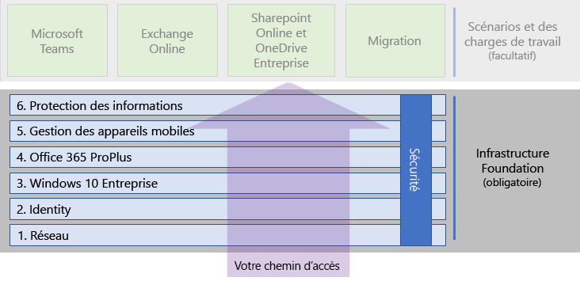

# Infrastructure de base de Microsoft 365 Entreprise

Si vous faites le déploiement de bout à bout de Microsoft 365 Entreprise vous-même, vous devez tout d’abord créer une base solide sur laquelle les applications et services reposent et peuvent déverrouiller la créativité et le travail d’équipe dans un environnement sécurisé. Cette base est parfois appelée *déploiement de base*.

Pour une trajectoire définie pour le déploiement bout à bout, vous pouvez utiliser chacune de ces phases pour planifier et déployer l’infrastructure de base de Microsoft 365 Entreprise :

| | Phase | Résultats |
|:-------|:-----|:-----|
||[Phase 1 : Mise en réseau](networking-infrastructure.md)| Votre réseau est optimisé pour l’accès aux services de Microsoft 365 basés sur le cloud. |
||[Phase 2 : Identité](identity-infrastructure.md)| Vos comptes d’administrateur sont protégés, vos utilisateurs et groupes sont synchronisés, et l’authentification utilisateur est forte. |
||[Phase 3 : Windows 10 Entreprise](windows10-infrastructure.md)| Vos ordinateurs exécutant Windows 10 ou Windows 10 peuvent bénéficier d’une mise à niveau vers Windows 10 Entreprise, et les nouveaux appareils sont installés avec Windows 10 Entreprise. |
||[Phase 4 : Office 365 ProPlus](office365proplus-infrastructure.md)| Vos utilisateurs existants de Microsoft Office peuvent bénéficier d’une mise à niveau vers Office 365 ProPlus. |
||[Phase 5 : Gestion des appareils mobiles](mobility-infrastructure.md)| Vos appareils peuvent être inscrits et gérés. |
||[Phase 6 : Protection des informations](infoprotect-infrastructure.md)| Les fonctionnalités de sécurité d’Office 365 sont activées et vos étiquettes et stratégies sont prêtes à protéger les documents et les courriers. |

Les phases commencent avec le plus fondamental (mise en réseau et identité), puis créer des couches de paramètres d’infrastructure et des groupes :

- Installer la version la plus actuelle et sécurisée de Windows sur vos appareils et la tenir à jour.
- Installer la version la plus actuelle et sécurisée de Microsoft Office sur vos appareils et la tenir à jour.
- Gérer les appareils de votre organisation et leur accès aux applications.
- Protéger les informations sur ces appareils et dans le cloud.

Toutefois, vous avez la possibilité de configurer et déployer les phases ou étapes en phases pour les adapter à vos ressources informatiques et aux besoins de votre entreprise.

- **Si vous êtes une entreprise de petite taille ou jeune**, suivez les phases selon vos besoins pour assembler votre infrastructure méthodiquement. Pour un déploiement simplifié pour structures autres que les entreprises, cliquez [ici](deploy-foundation-infrastructure-non-enterprises.md).

-  **Si vous êtes une organisation d’entreprise**, envisagez les phases comme des couches de l’infrastructure informatique, plutôt qu’une trajectoire définie et déterminez comment mieux travailler sur pour une adhérence finale à la configuration requise pour chaque couche au sein de votre organisation.

À la fin de chaque phase, vous devez examiner ses *critères de sortie*, qui incluent des conditions requises que vous devez respecter et des conditions facultatives à prendre en considération. Les critères de sortie pour chaque phase garantissent que votre version locale et infrastructure cloud et la configuration de bout à bout résultante répondent à la configuration requise pour un déploiement de Microsoft 365 Entreprise.

Pour voir comment le contenu est structuré, regardez cette courte vidéo.

> [!VIDEO https://www.microsoft.com/videoplayer/embed/RE23VRG]

Voici l’infrastructure de base dans le guide de déploiement global de Microsoft 365 Entreprise :

## En un coup d’œil

L’[affiche Microsoft 365 Enterprise Foundation infrastructure](media/deploy-foundation-infrastructure/Microsoft365EnterpriseFoundInfra.pdf) est un emplacement central où vous pouvez voir, pour chaque phase :

- Les objectifs généraux de la phase pour les administrateurs et les utilisateurs
- Les services, les fonctionnalités et les outils
- Les décisions clés de la conception pour la planification
- Les résultats de la configuration
- Le processus d’intégration des nouveaux utilisateurs
- Comment surveiller et mettre à jour

Pour télécharger une copie de l’affiche, cliquez [ici](https://github.com/MicrosoftDocs/microsoft-365-docs/raw/public/microsoft-365/enterprise/media/deploy-foundation-infrastructure/Microsoft365EnterpriseFoundInfra.pdf).

## Configuration de l’infrastructure vs processus de déploiement utilisateur

L’infrastructure de base est un ensemble de logiciels et services configurés qui, lorsqu’ils sont combinés ensemble pour un utilisateur, lui permet de tirer parti du spectre entier de compétences et protections que propose Microsoft 365 Entreprise. La destination finale de votre route de déploiement de bout en bout est que cette infrastructure s’applique à tous vos utilisateurs et leurs appareils Windows. 

Toutefois, il est important de noter que l’infrastructure de base Microsoft 365 Entreprise est indépendante du déploiement de logiciels et services à vos utilisateurs. ***Vous pouvez configurer les couches de l’infrastructure de base sans avoir à mettre en place ces couches à l’ensemble de vos utilisateurs.***

Il est possible de configurer, tester et piloter les éléments de l’infrastructure de base bien avant le processus de déploiement de ces éléments à la diversité de vos utilisateurs dans les bureaux, les régions ou les divisions de votre organisation.

Par exemple, vous créez les paramètres pour :

| Phase | Résultats |
|:-------|:-----|
| Identité | Synchronisation des comptes et des groupes pour les stratégies d’accès conditionnel basé sur l’identité. |
| Windows 10 Entreprise | Groupes de mise à niveau automatique pour les ordinateurs exécutant Windows 7 ou Windows 8.1 vers Windows 10 Entreprise en place. |
| Office 365 ProPlus | Groupes pour déployer automatiquement Office 365 ProPlus pour les utilisateurs avec Office 2010, Office 2013 ou Office 2016. |
| Gestion des appareils mobiles | Groupes pour l’inscription des appareils et stratégies d’accès conditionnel basé sur l’appareil. |
| Protection des informations | Groupes pour les étiquettes de confidentialité d’Office 365. |

Lorsque vous êtes prêt à déployer des éléments de cette infrastructure à des utilisateurs, vous :

| Phase | Action de déploiement |
|:-------|:-----|
| Identité | Ajouter des comptes d’utilisateurs à des groupes pour les stratégies d’accès conditionnel basé sur l’identité. |
| Windows 10 Entreprise | Ajouter des comptes aux groupes pour le déploiement automatique de Windows 10 Entreprise en place pour les utilisateurs avec Windows 7 ou Windows 8.1. |
| Office 365 ProPlus | Groupes pour le déploiement automatique de Office 365 ProPlus pour les utilisateurs avec Office 2010, Office 2013 ou Office 2016. |
| Gestion des appareils mobiles | Ajouter des comptes aux groupes pour l’inscription des appareils et stratégies d’accès conditionnel basé sur l’appareil. |
| Protection des informations | Ajoutez des comptes d’utilisateur aux groupes pour les étiquettes de confidentialité. |

Une fois les phases ou les éléments de l’infrastructure de base terminés, testés et pilotés, vous pouvez mettre en place des logiciels installés, comme Windows 10 Entreprise et Office 365 ProPlus et les services et protections basés sur le cloud, tels que l’inscription des appareils et stratégies d’accès conditionnel, à vos utilisateurs de la manière la mieux adaptée à vos objectifs professionnels et ressources informatiques.

## Stratégies de gestion de projet et déploiement

Pour vous donner quelques idées sur la façon de s’essayer à la gestion de projet des différentes phases de l’infrastructure de base pour les utilisateurs pilotes et le reste de votre organisation, voir [stratégies de déploiement](deployment-strategies-microsoft-365-enterprise.md).

## Déploiement pour des structures différentes des entreprises

Si votre organisation est plus petite et que Microsoft 365 Entreprise n’est pas adapté à vos besoins, consultez la section [Déploiement pour les structures autres que les entreprises](deploy-foundation-infrastructure-non-enterprises.md) pour une méthode de déploiement simplifiée.

## Étape suivante

| Où je suis | Où je dois aller |
|:-------|:-----|
| J’ai une infrastructure existante pour Office 365, Enterprise Mobility + Security (EMS) ou Windows 10 Entreprise | Commencez par [Déployer l’infrastructure existante](deploy-with-existing-infrastructure.md), qui vous guide dans les critères de sortie de chaque phase. |
| Je commence à zéro comme entreprise | Commencer votre route de déploiement de bout à bout avec [Phase 1 : mise en réseau](networking-infrastructure.md). |
| Je commence à zéro ailleurs que dans une entreprise | Commencer votre route de déploiement de bout à bout avec [Déploiement pour les structures autres que les entreprises](deploy-foundation-infrastructure-non-enterprises.md). |
