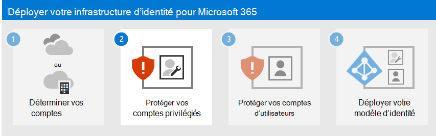

# Étape 1. Déterminer votre modèle d’identité cloud

Microsoft 365 utilise Azure Active Directory (Azure AD), un service d’authentification et d’identité d’utilisateur basé sur le cloud inclus dans votre abonnement Microsoft 365, pour gérer les identités et l’authentification pour Microsoft 365. Il est essentiel de configurer correctement votre infrastructure d’identité pour gérer l’accès et les autorisations des utilisateurs Microsoft 365 pour votre organisation.

Avant de commencer, regardez cette vidéo pour obtenir une vue d’ensemble des modèles d’identité et de l’authentification pour Microsoft 365.

 

> [!VIDEO https://www.microsoft.com/videoplayer/embed/RE2Pjwu]

Votre premier choix de planification est votre modèle d’identité cloud.

## Modèles d’identité cloud Microsoft

Pour planifier des comptes d’utilisateur, vous devez d’abord comprendre les deux modèles d’identité dans Microsoft 365. Vous pouvez gérer les identités de votre organisation uniquement dans le cloud, ou vous pouvez gérer vos identités AD DS (Domain Services) Active Directory local et les utiliser pour l’authentification lorsque les utilisateurs accèdent aux services cloud Microsoft 365.

Voici les deux types d’identité et leur meilleur ajustement et avantages.

| Attribut | Identité cloud uniquement | Identité hybride |
|:-------|:-----|:-----|
| **Définition** | Le compte d’utilisateur existe uniquement dans le locataire Azure AD pour votre abonnement Microsoft 365. | Le compte d’utilisateur existe dans AD DS et une copie se trouve également dans le locataire Azure AD pour votre abonnement Microsoft 365. Le compte d’utilisateur dans Azure AD peut également inclure une version hachée du mot de passe du compte d’utilisateur AD DS déjà haché. |
| **Comment Microsoft 365 authentifie les informations d’identification de l’utilisateur** | Le locataire Azure AD pour votre abonnement Microsoft 365 effectue l’authentification avec le compte d’identité cloud. | Le locataire Azure AD de votre abonnement Microsoft 365 gère le processus d’authentification ou redirige l’utilisateur vers un autre fournisseur d’identité. |
| **Recommandé pour** | Organisations qui n’ont pas ou ont besoin d’un service AD DS local. | Organisations utilisant AD DS ou un autre fournisseur d’identité. |
| **Plus grand avantage** | Simple à utiliser. Aucun serveur ou outil d’annuaire supplémentaire n’est requis. | Les utilisateurs peuvent utiliser les mêmes informations d’identification lors de l’accès aux ressources locales ou cloud. |
||||

## Identité cloud uniquement

Une identité cloud uniquement utilise les comptes utilisateur qui existent uniquement dans Azure AD. L’identité cloud uniquement est généralement utilisée par les petites organisations qui n’ont pas de serveurs locaux ou qui n’utilisent pas AD DS pour gérer les identités locales.

Voici les composants de base de l’identité cloud uniquement.

Les utilisateurs locaux et distants (en ligne) utilisent leurs comptes d’utilisateur et mots de passe Azure AD pour accéder aux services cloud Microsoft 365. Azure AD authentifie les informations d'identification de l'utilisateur en fonction de son compte utilisateur et de son mot de passe stockés.

### Administration
Étant donné que les comptes d’utilisateur sont stockés uniquement dans Azure AD, vous gérez les identités cloud avec des outils tels que les [Centre d'administration Microsoft 365](/admin) et [les Windows PowerShell](manage-user-accounts-and-licenses-with-microsoft-365-powershell.md).

## Identité hybride

L’identité hybride utilise des comptes qui proviennent d’un service AD DS local et qui ont une copie dans le locataire Azure AD d’un abonnement Microsoft 365. La plupart des modifications, à l’exception des [attributs de compte spécifiques](/azure/active-directory/hybrid/reference-connect-sync-attributes-synchronized), ne s’effectuent qu’à sens unique. Les modifications apportées aux comptes d’utilisateur AD DS sont synchronisées avec leur copie dans Azure AD.

Azure AD Connect fournit la synchronisation de compte en cours. Il s’exécute sur un serveur local, recherche les modifications apportées à AD DS et transfère ces modifications à Azure AD. Azure AD Connect permet de filtrer les comptes qui sont synchronisés et s’il faut synchroniser une version hachée des mots de passe utilisateur, appelée synchronisation de hachage de mot de passe (PHS).

Lorsque vous implémentez une identité hybride, votre AD DS local représente la source de référence pour les informations sur le compte. Cela signifie que vous effectuez des tâches d’administration principalement locales, qui sont ensuite synchronisées avec Azure AD.

Voici les composants de l’identité hybride.

Le locataire Azure AD a une copie des comptes AD DS. Dans cette configuration, les utilisateurs locaux et distants qui accèdent aux services cloud Microsoft 365 s’authentifient auprès d’Azure AD.

> [!NOTE]
> Vous devez toujours utiliser Azure AD Connect pour synchroniser les comptes d’utilisateur pour l’identité hybride. Vous avez besoin des comptes d’utilisateur synchronisés dans Azure AD pour effectuer l’attribution de licences et la gestion des groupes, configurer des autorisations et d’autres tâches administratives impliquant des comptes d’utilisateur.

### Synchronisation d’identités et d’annuaires hybrides pour Microsoft 365

En fonction des besoins de votre entreprise et des exigences techniques, le modèle d’identité hybride et la synchronisation d’annuaires sont le choix le plus courant pour les clients d’entreprise qui adoptent Microsoft 365. La synchronisation d’annuaires vous permet de gérer les identités dans votre services de domaine Active Directory (AD DS) et toutes les mises à jour des comptes d’utilisateur, des groupes et des contacts sont synchronisées avec le locataire Azure Active Directory (Azure AD) de votre abonnement Microsoft 365.

>[!Note]
>Lorsque les comptes d’utilisateur AD DS sont synchronisés pour la première fois, ils ne reçoivent pas automatiquement de licence Microsoft 365 et ne peuvent pas accéder aux services Microsoft 365, tels que les e-mails. Vous devez d'abord leur attribuer un emplacement d'utilisation. Ensuite, attribuez une licence à ces comptes d'utilisateurs, soit individuellement, soit dynamiquement via l'appartenance à un groupe.
>

#### Authentification pour l’identité hybride

Il existe deux types d'authentification lors de l'utilisation du modèle d'identité hybride :

- Authentification managée

  Azure AD gère le processus d’authentification à l’aide d’une version de hachage stockée localement du mot de passe ou envoie les informations d’identification à un agent logiciel local à authentifier par le service AD DS local.

- Authentification fédérée

  Azure AD redirige l'ordinateur client demandant l'authentification vers un autre fournisseur d'identité.

#### Authentification managée

Il existe deux types d'authentification gérée :

- Synchronisation de hachage de mot de passe (PHS)

  Azure AD effectue l’authentification elle-même.

- Authentification directe (PTA)

  Azure AD dispose d’AD DS pour effectuer l’authentification.

##### Synchronisation de hachage de mot de passe (PHS)

Avec PHS, vous synchronisez vos comptes d’utilisateur AD DS avec Microsoft 365 et gérez vos utilisateurs localement. Les hachages des mots de passe utilisateur sont synchronisés entre votre service AD DS et Azure AD afin que les utilisateurs aient le même mot de passe en local et dans le cloud. Il s’agit du moyen le plus simple d’activer l’authentification pour les identités AD DS dans Azure AD. 

Lorsque les mots de passe sont modifiés ou réinitialisés localement, les nouveaux hachages de mot de passe sont synchronisés avec Azure AD afin que vos utilisateurs puissent toujours utiliser le même mot de passe pour les ressources cloud et les ressources locales. Les mots de passe utilisateur ne sont jamais envoyés à Azure AD ou stockés dans Azure AD en texte clair. Certaines fonctionnalités Premium d’Azure AD, telles que Identity Protection, nécessitent PHS, quelle que soit la méthode d’authentification sélectionnée.
  
Consultez [le choix de la méthode d’authentification appropriée](/azure/active-directory/hybrid/choose-ad-authn) pour en savoir plus.
  
##### Authentification directe (PTA)

PTA fournit une validation de mot de passe simple pour les services d’authentification Azure AD à l’aide d’un agent logiciel s’exécutant sur un ou plusieurs serveurs locaux pour valider les utilisateurs directement avec votre service AD DS. Avec PTA, vous synchronisez les comptes d’utilisateur AD DS avec Microsoft 365 et gérez vos utilisateurs localement. 

PTA permet à vos utilisateurs de se connecter à des ressources et applications locales et Microsoft 365 à l’aide de leur compte et mot de passe locaux. Cette configuration valide les mots de passe des utilisateurs directement par rapport à votre AD DS local sans stocker les hachages de mot de passe dans Azure AD. 

PTA est également destiné aux organisations qui ont une exigence de sécurité pour appliquer immédiatement les états de compte d’utilisateur locaux, les stratégies de mot de passe et les heures d’ouverture de session. 
  
Consultez [le choix de la méthode d’authentification appropriée](/azure/active-directory/hybrid/choose-ad-authn) pour en savoir plus.
  
##### Authentification fédérée

L’authentification fédérée est principalement destinée aux grandes entreprises qui ont des exigences d’authentification plus complexes. Les identités AD DS sont synchronisées avec Microsoft 365 et les comptes d’utilisateurs sont gérés localement. Avec l’authentification fédérée, les utilisateurs ont le même mot de passe en local et dans le cloud, et ils n’ont pas besoin de se reconnecter pour utiliser Microsoft 365. 

L’authentification fédérée peut répondre à des exigences d’authentification supplémentaires, telles que l’authentification par carte à puce ou une authentification multifacteur tierce, et elle est généralement requise lorsque les organisations ont une exigence d’authentification non prise en charge en mode natif par Azure AD.
 
Consultez [le choix de la méthode d’authentification appropriée](/azure/active-directory/hybrid/choose-ad-authn) pour en savoir plus.
  
Pour les fournisseurs d’identité et d’authentification tiers, les objets d’annuaire locaux peuvent être synchronisés avec Microsoft 365 et l’accès aux ressources cloud qui sont principalement gérés par un fournisseur d’identité (IdP) tiers. Si votre organisation utilise une solution de fédération tierce, vous pouvez configurer l’authentification avec cette solution pour Microsoft 365 à condition que la solution de fédération tierce soit compatible avec Azure AD.
  
Pour en savoir plus, consultez la [liste de compatibilité de fédération Azure AD](/azure/active-directory/connect/active-directory-aadconnect-federation-compatibility) .
  
### Administration

Étant donné que les comptes d’utilisateurs d’origine et faisant autorité sont stockés dans AD DS local, vous gérez vos identités avec les mêmes outils que vous gérez votre AD DS.

Vous n’utilisez pas le Centre d'administration Microsoft 365 ou PowerShell pour Microsoft 365 pour gérer les comptes d’utilisateur synchronisés dans Azure AD.

## Étape suivante

Passez à [l’étape 2](protect-your-global-administrator-accounts.md) pour sécuriser vos comptes d’administrateur général.
