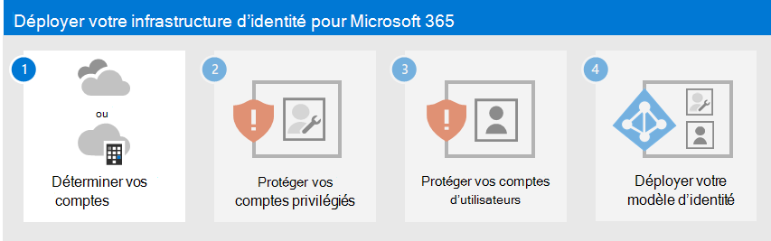

# Déployer votre infrastructure d’identité pour Microsoft 365

Dans Microsoft 365 pour entreprise, une infrastructure d’identité bien planifiée et exécutée ouvre la voie à une sécurité renforcée, notamment en limitant l’accès à vos charges de travail de productivité et à leurs données uniquement aux utilisateurs et appareils authentifiés. La sécurité des identités est un élément clé d’un déploiement Confiance nulle, dans lequel toutes les tentatives d’accès aux ressources locales et dans le cloud sont authentifiées et autorisées.

Pour plus d’informations sur les fonctionnalités d’identité de chaque Microsoft 365 pour les entreprises, le rôle d’Azure Active Directory (Azure AD), les composants locaux et cloud, ainsi que les configurations d’authentification les plus courantes, consultez [l’affiche Infrastructure](../downloads/m365e-identity-infra.pdf) d’identité.

Passez en revue cette affiche de deux pages pour en savoir plus rapidement sur les concepts d’identité et les configurations pour Microsoft 365 pour les entreprises.

Vous pouvez [télécharger cette affiche](https://github.com/MicrosoftDocs/microsoft-365-docs/raw/public/microsoft-365/downloads/m365e-identity-infra.pdf) et l’imprimer au format lettre, légal ou tabloïd (11 x 17).

Cette solution est la première étape pour créer la pile de déploiement Microsoft 365 Confiance nulle.

Pour plus d’informations, consultez le [plan de déploiement microsoft 365 Confiance nulle](/microsoft-365/security/microsoft-365-zero-trust).

## Qu’y a-t-il dans cette solution ?

Cette solution vous guide tout au long du déploiement d’une infrastructure d’identité pour votre locataire Microsoft 365 afin de fournir l’accès à vos employés et la protection contre les attaques basées sur l’identité.

Les étapes de cette solution sont les suivantes :

1. [Déterminez votre modèle d’identité.](deploy-identity-solution-identity-model.md)
2. [Protégez vos comptes privilégiés Microsoft 365.](protect-your-global-administrator-accounts.md)
3. [Protégez vos comptes d’utilisateur Microsoft 365.](microsoft-365-secure-sign-in.md)
4. [Déployez votre modèle d’identité.](cloud-only-identities.md)

Cette solution prend en charge les principes clés de [Confiance nulle](https://www.microsoft.com/security/business/zero-trust/) :

- **Vérifiez explicitement :** Toujours authentifier et autoriser en fonction de tous les points de données disponibles.
- **Utilisez l’accès selon le privilège minimum :** Limitez l’accès des utilisateurs avec un accès juste-à-temps et juste-suffisant (JIT/JEA), des stratégies adaptatives basées sur les risques et la protection des données.
- **Supposons une violation :** Réduisez le rayon d’explosion et l’accès aux segments. Vérifiez le chiffrement de bout en bout et utilisez l’analyse pour obtenir la visibilité, détecter les menaces et améliorer les défenses.

Contrairement à l’accès intranet classique, qui approuve tout ce qui se trouve derrière le pare-feu d’une organisation, La confiance zéro traite chaque connexion et accès comme s’il provenait d’un réseau non contrôlé, qu’il se trouve derrière le pare-feu de l’organisation ou sur Internet. La confiance zéro nécessite une protection pour le réseau, l’infrastructure, les identités, les points de terminaison, les applications et les données.

## Fonctionnalités de Microsoft 365

Azure AD fournit une suite complète de fonctionnalités de gestion des identités et de sécurité pour votre locataire Microsoft 365.

|Fonctionnalité|Description|Licence|
|---|---|---|
|[Authentification multifacteur (MFA)](/azure/active-directory/authentication/concept-mfa-howitworks)|L’authentification multifacteur exige que les utilisateurs fournissent deux formes de vérification, telles qu’un mot de passe d’utilisateur et une notification de l’application Microsoft Authenticator ou un appel téléphonique. L’authentification multifacteur réduit considérablement le risque que les informations d’identification volées puissent être utilisées pour accéder à votre environnement. Microsoft 365 utilise le service Azure AD Multi-Factor Authentication pour les connexions MFA.|Microsoft 365 E3 ou E5|
|[Accès conditionnel](/azure/active-directory/conditional-access/overview)|Azure AD évalue les conditions de connexion de l’utilisateur et utilise des stratégies d’accès conditionnel pour déterminer l’accès autorisé. Par exemple, dans ce guide, nous vous montrons comment créer une stratégie d’accès conditionnel pour exiger la conformité des appareils pour l’accès aux données sensibles. Cela réduit considérablement le risque qu’un pirate informatique disposant de son propre appareil et d’informations d’identification volées puisse accéder à vos données sensibles. Il protège également les données sensibles sur les appareils, car ils doivent répondre à des exigences spécifiques en matière d’intégrité et de sécurité.|Microsoft 365 E3 ou E5|
|[Groupes Azure AD](/azure/active-directory/fundamentals/active-directory-manage-groups)|Les stratégies d’accès conditionnel, la gestion des appareils avec Intune et même les autorisations sur les fichiers et les sites de votre organisation s’appuient sur l’affectation à des comptes d’utilisateurs ou à des groupes Azure AD. Nous vous recommandons de créer des groupes Azure AD qui correspondent aux niveaux de protection que vous implémentez. Par exemple, vos cadres supérieurs sont probablement des cibles de plus grande valeur pour les pirates informatiques. Par conséquent, il est judicieux d’ajouter les comptes d’utilisateur de ces employés à un groupe Azure AD et d’affecter ce groupe à des stratégies d’accès conditionnel et à d’autres stratégies qui appliquent un niveau de protection plus élevé pour l’accès.|Microsoft 365 E3 ou E5|
|[Azure AD Identity Protection](/azure/active-directory/identity-protection/overview)|Vous permet de détecter les vulnérabilités potentielles qui affectent les identités de votre organisation et de configurer la stratégie de correction automatisée en cas de risque de connexion faible, moyenne et élevée et à risque utilisateur. Cette aide s’appuie sur cette évaluation des risques pour appliquer des stratégies d’accès conditionnel pour l’authentification multifacteur. Ces conseils incluent également une stratégie d’accès conditionnel qui oblige les utilisateurs à modifier leur mot de passe si une activité à haut risque est détectée pour leur compte.|Microsoft 365 E5, Microsoft 365 E3 avec le module complémentaire sécurité E5, EMS E5 ou les licences Azure AD Premium P2|
|[Réinitialisation de mot de passe en libre-service (SSPR)](/azure/active-directory/authentication/concept-sspr-howitworks)|Permettre à vos utilisateurs de réinitialiser leurs mots de passe en toute sécurité et sans intervention du support technique, en fournissant la vérification de plusieurs méthodes d’authentification que l’administrateur peut contrôler.|Microsoft 365 E3 ou E5|
|[Protection par mot de passe Azure AD](/azure/active-directory/authentication/concept-password-ban-bad)|Détectez et bloquez les mots de passe faibles connus et leurs variantes, ainsi que les termes faibles supplémentaires spécifiques à votre organisation. Les listes générales par défaut de mots de passe interdits sont automatiquement appliquées à tous les utilisateurs d’un client Azure AD. Vous pouvez définir d’autres entrées dans une liste personnalisée de mots de passe interdits. Lorsque les utilisateurs modifient ou réinitialisent leurs mots de passe, ces listes sont vérifiées de façon à garantir l’utilisation de mots de passe forts.|Microsoft 365 E3 ou E5|
|

## Prochaines étapes

Procédez comme suit pour déployer un modèle d’identité et une infrastructure d’authentification pour votre locataire Microsoft 365 :

1. [Déterminez votre modèle d’identité cloud.](deploy-identity-solution-identity-model.md)
2. [Protégez vos comptes privilégiés Microsoft 365.](protect-your-global-administrator-accounts.md)
3. [Protégez vos comptes d’utilisateur Microsoft 365.](microsoft-365-secure-sign-in.md)
4. Déployez votre modèle d’identité cloud : [cloud uniquement](cloud-only-identities.md) ou [hybride](prepare-for-directory-synchronization.md).

  
## Ressources d’identité cloud Microsoft supplémentaires

### Gestion

Pour gérer votre déploiement d’identités cloud Microsoft, consultez :

- [Comptes d’utilisateur](manage-microsoft-365-accounts.md)
- [Licences](assign-licenses-to-user-accounts.md)
- [Mots de passe](manage-microsoft-365-passwords.md)
- [Groupes](manage-microsoft-365-groups.md)
- [Governance](manage-microsoft-365-identity-governance.md)
- [Synchronisation d’annuaires](view-directory-synchronization-status.md)

### Comment Microsoft effectue l’identité pour Microsoft 365

Découvrez comment les experts informatiques de [Microsoft gèrent les identités et la sécurisation des accès](https://www.microsoft.com/en-us/itshowcase/managing-user-identities-and-secure-access-at-microsoft).

>[!Note]
>Cette ressource it showcase est disponible uniquement en anglais.
>

### Comment Contoso a-t-il effectué l’identité pour Microsoft 365 ?

Pour obtenir un exemple de la façon dont une organisation multinationale fictive mais représentative a déployé une infrastructure d’identité hybride pour les services cloud Microsoft 365, consultez [Identity for the Contoso Corporation](contoso-identity.md).

<!--

## Plan

To plan for your identity implementation:

- [Understand the different identity models](about-microsoft-365-identity.md)
- [Plan for hybrid identity and directory synchronization](plan-for-directory-synchronization.md)

## Deploy

To deploy your identity implementation:

- [Protect your global administrator accounts](protect-your-global-administrator-accounts.md)
- [Configure and use cloud-only identities](cloud-only-identities.md)
- [Configure and use hybrid identities](prepare-for-directory-synchronization.md)
- [Set up directory synchronization](set-up-directory-synchronization.md)
- If needed, deploy [hybrid identity scenarios](hybrid-solutions.md)

### Identity and device access recommendations

To help ensure a secure and productive workforce, Microsoft provides a set of recommendations for [identity and device access](../security/office-365-security/microsoft-365-policies-configurations.md). For identity, use the recommendations and settings in these articles:

- [Prerequisites](../security/office-365-security/identity-access-prerequisites.md)
- [Common identity and device access policies](../security/office-365-security/identity-access-policies.md)

--> 
