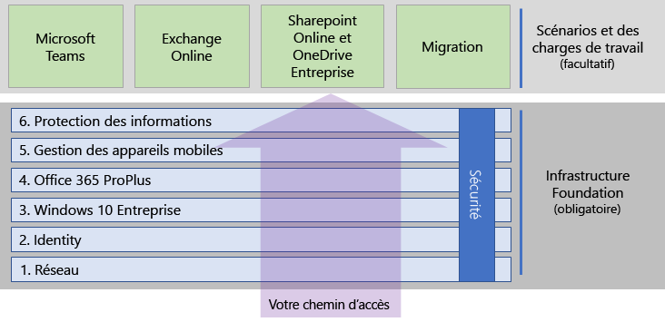
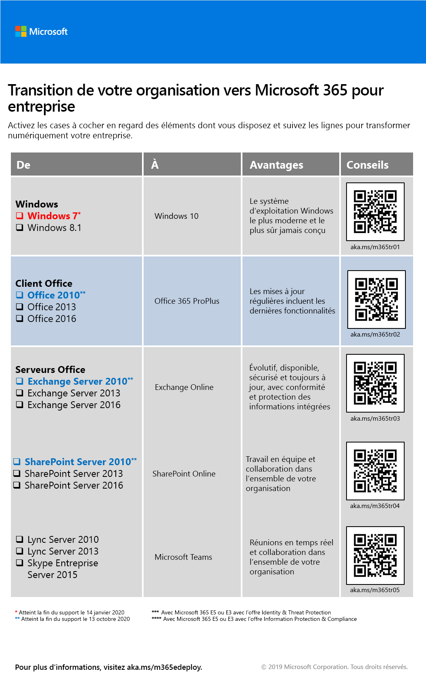

# Déployer Microsoft 365 pour entreprise

Microsoft 365 pour entreprise associe les applications et services de productivité locaux et basés sur le cloud à Windows 10 Entreprise qui :  

- possède une sécurité intelligente ;
- est intégré à des fins de simplicité ;
- révèle la créativité ;
- est conçu pour le travail d’équipe.

Vous pouvez bénéficier de ces avantages en déployant les charges de travail de productivité et l’infrastructure de façon intégrée en incluant des services de sécurité et des fonctionnalités de pointe.

Il existe trois méthodes principales pour déployer Microsoft 365 pour entreprise :

- Faites-le avec les ingénieurs Microsoft à l’aide de [FastTrack pour Microsoft 365](#fasttrack-for-microsoft-365).
- Faites-le avec l’aide de Microsoft Consulting Services ou d’un [partenaire Microsoft](https://partner.microsoft.com/).
- Faites-le vous-même avec le [Guide de déploiement de Microsoft 365 pour entreprise](#microsoft-365-for-enterprise-deployment-guide).

## FastTrack pour Microsoft 365

FastTrack est un avantage continu et renouvelable (*disponible gratuitement dans le cadre de votre abonnement*) qui est remis par les ingénieurs Microsoft pour vous aider à migrer vers le cloud à votre rythme. FastTrack permet également d’accéder à des partenaires qualifiés pour des services supplémentaires. Avec plus de 40 000 clients activés à ce jour, FastTrack vous aide à optimiser votre retour sur investissement, accélérer le déploiement et augmenter l’adoption au sein de votre organisation. Voir [FastTrack pour Microsoft 365](https://fasttrack.microsoft.com/microsoft365).

Si vous souhaitez tirer parti de FastTrack pour déployer Microsoft 365 pour entreprise, vous pouvez utiliser le [conseiller de déploiement de Microsoft 365](https://aka.ms/microsoft365setupguide) FastTrack pour obtenir des instructions sur la façon de déployer et configurer votre infrastructure de base. Pour accéder à cette page, vous devez être connecté en tant qu’administrateur général dans un client Office 365 ou Microsoft 365.

Commencer votre route de déploiement de bout à bout avec FastTrack[ici](https://fasttrack.microsoft.com/microsoft365).

## Guide de déploiement de Microsoft 365 pour entreprise

Le Guide de déploiement de Microsoft 365 pour entreprise vous accompagne dans la configuration correcte des produits et fonctionnalités Microsoft 365 pour entreprise.

Pour déployer Microsoft 365 pour entreprise vous-même, vous pouvez :

- Déployez l’[infrastructure de base](deploy-foundation-infrastructure.md) requise pour l’intégration et la sécurité intégrées pour une gestion simplifiée, ce qui permet de vérifier plus facilement que le logiciel client est mis à jour avec les dernières améliorations en matière de productivité et de sécurité. 
 
  L’infrastructure de base est organisée comme une série de phases numérotées se basant l’une sur l’autre et vers un environnement qui prend en charge des scénarios et des charges de travail Microsoft 365 pour entreprise. 

  **Si vous êtes une entreprise de petite taille ou jeune**, suivez les phases selon vos besoins pour assembler votre infrastructure méthodiquement.

  Toutefois, vous pouvez déployer les phases ou portions de différentes phases de cette infrastructure dans n’importe quel ordre selon vos besoins, [l’une après l’autre ou en parallèle](deployment-strategies-microsoft-365-enterprise.md), pour s’intégrer avec votre infrastructure actuelle, s’adapter à vos ressources et plans informatique et répondre à votre besoins professionnels. Pour un déploiement simplifié pour structures autres que les entreprises, cliquez [ici](deploy-foundation-infrastructure-non-enterprises.md).

  **Si vous êtes une organisation d’entreprise**, envisagez les phases comme des couches de l’infrastructure informatique, plutôt qu’une trajectoire définie et déterminez comment mieux travailler pour une adhérence finale à la configuration requise pour chaque couche au sein de votre organisation.

- Déployer les[scénarios et charges de travail](deploy-workloads.md) de productivité clé en haut de votre infrastructure. Déverrouiller la créativité et le travail d’équipe dans votre organisation.

Voici la relation entre l’infrastructure de base et les charges de travail et les scénarios.

Scénarios et charges de travail fonctionnent sur la partie supérieure de l’infrastructure de base. Toutefois, pas besoin que toutes les phases de l’infrastructure de base soient prédéfinies pour commencer à utiliser des charges de travail pour la productivité et la collaboration.

Commencer votre route de déploiement de bout à bout [ici](deploy-foundation-infrastructure.md).

## Faites un test

«*Ce que nous devons apprendre à faire, nous l’apprenons en le faisant.*» - Aristote

Si vous êtes nouveau avec Microsoft 365 pour entreprise ou à un produit spécifique ou une fonctionnalité, l’une des meilleures méthodes pour comprendre le fonctionnement consiste à le faire vous-même et voir comment cela fonctionne.

Nous vous avons facilité la tâche grâce aux Guides de laboratoire de Test (TLGs), qui vous guideront tout au long de la configuration d’une fonctionnalité dans un environnement de test simplifié mais représentatif utilisant des abonnements d’évaluation ou payants.

Avec les guides de laboratoire de test, vous pouvez apprendre, personnaliser ou créer une preuve de concept (PoC) d’une charge de travail, d’un scénario de bout en bout ou d’une configuration complexe.

Pour plus d’informations, consultez les [guides de laboratoire de test Microsoft 365 pour entreprise](m365-enterprise-test-lab-guides.md).

## Migration de l’ensemble de votre organisation

Pour tirer le meilleur parti de la migration de l’ensemble de votre organisation vers les produits et services de Microsoft 365 pour entreprise, consultez l’affiche [Transition de votre organisation vers Microsoft 365](media/deploy-microsoft-365-enterprise/transition-org-to-m365.pdf).

Cette affiche en double page vous permet d’inventorier rapidement votre infrastructure et de trouver des instructions pour effectuer la migration vers les produits ou services correspondants dans Microsoft 365 pour entreprise. Elle reprend les produits Windows et Office et d’autres éléments d’infrastructure et de sécurité comme la gestion des appareils, l’identité, les informations et la protection contre les menaces.

Vous pouvez également [télécharger cette affiche de transition](https://github.com/MicrosoftDocs/microsoft-365-docs/raw/public/microsoft-365/enterprise/media/deploy-microsoft-365-enterprise/transition-org-to-m365.pdf) et l’imprimer au format lettre, légal ou tabloïd (11 x 17).

## Comment d’autres ont-ils procédé ?

Utilisez ces ressources pour comprendre comment d’autres personnes ont déployé et utilisent Microsoft 365 pour entreprise.

### Utilisation de Microsoft 365 pour entreprise par les clients

Le site Témoignages clients vous permet de voir comment les clients Microsoft utilisent Microsoft 365 pour entreprise.

1. Accédez à [https://customers.microsoft.com/](https://customers.microsoft.com/),puis cliquez sur **Rechercher**.
2. Dans le volet gauche, sélectionnez la **Langue** de votre choix.
3. Sélectionnez le secteur de votre organisation dans **Secteur d’activité**.
4. Sélectionnez **Microsoft 365** dans **Produit**.
5. Cliquez sur une carte pour afficher l’étude de cas du client.

### Comment Microsoft utilise Microsoft 365 pour entreprise

La mise en place d’une culture numérique est une priorité majeure pour tout responsable soucieux à de promouvoir un espace de travail moderne. Microsoft 365 a été conçu pour prendre en charge ce genre de changement de culture, afin de stimuler la créativité et la collaboration. La mise en place de l’infrastructure de base chez Microsoft a précisément déclenché ce changement de culture numérique. L’implémentation de Microsoft 365 pour entreprise nous a permis de déployer des technologies de collaboration telles que Microsoft Teams et Exchange Online, ainsi que de partager des données sensibles en ligne sur des sites intranet SharePoint sécurisés.

En même temps, les fonctionnalités de sécurité intelligente et l’intégration des produits simplifient la gestion des besoins et réduisent le coût total de possession tout au long du cycle de vie des ressources informatiques. 

Découvrez comment les départements d’ingénierie et d’exploitation de Core Services (anciennement Microsoft IT) ont [planifié et déployé la base](https://www.microsoft.com/itshowcase/deploying-and-managing-microsoft-365) nécessaire pour prendre en charge les applications et services qui stimulent la créativité et le travail en équipe dans un environnement sécurisé.

> [!Note]
> Cette page web n’est disponible qu’en anglais.

### Comment Contoso Corporation a déployé Microsoft 365 pour entreprise

Contoso Corporation est un conglomérat de fabricants international fictif mais représentatif avec son siège à Paris en France. Découvrez comment [Contoso a déployé Microsoft 365 pour entreprise](contoso-case-study.md) et abordé les décisions de conception majeures, ainsi que les détails d’implémentation pour la mise en réseau, la gestion des identités, Windows 10 Entreprise, Office 365 ProPlus, la gestion des appareils mobiles, la protection des informations et la sécurité. 

## Restez informé du contenu de déploiement

Pour les dernières modifications apportées au contenu, consultez [cet article](microsoft-365-deploment-guide-changes.md).

## Étape suivante

Pour le faire avec l’assistance directe de Microsoft, utilisez [FastTrack](https://fasttrack.microsoft.com/microsoft365).

Pour le faire avec l’aide d’un conseiller, contactez Microsoft Consulting Services ou un [partenaire Microsoft](https://partner.microsoft.com/).

Pour le faire vous-même, voir [infrastructure de base](deploy-foundation-infrastructure.md).
