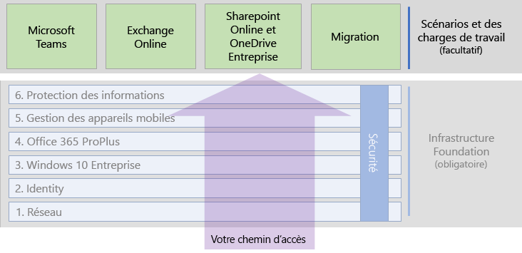

# Scénarios et charges de travail Microsoft 365 Entreprise

Pour bénéficier des avantages de la créativité et du travail d’équipe de Microsoft 365 Entreprise, déployez sur votre infrastructure de base les charges de travail suivantes :

- [Microsoft Teams](teams-workload.md)
- [Exchange Online](exchangeonline-workload.md)
- [SharePoint et OneDrive](sharepoint-online-onedrive-workload.md)

Pour disposer d’une feuille de route générale concernant la migration de votre organisation toute entière vers Microsoft 365 Entreprise, incluant les produits clients Microsoft Office, les produits Office Server locaux et les appareils basés sur Microsoft Windows, voir l’article [migration](migration-microsoft-365-enterprise-workload.md).

Les scénarios utilisent des fonctionnalités et services de Microsoft 365 Entreprise de façon intégrée pour répondre à des besoins métier. 

Il peut être nécessaire de s’assurer que vos employés peuvent travailler de manière efficace et sécurisée lorsqu’ils ne sont pas connectés directement à votre intranet. Pour plus d’informations sur la feuille de route de déploiement des éléments d’infrastructure et la favorisation de l’adoption par les utilisateurs distants des charges de travail clés, telles que Teams et Exchange Online, consultez le scénario [Confiez des responsabilités aux travailleurs à distance](empower-people-to-work-remotely.md).

Un autre de ces besoins est la protection des données hautement réglementées stockées dans Microsoft 365. Les données hautement réglementées incluent les biens numériques suivants :

- sujettes à des réglementations régionales ;
- les plus précieuses de votre organisation comme les secrets commerciaux, les informations sur les ressources humaines ou financières et la stratégie de l’organisation.

Pour protéger ces données contre les menaces internes et externes, voir :

- [Teams pour les données hautement réglementées](secure-teams-highly-regulated-data-scenario.md)
- [Sites SharePoint pour les données hautement réglementées](teams-sharepoint-online-sites-highly-regulated-data.md). 

Ces scénarios vous guident dans la configuration d’une équipe Microsoft Teams ou d’un site SharePoint afin de stocker en toute sécurité vos données les plus précieuses.

Les charges de travail et les scénarios décrits dans le guide de déploiement global de Microsoft 365 Entreprise sont les suivants :

Pour obtenir d’autres scénarios, reportez-vous à la [bibliothèque de productivité Microsoft 365](https://aka.ms/productivitylibrary)https://aka.ms/productivitylibrary). 

## Conditions préalables pour l’infrastructure de base

*Idéalement *, vous devez déployer les charges de travail et les scénarios après avoir configuré toutes les phases de l’[infrastructure de base](deploy-foundation-infrastructure.md). Cela garantit que toutes les couches de base sous-jacentes sont en place pour offrir une intégration, une sécurité et une expérience optimale à vos utilisateurs ainsi qu’à leurs appareils.

| Phase | Résultat |
|:-------|:-----|
| Réseau | Votre réseau est mis à jour vers les services de cloud computing de Microsoft 365 afin d’optimiser les performances. |
| Identité | L’identité est synchronisée et sécurisée avec une authentification forte pour les comptes d’utilisateurs et la protection des comptes d’administrateurs. |
| Windows 10 Entreprise | Vos ordinateurs exécutant Windows 7 ou Windows 8.1 peuvent bénéficier d’une mise à niveau vers Windows 10 Entreprise, et les nouveaux appareils sont installés avec Windows 10 Entreprise. |
| Microsoft 365 Apps for enterprise | Vos utilisateurs existants de Microsoft Office peuvent bénéficier d’une mise à niveau vers Microsoft 365 Apps for enterprise. |
| Gestion des appareils mobiles | Vos appareils peuvent être inscrit et gérés. |
| Protection des informations | Les fonctionnalités de protection des informations de Microsoft 365 sont configurées et vos étiquettes de confidentialité ou les étiquettes d’Azure Information Protection sont prêtes à protéger les documents et les e-mails. |

N’oubliez pas qu’il s’agit d’un scénario idéal et que la planification, la configuration, les tests et l’implémentation de pilote peuvent prendre du temps, en particulier au sein de grandes organisations dotées d’une infrastructure existante et de plusieurs sites. Le suivi de toutes ces phases dans tous les sites n’est pas indispensable pour bénéficier plus rapidement de la valeur métier de Microsoft 365 Entreprise. 

Voici des charges de travail courantes à déployer immédiatement : 

- Une fois la phase **Identité** de l’infrastructure de base déployée vers les utilisateurs, de nombreuses organisations effectuent les déploiements suivants :
  - [Microsoft 365 Apps for enterprise](office365proplus-infrastructure.md) combinée à [OneDrive](https://docs.microsoft.com/onedrive/plan-onedrive-enterprise). Microsoft 365 Apps for enterprise apporte la sécurité de l’authentification moderne et l’expérience utilisateur du dernier client Microsoft Office. La migration des fichiers personnels de l’utilisateur vers OneDrive réduit l’infrastructure et la nécessité de prendre en charge des dossiers et lecteurs locaux.
  - [Exchange Online](exchangeonline-workload.md) pour permettre aux utilisateurs de commencer à utiliser le courrier basé sur le cloud.
- Si vous n’avez pas immédiatement besoin de stocker des biens numériques hautement réglementés dans le cloud, déployez [Microsoft Teams](teams-workload.md) et [SharePoint](sharepoint-online-onedrive-workload.md) pour vos utilisateurs avant la phase **Protection des informations**.

Vous devez décider de la meilleure façon de commander et déployer la configuration des phases préalables de l’infrastructure de base pour répondre au mieux à vos besoins métier.

### Meilleures pratiques

Nous vous recommandons vivement d’opérer le déploiement de la phase **Identité** de l’infrastructure de base avant d’intégrer vos utilisateurs à des charges de travail ou scénarios.

La phase **Identité** garantit que votre identité basée sur le cloud, qu’elle soit uniquement cloud ou synchronisée avec vos Active Directory Domain Services (AD DS) locaux, contient les comptes et groupes d’utilisateurs et d’ordinateurs permettant de gérer l’authentification et l’accès. Une authentification forte pour tous vos utilisateurs ainsi qu’une protection forte des comptes d’administrateurs sont requises avant de placer des biens numériques de votre organisation dans le cloud Microsoft 365.

Bien que fondamentale et essentielle pour les performances globales, la phase **Mise en réseau** peut être en cours lorsque vous intégrez vos utilisateurs à des charges de travail, sachant que les performances de la charge de travail et des services Microsoft 365 s’améliorent au fil du temps. Cela vaut en particulier pour les organisations disposant de plusieurs sites et d’une grande diversité d’appareils périphériques et de connexions Internet.
