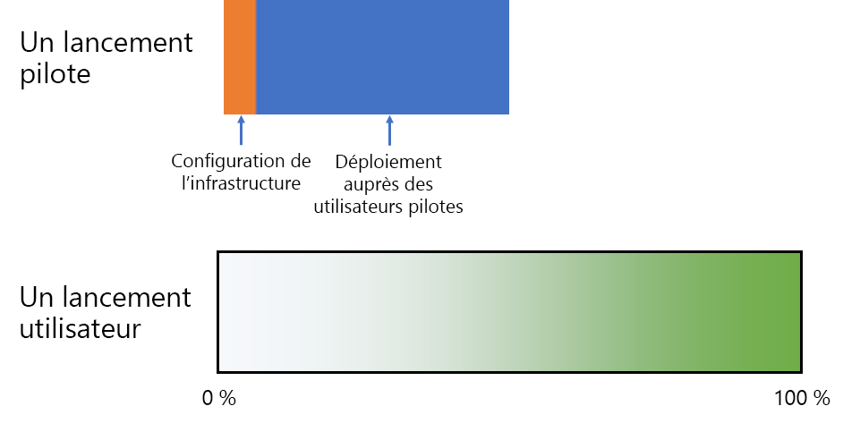
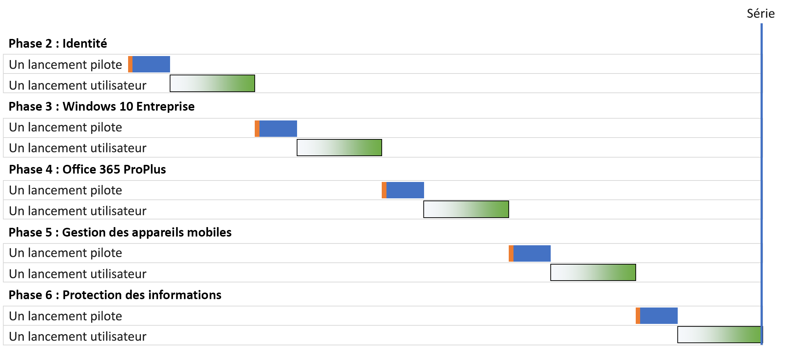
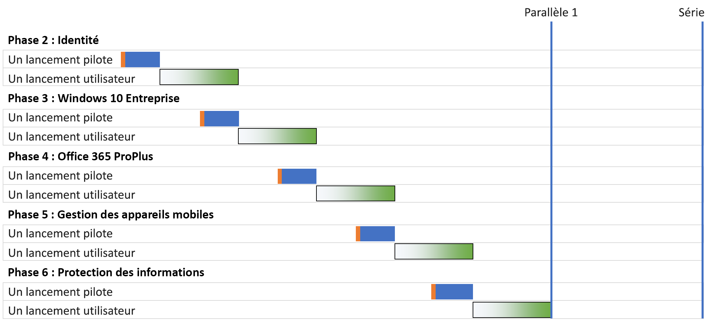
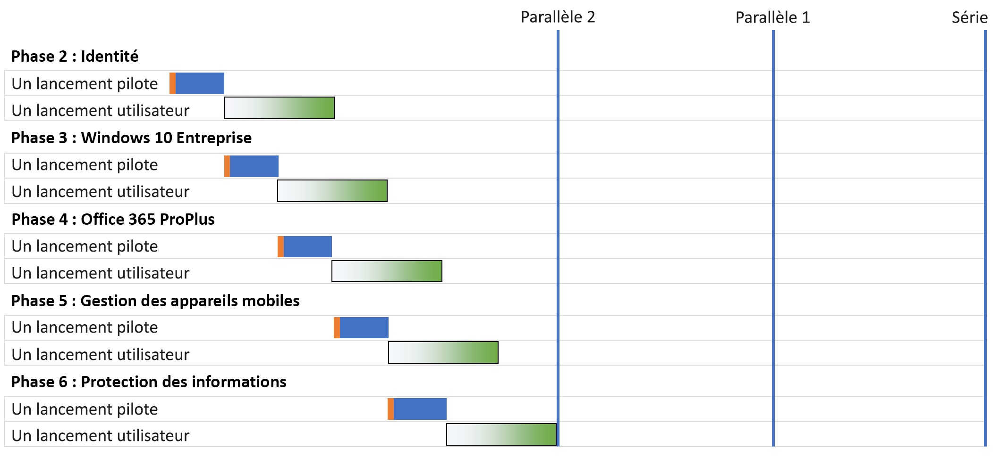
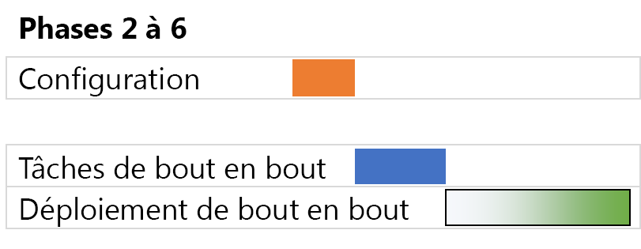

# Stratégies de déploiement de l’infrastructure de base de Microsoft 365 Entreprise

Il existe plusieurs façons de déployer les phases de l’[infrastructure de base](deploy-foundation-infrastructure.md) de Microsoft 365 Entreprise et de proposer ses fonctionnalités, logiciels et services à vos utilisateurs. Pour vous aider dans cette tâche, qui peut être vaste et complexe selon la taille de votre organisation et de son infrastructure existante, tenez compte des stratégies de déploiement suivantes :

- Déploiement en série
- Déploiement parallèle avec un lancement utilisateur décalé
- Déploiement parallèle avec un lancement utilisateur concomitant
- Infrastructure initiale et lancement de la configuration de bout en bout

Utilisez ces stratégies pour obtenir des idées sur la gestion du projet global et découvrir plus rapidement les avantages de Microsoft 365 Entreprise.

>[!Note]
>Cet article contient des suppositions et des simplifications dans le but de décrire de façon cohérente les stratégies de déploiement. Ces stratégies de déploiement sont considérées dans leur ensemble et n’impliquent en aucun cas l’existence de délais spécifiques. Elles ne sont pas non plus destinées à être appliquées à toutes les organisations et situations.
>

## Éléments de gestion de projets informatiques pour les entreprises standard

L’infrastructure informatique inclut des services principaux et le lancement de fonctionnalités inédites ou améliorées ou de logiciels installés à destination des utilisateurs finaux. Les départements informatiques déploient généralement les éléments d’une infrastructure informatique de façon méthodique. Pour réussir le déploiement d’un élément de l’infrastructure informatique, il vous faut :

- Un lancement pilote 

  Comprend la configuration de l’infrastructure initiale et le lancement à destination d’un groupe pilote d’utilisateurs, les tests et les modifications ultérieures de la configuration de l’infrastructure.

- Un lancement utilisateur

  Comprend le lancement destiné au reste de votre organisation par région, département, groupe ou tout autre méthode systématique de propagation de la configuration ou des logiciels.

Le lancement pilote et le lancement utilisateur ne s’adressent pas aux mêmes utilisateurs.

Voici comment ces deux lancements sont représentés dans cet article : 

 

Le dégradé utilisé pour illustrer le lancement utilisateur représente le pourcentage de 0 % à 100 % au sein de votre organisation, qui est réalisé de façon méthodique ou structurée par groupe, département ou région.

## Stratégies de déploiement

Voici les stratégies de déploiement que vous pouvez utiliser :

- Déploiement en série
- Déploiement parallèle avec un lancement utilisateur décalé
- Déploiement parallèle avec un lancement utilisateur concomitant
- Infrastructure initiale et lancement de la configuration de bout en bout

### Déploiement en série

Un déploiement en série vous permet de lancer une phase dans son intégralité auprès de l’ensemble de vos utilisateurs, avant de passer à la suivante. Vous pouvez recourir à cette stratégie de déploiement pour différentes raisons, notamment dans les cas suivants :

- Atténuation des risques
- Ressources insuffisantes
- Cycles de financement du département informatique
- Dépendances de la technologie informatique
- Gestion des changements opérationnels et résistance des utilisateurs finaux

Ce diagramme de Gantt illustre un déploiement en série simplifié des phases 2 à 6 de l’infrastructure de base de Microsoft 365 Entreprise.

 
 
Pour simplifier notre exposé, nous partons du principe que les phases et les segments de déploiement au sein de chaque phase ont la même durée.

>[!Note]
>La Phase 1 : Mise en réseau de l’infrastructure de base de Microsoft 365 Entreprise concerne uniquement le département informatique. Les utilisateurs profitent des avantages d’une meilleure connexion aux ressources cloud de Microsoft, mais ils ne sont pas obligés de la réaliser.
>

Exemple simplifié d’une expérience utilisateur pilote :

- En décembre, je dois utiliser mon smartphone pour l’authentification multifacteur. (Identity)
- En mars, Windows 10 Entreprise est installé sur mon ordinateur de bureau Windows 8.1. (Windows 10 Entreprise). (Windows 10 Entreprise)
- En juin, Office 365 ProPlus est installé à la place d’Office 2013. (Office 365 ProPlus)
- En septembre, il faut réaliser l’inscription des appareils. Les stratégies d’accès conditionnel et des applications entrent en vigueur. (Gestion des périphériques mobiles)
- En décembre, le client Azure Information Protection est installé et je reçois une formation pour savoir comment appliquer des étiquettes aux documents. (Information Protection)

Conclusion : vos lancements pilotes successifs sont espacés de 90 jours.

Exemple simplifié de l’expérience de l’utilisateur final :

- En janvier, je dois utiliser mon smartphone pour l’authentification multifacteur. (Identity)
- En avril, Windows 10 Entreprise est installé sur mon ordinateur de bureau Windows 8.1. (Windows 10 Entreprise)
- En juillet, Office 365 ProPlus est installé à la place d’Office 2013. (Office 365 ProPlus)
- En octobre, il faut réaliser l’inscription des appareils. Les stratégies d’accès conditionnel et des applications entrent en vigueur. (Gestion des périphériques mobiles)
- En janvier de l’année suivante, le client Azure Information Protection est installé et je reçois une formation pour savoir comment appliquer des étiquettes aux documents. (Information Protection)

Conclusion : vos lancements utilisateurs successifs sont espacés de 90 jours.

L’inconvénient de cette stratégie de déploiement est que le déploiement de l’infrastructure de base de Microsoft 365 Entreprise peut prendre un certain temps.

### Déploiement parallèle avec un lancement utilisateur décalé (Parallèle 1)

Avec cette stratégie de déploiement, le lancement pilote de la phase d’après a lieu quand le lancement utilisateur de la phase en cours se termine. Vous trouverez dans le graphique ci-dessous le déroulé des phases 2 à 6.

La durée des stratégies de déploiement en série et parallèle est également comparée.

 
 
Résultat : le lancement utilisateur pour la phase en cours se termine dans l’ensemble de votre organisation avant que la phase suivante commence. Les utilisateurs qui ne sont pas concernés par les lancements pilotes n’ont pas affaire aux lancement de plusieurs phases en même temps, mais vos lancements pilotes se terminent en parallèle des lancements utilisateurs.

Exemple simplifié d’une expérience utilisateur pilote : 

- En décembre, je dois utiliser mon smartphone pour l’authentification multifacteur. (Identity)
- En février, Windows 10 Entreprise est installé sur mon ordinateur de bureau Windows 8.1. (Windows 10 Entreprise)
- En avril, Office 365 ProPlus est installé à la place d’Office 2013. (Office 365 ProPlus)
- En juin, il faut réaliser l’inscription des appareils. Les stratégies d’accès conditionnel et des applications entrent en vigueur. (Gestion des périphériques mobiles)
- En août, le client Azure Information Protection est installé et je reçois une formation pour savoir comment appliquer des étiquettes aux documents. (Information Protection)

Conclusion : vos lancements pilotes successifs sont espacés de 60 jours.

Exemple simplifié de l’expérience de l’utilisateur final :

- En janvier, je dois utiliser mon smartphone pour l’authentification multifacteur. (Identity)
- En mars, Windows 10 Entreprise est installé sur mon ordinateur de bureau Windows 8.1. (Windows 10 Entreprise)
- En mai, Office 365 ProPlus est installé à la place d’Office 2013. (Office 365 ProPlus)
- En juillet, il faut réaliser l’inscription des appareils. Les stratégies d’accès conditionnel et des applications entrent en vigueur. (Gestion des périphériques mobiles)
- En septembre, le client Azure Information Protection est installé et je reçois une formation pour savoir comment appliquer des étiquettes aux documents. (Information Protection)

Conclusion : vos lancements utilisateurs successifs sont espacés de 60 jours.

L’avantage de cette stratégie est que le déploiement intégral de l’infrastructure de base de Microsoft 365 Entreprise prend moins de temps. De plus, votre département informatique et les utilisateurs n’ont pas affaire à plusieurs lancements en même temps.

### Déploiement parallèle avec un lancement utilisateur concomitant (Parallèle 2)

Avec cette stratégie de déploiement :

- le lancement pilote de la phase suivante commence quand le lancement utilisateur de la phase en cours se termine ;
- le lancement utilisateur de la phase suivante commence pendant le lancement utilisateur de la phase en cours. Ainsi, aucun utilisateur n’a affaire au lancement de plusieurs phases en même temps. Cela suppose aussi que vous lancez chaque phase de l’infrastructure de base de la même façon, par régions, départements ou autre.

Voici une comparaison simplifiée des stratégies de déploiement.

 

Résultat :

- Les lancements pilotes passent d’une phase à l’autre sans interruption.
- Le lancement utilisateur d’une phase commence avant la fin du lancement utilisateur de la phase précédente, mais aucun utilisateur ne déploie plusieurs phases à la fois.

Exemple simplifié d’une expérience utilisateur pilote : 

- En décembre, je dois utiliser mon smartphone pour l’authentification multifacteur. (Identity)
- En janvier, Windows 10 Entreprise est installé sur mon ordinateur de bureau Windows 8.1. (Windows 10 Entreprise)
- En février, Office 365 ProPlus est installé à la place d’Office 2013. (Office 365 ProPlus)
- En mars, il faut réaliser l’inscription des appareils. Les stratégies d’accès conditionnel et des applications entrent en vigueur. (Gestion des périphériques mobiles)
- En avril, le client Azure Information Protection est installé et je reçois une formation pour savoir comment appliquer des étiquettes aux documents. (Information Protection)

Conclusion : vos lancements pilotes successifs sont espacés de 30 jours.

Exemple simplifié de l’expérience de l’utilisateur final :

- En janvier, je dois utiliser mon smartphone pour l’authentification multifacteur. (Identity)
- En février, Windows 10 Entreprise est installé sur mon ordinateur de bureau Windows 8.1. (Windows 10 Entreprise)
- En mars, Office 365 ProPlus est installé à la place d’Office 2013. (Office 365 ProPlus)
- En avril, il faut réaliser l’inscription des appareils. Les stratégies d’accès conditionnel et des applications entrent en vigueur. (Gestion des périphériques mobiles)
- En mai, le client Azure Information Protection est installé et je reçois une formation pour savoir comment appliquer des étiquettes aux documents. (Information Protection)

Conclusion : vos lancements utilisateurs successifs sont espacés de 30 jours.

L’avantage de cette stratégie est que le déploiement intégral de l’infrastructure de base de Microsoft 365 Entreprise prend encore moins de temps. De plus, les utilisateurs n’ont pas affaire à plusieurs lancements en même temps. Par contre, les utilisateurs ne bénéficient d’aucune pause entre les phases successives.

### Infrastructure initiale et lancement de la configuration de bout en bout

Pour les petites organisations ayant la possibilité de condenser les phases 2à 6 dans un seul segment de déploiement, le déploiement qui en résulte se présente de la façon suivante :
 
 

Le département informatique configure l’infrastructure pour les phases 2 à 6, puis la déploie auprès des utilisateurs pilotes pour vérifier les fonctionnalités de la configuration de bout à bout. Par exemple, les utilisateurs pilotes reçoivent toutes ces fonctionnalités en même temps :

- Authentification multifacteur et autres fonctionnalités d’identité (Identity)
- Windows 10 Entreprise sur les appareils Windows (Windows 10 Entreprise)
- Office 365 ProPlus pour la suite Office (Office 365 ProPlus)
- Stratégies d’accès conditionnel et des applications (Gestion des périphériques mobiles)
- Client Azure Information Protection installé et formation pour savoir appliquer des étiquettes aux documents (Information Protection)

Une fois le lancement pilote terminé, le lancement utilisateur commence et fournit à chaque utilisateur toutes les fonctionnalités simultanément.

## Étape suivante

Lancez le déploiement de Microsoft 365 Entreprise avec l’[infrastructure de base](deploy-foundation-infrastructure.md).
