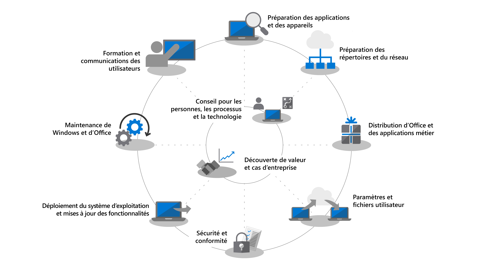

# Centre de déploiement du bureau moderne

<strong>Mise à niveau de Windows 7 vers Windows 10</strong>

Le support étendu de Windows 7 a pris fin le 14 janvier 2020. La mise à niveau sur place de Windows 7 vers Windows 10 constitue la méthode de déploiement la plus rapide. Microsoft Endpoint Configuration Manager vous permet de <a href="https://docs.microsoft.com/microsoft-365/enterprise/windows-7-to-windows-10-upgrade-manual">mettre à niveau un PC</a> ou <a href="https://docs.microsoft.com/microsoft-365/enterprise/windows-7-to-windows-10-upgrade-automated">des milliers de PC</a>. Avec les mises à niveau sur place, vous n’avez pas à vous occuper de la distribution des applications, de la migration des fichiers, de la création d’images personnalisées ou de l’activation des services cloud. Vous pouvez utiliser les outils dont vous disposez déjà pour mettre à niveau des PC existants et vous concentrer sur les étapes de déploiement suivantes pour les mises à niveau : 

<ul class="panelContent cardsM">
    <li>
        <a href="https://docs.microsoft.com/microsoft-365/enterprise/step-2-directory-and-network-readiness">
        

            

                

                    

                        

                            
                        

                    

                    

                        <h3>Mise à niveau de ConfigMgr vers l’option Current Branch</h3>
            
Partie de l’étape de préparation des répertoires et du réseau pour les organisations utilisant Configuration Manager

                    

                

            

        

        </a>
    </li>
    <li>
        <a href="https://docs.microsoft.com/microsoft-365/enterprise/step-1-device-and-app-readiness">
        

            

                

                    

                        

                            
                        

                    

                    

                        <h3>Validation de la préparation des appareils et applications</h3>
            
Partie de l’étape de préparation des appareils et des applications (une aide est disponible via le service Soutien aux applications du bureau)

                    

                

            

        

        </a>
    </li>
    <li>
        <a href="https://docs.microsoft.com/microsoft-365/enterprise/windows-7-to-windows-10-upgrade-automated">
        

            

                

                    

                        

                            
                        

                    

                    

                        <h3>Mise à niveau des PC Windows 7 vers Windows 10</h3>
            
Partie de l’étape de déploiement du système d’exploitation et de mise à jour des fonctionnalités pour les PC conservés par les utilisateurs

                    

                

            

        

        </a>
    </li>
</ul>

Pour planifier et effectuer votre déploiement à grande échelle de Windows 10 et d’Office 365 ProPlus, procédez de la manière décrite ci-dessous. Chacune des étapes s’inscrit dans le processus global de planification et de déploiement. Dans le cadre d’un déploiement par phases, certaines étapes doivent être exécutées en parallèle. Téléchargez gratuitement le [Kit de laboratoire pour le déploiement et la gestion des ordinateurs de bureau modernes](https://aka.ms/howtoshiftlabs) pour bénéficier d’une formation pratique avec les outils mis en évidence dans le processus de déploiement. Vous pouvez également [obtenir de l’aide](https://aka.ms/mddhelp) pour le déploiement de votre bureau auprès de partenaires et des services FastTrack de Microsoft.

 

<table>
<tr class="even">
<td></td>
<td>
<strong><a href="https://aka.ms/mdd0">Prise en main : aide relative aux technologies, aux processus et aux utilisateurs</a></strong>

Découvrez les avantages de la migration vers Windows 10 et Office 365 ProPlus, les modifications majeures et les aspects à prendre en compte par rapport aux déploiements précédents, ainsi que les bonnes pratiques à adopter pour assurer une transition fluide vers Windows 10 et Office 365 ProPlus.
</td>
<td></td>
</tr>
<tbody>
<tr class="odd">
<td></td>
<td>
<strong><a href="https://aka.ms/mdd1">Étape 1 : préparation des applications et des appareils</a></strong>

Commencez votre projet de déploiement d’ordinateurs de bureau par un inventaire de vos appareils et applications, classez-les par ordre de priorité, testez les appareils et applications privilégiés, puis apportez les corrections nécessaires en vue du déploiement.
</td>
<td></td>
</tr>
<tr class="even">
<td></td>
<td>
<strong><a href="https://aka.ms/mdd2">Étape 2 : préparation des répertoires et du réseau</a></strong>

Les services connectés au cloud dans Office 365 ProPlus et les nouvelles options de déploiement, telles que Windows Autopilot, nécessitent Azure Active Directory. Votre réseau et votre connectivité sont également des aspects importants pour planifier le déplacement des images, des applications, des pilotes Windows et des fichiers connexes sur votre PC. Découvrez comment les nouveaux outils et les nouvelles options de déploiement réduisent et rationalisent le trafic réseau.
</td>
<td></td>
</tr>
<tr class="odd">
<td></td>
<td>
<strong><a href="https://aka.ms/mdd3">Étape 3 : distribution d’Office et des applications métier</a></strong>

Vérifiez que vos applications sont empaquetées et prêtes pour une installation automatisée. Découvrez comment l’empaquetage Démarrer en un clic avec Office 365 ProPlus vous offre de nouvelles options pour configurer, livrer et actualiser vos applications Office.
</td>
<td></td>
</tr>
<tr class="even">
<td></td>
<td>
<strong><a href="https://aka.ms/mdd4">Étape 4 : paramètres et fichiers utilisateur</a></strong>

Lorsque vous actualisez ou remplacez des PC, gagnez du temps en automatisant la sauvegarde et la restauration de l’état utilisateur. De nouvelles options dédiées à la synchronisation des fichiers cloud vous permettent d’appliquer, par utilisateur, la synchronisation des dossiers Bureau, Documents et Images avec OneDrive afin d’assurer un accès transparent aux fichiers à partir de nouvelles installations de Windows.
</td>
<td></td>
</tr>
<tr class="odd">
<td></td>
<td>
<strong><a href="https://aka.ms/mdd5">Étape 5 : considérations relatives à la sécurité et à la conformité</a></strong>

Windows 10 et Office 365 ProPlus fournissent de nouveaux moyens de protéger vos données, appareils et utilisateurs, ainsi que de détecter et traiter rapidement les menaces. Découvrez également comment résoudre des problèmes courants liés au chiffrement de disque, aux applications anti-programmes malveillants et aux stratégies de migration vers Windows 10.
</td>
<td></td>
</tr>
<tr class="even">
<td></td>
<td>
<strong><a href="https://aka.ms/mdd6">Étape 6 : déploiement du système d’exploitation et mises à jour des fonctionnalités</a></strong>

Un déploiement basé sur une séquence de tâches est utilisé pour automatiser le déploiement à grande échelle et par phases d’installations complètes, d’actualisations d’ordinateur et de remplacements d’ordinateur. Des séquences de tâches de mise à niveau vous aideront également à rester informé des principales mises à jour semi-annuelles. Windows Autopilot est un ajout récent qui modernise l’imagerie des appareils nouveaux ou existants.
</td>
<td></td>
</tr>
<tr class="odd">
<td></td>
<td>
<strong><a href="https://aka.ms/mdd7">Étape 7 : maintenance de Windows et d’Office</a></strong>

Windows 10 et Office 365 ProPlus s’enrichissent continuellement de nouvelles fonctionnalités pour améliorer l’expérience utilisateur et la sécurité. Découvrez comment vous tenir informé des mises à jour semi-annuelles et mensuelles, le fonctionnement du nouveau modèle de maintenance, ainsi que les outils et options à votre disposition.
</td>
<td></td>
</tr>
<tr class="even">
<td></td>
<td>
<strong><a href="https://aka.ms/mdd8">Étape 8 : formation et communication des utilisateurs</a></strong>

Pensez à informer vos utilisateurs des nouvelles expériences et nouveaux modes de travail avant de migrer vos PC vers Windows 10 et Office 365 ProPlus. Découvrez comment tirer parti de l’assistance à l’adoption utilisateur avec Microsoft FastTrack, des supports de formation et des modèles de communication, ainsi que des nouveaux moyens pour surveiller l’usage et l’acceptation des utilisateurs.
</td>
<td></td>
</tr>
</tbody>
</table>
