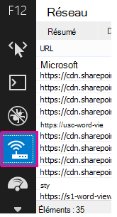
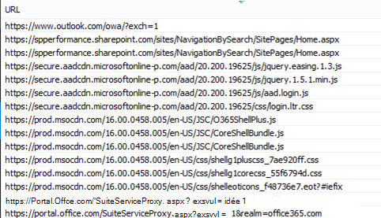
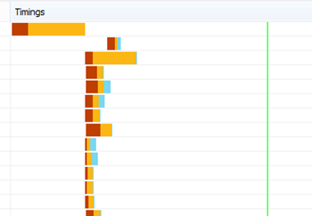
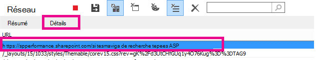
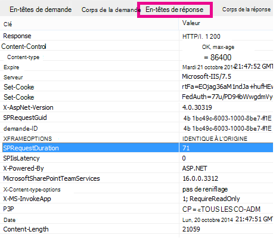

# Diagnostic des problèmes de performances avec SharePoint Online

Cet article vous montre comment diagnostiquer les problèmes courants liés à votre site SharePoint Online à l’aide des outils de développement d’Internet Explorer.
  
Il existe quatre façons différentes d’identifier qu’une page d’un site SharePoint Online présente un problème de performances avec les personnalisations.

- Diagnostic des performances du site et de la page
  
- Moniteur réseau de barre d’outils F12

- Comparaison avec une base de référence non personnalisée

- Métriques d’en-tête de réponse SharePoint Online

Cette rubrique explique comment utiliser chacune de ces méthodes pour diagnostiquer les problèmes de performances. Une fois que vous avez identifié la cause du problème, vous pouvez travailler à une solution à l’aide des articles sur l’amélioration des performances SharePoint que vous pouvez trouver sur https://aka.ms/tune.  

## Utiliser le diagnostic des performances du site et de la page à partir du centre de Administration Microsoft 365

> [!NOTE]
> Si vous êtes administrateur et que vous rencontrez des problèmes de performances dans SharePoint, sélectionnez **Exécuter les tests ci-dessous**, ce qui remplira le diagnostic des performances du site et de la page dans le centre Administration Microsoft 365. Ces tests vérifient votre configuration et recommandent rapidement les étapes suivantes pour améliorer les performances de SharePoint pour votre locataire.
>> [!div class="nextstepaction"]
>> [Exécuter des tests : vérifier les performances de SharePoint](https://aka.ms/PillarSiteandPagePerf)

> [!NOTE] 
> Cette fonctionnalité n’est pas disponible pour Microsoft 365 Government, Microsoft 365 géré par 21Vianet ou Microsoft 365 Germany.
  
## Utilisation de la barre d’outils F12 pour diagnostiquer les performances dans SharePoint Online

Dans cet article, nous utilisons Internet Explorer 11. Les versions des outils de développement F12 sur d’autres navigateurs ont des fonctionnalités similaires, bien qu’elles puissent sembler légèrement différentes. Pour plus d’informations sur les outils de développement F12, consultez :
  
- [Nouveautés des outils F12](/previous-versions/windows/internet-explorer/ie-developer/dev-guides/bg182632(v=vs.85))

- [Utilisation des outils de développement F12](/previous-versions/windows/internet-explorer/ie-developer/samples/bg182326(v=vs.85))

Pour afficher les outils de développement, appuyez sur **F12** , puis cliquez sur l’icône Wi-Fi :
  

  
Sous l’onglet **Réseau** , appuyez sur le bouton de lecture vert pour charger une page. L’outil retourne tous les fichiers que le navigateur demande afin d’obtenir la page que vous avez demandée. La capture d’écran suivante montre une de ces listes.
  

  
Vous pouvez également voir les heures de téléchargement des fichiers sur le côté droit, comme illustré dans cette capture d’écran.
  

  
Cela vous donne une représentation visuelle du temps de chargement du fichier. La ligne verte représente lorsque la page est prête à être rendue par le navigateur. Cela peut vous donner un aperçu rapide des différents fichiers susceptibles d’entraîner des chargements de pages lents sur votre site.
  
## Configuration d’une base de référence non personnalisée pour SharePoint Online

La meilleure façon de déterminer les points faibles de performances de votre site consiste à configurer une collection de sites entièrement prêt à l’emploi dans SharePoint Online. De cette façon, vous pouvez comparer tous les différents aspects de votre site avec ce que vous obtiendriez sans personnalisation sur la page. La page d’accueil OneDrive Entreprise est un bon exemple d’une collection de sites distincte qui est peu susceptible d’avoir des personnalisations.
  
## Affichage des informations d’en-tête de réponse SharePoint

Dans SharePoint Online, vous pouvez accéder aux informations qui sont renvoyées au navigateur dans l’en-tête de réponse de chaque fichier. La valeur la plus utile pour diagnostiquer les problèmes de performances est **SPRequestDuration**, qui affiche la durée de traitement de la demande sur le serveur. Cela peut aider à déterminer si la demande est lourde et gourmande en ressources. Il s’agit du meilleur aperçu que vous avez sur la quantité de travail que le serveur effectue pour servir la page.

### Pour afficher les informations d’en-tête de réponse SharePoint
  
1. Vérifiez que les outils F12 sont installés. Pour plus d’informations sur le téléchargement et l’installation de ces outils, consultez [Les nouveautés des outils F12](/previous-versions/windows/internet-explorer/ie-developer/dev-guides/bg182632(v=vs.85)).

2. Dans les outils F12, sous l’onglet **Réseau** , appuyez sur le bouton de lecture vert pour charger une page.

3. Cliquez sur l’un des fichiers .aspx retournés par l’outil, puis cliquez sur **DÉTAILS**.

    
  
4. Cliquez sur **En-têtes de réponse**.

    
  
## Quelles sont les causes des problèmes de performances dans SharePoint Online ?

Les options de navigation de l’article [pour SharePoint Online](navigation-options-for-sharepoint-online.md) montrent un exemple d’utilisation de la valeur SPRequestDuration pour déterminer que la navigation structurelle compliquée entraînait un long processus de la page sur le serveur. En prenant une valeur pour un site de référence (sans personnalisation), il est possible de déterminer si le chargement d’un fichier donné prend beaucoup de temps. L’exemple utilisé dans [les options de navigation pour SharePoint Online](navigation-options-for-sharepoint-online.md) est le fichier .aspx principal. Ce fichier contient la plupart du code ASP.NET qui s’exécute pour le chargement de votre page. Selon le modèle de site que vous utilisez, il peut s’agir de start.aspx, home.aspx, default.aspx ou d’un autre nom si vous personnalisez la page d’accueil. Si ce nombre est considérablement supérieur à celui de votre site de référence, cela indique qu’il se passe quelque chose de complexe dans votre page qui provoque des problèmes de performances.
  
Une fois que vous avez identifié un problème spécifique à votre site, la méthode recommandée pour déterminer ce qui provoque des performances médiocres consiste à éliminer toutes les causes possibles, telles que les personnalisations de page, puis à les rajouter une par une au site. Une fois que vous avez supprimé suffisamment de personnalisations pour que la page fonctionne correctement, vous pouvez ensuite rajouter des personnalisations spécifiques une par une.
  
Par exemple, si vous avez une navigation complexe, essayez de modifier la navigation pour ne pas afficher les sous-sites, puis vérifiez les outils de développement pour voir si cela fait une différence. Ou si vous avez une grande quantité de cumuls de contenu, essayez de les supprimer de votre page et de voir si cela améliore les choses. Si vous éliminez toutes les causes possibles et les rajoutez une par une, vous pouvez facilement identifier les fonctionnalités qui constituent le plus grand problème, puis travailler à une solution.
