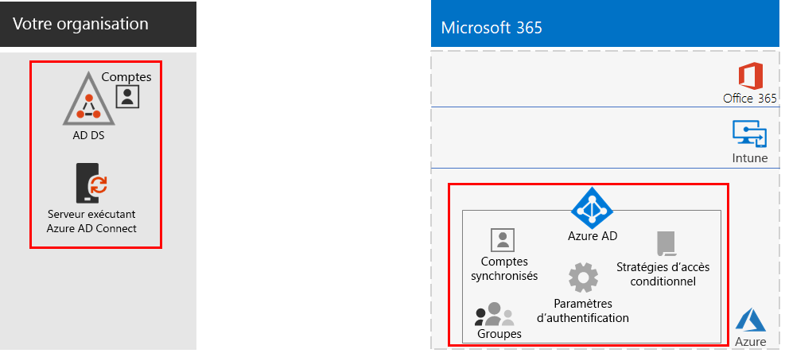
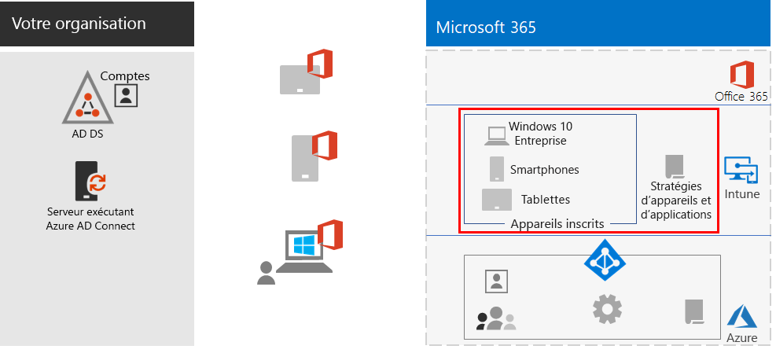
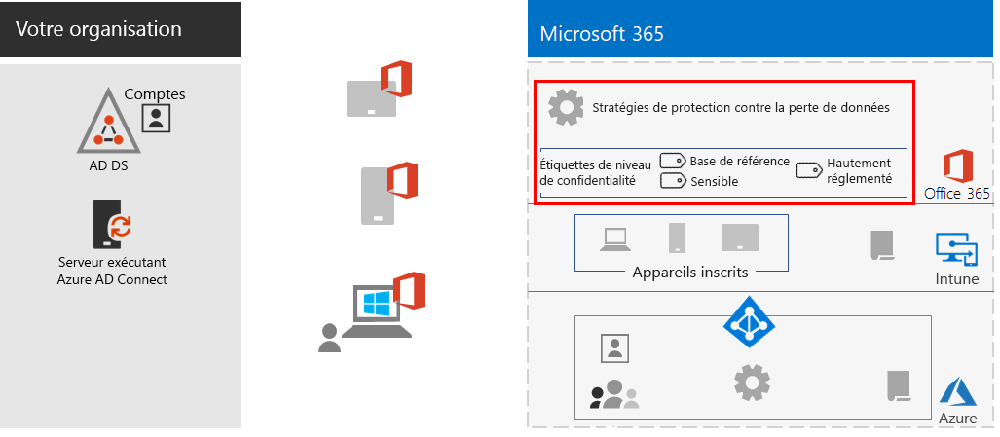
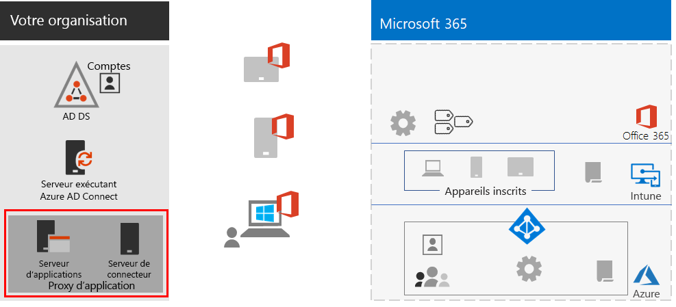
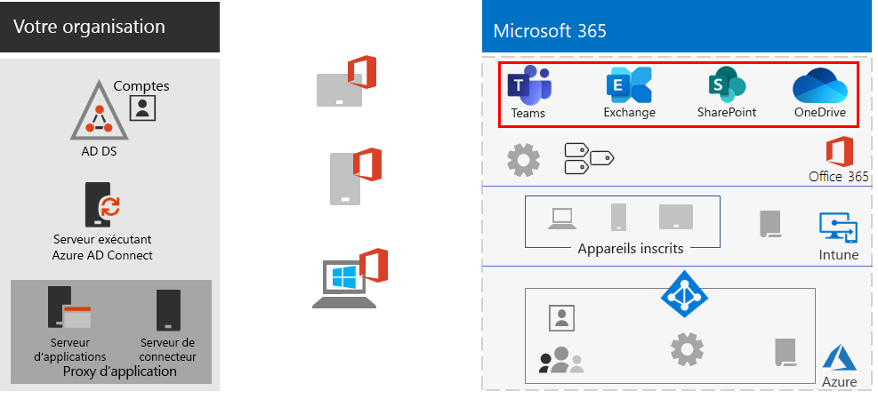
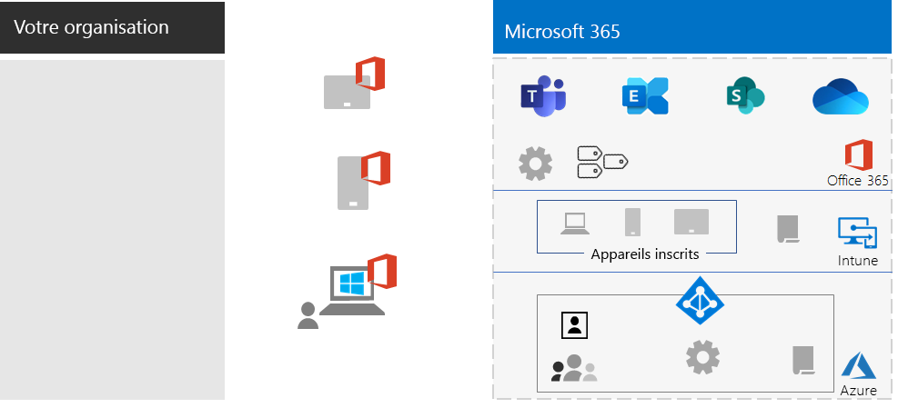

# Confiez des responsabilités aux travailleurs à distance

*Ce scénario s’applique à la fois aux versions E3 et E5 de Microsoft 365 Entreprise*

Permettre aux employés de travailler en-dehors du bureau en toute simplicité et en toute sécurité est important pour de nombreuses organisations afin d’économiser de l’espace de bureau, d’embaucher et de fidéliser les employés qui ne veulent pas être relocalisés, et de réduire le temps de déplacement des employés, ce qui leur laisse plus de temps pour gagner en productivité et pour se livrer à des activités permettant de réduire leur stress en-dehors du travail.

Le travail à distance, également appelé télétravail, peut couvrir un spectre qui inclut les éléments suivants :

- Les employés qui s'absentent occasionnellement du bureau pour assister à des conférences ou à des réunions avec les clients.
- Certains employés qui travaillent à temps plein.
- Une organisation totalement à distance dans laquelle il n’y a pas de bureau et dans laquelle tous les employés travaillent à distance.

Pour prendre en charge les travailleurs à distance, une combinaison de fonctionnalités de Microsoft 365 Entreprise permet à vos employés à distance de travailler de façon très collaborative, par exemple dans les cas suivants :

- Les réunions en ligne et les sessions de conversation.
- Les espaces de travail partagés pour le stockage de fichiers dans le Cloud avec une accessibilité globale et une collaboration en temps réel.
- Les tâches partagées et flux de travail pour répartir le travail et accomplir les tâches.

Pour renforcer la sécurité, Microsoft 365 Entreprise inclut les éléments suivants :

- Application des conditions requises pour l’authentification, détection des connexions à risque élevé et réponse à celles-ci et blocage de certaines applications et d’appareils non conformes.
- Connexions cryptées et biens numériques dans le Cloud.
- Autorisations pour définir qui peut faire quoi avec les fichiers.
- Protection contre la perte de données (DLP) pour empêcher les fuites de données hautement réglementées.

Pour répondre à ces critères pour les travailleurs à distance, utilisez les fonctionnalités suivantes de Microsoft 365 Entreprise :

- Identité de l’utilisateur et sécurité de la connexion
  - Comptes d’utilisateur Azure Active Directory (Azure AD) avec authentification multifacteur (MFA)
  - Stratégies d’accès conditionnel pour exiger l’authentification multifacteur pour les connexions à risque
- Plateformes de collaboration
  - Les applications Microsoft Teams, SharePoint et OneDrive, avec lesquelles les travailleurs à distance peuvent programmer et assister en ligne à des réunions vidéo et travailler sur les mêmes documents en même temps.
- Accès sécurisé aux ressources
  - Groupes et autorisations pour Teams, les sites SharePoint et OneDrive pour que seuls les utilisateurs authentifiés et autorisés y aient accès
- Protection des fichiers qui ont fuité
  - Stratégies de protection contre la perte de données d’Office 365
  - Étiquettes de confidentialité pour le chiffrement et les autorisations qui se déplacent avec les fichiers
- Gestion des périphériques et sécurité avec Microsoft Intune
  - Inscription pour les appareils gérés
  - Paramètres des applications pour les appareils personnels
  - Stratégies d’appareils et d’applications
- Applications de productivité pour les appareils
  - Applications Office 365 ProPlus pour les expériences collaboratives avec Teams, SharePoint et OneDrive 
- Windows 10 Entreprise
  - Fonctionnalités de sécurité complètes pour protéger contre les cyberattaques et empêcher les fuites de données
- Accès aux applications locales
  - Les organisations qui ont une identité hybride peuvent utiliser le proxy d’application Azure AD au lieu des connexions de réseau privé virtuel (VPN)

Les phases suivantes vous guideront tout au long du déploiement des fonctionnalités de Microsoft 365 Entreprise pour l’accès à distance et de l’adoption par les travailleurs à distance. Si vous avez déjà déployé des éléments de ces phases, assurez-vous qu’ils répondent aux exigences établies avant de passer à l’élément suivant.

 Pour un résumé d’une page de ce scénario, voir l’affiche [Confiez des responsabilités aux travailleurs à distance](../media/empower-people-to-work-remotely/empower-remote-workers-scenario.pdf).

Vous pouvez également télécharger cette affiche au format [PDF](https://github.com/MicrosoftDocs/microsoft-365-docs/raw/public/microsoft-365/media/empower-people-to-work-remotely/empower-remote-workers-scenario.pdf) ou [PowerPoint](https://github.com/MicrosoftDocs/microsoft-365-docs/raw/public/microsoft-365/media/empower-people-to-work-remotely/Empower-Remote-Workers-Poster.pptx) et l’imprimer sur du papier au format lettre, légal ou tabloïd (11 x 17).

## Phase 1 : déployer les fonctionnalités et les capacités de Microsoft 365 pour les travailleurs à distance

En raison de la diversité et du nombre de fonctionnalités et de capacités requises pour ce scénario, nous allons vous présenter les éléments requis de l'infrastructure de base et les sections des charges de travail du [Guide de déploiement de Microsoft 365 Entreprise](deploy-microsoft-365-enterprise.md).

### Étape 1 : conditions requises pour l’infrastructure de base pour les travailleurs à distance

Au cours de cette étape, nous allons voir les phases de [l’infrastructure de base](deploy-foundation-infrastructure.md) et répertorier les éléments requis pour permettre aux travailleurs à distance de travailler.

Pour la [Phase 2 : identité](identity-infrastructure.md), déployez les éléments suivants pour l’identité de l’utilisateur et la sécurité de la connexion :

- Pour l’identité hybride, les comptes et groupes d’utilisateurs sont synchronisés à partir des services de domaine Active Directory locaux (AD DS).
- Pour l’attribution d’autorisations, les groupes synchronisés ou Azure AD avec les membres appropriés.
- Paramètres d’authentification comme la nécessité d’une authentification multifacteur.
- Stratégies d’accès conditionnel pour exiger l’authentification multifacteur pour les connexions à risque et blocage des clients ne prenant pas en charge l’authentification moderne.

Voici la configuration obtenue avec les éléments d’identité mis en surbrillance.

 
Pour la [Phase 3 : Windows 10 Entreprise](windows10-infrastructure.md), déployez :

- L’infrastructure pour déployer de nouveaux appareils avec Windows 10 Entreprise et effectuer la mise à niveau de vos appareils Windows 7 ou Windows 8.1 vers Windows 10 Entreprise
- L’activation des fonctionnalités de sécurité complètes pour l’identité, les menaces et la protection des informations

Voici la configuration obtenue avec les appareils Windows 10 Entreprise.

 
Pour la [Phase 4 : Office 365 ProPlus](office365proplus-infrastructure.md), déployez l’infrastructure pour installer Office 365 ProPlus ou mettez à niveau votre suite Office actuellement installée (par exemple, Office 2010 ou Office 2013) vers Office 365 ProPlus sur les appareils de votre organisation. Cela permet à vos utilisateurs de tirer parti des meilleures expériences en matière de sécurité et de collaboration.

Voici la configuration obtenue avec Office 365 ProPlus installé sur des appareils.

 
Pour la [Phase 5 : gestion des appareils mobiles](mobility-infrastructure.md), déployez la gestion des appareils et applications Intune pour les éléments suivants :

- Inscription de vos appareils Windows 10 Entreprise, iOS, macOS, Android et Android Entreprise afin qu’ils reçoivent les fonctionnalités et les paramètres de sécurité définis par votre organisation.
- Paramètres de l’application pour renforcer la sécurité et autoriser ou bloquer les applications, même sur les appareils personnels appartenant à un employé.
- Stratégies de conformité avec accès conditionnel pour empêcher les appareils non conformes de se connecter.

Voici la configuration obtenue avec les appareils et stratégies Intune inscrits mis en surbrillance.

 
Pour la [Phase 6 : protection des informations](infoprotect-infrastructure.md), concevez et configurez la protection de vos biens numériques avec les éléments suivants :

- Stratégies de protection contre la perte de données d’Office 365.
- Étiquettes de confidentialité d’Office 365 pour le chiffrement et autorisations qui se déplacent avec les fichiers.

Voici la configuration obtenue avec les stratégies de protection contre la perte de données et les étiquettes de confidentialité mises en surbrillance.

 
Pour accéder aux applications locales, vous pouvez utiliser le [proxy d’application Azure AD](https://docs.microsoft.com/azure/active-directory/manage-apps/application-proxy), qui nécessite un environnement d’identité hybride.

Voici la configuration obtenue avec les composants de proxy d’application mis en surbrillance.

 
### Étape 2 : charges de travail pour les travailleurs à distance

Pour [Exchange Online](exchangeonline-workload.md), déployez les boîtes aux lettres Exchange Online pour chacun de vos utilisateurs.

Pour [Teams](teams-workload.md), déployez Teams auprès de vos utilisateurs et groupes.

Pour [SharePoint et OneDrive](sharepoint-online-onedrive-workload.md), déployez les sites de communication ou d’équipe SharePoint et les dossiers OneDrive.

Voici la configuration obtenue avec les charges de travail mises en surbrillance.

 
### Résultats du déploiement

Une fois que vous avez déployé l’infrastructure de base et les charges de travail et déployé Windows 10 Entreprise et Office 365 ProPlus, les travailleurs à distance :

- sont soumis à une authentification renforcée et à la protection de l’identité.
- utilisent la version la plus récente et la plus sécurisée de Windows sur leurs appareils Windows.
- utilisent la version la plus récente et la plus productive de la suite Office sur leurs appareils.
- sont soumis à la gestion des applications et aux stratégies de conformité des appareils.
- sont soumis aux stratégies et restrictions de protection contre la perte de données.
- peuvent assigner des étiquettes de confidentialité pour le chiffrement et les autorisations qui se déplacent avec les fichiers et les e-mails.
- peuvent accéder aux applications locales sans connexion VPN.
- peuvent effectuer leur propre travail et participer à des collaborations en temps réel avec des collègues via des conversations, des réunions et des fichiers dans Teams et des fichiers dans SharePoint et OneDrive.

En mode hors connexion (non connecté à Internet), vos travailleurs à distance peuvent modifier les copies locales de fichiers. Lorsqu’ils se reconnectent à Internet, OneDrive synchronise les copies locales avec les fichiers stockés dans votre abonnement Microsoft 365. 

Voici la configuration obtenue pour les travailleurs à distance de votre organisation si vous utilisez une identité hybride.

 
 
Voici la configuration obtenue pour les travailleurs à distance de votre organisation si vous utilisez l’identité dans le Cloud uniquement.

## Phase 2 : favoriser l’adoption par les utilisateurs pour les travailleurs à distance

Maintenant que l’infrastructure de base et les charges de travail sont en place, il est temps de stimuler l’utilisation actuelle de ces fonctionnalités auprès de vos travailleurs à distance afin qu’ils puissent être productifs n'importe où et à tout moment.

### Étape 1 : former vos utilisateurs

Formez vos travailleurs à distance sur :

- les procédures de connexion appropriées, y compris l’inscription à l’authentification multifacteur, et la manière dont les ouvertures de sessions peuvent être remises en question lorsqu’un risque est détecté.
- l’utilisation des appareils et la manière dont les stratégies peuvent être utilisées pour bloquer l’accès des appareils non conformes.
- l’utilisation d’applications autorisées et la manière dont les stratégies d’applications Intune peuvent être utilisées pour bloquer des applications.
- les fonctionnalités de sécurité Windows 10 Entreprise.
- l’utilisation d’Outlook pour la messagerie et le calendrier.
- l’utilisation de [Teams](https://docs.microsoft.com/microsoftteams/training-microsoft-teams-landing-page) pour les conversations, les conférences basées sur la vidéo, le partage de documents et les conversations thématiques.
- l’utilisation des sites d’équipe ou de communication SharePoint et des dossiers OneDrive pour rechercher des fichiers dans la bibliothèque d’un utilisateur et de ceux appartenant à un groupe.
- l’utilisation et l’application des étiquettes de confidentialité pour les fichiers qui contiennent des données sensibles ou hautement réglementées pour les versions locales et en ligne des fichiers.

Cette formation doit inclure des exercices pratiques pour que vos étudiants puissent se familiariser avec ces fonctionnalités et observer leurs résultats.

### Étape 2 : conduire des vérifications périodiques de l’utilisation et donner suite aux commentaires des travailleurs

Dans les semaines suivant la formation :

- Traitez rapidement les commentaires des travailleurs distants et affinez les stratégies et les configurations.
- Analysez l’utilisation des équipes, des sites SharePoint et des dossiers OneDrive et comparez-les à l’utilisation attendue.
- Vérifiez que les fichiers sensibles ou hautement réglementés ont été correctement étiquetés avec l’étiquette de confidentialité appropriée.

Former à nouveau vos utilisateurs, le cas échéant.

### Résultats de l’adoption par les utilisateurs

Vos travailleurs à distance peuvent utiliser leur appareil Windows 10 Entreprise ou autre appareil et Office 365 ProPlus pour accéder aux ressources et services partagés dans le Cloud Microsoft 365 Entreprise et collaborer dessus dans un environnement sécurisé, et ils peuvent participer à des réunions, créer et collaborer en temps réel.

## Voir aussi

[Scénarios et des charges de travail](deploy-workloads.md)

[Bibliothèque de productivité Microsoft 365](https://aka.ms/productivitylibrary)https://aka.ms/productivitylibrary)

[Guide de déploiement](deploy-microsoft-365-enterprise.md)
