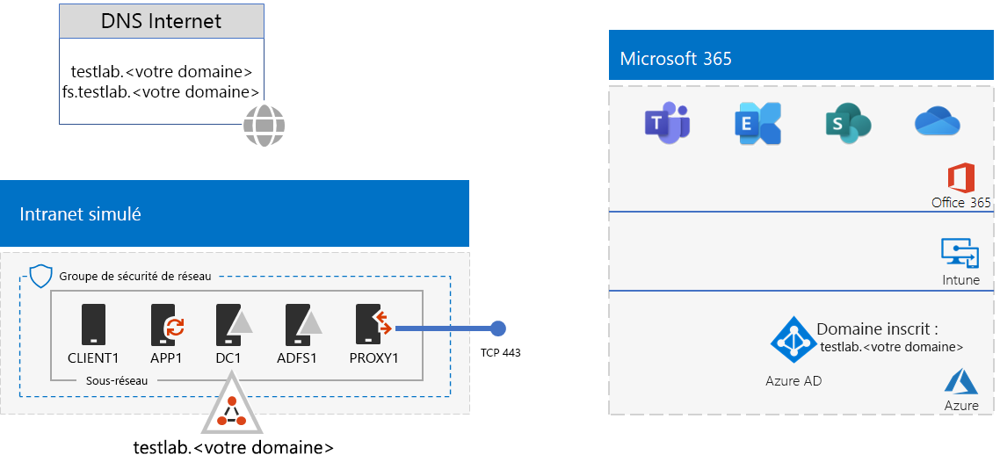
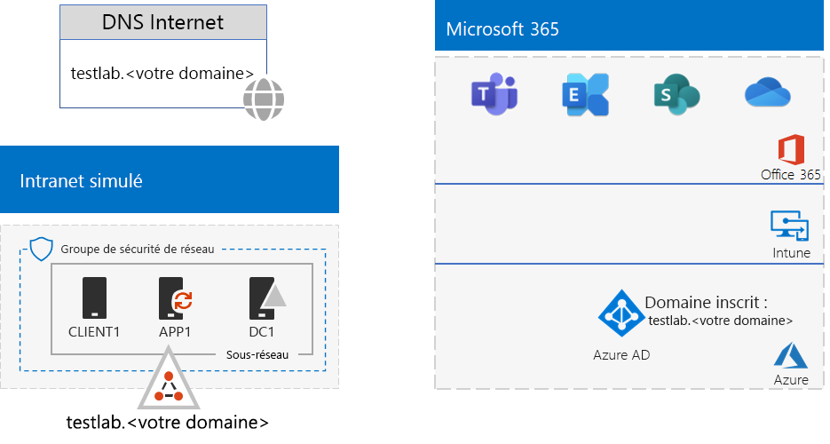
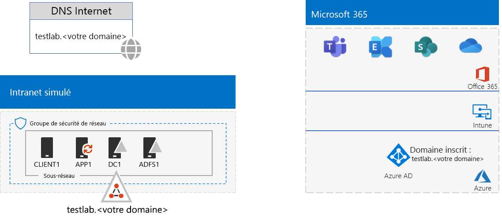

# <a name="federated-identity-for-your-microsoft-365-test-environment"></a>Identité fédérée pour votre environnement de test Microsoft 365

*Ce Guide de Laboratoire Test peut être utilisé pour les environnements de test Microsoft 365 Entreprise et Office 365 Entreprise*.

Office 365 prend en charge l’identité fédérée. Cela signifie qu’au lieu d’effectuer la validation des informations d’identification, Office 365 renvoie l’utilisateur qui se connecte à un serveur d’authentification fédérée approuvé par Office 365. Si les informations d’identification de l’utilisateur sont correctes, le serveur d’authentification fédérée émet un jeton de sécurité que le client envoie ensuite à Office 365 comme preuve d’authentification. L’identité fédérée autorise le déchargement et la montée en charge de l’authentification pour un abonnement Office 365, ainsi que l’authentification avancée et les scénarios de sécurité.
  
Cet article explique comment configurer l’authentification fédérée pour l’environnement de test Microsoft 365 ou Office 365, pour le résultat suivant :


  
Cette configuration se compose des éléments suivants :  
  
- Un abonnement d’évaluation ou de production Microsoft 365 E5 ou Office 365 E5.
    
- Un intranet d’organisation simplifié et connecté à Internet, composé de cinq machines virtuelles sur un sous-réseau d’un réseau virtuel Azure (DC1, APP1, CLIENT1, ADFS1 et PROXY1). Azure AD Connect s’exécute sur APP1 pour synchroniser la liste de comptes dans le domaine AD DS (Active Directory Domain Services) avec Office 365. PROXY1 reçoit les demandes d’authentification entrantes. ADFS1 valide les informations d’identification avec DC1 et émet des jetons de sécurité.
    
Les cinq phases de configuration de cet environnement de test sont les suivantes :
  
1. Création de l’environnement de test de l’entreprise simulée avec la synchronisation de hachage de mot de passe.
    
2. Créez le serveur AD FS (ADFS1).
    
3. Créez le serveur proxy web (PROXY1).
    
4. Créez un certificat auto-signé et configurez ADFS1 et PROXY1.
    
5. Configurez Office 365 pour l’identité fédérée.
    
> [!NOTE]
> Vous ne pouvez pas configurer cet environnement de test avec un abonnement à la version d’évaluation d’Azure. 
  
## <a name="phase-1-configure-password-hash-synchronization-for-your-microsoft-365-test-environment"></a>Étape 1 : Configuration de la synchronisation de hachage de mot de passe pour votre environnement de test Microsoft 365

Suivez les instructions fournies dans l’article [Synchronisation de hachage de mot de passe pour Microsoft 365](password-hash-sync-m365-ent-test-environment.md). Voici la configuration que vous obtenez.
  

  
Cette configuration se compose des éléments suivants :  
  
- Un abonnement d’évaluation ou payant Microsoft 365 E5 ou Office 365 E5.
- Un intranet d’organisation simplifié connecté à Internet, qui se compose des machines virtuelles DC1, APP1 et CLIENT1 sur un sous-réseau d’un réseau virtuel Azure. Azure AD Connect s’exécute sur APP1 pour synchroniser le domaine TESTLAB AD DS avec le client Azure AD de vos abonnements Microsoft 365 ou Office 365 de manière périodique.

## <a name="phase-2-create-the-ad-fs-server"></a>Phase 2 : Création du serveur AD FS

Un serveur AD FS fournit une authentification fédérée entre Office 365 et les comptes dans le domaine corp.contoso.com hébergé sur DC1.
  
Pour créer une machine virtuelle Azure pour ADFS1, indiquez le nom de votre abonnement et de votre groupe de ressources, ainsi que l’emplacement Azure de votre configuration de base, puis exécutez ces commandes à l’invite de commandes Azure PowerShell sur votre ordinateur local.
  
```powershell
$subscrName="<your Azure subscription name>"
$rgName="<the resource group name of your Base Configuration>"
$vnetName="TlgBaseConfig-01-VNET"
# NOTE: If you built your simulated intranet with Azure PowerShell, comment the previous line with a "#" and remove the "#" from the next line.
#$vnetName="TestLab"
Connect-AzAccount
Select-AzSubscription -SubscriptionName $subscrName
$staticIP="10.0.0.100"
$locName=(Get-AzResourceGroup -Name $rgName).Location
$vnet=Get-AzVirtualNetwork -Name $vnetName -ResourceGroupName $rgName
$pip = New-AzPublicIpAddress -Name ADFS1-PIP -ResourceGroupName $rgName -Location $locName -AllocationMethod Dynamic
$nic = New-AzNetworkInterface -Name ADFS1-NIC -ResourceGroupName $rgName -Location $locName -SubnetId $vnet.Subnets[0].Id -PublicIpAddressId $pip.Id -PrivateIpAddress $staticIP
$vm=New-AzVMConfig -VMName ADFS1 -VMSize Standard_D2_v2
$cred=Get-Credential -Message "Type the name and password of the local administrator account for ADFS1."
$vm=Set-AzVMOperatingSystem -VM $vm -Windows -ComputerName ADFS1 -Credential $cred -ProvisionVMAgent -EnableAutoUpdate
$vm=Set-AzVMSourceImage -VM $vm -PublisherName MicrosoftWindowsServer -Offer WindowsServer -Skus 2016-Datacenter -Version "latest"
$vm=Add-AzVMNetworkInterface -VM $vm -Id $nic.Id
$vm=Set-AzVMOSDisk -VM $vm -Name "ADFS-OS" -DiskSizeInGB 128 -CreateOption FromImage -StorageAccountType "Standard_LRS"
New-AzVM -ResourceGroupName $rgName -Location $locName -VM $vm
```

Ensuite, utilisez le [portail Azure](https://portal.azure.com) pour vous connecter à la machine virtuelle ADFS1 à l’aide du nom de compte d’administrateur local ADFS1 et de votre mot de passe, puis ouvrez une invite de commande Windows PowerShell.
  
Pour vérifier la résolution du nom et la communication réseau entre ADFS1 et DC1, exécutez la commande **ping dc1.corp.contoso.com** et vérifiez qu’il y a quatre réponses.
  
Ensuite, associez la machine virtuelle ADFS1 au domaine CORP avec ces commandes à l’invite Windows PowerShell sur ADFS1.
  
```powershell
$cred=Get-Credential -UserName "CORP\User1" -Message "Type the User1 account password."
Add-Computer -DomainName corp.contoso.com -Credential $cred
Restart-Computer
```

Voici la configuration finale.
  

  
## <a name="phase-3-create-the-web-proxy-server"></a>Phase 3 : création du serveur proxy web (PROXY1)

PROXY1 permet le traitement proxy des messages d’authentification entre les utilisateurs tentant de s’authentifier et ADFS1.
  
Pour créer une machine virtuelle Azure pour PROXY1, indiquez le nom de votre groupe de ressources et l’emplacement Azure, puis exécutez ces commandes à l’invite de commande Azure PowerShell sur votre ordinateur local.
  
```powershell
$rgName="<the resource group name of your Base Configuration>"
$vnetName="TlgBaseConfig-01-VNET"
# NOTE: If you built your simulated intranet with Azure PowerShell, comment the previous line with a "#" and remove the "#" from the next line.
#$vnetName="TestLab"
$staticIP="10.0.0.101"
$locName=(Get-AzResourceGroup -Name $rgName).Location
$vnet=Get-AzVirtualNetwork -Name $vnetName -ResourceGroupName $rgName
$pip = New-AzPublicIpAddress -Name PROXY1-PIP -ResourceGroupName $rgName -Location $locName -AllocationMethod Static
$nic = New-AzNetworkInterface -Name PROXY1-NIC -ResourceGroupName $rgName -Location $locName -SubnetId $vnet.Subnets[0].Id -PublicIpAddressId $pip.Id -PrivateIpAddress $staticIP
$vm=New-AzVMConfig -VMName PROXY1 -VMSize Standard_D2_v2
$cred=Get-Credential -Message "Type the name and password of the local administrator account for PROXY1."
$vm=Set-AzVMOperatingSystem -VM $vm -Windows -ComputerName PROXY1 -Credential $cred -ProvisionVMAgent -EnableAutoUpdate
$vm=Set-AzVMSourceImage -VM $vm -PublisherName MicrosoftWindowsServer -Offer WindowsServer -Skus 2016-Datacenter -Version "latest"
$vm=Add-AzVMNetworkInterface -VM $vm -Id $nic.Id
$vm=Set-AzVMOSDisk -VM $vm -Name "PROXY1-OS" -DiskSizeInGB 128 -CreateOption FromImage -StorageAccountType "Standard_LRS"
New-AzVM -ResourceGroupName $rgName -Location $locName -VM $vm
```

> [!NOTE]
> Une adresse IP publique statique est affectée à PROXY1, car vous créez un enregistrement DNS public qui pointe vers celle-ci et elle ne doit pas être modifiée lorsque vous redémarrez la machine virtuelle PROXY1. 
  
Ensuite, ajoutez une règle au groupe de sécurité réseau pour le sous-réseau CorpNet afin d’autoriser le trafic entrant non sollicité provenant d’Internet et allant vers l’adresse IP privée de PROXY1 et le port TCP 443. Exécutez ces commandes dans l’invite de commande Azure PowerShell sur votre ordinateur local.
  
```powershell
$rgName="<the resource group name of your Base Configuration>"
Get-AzNetworkSecurityGroup -Name CorpNet -ResourceGroupName $rgName | Add-AzNetworkSecurityRuleConfig -Name "HTTPS-to-PROXY1" -Description "Allow TCP 443 to PROXY1" -Access "Allow" -Protocol "Tcp" -Direction "Inbound" -Priority 101 -SourceAddressPrefix "Internet" -SourcePortRange "*" -DestinationAddressPrefix "10.0.0.101" -DestinationPortRange "443" | Set-AzNetworkSecurityGroup
```

Ensuite, utilisez le [portail Azure](https://portal.azure.com) pour vous connecter à la machine virtuelle PROXY1 à l’aide du nom de compte d’administrateur local PROXY1 et de votre mot de passe, puis ouvrez une invite de commande Windows PowerShell sur PROXY1.
  
Pour vérifier la résolution du nom et la communication réseau entre PROXY1 et DC1, exécutez la commande **ping dc1.corp.contoso.com** et vérifiez qu’il y a quatre réponses.
  
Ensuite, associez la machine virtuelle PROXY1 au domaine CORP avec ces commandes à l’invite Windows PowerShell sur PROXY1.
  
```powershell
$cred=Get-Credential -UserName "CORP\User1" -Message "Type the User1 account password."
Add-Computer -DomainName corp.contoso.com -Credential $cred
Restart-Computer
```

Affichez l’adresse IP publique de PROXY1 avec ces commandes Azure PowerShell sur votre ordinateur local :
  
```powershell
Write-Host (Get-AzPublicIpaddress -Name "PROXY1-PIP" -ResourceGroup $rgName).IPAddress
```

Ensuite, utilisez votre fournisseur DNS public et créez un enregistrement A DNS public pour **fs.testlab.**\<<votre nom de domaine DNS> qui résout l’adresse IP affichée par la commande **Write-Host**. **fs.testlab.**\<<votre nom de domaine DNS> est désigné ci-après en tant que *nom de domaine complet du service FS (Federation Service)*.
  
Ensuite, utilisez le [portail Azure](https://portal.azure.com) pour vous connecter à la machine virtuelle DC1 à l’aide des informations d’identification de CORP\\User1, puis exécutez les commandes suivantes à une invite de commande Windows PowerShell de niveau administrateur :
  
```powershell
Add-DnsServerPrimaryZone -Name corp.contoso.com -ZoneFile corp.contoso.com.dns
Add-DnsServerResourceRecordA -Name "fs" -ZoneName corp.contoso.com -AllowUpdateAny -IPv4Address "10.0.0.100" -TimeToLive 01:00:00
```
Ces commandes créent un enregistrement A DNS interne afin que les machines virtuelles sur le réseau virtuel Azure puissent résoudre le nom de domaine complet du service FS (Federation Service) sur l’adresse IP privée d’ADFS1.
  
Voici la configuration finale.
  

  
## <a name="phase-4-create-a-self-signed-certificate-and-configure-adfs1-and-proxy1"></a>Phase 4 : création d’un certificat auto-signé et configuration d’ADFS1 et de PROXY1

Au cours de cette phase, vous créez un certificat numérique auto-signé pour votre nom de domaine complet du service FS (Federation Service) et vous configurez ADFS1 et PROXY1 en tant que batterie de serveurs AD FS.
  
Tout d’abord, utilisez le [portail Azure](https://portal.azure.com) pour vous connecter à la machine virtuelle DC1 à l’aide des informations d’identification de CORP\\User1, puis ouvrez une invite de commande Windows PowerShell de niveau administrateur.
  
Ensuite, créez un compte de service AD FS avec cette commande à l’invite de commande Windows PowerShell sur DC1 :
  
```powershell
New-ADUser -SamAccountName ADFS-Service -AccountPassword (read-host "Set user password" -assecurestring) -name "ADFS-Service" -enabled $true -PasswordNeverExpires $true -ChangePasswordAtLogon $false
```
Notez que cette commande vous invite à indiquer le mot de passe du compte. Choisissez un mot de passe fort et enregistrez-le dans un emplacement sécurisé. Vous en aurez besoin pour cette phase et la phase 5.
  
Utilisez le [portail Azure](https://portal.azure.com) pour vous connecter à la machine virtuelle ADFS1 à l’aide des informations d’identification de CORP\\User1. Ouvrez une invite de commande Windows PowerShell de niveau administrateur sur ADFS1, indiquez votre nom de domaine complet du service FS (Federation Service), puis exécutez ces commandes pour créer un certificat auto-signé :
  
```powershell
$fedServiceFQDN="<federation service FQDN>"
New-SelfSignedCertificate -DnsName $fedServiceFQDN -CertStoreLocation "cert:\LocalMachine\My"
New-Item -path c:\Certs -type directory
New-SmbShare -name Certs -path c:\Certs -changeaccess CORP\User1
```

Ensuite, utilisez ces étapes pour enregistrer le nouveau certificat auto-signé en tant que fichier.
  
1. Cliquez sur **Démarrer**, tapez **mmc.exe**, puis appuyez sur **Entrée**.
    
2. Cliquez sur **Fichier > Ajouter/Supprimer un composant logiciel enfichable**.
    
3. Dans **Ajouter ou supprimer des composants logiciels enfichables**, double-cliquez sur **Certificats** dans la liste des composants logiciels enfichables disponibles, cliquez sur **Compte d’ordinateur**, puis sur **Suivant**.
    
4. Dans **Sélectionner un ordinateur**, cliquez sur **Terminer**, puis sur **OK**.
    
5. Dans le volet d’arborescence, ouvrez **Certificats (ordinateur local) > Personnel > Certificats**.
    
6. Cliquez sur le certificat avec votre nom de domaine complet du service FS (Federation Service) avec le bouton droit de la souris, cliquez sur **Toutes les tâches**, puis sur **Exporter**.
    
7. Dans la page **Bienvenue**, cliquez sur **Suivant**.
    
8. Sur la page **Exporter la clé privée **, cliquez sur **Oui**, puis sur **Suivant**.
    
9. Sur la page **Format du fichier d’exportation**, cliquez sur **Exporter toutes les propriétés étendues**, puis sur **Suivant**.
    
10. Sur la page **Sécurité**, cliquez sur **Mot de passe** et saisissez un mot de passe dans **Mot de passe** et dans **Confirmer le mot de passe**.
    
11. Sur la page **Fichier à exporter**, cliquez sur **Parcourir**.
    
12. Accédez au dossier **C:\\Certs**, saisissez **SSL** dans **Nom de fichier**, puis cliquez sur **Enregistrer.**
    
13. Sur la page **Fichier à exporter**, cliquez sur **Suivant**.
    
14. Sur la page **Fin de l’Assistant Exportation de certificat**, cliquez sur **Terminer**. À l’invite, cliquez sur **OK**.
    
Ensuite, installez le service AD FS avec cette commande à l’invite de commande Windows PowerShell sur ADFS1 :
  
```powershell
Install-WindowsFeature ADFS-Federation -IncludeManagementTools
```

Attendez la fin de l’installation.
  
Ensuite, configurez le service AD FS en suivant ces étapes :
  
1. Cliquez sur **Démarrer**, puis sur l’icône **Gestionnaire de serveur**.
    
2. Dans le volet d’arborescence du Gestionnaire de serveur, cliquez sur **AD FS**.
    
3. Dans la barre d’outils en haut de l’écran, cliquez sur le symbole d’avertissement orange, puis sur **Configurez le service FS (Federation Service) sur ce serveur**.
    
4. Sur la page d’**accueil** de l’Assistant Configuration des services de fédération Active Directory (AD FS), cliquez sur **Suivant**.
    
5. Sur la page **Connexion à AD FS**, cliquez sur **Suivant**.
    
6. Sur la page **Spécifier les propriétés de service** :
    
  - Pour **Certificat SSL**, cliquez sur la flèche vers le bas, puis sur le certificat avec votre nom de domaine complet du service FS (Federation Service).
    
  - Dans **Nom complet du service FS**, saisissez le nom de votre organisation fictive.
    
  - Cliquez sur **Suivant**.
    
7. Sur la page **Spécifier un compte de service**, cliquez sur **Sélectionner** pour **Nom du compte**.
    
8. Dans **Sélectionner l’utilisateur ou le compte de service**, saisissez **ADFS-Service**, cliquez sur **Vérifier les noms**, puis cliquez sur **OK**.
    
9. Dans **Mot de passe de compte**, saisissez le mot de passe du compte ADFS-Service, puis cliquez sur **Suivant**.
    
10. Sur la page **Spécifier une base de données de configuration**, cliquez sur **Suivant**.
    
11. Sur la page **Examiner les options**, cliquez sur **Suivant**.
    
12. Sur la page **Vérifications des conditions préalables**, cliquez sur **Configurer**.
    
13. Sur la page **Résultats**, cliquez sur **Fermer**.
    
14. Cliquez sur **Démarrer**, puis sur l’icône de démarrage, choisissez **Redémarrer**, puis **Continuer**.
    
À partir du [portail Azure](https://portal.azure.com), connectez-vous à PROXY1 avec les informations d’identification du compte CORP\\User1.
  
Ensuite, suivez ces étapes pour installer le certificat auto-signé et configurer PROXY1.
  
1. Cliquez sur **Démarrer**, tapez **mmc.exe**, puis appuyez sur **Entrée**.
    
2. Cliquez sur **Fichier > Ajouter/Supprimer un composant logiciel enfichable**.
    
3. Dans **Ajouter ou supprimer des composants logiciels enfichables**, double-cliquez sur **Certificats** dans la liste des composants logiciels enfichables disponibles, cliquez sur **Compte d’ordinateur**, puis sur **Suivant**.
    
4. Dans **Sélectionner un ordinateur**, cliquez sur **Terminer**, puis sur **OK**.
    
5. Dans le volet d’arborescence, ouvrez **Certificats (ordinateur local) > Personnel > Certificats**.
    
6. Cliquez avec le bouton droit sur **Personnel**, cliquez sur **Toutes les tâches**, puis sur **Importer**.
    
7. Dans la page **Bienvenue**, cliquez sur **Suivant**.
    
8. Sur la page **Fichier à importer**, saisissez **\\\\adfs1\\certs\\ssl.pfx**, puis cliquez sur **Suivant**.
    
9. Sur la page **Protection de clé privée**, saisissez le mot de passe du certificat dans **Mot de passe**, puis cliquez sur **Suivant.**
    
10. Sur la page **Magasin de certificats**, cliquez sur **Suivant**.
    
11. Sur la page **Achèvement**, cliquez sur **Terminer**.
    
12. Sur la page **Magasin de certificats**, cliquez sur **Suivant**.
    
13. À l’invite, cliquez sur **OK**.
    
14. Cliquez sur **Certificats** dans le volet d’arborescence.
    
15. Cliquez sur le certificat avec le bouton droit de la souris, puis cliquez sur **Copier**.
    
16. Dans le volet d’arborescence, ouvrez **Autorités de certification racines de confiance > Certificats**.
    
17. Placez le pointeur de la souris au-dessous de la liste des certificats installés, cliquez avec le bouton droit, puis cliquez sur **Coller**.
    
Ouvrez une invite de commande PowerShell de niveau administrateur et exécutez les commandes suivantes :
  
```powershell
Install-WindowsFeature Web-Application-Proxy -IncludeManagementTools
```

Attendez la fin de l’installation.
  
Suivez ces étapes pour configurer le service de proxy d’application web de manière à ce qu’il utilise ADFS1 comme serveur de fédération :
  
1. Cliquez sur **Démarrer**, puis sur **Gestionnaire de serveur**.
    
2. Dans le volet d’arborescence, cliquez sur **Accès distant**.
    
3. Dans la barre d’outils en haut de l’écran, cliquez sur le symbole d’avertissement orange, puis sur **Ouvrir l’Assistant Proxy d’application web**.
    
4. Sur la page d’**accueil** de l’Assistant Configuration de proxy d’application web, cliquez sur **Suivant**.
    
5. Sur la page **Serveur de fédération** :
    
  - Saisissez votre nom de domaine complet du service FS (Federation Service) dans **Nom du service FS (Federation Service)**.
    
  - Saisissez **CORP\\User1** dans **Nom d’utilisateur**.
    
  - Saisissez le mot de passe du compte User1 dans **Mot de passe**.
    
  - Cliquez sur **Suivant**.
    
6. Sur la page **Certificats de proxy AD FS**, cliquez sur la flèche vers le bas, cliquez sur le certificat avec votre nom de domaine complet du service FS (Federation Service), puis sur **Suivant**.
    
7. Sur la page **Confirmation**, cliquez sur **Configurer**.
    
8. Sur la page **Résultats**, cliquez sur **Fermer**.

    
## <a name="phase-5-configure-office-365-for-federated-identity"></a>Phase 5 : Configuration d’Office 365 pour l’identité fédérée

Utilisez le [portail Azure](https://portal.azure.com) pour vous connecter à la machine virtuelle APP1 avec les informations d’identification du compte CORP\\User1.
  
Suivez ces étapes pour configurer Azure AD Connect et votre abonnement Office 365 pour l’authentification fédérée :
  
1. Sur le bureau, double-cliquez sur **Azure AD Connect**.
    
2. Sur la page **Bienvenue dans Azure AD Connect**, cliquez sur **Configurer**.
    
3. Sur la page **Tâches supplémentaires**, cliquez sur **Modifier la connexion utilisateur**, puis sur **Suivant**.
    
4. Sur la page **Connexion à Azure AD**, saisissez vos nom de compte et mot de passe d’administrateur général Office 365, puis cliquez sur **Suivant**.
    
5. Sur la page **Connexion utilisateur**, cliquez sur **Fédération avec AD FS**, puis sur **Suivant**.
    
6. Sur la page **Batterie de serveurs AD FS**, cliquez sur **Utiliser une batterie de serveurs AD FS existante**, saisissez **ADFS1** dans **Nom du serveur**, puis cliquez sur **Suivant**.
    
7. Lorsque vous êtes invité à entrer les informations d’identification du serveur, saisissez les informations d’identification du compte CORP\\User1, puis cliquez sur **OK**.
    
8. Sur la page des informations d’identification **Administrateur de domaine**, saisissez **CORP\\User1** dans **Nom d’utilisateur** et le mot de passe du compte dans **Mot de passe**, puis cliquez sur **Suivant**.
    
9. Sur la page **Compte de service AD FS**, saisissez **CORP\\ADFS-Service** dans **Nom d’utilisateur du domaine** et le mot de passe du compte dans **Mot de passe utilisateur du domaine**, puis cliquez sur **Suivant**.
    
10. Sur la page **Domaine Azure AD**, dans **Domaine**, sélectionnez le nom du domaine que vous avez précédemment créé et ajouté à votre abonnement Office 365 lors de la phase 1, puis cliquez sur **Suivant**.
    
11. Sur la page **Prêt à configurer**, cliquez sur **Configurer**.
    
12. Sur la page **Installation terminée**, cliquez sur **Vérifier**.
    
    Vous devriez voir des messages vous indiquant que les configurations intranet et Internet ont été vérifiées.
    
13. Sur la page **Installation terminée**, cliquez sur **Quitter**.
    
Pour vérifier que l’authentification fédérée fonctionne, procédez comme suit :
  
1. Ouvrez une nouvelle instance privée de votre navigateur sur votre ordinateur local et accédez à [https://admin.microsoft.com](https://admin.microsoft.com).
    
2. Pour les informations d’identification de connexion, saisissez le domaine **user1@**\< créé lors de la phase 1>. 
    
    Par exemple, si votre domaine de test est **testlab.contoso.com**, vous saisissez « user1@testlab.contoso.com ». Appuyez sur la touche de tabulation ou autorisez Office 365 à vous rediriger automatiquement.
    
    Une page **Votre connexion n’est pas privée** devrait s’afficher. Cette page s’affiche, car vous avez installé sur ADFS1 un certificat auto-signé que votre ordinateur de bureau ne peut pas valider. Dans un déploiement de production d’authentification fédérée, vous utiliseriez un certificat provenant d’une autorité de certification approuvée et vos utilisateurs ne verraient pas cette page.
    
3. Sur la page **Votre connexion n’est pas privée**, cliquez sur **Avancé**, puis sur **Continuer avec \<votre nom de domaine complet du service FS (Federation Service)>**. 
    
4. Sur la page contenant le nom de votre organisation fictive, connectez-vous avec les éléments suivants :
    
  - **CORP\\User1** pour le nom ;
    
  - le mot de passe du compte User1.
    
    Vous devez voir la **page d’accueil Microsoft Office**.
    
Cette procédure montre que votre abonnement à la version d’évaluation d’Office 365 est fédéré avec le domaine corp.contoso.com AD DS hébergé sur DC1. Voici les principes de base du processus d’authentification :
  
1. Lorsque vous utilisez le domaine fédéré que vous avez créé à la phase 1 dans le nom de compte de connexion, Office 365 redirige votre navigateur vers votre nom de domaine complet du service FS (Federation Service) et PROXY1.
    
2. PROXY1 envoie la page de connexion de l’entreprise fictive à votre ordinateur local.
    
3. Lorsque vous envoyez CORP\\User1 et le mot de passe à PROXY1, il les transfère à ADFS1.
    
4. ADFS1 valide CORP\\User1 et le mot de passe avec DC1 et envoie un jeton de sécurité à votre ordinateur local.
    
5. Votre ordinateur local envoie le jeton de sécurité à Office 365.
    
6. Office 365 confirme que le jeton de sécurité a été créé par ADFS1 et autorise l’accès.
    
Votre abonnement à la version d’évaluation d’Office 365 est désormais configuré avec l’authentification fédérée. Vous pouvez utiliser cet environnement de développement/test pour les scénarios d’authentification avancés.
  
## <a name="next-step"></a>Étape suivante

Quand vous êtes prêt à déployer l’authentification fédérée haute disponibilité pour environnements de production pour Microsoft 365 ou Office 365 dans Azure, consultez la rubrique [Deploy high availability federated authentication for Office 365 in Azure](https://docs.microsoft.com/office365/enterprise/deploy-high-availability-federated-authentication-for-office-365-in-azure).
  
