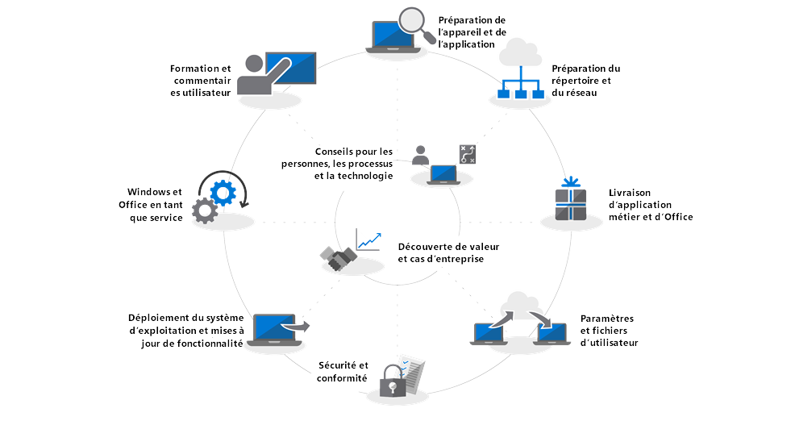

# Prise en main : déploiement du bureau moderne

Le cloud révolutionne la gestion des PC : le cloud intelligent de Microsoft met à la disposition des informaticiens des connaissances actionnables pour les aider à déployer un bureau moderne. Cette série d’articles a pour but de vous aider à planifier et à migrer vers un bureau moderne basé sur Windows 10 et Office 365 ProPlus.

<table>
<thead>
<td></td>
<td>
<strong>Prise en main : aide relative aux technologies, aux processus et aux utilisateurs</strong>

Découvrez les avantages d’un bureau moderne, les modifications majeures et les aspects à prendre en compte par rapport aux déploiements précédents, ainsi que les bonnes pratiques à adopter pour assurer une transition fluide vers Windows 10 et Office 365 ProPlus.
</td>
<td></td>
</thead>
</table>

>[!NOTE]
>Dans cette série d’articles, nous allons expliquer comment faire bon usage des outils existants, et vous présenter les nouvelles technologies, les nouveaux services et les nouvelles méthodes accessibles via le cloud. Pour consulter l’ensemble du processus de déploiement du bureau, visitez le [centre de déploiement du bureau moderne](https://aka.ms/HowToShift).
>

Bienvenue au centre de déploiement du bureau moderne, notre plateforme centralisée où vous pourrez découvrir comment planifier et mettre en œuvre votre migration vers un bureau moderne. Vous pourrez ainsi profiter d’un espace de travail sécurisé qui vous offrira les expériences les plus récentes en matière de productivité, de travail d’équipe et de collaboration.

Si vous n’avez pas déployé un nouvel environnement de bureau depuis un certain temps, vous serez heureux d’apprendre que le processus de déploiement a été optimisé. Les difficultés rencontrées par le passé, comme la compatibilité des applications, sont beaucoup moins problématiques aujourd’hui, et les nouveaux outils et les connaissances issues du cloud vous permettent d’agir en toute confiance, plus rapidement et plus efficacement que jamais.

Au cours de cette présentation, nous allons expliquer les changements qui ont eu lieu et présenter le processus de déploiement du bureau. Ainsi, vous connaîtrez les étapes recommandées à suivre pour migrer vers Windows 10 et Office 365 ProPlus, et apprendrez à tirer parti de vos processus et outils existants quand vous adopterez des approches et des technologies de gestion modernes à l’avenir.

## Pourquoi mettre à niveau ?

Windows 10 et le cloud intelligent de Microsoft vous permettent d’offrir à vos utilisateurs l’espace de travail le plus stimulant, puissant et sécurisé possible, tout en simplifiant votre infrastructure de support.

La mise à jour régulière des appareils est importante pour adopter une gestion moderne de votre bureau. Grâce à cette série d’articles, vous allez découvrir les nouvelles fonctionnalités qui vous aideront à passer à Windows 10 et Office 365 ProPlus et à accéder aux versions semestrielles de ces deux logiciels.

[Windows 10 pour les professionnels de l’informatique](https://www.microsoft.com/fr-FR/itpro/windows-10)

## Qu’est-ce qui a changé ?

Examinons les modifications et les améliorations apportées depuis votre dernier déploiement de bureau. Si vous n’avez pas migré votre environnement de bureau récemment, vous utilisez probablement Windows 7 et Office 2010 ou Office 2013. Dans ce cas, vous remarquerez que certains éléments ont évolué depuis votre dernière mise à niveau majeure. Voici quelques exemples de ces changements :

**Gestion des identités et des accès** Le bureau moderne, connecté aux services de gestion, de sécurité et de productivité dans le cloud, propose un nouveau service de base pour gérer les identités et les accès : Azure Active Directory. Il vous permet d’utiliser l’authentification unique et une connexion sécurisée dans vos services cloud. Pour l’utiliser, nous vous conseillons d’installer Azure AD. Ce service vous permettra de bénéficier des services de Microsoft 365 tels qu’Office 365, Intune ou Windows Autopilot.

[Microsoft 365](https://www.microsoft.com/fr-FR/microsoft-365/default.aspx)

**Environnement sécurisé préalable au démarrage** Le microprogramme UEFI 64 bits remplace BIOS. Votre environnement se met en route plus vite et la plupart des fonctionnalités de sécurité modernes doivent être activées dans Windows 10. Windows 10 s’exécute sur BIOS mais l’utilisation d’UEFI est fortement recommandée. Si vous n’avez pas encore installé le microprogramme UEFI 64 bits, nous vous conseillons vivement de le faire. Il existe des outils pour vous aider dans cette transition, que ce soit pendant une mise à niveau Windows 10 ou après celle-ci.

[Passer de BIOS à UEFI avec MBR2GPT](https://technet.microsoft.com/fr-FR/windows/mt782786.aspx)

**Gestion informatique des appareils** Les services tels que Microsoft Intune vous permettent de centraliser la gestion de vos appareils Windows 10 et d’autres appareils mobiles en un seul endroit. Microsoft Intune est capable de cogérer vos appareils Windows 10 avec le System Center Configuration Manager. Vous pouvez utiliser ce logiciel pour vous aider à migrer vers Windows 10, puis ajouter Microsoft Intune. Le System Center Configuration Manager forme un périmètre intelligent au sein de votre organisation connectée au cloud intelligent de Microsoft. Ainsi, vous pouvez gérer les appareils de vos utilisateurs en toute sécurité, quel que soit l’endroit où ils se trouvent, qu’ils soient connectés au cloud de votre organisation ou au cloud public.

[Cogestion des appareils Windows 10](https://docs.microsoft.com/fr-FR/sccm/core/clients/manage/co-management-overview)

**Service de déploiement informatique** Nous vous proposons un nouveau service cloud pour vous aider à déployer les appareils Microsoft 365 sur vos nouveaux PC. Il s’agit du service de déploiement Windows Autopilot. AutoPilot est intégré directement par les fournisseurs de votre matériel et enregistre automatiquement les nouveaux PC. Ainsi, le fournisseur peut expédier le nouveau PC directement à l’utilisateur final. Quand le PC est mis en route pour la première fois, il est rapidement configuré selon les paramètres de votre organisation, et répond aux besoins spécifiques de l’utilisateur.

[Windows Autopilot](https://www.microsoft.com/fr-FR/windowsforbusiness/windows-autopilot)

**Déploiements pour Démarrer en un clic** Pendant la configuration des applications de bureau Office, Office 365 ProPlus est l’option sélectionnée par défaut. Ainsi, vous avez accès aux dernières innovations apportées dans Office dès qu’elles sont développées. Vous n’attendrez plus des années avant de recevoir de nouvelles fonctionnalités. Vous allez également utiliser une nouvelle installation appelée Démarrer en un clic.

L’installation Démarrer en un clic est différente des packages antérieurs basés sur MSI. Démarrer en un clic est plus rapide, plus claire et utilise la diffusion des programmes en continu qui permet aux utilisateurs d’être opérationnels en quelques minutes et d’exécuter les mises à jour en arrière-plan. Il s’agit toujours d’une copie locale d’Office ; vous pouvez continuer à utiliser vos outils de déploiement existants, tels que le System Center Configuration Manager, pour configurer les applications.

[Guide de déploiement pour Office 365 ProPlus](https://docs.microsoft.com/fr-FR/DeployOffice/deployment-guide-for-office-365-proplus)

**Mises à jour semestrielles** Une fois que vous avez migré vers Windows 10 et Office 365 ProPlus, les mises à jour sont mises en production tous les six mois avec de nouvelles fonctionnalités. Microsoft met des connaissances du cloud à votre disposition pour vous aider à déployer rapidement et sereinement ces mises à jour sur des centaines voire des milliers d’appareils. Tout comme les mises à niveau sur place, les mises à jour de fonctionnalité conservent les applications, les données et les configurations de la version précédente.

## Processus de déploiement

Avant de commencer, planifiez votre déploiement et sollicitez la participation des commanditaires appropriés. Notre processus de déploiement présente les étapes importantes à suivre pour vous aider à identifier les membres du noyau dur de votre équipe et les ressources à gérer dans les zones de déploiement suivantes.

**[Étape 1 : préparation des applications et des appareils](https://aka.ms/mdd1)** Pour réussir votre déploiement, il est important de savoir ce dont vous disposez. Nous vous conseillons donc de réaliser un inventaire de vos appareils et applications et de vérifier leur compatibilité.

Pour cela, vous pouvez utiliser les outils disponibles dans notre service informatique Windows Analytics. Windows Analytics vous permet de puiser dans les informations relatives à la compatibilité et la télémétrie provenant de centaines de millions de PC, pour évaluer les applications et les pilotes exécutés sur votre appareil et déterminer l’état de préparation de votre parc d’ordinateurs de bureau. Vous pouvez même exporter une liste de « PC prêts pour le déploiement » à partir de Windows Analytics vers le System Center Configuration Manager si vous l’utilisez, pour créer des collections de PC ciblés dès qu’ils sont prêts.

[Prise en main de Upgrade Readiness](https://docs.microsoft.com/fr-FR/windows/deployment/upgrade/upgrade-readiness-get-started)

**[Étape 2 : préparation des répertoires et du réseau](https://aka.ms/mdd2)** Si vous ne l’avez pas encore installé, nous vous conseillons d’implémenter Azure Active Directory pour gérer les identités et les accès. Préparez également votre réseau au déplacement des images système, des packages d’application, des fichiers utilisateur et des mises à jour. Ce processus implique un volume massif de données supplémentaires ; votre réseau doit être capable de gérer cette charge supplémentaire sans que cela se répercute sur le travail quotidien de votre organisation. Nous vous proposons une gamme d’optimisations de mise en réseau incluant des options de pair à pair, de limitation de la bande passante, de nettoyage dynamique de la bande passante et de mise à jour différentielle.

[BranchCache et cache d’homologue](https://blogs.technet.microsoft.com/swisspfe/2018/01/25/branch-cache-vs-peer-cache/)

**[Étape 3 : distribution d’Office et des applications métiers](https://aka.ms/mdd3)** Alors que Windows continue à prendre en charge les installations basées sur MSI, il prend désormais en charge les mécanismes d’installation plus récents, optimisés pour le déploiement automatisé et les mises à jour continues. Comme les clients Office 365 ProPlus et Windows 2019 utilisent Démarrer en un clic, nous vous recommandons de mettre à leur disposition une gamme d’applications UWP, et de déployer progressivement des applications tierces et des applications métiers développées en interne qui utilisent les nouvelles applications d’empaquetage basées sur MSIX. En suivant cette étape, vous vous assurez que vos applications sont prêtes pour les déploiements automatisés et que votre configuration réussisse, que vos applications soient déployées à l’aide de Démarrer en un clic, MSIX, MSI conventionnel, ou qu’il s’agisse d’applications UWP déployées à partir d’une Boutique Microsoft dans une application métier que vous avez configurée.

[Présentation de MSIX](https://blogs.msdn.microsoft.com/sgern/2018/06/15/msix-intro/)

**[Étape 4 : migration des fichiers et des paramètres utilisateur](https://aka.ms/mdd4)** Cette étape joue un rôle important dans n’importe quel cycle d’actualisation ou de remplacement de PC : assurez-vous que les fichiers, les données et les paramètres des utilisateurs sont déplacés correctement et conservés tout au long de la migration. Cette étape présente les options disponibles (nouvelles options et options déjà connues) pour effectuer des migrations manuelles ou automatiques.

Comme dans les mises à niveau précédentes, l’outil de migration utilisateur reste un outil pratique pour automatiser ce processus et demeure une partie intégrante des migrations orchestrées avec le System Center Configuration Manager ou Microsoft Deployment Toolkit. Le fait de déplacer ces données pendant la migration peut générer un goulot d’étranglement qui influe sur le calendrier de remplacement des PC, étant donné le double transfert de centaines de gigaoctets par PC (la première fois, à partir du bureau existant, la deuxième fois vers la nouvelle version du bureau). La nouvelle option « Known Folder Move » de OneDrive vous permet de synchroniser les documents, les images et les fichiers du bureau d’un utilisateur, à l’échelle, dans le cloud, préalablement au déploiement.

[Rediriger et déplacer les dossiers connus de Windows vers OneDrive](https://docs.microsoft.com/fr-FR/onedrive/redirect-known-folders)

**[Étape 5 : sécurité et conformité](https://aka.ms/mdd5)** Le domaine de la sécurité et de la conformité présente beaucoup d’avantages quand vous migrez vers Windows 10 et Office 365 ProPlus. Il est important que vous vous familiarisiez avec les nouvelles fonctionnalités intégrées et les compariez avec celles que vous avez. Par exemple, les nouvelles fonctionnalités disponibles dans Windows 10 qui utilisent la sécurité basée sur la virtualisation peuvent protéger vos PC contre le vol d’informations d’identification, les attaques basées sur le navigateur et l’exécution de code malveillant en isolant les processus centraux et les secrets du système d’exploitation. De plus, les services cloud, tels qu’Advanced Threat Protection, mettent à votre disposition une plateforme unifiée dédiée au renforcement de la sécurité, à la détection des violations postérieure, aux examens et aux réponses. Advanced Threat Protection peut également vous protéger contre les pièces jointes malveillantes, les liens hypertexte potentiellement dangereux, entre autres.

[Sécurité Microsoft](https://www.microsoft.com/fr-FR/security/default.aspx)

**[Étape 6 : déploiement du système d’exploitation et mises à jour de fonctionnalité](https://aka.ms/mdd6)** Une fois que tout est prêt, il ne vous reste plus qu’à déployer les images du système d’exploitation. La plupart des tâches complexes peuvent être effectuées à l’aide de l’infrastructure et des séquences de tâches du System Center Configuration Manager. Pour cela, nous vous recommandons de procéder à un déploiement en plusieurs phases, tout d’abord en ciblant un « groupe d’utilisateurs de la première heure » dans votre organisation pour le déployer à l’aide d’un ensemble représentatif de matériels et d’applications. Vous pouvez ensuite utiliser les données issues de ces appareils et utilisateurs pour élargir progressivement le groupe de PC à cibler.

[Présentation du déploiement du système d’exploitation dans le System Center Configuration Manager](https://docs.microsoft.com/fr-FR/sccm/osd/understand/introduction-to-operating-system-deployment)

**[Étape 7 : Windows et Office as a Service](https://aka.ms/mdd7)** Cette étape révolutionne la maintenance du parc d’ordinateurs de bureau des utilisateurs. En migrant les PC vers Windows 10 (et Office 365 ProPlus), vous pouvez adopter une gestion de Windows (et d’Office) « as a service ». Au lieu de migrer vers une nouvelle technologie tous les ans, vous fournirez à vos utilisateurs de nouvelles fonctionnalités, expériences et protections. Les mises à jour de fonctionnalité semestrielles proposent de nouvelles fonctionnalités en automne et au printemps, tandis que les mises à jour de qualité cumulatives mensuelles contiennent des correctifs de bogue, de sécurité et de fiabilité. Même si vous pouvez choisir de déployer des clients Office 2019, nous vous recommandons vivement de migrer vers Office ProPlus. Il adopte le même plan de service que Windows pour que vos utilisateurs reçoivent régulièrement les mises à jour des applications Office.

[Vue d’ensemble de Windows as a service](https://docs.microsoft.com/fr-FR/windows/deployment/update/waas-overview)

**[Étape 8 : Communications et formation des utilisateurs](https://aka.ms/mdd8)** Cette dernière étape vous permet d’encourager vos utilisateurs à faire appel aux nouvelles fonctionnalités pour améliorer le travail d’équipe, les communications, la sécurité, entre autres. Avant d’étendre le déploiement aux utilisateurs extérieurs au cercle d’utilisateurs de la première heure, nous vous recommandons de mener une campagne de communication et de proposer aux utilisateurs des formations. Cela vous permettra d’inciter les utilisateurs à utiliser les nouvelles fonctionnalités disponibles dans Office, Windows ou d’autres applications et services métiers. Pour vous y aider, nous proposons une formation en ligne gratuite via Microsoft FastTrack. De plus, nous avons publié des plans et des calendriers de communication gratuits, ainsi que des modèles de messages à diffuser par e-mail, sur les réseaux sociaux et l’intranet pour vous aider à déployer Windows 10. En tant qu’organisation Microsoft 365 ou Office 365, vous pouvez également bénéficier d’un support direct.

## Étape suivante

Désormais, le processus de déploiement n’a plus aucun secret pour vous. Lancez-vous !

## [Étape 1 : préparation des applications et des appareils](https://aka.ms/mdd1)

