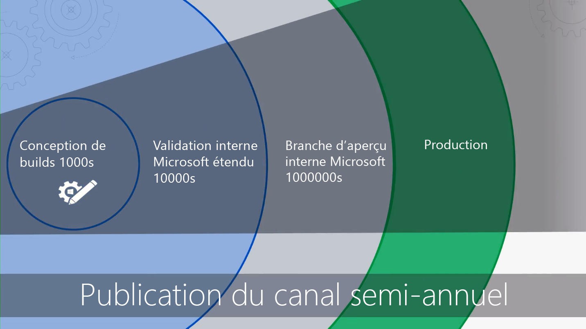

# Prise en main - Déploiement Bureau

<table>
<thead>
<td></td>
<td>
<strong>Prise en main : aide relative aux technologies, aux processus et aux utilisateurs</strong>

Découvrez les avantages de Windows 10 et Office 365 ProPlus, les modifications majeures et les aspects à prendre en compte par rapport aux déploiements précédents, ainsi que les bonnes pratiques à adopter pour assurer une transition fluide vers Windows 10 et Office 365 ProPlus.
</td>
<td></td>
</thead>
</table>

>[!NOTE]
>Dans cette série d’articles, nous allons expliquer comment faire bon usage des outils existants, et vous présenter les nouvelles technologies, les nouveaux services et les nouvelles méthodes accessibles via le cloud.   Pour afficher le processus de déploiement de bureau complet, visitez le [Centre de déploiement de Bureau](https://aka.ms/HowToShift).
>

Bienvenue dans le centre de déploiement de bureau, notre emplacement central pour découvrir comment vous aider à planifier et vérifier le passage à Windows 10 et Office 365 ProPlus. Cela vous permettra de tirer parti d’un espace de travail sécurisé, optimisé par les dernières expériences de productivité, de travail en équipe et de collaboration.

Si vous n’avez pas déployé de nouvel environnement bureau depuis un certain temps, la bonne nouvelle est que le processus de déploiement a été amélioré. Les défis du passé, par exemple, la compatibilité des applications, sont beaucoup moins un problème aujourd'hui. Les nouveaux outils, mais aussi les informations délivrées à partir du Cloud, vous aident à avancer plus rapidement et plus efficacement que jamais.

Au cours de cette présentation, nous allons expliquer les changements qui ont eu lieu et présenter le processus de déploiement du bureau. Ainsi, vous connaîtrez les étapes recommandées à suivre pour migrer vers Windows 10 et Office 365 ProPlus, et apprendrez à tirer parti de vos processus et outils existants quand vous adopterez des approches et des technologies de gestion modernes à l’avenir.

## Pourquoi mettre à niveau ?

Combinés, Windows 10 et le cloud intelligent de Microsoft vous permettent d’offrir à vos utilisateurs l’espace de travail le plus stimulant, puissant et sécurisé possible, tout en simplifiant votre infrastructure de support.

Un des clients clés des pratiques de gestion moderne est des appareils qui sont toujours à jour. Dans cette série vous serez informés sur les nouvelles fonctionnalités qui sont délivrées pour vous aider à passer à Windows 10 et Office 365 ProPlus en restant à jour avec les publications semi-annuelles des deux.

[Windows 10 pour les professionnels de l’informatique](https://www.microsoft.com/en-us/itpro/windows-10)

  [À propos d'Office 365 ProPlus en entreprise](https://docs.microsoft.com/fr-FR/deployoffice/about-office-365-proplus-in-the-enterprise)

## Qu’est-ce qui a changé ?

Examinons les modifications et les améliorations apportées depuis votre dernier déploiement de bureau. Si vous n’avez pas migré votre environnement de bureau récemment, vous utilisez probablement Windows 7 et Office 2010 ou Office 2013. Dans ce cas, vous remarquerez que certains éléments ont évolué depuis votre dernière mise à niveau majeure. Voici quelques exemples de ces changements :

**Identité et accès :** Windows 10 et Office 365 ProPlus, avec sa connectivité aux services de gestion, de sécurité et de productivité dans le cloud a un nouveau service de gestion des identités et accès : Azure Active Directory (Azure AD). Cela permet une connectivité à authentification unique et en toute sécurité au sein de vos services cloud, ce qui signifie que vous allez avoir besoin d’Azure AD pour tirer parti des services Microsoft 365 tels qu’Office 365, Intune ou Windows Autopilot.

[Microsoft 365](https://www.microsoft.com/en-us/microsoft-365/default.aspx)

**Environnement sécurisé préalable au démarrage :** microprogramme UEFI 64 bits remplace BIOS. En plus d’accélérer les temps de démarrage, il est indispensable pour activer bon nombre des fonctionnalités de sécurité modernes de Windows 10. Tandis que Windows 10 s’exécute sur BIOS, UEFI est fortement recommandé. Si vous n'avez pas basculé à partir du BIOS vers UEFI et exploité le 64 bits, il est temps. Il existe des outils pour vous aider à faire ce changement pendant une mise à niveau Windows 10 ou après celle-ci.

**Gestion des appareils basée sur le cloud : ** des services comme Microsoft Intune vous permettent de gérer vos appareils Windows 10 comme d’autres appareils mobiles, à partir d’un seul emplacement. Ce qui rend Microsoft Intune unique est que vous pouvez également cogérer des appareils Windows 10 avec System Center configuration Manager. Vous pouvez utiliser System Center Configuration Manager pour vous aider à votre passage vers Windows 10, puis ajouter Microsoft Intune. En travaillant ensemble, le System Center Configuration Manager devient le périmètre intelligent au sein de votre organisation connectée au cloud intelligent de Microsoft. Cela vous permet de gérer les appareils de vos utilisateurs en toute sécurité où qu’ils soient, qu’ils soient connectés sur l’infrastructure de votre organisation ou dans le cloud public.

  [Cogestion des appareils Windows 10](https://docs.microsoft.com/fr-FR/sccm/core/clients/manage/co-management-overview)

**Service de déploiement basé sur le cloud :** lorsque vous acquérez de nouveaux PC, nous avons introduit un nouveau service cloud pour vous aider à déployer Microsoft 365 aux appareils, appelé le service de déploiement Windows Autopilot. AutoPilot est intégré avec vos fournisseurs de matériel et les nouveaux PC sont automatiquement enregistrés dans Autopilot, permettant au nouveau PC d’être expédié directement à l’utilisateur final. Lorsque le PC est allumé pour la première fois, il est rapidement configuré selon les préférences de votre organisation et personnalisé pour les besoins spécifiques de l’utilisateur.

[Windows Autopilot](https://www.microsoft.com/en-us/windowsforbusiness/windows-autopilot)

**Les déploiements en un clic :** lors de la configuration des applications de bureau Office, Office 365 ProPlus est l’option par défaut. Cela vous donne accès aux innovations dans Office en temps réel, afin que vous n’ayez pas besoin d’attendre des années avant d’avoir accès aux nouvelles fonctionnalités. Vous pouvez également utiliser une nouvelle installation appelée En un clic.

En un clic est relativement différent des anciens packages basés sur MSI. En un clic est plus rapide, plus léger et prend en charge des mises à jour en arrière-plan pour permettre aux utilisateurs d’être opérationnels. C’est toujours une copie locale d’Office et vous pouvez continuer à utiliser vos outils de déploiement existants, tels que System Center Configuration Manager, pour approvisionner et configurer les applications.

  [Guide de déploiement pour Office 365 ProPlus](https://docs.microsoft.com/fr-FR/DeployOffice/deployment-guide-for-office-365-proplus)

**Mises à jour semestrielles :** une fois que vous êtes passé vers Windows 10 et Office 365 ProPlus, les mises à jour sont effectuées semestriellement avec de nouvelles fonctionnalités. Mais comme Microsoft peut délivrer des informations à partir du cloud pour vous aider, vous pouvez rapidement déployer sereinement ces mises à jour à des centaines voire des milliers d’appareils. Comme une mise à niveau locale, la mise à jour de fonctionnalité conserve les applications, données et configurations à partir de la version précédente.

## Roue de processus de déploiement

Avant de commencer, vous souhaitez créer un plan de haut-niveau et obtenir les sponsors nécessaires. La roue de nos processus de déploiement décrit les étapes critiques pour vous aider à identifier les membres de l’équipe essentiels et les ressources pour gérer dans les zones de déploiement suivantes.

**[Étape 1 : Disponibilité des applications et appareils](https://aka.ms/mdd1) ** pour un déploiement réussi vous devez d’abord connaître ce que vous avez. Cela signifie tenir un inventaire de vos appareils et applications et vérifier la compatibilité. Pour vous aider, vous pouvez tirer parti des outils disponibles dans notre service basé sur le cloud, Windows Analytics. Windows Analytics vous permet de puiser dans les ressources de compatibilité et données de diagnostic collectées sur des centaines de millions de PC, afin d’évaluer les applications et les pilotes en cours d’exécution sur votre appareil pour que vous puissiez établir la préparation de votre bureau. Vous pouvez même exporter une liste de « PC prêts pour le déploiement » à partir de Windows Analytics vers System Center Configuration Manager si vous l’utilisez, vous permettant de créer des collections de PCs basées sur les données dès qu’ils sont prêts.

  [Prise en main de Upgrade Readiness](https://docs.microsoft.com/fr-FR/windows/deployment/upgrade/upgrade-readiness-get-started)

**[Étape 2 : disponibilité annuaire et réseau](https://aka.ms/mdd2) ** si vous ne l’avez pas encore fait, vous souhaiterez implémenter Azure Active Directory pour la gestion de l’identité et accès. Vous souhaiterez également préparer votre réseau pour le déplacement des images système, des packages d’applications, fichiers utilisateur et mises à jour. Cela signifie une grande quantité de données supplémentaires ; votre réseau doit avoir la capacité disponible pour gérer cette charge supplémentaire sans impact sur le travail quotidien de votre organisation. Nous vous proposons une plage d’optimisations de mise en réseau disponibles pour la limitation de bande passante pair à pair au nettoyage de bande passante dynamique et mise à jour différentielle.

[BranchCache et cache d’homologue](https://blogs.technet.microsoft.com/swisspfe/2018/01/25/branch-cache-vs-peer-cache/)

**[Étape 3 : Office et ligne d’entreprise de remise d’application ](https://aka.ms/mdd3) ** tandis que Windows continue à prendre en charge les installations basées sur MSI, il prend également désormais en charge les plus récents mécanismes d’installations, optimisés pour les déploiements automatisés et mises à jour continues. Les clients Office 365 ProPlus et Office 2019 utilisent des technologies d’installation en un clic. Vous voudrez peut-être effectuer une plage UWP d’applications disponibles et vous pourrez vous apercevoir que vous déployez progressivement vous-même des applications tierces et internes basées sur la ligne d’entreprise qui utilisent les nouvelles applications MSIX. Cette étape garantit que vos applications sont prêtes pour les déploiements automatisés vers et que vous êtes prêts pour la réussite, que vos applications se déploient à l’aide de En un clic, MSIX conventionnels basée sur MSI, ou que ce soient des applications UWP déployées à partir d’un Microsoft Store configuré pour Entreprise.

[Présentation de MSIX](https://blogs.msdn.microsoft.com/sgern/2018/06/15/msix-intro/)

**[Étape 4 : migration des fichiers et des paramètres utilisateur](https://aka.ms/mdd4)** Cette étape joue un rôle important dans n’importe quel cycle d’actualisation ou de remplacement de PC : assurez-vous que les fichiers, les données et les paramètres des utilisateurs sont déplacés correctement et conservés tout au long de la migration.  Cette étape présente les options disponibles pour les migrations manuelles ou automatiques, y compris les options connues et nouvelles.

Comme dans les mises à jour précédentes, l’outil de Migration état utilisateur continue d’être un outil précieux pour automatiser ce processus et reste partie intégrante des migrations orchestrées à l’aide de System Center Configuration Manager ou Microsoft Deployment Toolkit. Mais déplacer ces données en migration peut être fastidieux pour le remplacement de PC en raison de physiques impliquées dans le transfert de centaines de gigaoctets par PC à deux reprises : tout d’abord à partir du bureau existant, puis vers la nouvelle version de bureau. Une nouvelle option activée par OneDrive est Déplacement de Dossier connu, utilisé pour synchroniser des documents de l’utilisateur, des images et des fichiers du Bureau à l’échelle, dans le cloud et avant le déploiement.

  [Rediriger et déplacer les dossiers connus de Windows vers OneDrive](https://docs.microsoft.com/fr-FR/onedrive/redirect-known-folders)

**[Étape 5 : sécurité et conformité](https://aka.ms/mdd5)** Le domaine de la sécurité et de la conformité présente beaucoup d’avantages quand vous migrez vers Windows 10 et Office 365 ProPlus. Il est important que vous vous familiarisiez avec les nouvelles fonctionnalités intégrées et les compariez avec celles que vous avez. Par exemple, les nouvelles fonctionnalités disponibles dans Windows 10 qui utilisent la sécurité basée sur la virtualisation peuvent protéger vos PC contre le vol d’informations d’identification, les attaques basées sur le navigateur et l’exécution de code malveillant en isolant les processus centraux et les secrets du système d’exploitation. De plus, les services cloud, tels qu’Advanced Threat Protection, mettent à votre disposition une plateforme unifiée dédiée au renforcement de la sécurité, à la détection des violations postérieure, aux examens et aux réponses. Advanced Threat Protection peut également vous protéger contre les pièces jointes malveillantes, les liens hypertexte potentiellement dangereux, entre autres.

[Sécurité Microsoft](https://www.microsoft.com/en-us/security/default.aspx)

**[Étape 6 : déploiement du système d’exploitation et mises à jour de fonctionnalité](https://aka.ms/mdd6)** Une fois que tout est prêt, il ne vous reste plus qu’à déployer les images du système d’exploitation. La plupart des tâches complexes peuvent être effectuées à l’aide de l’infrastructure et des séquences de tâches du System Center Configuration Manager. Pour cela, nous vous recommandons de procéder à un déploiement en plusieurs phases, tout d’abord en ciblant un « groupe d’utilisateurs de la première heure » dans votre organisation pour le déployer à l’aide d’un ensemble représentatif de matériels et d’applications. Vous pouvez ensuite utiliser les données issues de ces appareils et utilisateurs pour élargir progressivement le groupe de PC à cibler.

  [Présentation du déploiement du système d’exploitation dans le System Center Configuration Manager](https://docs.microsoft.com/fr-FR/sccm/osd/understand/introduction-to-operating-system-deployment)

**[Étape 7 : Windows et Office en tant que Service](https://aka.ms/mdd7) ** cette valeur représente un changement majeur dans la façon de maintenir à jour le bureau des utilisateurs. Avec ce déplacement à Windows 10 et Office 365 ProPlus, vous pouvez passer à la gestion de Windows et Office en tant que service. À la place d’un changement massif de technologies tous les ans, vous aurez continuellement de nouvelles fonctionnalités et expériences, et des protections fiables pour vos utilisateurs. Les mises à jour semestrielles des fonctionnalités offrent de nouvelles fonctionnalités chaque automne et printemps, tandis que les mises à jour mensuelles de qualité cumulées contiendront sécurité, fiabilité et correctifs. Même si vous pouvez choisir de déployer le client Office 2019, nous vous recommandons vivement de passer à Office 365 ProPlus. Cela suit un plan de service similaire à Windows afin que vos utilisateurs reçoivent les mises à jour aux applications Office régulièrement.

  [Vue d’ensemble de Windows en tant que service](https://docs.microsoft.com/fr-FR/windows/deployment/update/waas-overview)
[vue d’ensemble d’Office en tant que service](https://docs.microsoft.com/fr-FR/DeployOffice/overview-of-update-channels-for-office-365-proplus)

**[Étape 8 : Communications et formation des utilisateurs ](https://aka.ms/mdd8) ** cette dernière étape est critique pour mener l’utilisation des nouvelles fonctionnalités pour optimiser le travail d’équipe, communications, sécurité et autres aspects. Avant que le déploiement à grande échelle ne soit appliqué aux utilisateurs hors premiers utilisateurs, nous vous recommandons de mettre en place la formation et communication utilisateur. Cela vous aidera à apporter les modifications souhaités dans comment les personnes utilisent les nouvelles fonctionnalités disponibles dans Office, Windows ou autres applications et services d’entreprise . Pour aider, nous fournissons une formation en ligne gratuite via Microsoft FastTrack. De plus, nous avons publié des échantillons de plans de communication gratuits et chronologies avec messagerie électronique, réseaux sociaux et modèles intranet pour vous aider avec votre déploiement de Windows 10. En tant qu’entreprise Microsoft 365 ou Office 365, votre organisation peut également être éligible pour un service clientèle direct.

## Étape suivante

Vous savez maintenant ce qui est nouveau et différent dans Windows 10 et Office 365 ProPlus et nous vous avons guidé dans notre roue de processus de déploiement recommandé. Avec cette introduction pour l’aide bout à bout et outils disponibles pour passer à Windows 10 et Office 365 ProPlus, c’est parti.

## [Étape 1 : préparation des applications et des appareils](https://aka.ms/mdd1)

