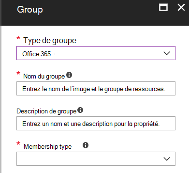

# Stratégies communes pour les identités et l’accès aux appareils
Cet article décrit les stratégies recommandées courantes pour sécuriser l’accès aux services Cloud, notamment les applications locales publiées avec le proxy d’application Azure AD. 

Ce guide explique comment déployer les stratégies recommandées dans un environnement nouvellement mis en service. La configuration de ces stratégies dans un environnement de laboratoire distinct vous permet de comprendre et d’évaluer les stratégies recommandées avant de mettre en place le déploiement dans vos environnements de pré-production et de production. Votre environnement nouvellement configuré peut être en nuage seul ou hybride.  

## Jeu de stratégie 

Le diagramme suivant illustre l’ensemble de stratégies recommandé. Elle indique le niveau de protection auquel chaque stratégie s’applique et indique si les stratégies s’appliquent aux PC, téléphones et tablettes, ou aux deux catégories d’appareils. Il indique également où ces stratégies sont configurées.

Le reste de cet article explique comment configurer ces stratégies. 

L’utilisation de l’authentification multifacteur est recommandée avant l’inscriptions de périphériques dans Intune pour garantir que l’appareil est en possession de l’utilisateur prévu. Vous devez également inscrire les appareils dans Intune avant d’appliquer les stratégies de conformité des appareils.

Pour vous donner le temps de réaliser ces tâches, nous vous recommandons de mettre en œuvre les stratégies de base dans l’ordre indiqué dans le tableau ci-dessous. Toutefois, les stratégies de MFA pour une protection sensible et hautement réglementée peuvent être mises en œuvre à tout moment.

|Niveau de protection|Stratégies|Plus d’informations|
|:---------------|:-------|:----------------|
|**Baseline**|[Exiger l’authentification multifacteur lorsque le risque de connexion est *moyen* ou *élevé*](#require-mfa-based-on-sign-in-risk)| |
|        |[Bloquer les clients ne prenant pas en charge l’authentification moderne](#block-clients-that-dont-support-modern-authentication)|Les clients qui n’utilisent pas l’authentification moderne peuvent contourner les règles d’accès conditionnel, c’est pourquoi il est important de bloquer ces|
|        |[Les utilisateurs à haut risque doivent changer leur mot de passe](#high-risk-users-must-change-password)|Force les utilisateurs à modifier leur mot de passe lors de la connexion en cas de détection d’une activité à haut risque pour leur compte.|
|        |[Définir les stratégies de protection des applications](#define-app-protection-policies)|Une stratégie par plateforme (iOS, Android, Windows).|
|        |[Exiger les applications qui prennent en charge les stratégies de protection des applications Intune](#require-apps-that-support-intune-app-protection-policies)|Applique la protection des applications mobiles pour les téléphones et les tablettes|
|        |[Définir les stratégies de conformité des appareils](#define-device-compliance-policies)|Une stratégie pour chaque plateforme|
|        |[Exiger des PC conformes](#require-compliant-pcs-but-not-compliant-phones-and-tablets)|Applique la gestion Intune des PC|
|**Sensible**|[Exiger l’authentification multifacteur lorsque le risque de connexion est *faible*, *moyen* ou *élevé*](#require-mfa-based-on-sign-in-risk)| |
|         |[Exiger des PC conformes *et des* appareils mobiles](#require-compliant-pcs-and-mobile-devices)|Applique la gestion Intune pour les PC et les téléphones/tablettes|
|**Hautement réglementé**|[*Toujours* exiger l’authentification multifacteur](#require-mfa-based-on-sign-in-risk)|
| | |

## Affectation de stratégies aux utilisateurs
Avant de configurer des stratégies, identifiez les groupes Azure AD que vous utilisez pour chaque niveau de protection. En règle générale, la protection de base s’applique à tous les employés de l’organisation. Toutes les stratégies de base, ainsi que les stratégies sensibles, sont appliquées à un utilisateur qui est inclus à la fois pour la protection de référence et la protection sensible. La protection est cumulative et la stratégie la plus restrictive est appliquée. 

Une pratique recommandée consiste à créer un groupe Azure AD pour l’exclusion d’accès conditionnel. Ajoutez ce groupe à toutes vos règles d’accès conditionnel sous « exclure ». Cela vous permet de fournir un accès à un utilisateur pendant que vous dépannez les problèmes d’accès. Il s’agit d’une solution temporaire uniquement. Surveillez ce groupe pour les modifications et assurez-vous que le groupe d’exclusion n’est utilisé que comme prévu. 

Le diagramme suivant fournit un exemple d’affectations et d’exclusions d’utilisateurs.

Dans l’illustration, l’équipe « top secret Project X Team » est affectée à une stratégie d’accès conditionnel qui requiert la MFA *Always*. Soyez judicieuses lorsque vous appliquez des niveaux de protection plus élevés aux utilisateurs. Les membres de cette équipe de projet devront fournir deux formulaires d’authentification à chaque fois qu’ils se connectent, même s’ils n’affichent pas de contenu hautement réglementé.  

Tous les groupes Azure AD créés dans le cadre de ces recommandations doivent être créés en tant que groupes Office 365. C’est particulièrement important pour le déploiement d’Azure Information Protection lors de la sécurisation des documents dans SharePoint Online.

## Exiger une authentification multifacteur basée sur le risque de connexion
Avant d’exiger MFA, utilisez d’abord une stratégie d’inscription MFA de protection des identités pour inscrire les utilisateurs pour MFA. Une fois que les utilisateurs sont inscrits, vous pouvez appliquer l’authentification multifacteur à la connexion. Le [travail requis](identity-access-prerequisites.md) inclut l’inscription de tous les utilisateurs avec authentification multifacteur.

Pour créer une stratégie d’accès conditionnel : 

1. Accédez au [portail Azure](https://portal.azure.com) et connectez-vous avec vos informations d’identification. Une fois connecté, le tableau de bord Azure s’affiche.

2. Dans le menu de gauche, choisissez **Azure Active Directory**.

3. Sous la section **Sécurité**, choisissez **Accès conditionnel**.

4. Choisissez **Nouvelle stratégie**.

 Le tableau suivant décrit les paramètres de stratégie d’accès conditionnel à implémenter pour cette stratégie.

**Affectations**

|Type|Propriétés|Valeurs|Remarques|
|:---|:---------|:-----|:----|
|Utilisateurs et groupes|Inclure|Sélectionner des utilisateurs et des groupes : sélectionnez un groupe de sécurité spécifique contenant les utilisateurs ciblés|Commencer avec un groupe de sécurité comprenant les utilisateurs pilotes|
||Exclure|Groupe de sécurité d’exception ; comptes de service (identités d’application)|Appartenance modifiée en fonction de vos besoins temporaires|
|Applications cloud|Inclure|Sélectionnez les applications auxquelles cette règle doit s’appliquer. Par exemple, sélectionnez Office 365 Exchange Online||
|Conditions|Configuré|Oui|Les configurer en fonction de votre environnement et de vos besoins spécifiques|
|Risque de connexion|Niveau de risque||Consultez les conseils dans le tableau suivant.|

**Risque de connexion**

Appliquez les paramètres en fonction du niveau de protection que vous ciblez.

|Propriété|Niveau de protection|Valeurs|Remarques|
|:---|:---------|:-----|:----|
|Niveau de risque|Baseline|Élevé, moyen|Cocher les deux|
| |Sensible|Élevé, moyen, faible|Cocher les trois|
| |Hautement réglementé| |Laissez toutes les options désactivées pour toujours appliquer l’authentification multifacteur|

**Contrôles d’accès**

|Type|Propriétés|Valeurs|Remarques|
|:---|:---------|:-----|:----|
|Accorder|Accorder l'accès|Vrai|Sélectionné|
||Exiger MFA|True|Check|
||Exiger que l’appareil soit marqué comme conforme|False||
||Exiger un appareil joint Azure AD hybride|False||
||Exiger une application client approuvée|False||
||Demander tous les contrôles sélectionnés|True|Sélectionné|

> [!NOTE]
> N’oubliez pas d’activer cette stratégie en sélectionnant **activé**. Vous pouvez également utiliser l’outil [What If](https://docs.microsoft.com/azure/active-directory/active-directory-conditional-access-whatif) pour tester la stratégie.

## Bloquer les clients ne prenant pas en charge l’authentification moderne
1. Accédez au [portail Azure](https://portal.azure.com) et connectez-vous avec vos informations d’identification. Une fois connecté, le tableau de bord Azure s’affiche.

2. Dans le menu de gauche, choisissez **Azure Active Directory**.

3. Sous la section **Sécurité**, choisissez **Accès conditionnel**.

4. Choisissez **Nouvelle stratégie**.

Le tableau suivant décrit les paramètres de stratégie d’accès conditionnel à implémenter pour cette stratégie.

**Affectations**

|Type|Propriétés|Valeurs|Remarques|
|:---|:---------|:-----|:----|
|Utilisateurs et groupes|Include|Sélectionner des utilisateurs et des groupes : sélectionnez un groupe de sécurité spécifique contenant les utilisateurs ciblés|Commencer avec un groupe de sécurité comprenant les utilisateurs pilotes|
||Exclure|Groupe de sécurité d’exception ; comptes de service (identités d’application)|Appartenance modifiée de manière temporaire selon les besoins|
|Applications cloud|Include|Sélectionnez les applications auxquelles cette règle doit s’appliquer. Par exemple, sélectionnez Office 365 Exchange Online||
|Conditions|Configuré|Oui|Configurer les applications clientes|
|Applications clientes|Configuré|Oui|Applications mobiles et clients de bureau, autres clients (sélectionnez les deux)|

**Contrôles d’accès**

|Type|Propriétés|Valeurs|Remarques|
|:---|:---------|:-----|:----|
|Accorder|Bloquer l’accès|Vrai|Sélectionné|
||Exiger MFA|False||
||Exiger que l’appareil soit marqué comme conforme|False||
||Exiger un appareil joint Azure AD hybride|False||
||Exiger une application client approuvée|False||
||Demander tous les contrôles sélectionnés|True|Sélectionné|

> [!NOTE]
> N’oubliez pas d’activer cette stratégie en sélectionnant **activé**. Vous pouvez également utiliser l’outil [What If](https://docs.microsoft.com/azure/active-directory/active-directory-conditional-access-whatif) pour tester la stratégie.

## Les utilisateurs à haut risque doivent changer leur mot de passe
Pour vous assurer que tous les comptes compromis par les utilisateurs à haut risque sont obligés d’effectuer une modification de mot de passe lors de la connexion, vous devez appliquer la stratégie suivante.

Connectez-vous au [portail Microsoft Azure (https://portal.azure.com)](https://portal.azure.com/) avec vos informations d’identification d’administrateur, puis accédez à **Azure AD Identity Protection > Stratégie d’utilisateur à risque**.

**Affectations**

|Type|Propriétés|Valeurs|Remarques|
|:---|:---------|:-----|:----|
|Utilisateurs|Inclure|Tous les utilisateurs|Sélectionné|
||Exclure|Aucune||
|Conditions|Risque de l’utilisateur|Importante|Sélectionné|

**Contrôles**

| Type | Propriétés | Valeurs                  | Remarques |
|:-----|:-----------|:------------------------|:------|
|      | Accès     | Autoriser l'accès            | Vrai  |
|      | Accès     | Exiger le changement du mot de passe | True  |

**Révision :** non applicable

> [!NOTE]
> N’oubliez pas d’activer cette stratégie en sélectionnant **activé**. Vous pouvez également utiliser l’outil [What If](https://docs.microsoft.com/azure/active-directory/active-directory-conditional-access-whatif) pour tester la stratégie.

## Définir les stratégies de protection des applications
Les stratégies de protection des applications (APP) définissent les applications autorisées et les actions qu’elles peuvent effectuer sur les données de votre organisation. Les choix disponibles dans l’application permettent aux organisations de personnaliser la protection en fonction de leurs besoins spécifiques. Pour certains, il se peut que les paramètres de stratégie requis pour implémenter un scénario complet ne soient pas évidents. Pour aider les organisations à hiérarchiser le renforcement des points de terminaison des clients mobiles, Microsoft a introduit la taxonomie de son application Data Protection Framework pour iOS et Android Mobile App Management. 

L’infrastructure Data Protection Framework est organisée en trois niveaux de configuration distincts, chaque niveau étant créé à partir du niveau précédent : 

- La protection des données de base d’entreprise garantit que les applications sont protégées par un code confidentiel et qu’elles sont chiffrées et effectue des opérations de réinitialisation sélective. Pour les appareils Android, ce niveau valide l’attestation d’appareil Android. Il s’agit d’une configuration de niveau d’entrée qui fournit un contrôle de protection des données similaire dans les stratégies de boîte aux lettres Exchange Online et l’affiche, ainsi que la population de l’utilisateur vers l’application. 
- Enterprise Enhanced Data Protection introduit les mécanismes de prévention des fuites de données d’application et les exigences minimales de système d’exploitation. Il s’agit de la configuration applicable à la plupart des utilisateurs mobiles qui accèdent aux données professionnelles ou scolaires. 
- Enterprise High Data Protection introduit des mécanismes de protection avancée des données, une configuration de code confidentiel améliorée et une défense contre les menaces pour les applications mobiles. Cette configuration est souhaitable pour les utilisateurs qui accèdent à des données à haut risque. 

Pour voir les recommandations spécifiques pour chaque niveau de configuration et les applications minimales à protéger, examinez [Data Protection Framework à l’aide de stratégies de protection des applications](https://docs.microsoft.com/mem/intune/apps/app-protection-framework). 

À l’aide des principes décrits dans les [configurations d’identité et d’accès aux appareils](microsoft-365-policies-configurations.md), les niveaux de protection de base et sensibles sont mappés en étroite collaboration avec les paramètres de protection avancée des données de niveau 2 entreprise. Le niveau de protection hautement réglementé est étroitement associé aux paramètres de protection des données élevés de niveau 3.

|Niveau de protection |Stratégie de protection des applications  |Plus d’informations  |
|---------|---------|---------|
|Baseline     | [Niveau 2 protection des données améliorée](https://docs.microsoft.com/mem/intune/apps/app-protection-framework#level-2-enterprise-enhanced-data-protection)        | Les paramètres de stratégie appliqués au niveau 2 incluent tous les paramètres de stratégie recommandés pour le niveau 1 et ajoutent ou met à jour uniquement les paramètres de stratégie ci-dessous pour implémenter davantage de contrôles et une configuration plus sophistiquée que le niveau 1.         |
|Sensible     | [Niveau 2 protection des données améliorée](https://docs.microsoft.com/mem/intune/apps/app-protection-framework#level-2-enterprise-enhanced-data-protection)        | Les paramètres de stratégie appliqués au niveau 2 incluent tous les paramètres de stratégie recommandés pour le niveau 1 et ajoutent ou met à jour uniquement les paramètres de stratégie ci-dessous pour implémenter davantage de contrôles et une configuration plus sophistiquée que le niveau 1.        |
|Hautement réglementé     | [Niveau 3 entreprise protection élevée des données](https://docs.microsoft.com/mem/intune/apps/app-protection-framework#level-3-enterprise-high-data-protection)        | Les paramètres de stratégie appliqués au niveau 3 incluent tous les paramètres de stratégie recommandés pour le niveau 1 et 2 et ajoutent ou met à jour uniquement les paramètres de stratégie ci-dessous pour implémenter davantage de contrôles et une configuration plus sophistiquée que le niveau 2.        |

Pour créer une stratégie de protection des applications pour chaque plateforme (iOS et Android) dans le gestionnaire de points de terminaison de Microsoft à l’aide des paramètres Data Protection Framework, les administrateurs peuvent :
1. Créez manuellement les stratégies en suivant les étapes de la [procédure de création et de déploiement des stratégies de protection des applications avec Microsoft Intune](https://docs.microsoft.com/mem/intune/apps/app-protection-policies).
2. Importez les modèles JSON de l’exemple de [configuration de stratégie de protection des applications Intune App](https://github.com/microsoft/Intune-Config-Frameworks/tree/master/AppProtectionPolicies) avec les [scripts PowerShell d’Intune](https://github.com/microsoftgraph/powershell-intune-samples).

## Exiger les applications qui prennent en charge les stratégies de protection des applications Intune
Grâce à l’accès conditionnel, les organisations peuvent restreindre l’accès aux applications clientes iOS et Android approuvées (Modern Authentication compatible) avec les stratégies Intune App protection appliquées. Plusieurs stratégies d’accès conditionnel sont requises, chaque stratégie ciblant tous les utilisateurs potentiels. Pour plus d’informations sur la création de ces stratégies, voir [require application protection Policy for Cloud App Access with ConditionalAttribute Access](https://docs.microsoft.com/azure/active-directory/conditional-access/app-protection-based-conditional-access).

1. Suivez « étape 1 : configurer une stratégie d’accès conditionnel Azure AD pour Office 365 » dans le [scénario 1 : les applications office 365 nécessitent des applications approuvées avec des stratégies de protection d’application](https://docs.microsoft.com/azure/active-directory/conditional-access/app-protection-based-conditional-access#scenario-1-office-365-apps-require-approved-apps-with-app-protection-policies), ce qui permet d’utiliser Outlook pour iOS et Android, mais empêche les clients Exchange ActiveSync compatibles OAuth de se connecter à Exchange Online.

   > [!NOTE]
   > Cette stratégie permet aux utilisateurs mobiles d’accéder à tous les points de terminaison Office à l’aide des applications applicables.

2. Si vous activez l’accès mobile à Exchange Online, implémentez [bloquer les clients ActiveSync](secure-email-recommended-policies.md#block-activesync-clients), ce qui empêche les clients Exchange ActiveSync qui utilisent l’authentification de base de se connecter à Exchange Online.

   Les stratégies ci-dessus exploitent les contrôles d’octroi [nécessitent une application client approuvée](https://docs.microsoft.com/azure/active-directory/conditional-access/concept-conditional-access-grant#require-approved-client-app) et [nécessitent une stratégie de protection des applications](https://docs.microsoft.com/azure/active-directory/conditional-access/concept-conditional-access-grant#require-app-protection-policy).

3. Désactivez l’authentification héritée pour les autres applications clientes sur les appareils iOS et Android. Pour plus d’informations, consultez la rubrique [bloquer les clients qui ne prennent pas en charge l’authentification moderne](#block-clients-that-dont-support-modern-authentication).

## Définir des stratégies de conformité des appareils

Les stratégies de conformité des appareils définissent les exigences auxquelles les appareils doivent adhérer afin d’être marqués comme étant conformes. Créez des stratégies de conformité d’appareil Intune à partir du centre d’administration du gestionnaire de points de terminaison Microsoft.

Créez une stratégie pour chaque plateforme :
- Administrateur d’appareils Android
- Android Enterprise
- iOS/iPad
- macOS
- Ce paramètre est disponible sur les types d’appareils suivants :
- Windows 8,1 et versions ultérieures
- Windows 10 et versions ultérieures

Pour créer des stratégies de conformité des appareils, connectez-vous au [Centre d’administration du gestionnaire de points de terminaison Microsoft](https://go.microsoft.com/fwlink/?linkid=2109431) avec vos informations d’identification, puis accédez à périphériques stratégies de**conformité** > **Policies**des **appareils** > . Sélectionnez **créer une stratégie**.

Pour que les stratégies de conformité des appareils soient déployées, elles doivent être affectées à des groupes d’utilisateurs. Vous affectez une stratégie après l’avoir créée et enregistrée. Dans le centre d’administration, sélectionnez la stratégie, puis sélectionnez **affectations**. Après avoir sélectionné les groupes pour lesquels vous souhaitez recevoir la stratégie, sélectionnez **Enregistrer** pour enregistrer l’affectation de groupe et déployer la stratégie.

Pour obtenir des instructions pas à pas sur la création de stratégies de conformité dans Intune, voir [Create a Compliance Policy in Microsoft Intune](https://docs.microsoft.com/mem/intune/protect/create-compliance-policy) dans la documentation Intune.

Les paramètres suivants sont recommandés pour Windows 10.

**Intégrité de l’appareil : règles d’évaluation du service d’attestation d’intégrité Windows**

|Propriétés|Valeurs|Remarques|
|:---------|:-----|:----|
|Exiger BitLocker|Require (Rendre obligatoire)||
|Exiger l’activation du démarrage sécurisé sur l’appareil|Require (Rendre obligatoire)||
|Exiger l’intégrité du code|Require (Rendre obligatoire)||

**Propriétés des appareils**

|Type|Propriétés|Valeurs|Remarques|
|:---|:---------|:-----|:----|
|Version du système d'exploitation|Tous|Non configuré||

**Sécurité système**

|Type|Propriétés|Valeurs|Remarques|
|:---|:---------|:-----|:----|
|Password|Exiger un mot de passe pour déverrouiller les appareils mobiles|Require (Rendre obligatoire)||
||Mots de passe simples|Bloc||
||Type de mot de passe|Valeur par défaut du périphérique||
||Longueur minimale du mot de passe|6 ||
||Nombre maximal de minutes d’inactivité avant que le mot de passe ne soit requis|15 |Ce paramètre est pris en charge pour Android versions 4,0 et supérieures ou KNOX 4,0 et versions ultérieures. Pour les appareils iOS, il est pris en charge pour iOS 8,0 et versions ultérieures.|
||Expiration du mot de passe (jours)|41||
||Nombre de mots de passe précédents pour empêcher la réutilisation|5 ||
||Exiger un mot de passe lorsque l’appareil revient de l’état inactif (mobile et holographique)|Require (Rendre obligatoire)|Disponible pour Windows 10 et versions ultérieures|
|Chiffrement|Chiffrement du stockage des données sur l’appareil|Require (Rendre obligatoire)||
|Sécurité de l’appareil|-|Require (Rendre obligatoire)||
||Antivirus|Require (Rendre obligatoire)||
||Logiciel anti-espion|Require (Rendre obligatoire)|Ce paramètre nécessite une solution de protection contre les logiciels espions inscrite auprès du centre de sécurité Windows|
|Defender|Logiciel anti-programme malveillant Microsoft Defender|Require (Rendre obligatoire)||
||Version minimale du logiciel anti-programme malveillant de Microsoft Defender||Uniquement pris en charge pour les ordinateurs de bureau Windows 10. Microsoft recommande une version qui n’est pas plus de cinq par rapport à la version la plus récente.|
||Mise à jour de la signature du logiciel anti-programme malveillant Microsoft Defender|Require (Rendre obligatoire)||
||Protection en temps réel|Require (Rendre obligatoire)|Prise en charge uniquement pour les ordinateurs de bureau Windows 10|

**Microsoft Defender - PACM**

|Type|Propriétés|Valeurs|Remarques|
|:---|:---------|:-----|:----|
|Règles de protection avancée contre les menaces Microsoft Defender|Exiger que l’appareil soit au ou sous le score de risque machine|Moyenne||

## Exiger des PC conformes (mais pas les téléphones et les tablettes conformes)
Avant d’ajouter une stratégie pour exiger des PC conformes, veillez à inscrire les appareils pour la gestion dans Intune. L’utilisation de l’authentification multifacteur est recommandée avant l’inscriptions de périphériques dans Intune pour garantir que l’appareil est en possession de l’utilisateur prévu. 

Pour exiger des PC conformes :

1. Accédez au [portail Azure](https://portal.azure.com) et connectez-vous avec vos informations d’identification. Une fois connecté, le tableau de bord Azure s’affiche.

2. Dans le menu de gauche, choisissez **Azure Active Directory**.

3. Sous la section **Sécurité**, choisissez **Accès conditionnel**.

4. Choisissez **Nouvelle stratégie**.

5. Entrez un nom de stratégie et choisissez les **Utilisateurs et groupes** auxquels vous souhaitez appliquer la stratégie.

6. Choisissez **Applications cloud**.

7. Sélectionnez **Sélectionner les applications**, sélectionnez les applications souhaitées dans la liste **applications Cloud** . Par exemple, sélectionnez Office 365 Exchange Online. Choisissez **Sélectionner** et **Terminer**.

8. Pour exiger des PC conformes, mais pas des téléphones et des tablettes conformes, choisissez des **conditions** et des **plateformes d’appareil**. Sélectionnez **Sélectionner les plateformes** de l’appareil, puis **Windows** et **MacOS**.

9. Choisissez **Accorder** dans la section **Contrôles d’accès**.

10. Sélectionnez **accorder l’accès**, sélectionnez **exiger la conformité de l’appareil pour être marqué comme conforme**. Pour plusieurs contrôles, sélectionnez **exiger tous les contrôles sélectionnés**, puis choisissez **Sélectionner**. 

11. Sélectionnez **Créer**.

Si votre objectif est d’exiger des PC conformes *et des* appareils mobiles, ne sélectionnez pas de plateformes. Cela garantit la conformité de tous les appareils. 

## Exiger des PC conformes *et des* appareils mobiles

Pour exiger la conformité de tous les périphériques, procédez comme suit :

1. Accédez au [portail Azure](https://portal.azure.com) et connectez-vous avec vos informations d’identification. Une fois connecté, le tableau de bord Azure s’affiche.

2. Dans le menu de gauche, choisissez **Azure Active Directory**.

3. Sous la section **Sécurité**, choisissez **Accès conditionnel**.

4. Choisissez **Nouvelle stratégie**.

5. Entrez un nom de stratégie et choisissez les **Utilisateurs et groupes** auxquels vous souhaitez appliquer la stratégie.

6. Choisissez **Applications cloud**.

7. Sélectionnez **Sélectionner les applications**, sélectionnez les applications souhaitées dans la liste **applications Cloud** . Par exemple, sélectionnez Office 365 Exchange Online. Choisissez **Sélectionner** et **Terminer**.

8. Choisissez **Accorder** dans la section **Contrôles d’accès**.

9. Sélectionnez **accorder l’accès**, sélectionnez **exiger la conformité de l’appareil pour être marqué comme conforme**. Pour plusieurs contrôles, sélectionnez **exiger tous les contrôles sélectionnés**, puis choisissez **Sélectionner**. 

10. Sélectionnez **Créer**.

Lors de la création de cette stratégie, ne sélectionnez pas de plateformes. Cela met en place des appareils conformes.

## Étapes suivantes

[Découvrir les recommandations de stratégies pour sécuriser les e-mails](secure-email-recommended-policies.md)
